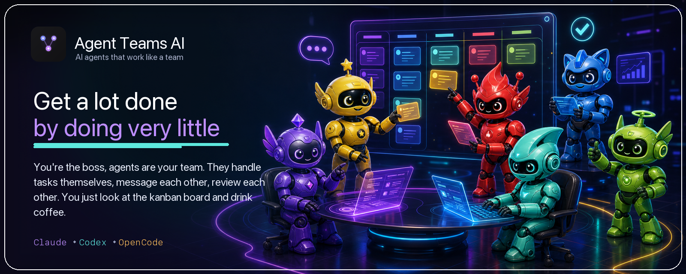
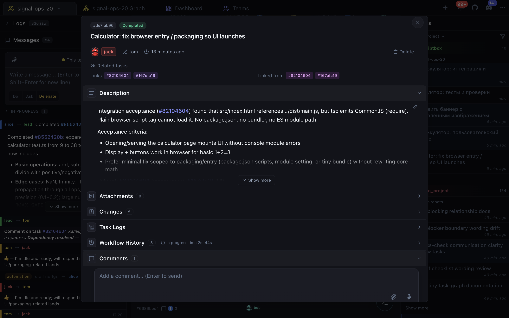
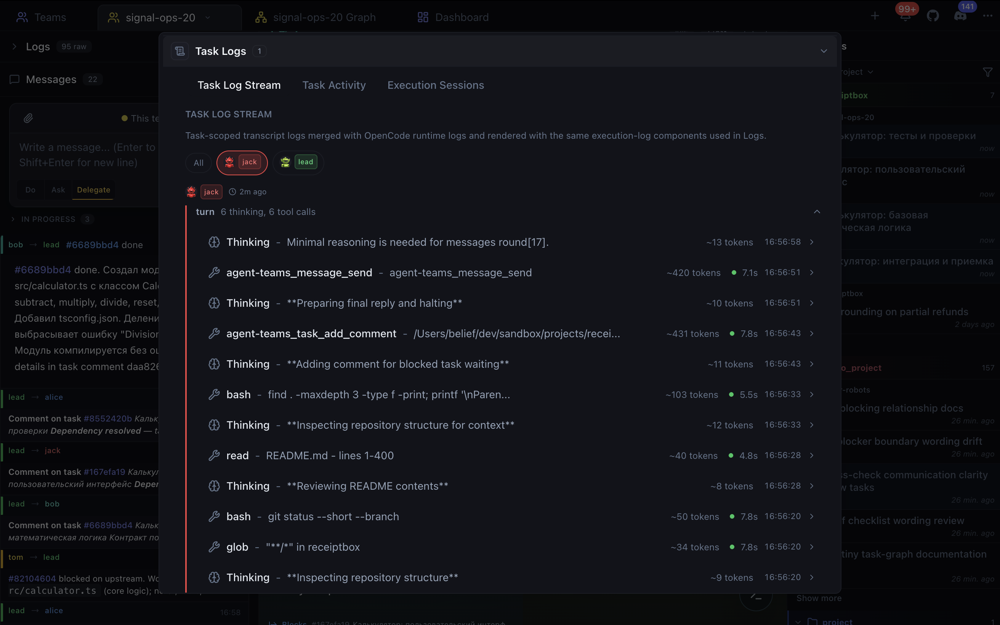
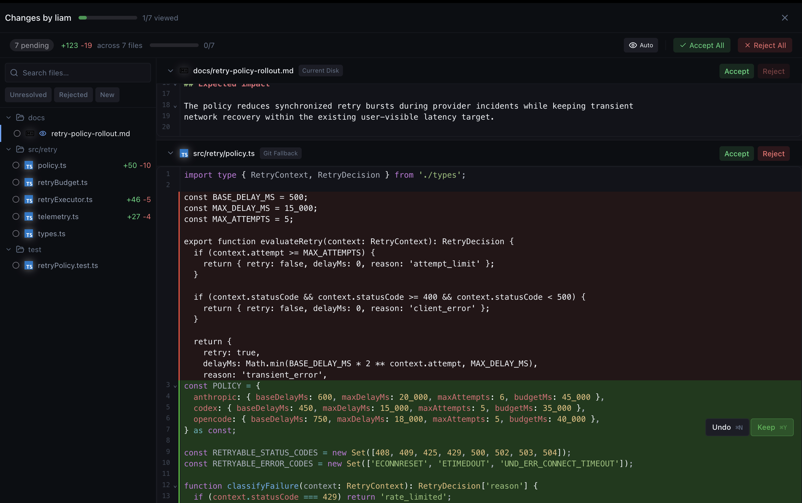
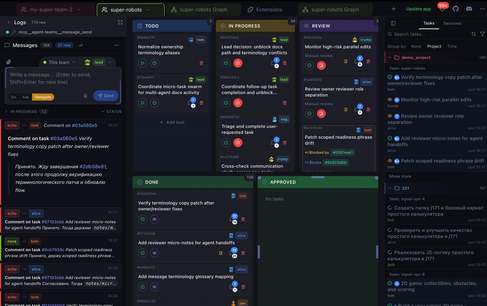
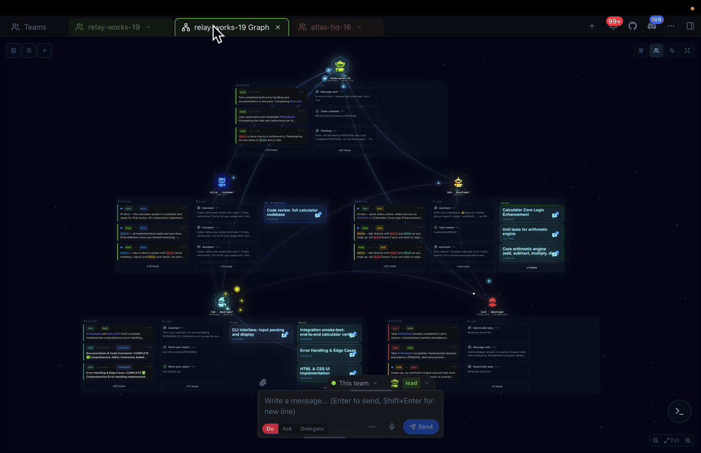

<p align="center">
  <a href="https://agentteams.live/">
    
  </a>
</p>

<p align="center">
  <a href="https://github.com/777genius/agent-teams-ai/releases/latest"></a>&nbsp;
  <a href="https://discord.gg/qtqSZSyuEc"></a>&nbsp;
  <a href="https://agentteams.live/"></a>&nbsp;
  <a href="https://github.com/777genius/agent-teams-ai/actions/workflows/ci.yml"></a>&nbsp;
</p>

<p align="center">
  <sub>Free desktop app for AI agent teams. Start with a free model with no auth - no signup, API key, or card - or connect Claude Code, Codex, OpenCode, Cursor, SuperGrok, GitHub Copilot, Z.AI, MiniMax, or Kiro. For coding and broader project work.</sub>
</p>

<table>
<tr>
<td width="50%">
  
</td>
<td width="50%">
  
</td>
</tr>
<tr>
<td width="50%">
  
</td>
<td width="50%">
  
</td>
</tr>
<tr>
<td width="50%">
  
</td>
<td width="50%">
  
</td>
</tr>
<tr>
<td width="50%">
  
</td>
<td width="50%">
  
</td>
</tr>
</table>

<!--


-->

<a href="https://agentteams.live/">Watch demo on the site or here:</a>

[demo_new_15s.webm](https://github.com/user-attachments/assets/d78cf5a4-80fe-4a8b-a1db-fb272e18029c)

<details>
<summary>Older demos</summary>

<br />

<table>
<tr>
<td width="50%">

https://github.com/user-attachments/assets/9cae73cd-7f42-46e5-a8fb-ad6d41737ff8

</td>
<td width="50%">

https://github.com/user-attachments/assets/35e27989-726d-4059-8662-bae610e46b42

</td>
</tr>
</table>

</details>

<br />

## Installation

No prerequisites - the app can detect installed Claude Code, Codex, and OpenCode runtimes. You can also connect Cursor, SuperGrok, GitHub Copilot, Z.AI, MiniMax, and Kiro from the UI.

<table align="center">
<tr>
<td align="center">
  <a href="https://github.com/777genius/agent-teams-ai/releases/download/v2.7.0/Agent.Teams.AI-2.7.0-arm64.dmg">
    
  </a>
  <br />
  <a href="https://github.com/777genius/agent-teams-ai/releases/download/v2.7.0/Agent.Teams.AI-2.7.0-x64.dmg">
    
  </a>
</td>
<td align="center">
  <a href="https://github.com/777genius/agent-teams-ai/releases/download/v2.7.0/Agent.Teams.AI.Setup.2.7.0.exe">
    
  </a>
  <br />
  <sub>May trigger SmartScreen - click "More info" -> "Run anyway"</sub>
  <br />
  <sub>Run normally. Administrator mode may be needed only if the app reports a specific OpenCode symlink or permission error.</sub>
</td>
<td align="center">
  <a href="https://github.com/777genius/agent-teams-ai/releases/download/v2.7.0/Agent.Teams.AI-2.7.0.AppImage">
    
  </a>
  <br />
  <a href="https://github.com/777genius/agent-teams-ai/releases/download/v2.7.0/agent-teams-ai_2.7.0_amd64.deb">
    
  </a>&nbsp;
  <a href="https://github.com/777genius/agent-teams-ai/releases/download/v2.7.0/agent-teams-ai-2.7.0.x86_64.rpm">
    
  </a>&nbsp;
  <a href="https://github.com/777genius/agent-teams-ai/releases/download/v2.7.0/agent-teams-ai-2.7.0.pacman">
    
  </a>
</td>
</tr>
</table>

## Table of contents

- [Installation](#installation)
- [Table of contents](#table-of-contents)
- [What is this](#what-is-this)
- [Comparison](#comparison)
- [Quick start](#quick-start)
- [FAQ](#faq)
- [Development](#development)
  - [Developer architecture docs](#developer-architecture-docs)
  - [Terminal Platform integration](#terminal-platform-integration)
- [Tech stack](#tech-stack)
  - [Debug teammate runtimes](#debug-teammate-runtimes)
  - [Build for distribution](#build-for-distribution)
  - [Scripts](#scripts)
- [Ideas](#ideas)
- [Contributing](#contributing)
- [Security](#security)
- [License](#license)

## What is this

An orchestration layer for AI agent teams across Claude Code, Codex, OpenCode, Cursor, SuperGrok, GitHub Copilot, Z.AI, MiniMax, and Kiro.

- **Assemble your team** — create agent teams with different roles that work autonomously in parallel
- **Sit back and watch** — tasks change status on the kanban board while agents handle everything on their own
- **Agents talk to each other** — they communicate, create and manage their own tasks, review, leave comments
- **Review changes like in Cursor** — see what code each task changed, then approve, reject, or comment
- **Built-in review workflow** — easily see how agents review each other's tasks to make sure everything went exactly as planned
- **Token analytics and budgets** — see input, output, cache, and reasoning usage across teams, agents, tasks, projects, models, runtimes, sessions, commands, and runs. Spot expensive work, track trends and forecasts, set monthly token or estimated-cost budgets, and get alerts at 80% and 100%
- **Organizations and global overview** — group teams into departments, squads, or any nested structure. Track every organization on one live map with team and agent status, task progress, dependencies, delegation, and cross-team communication
- **Cross-team communication** — agents can fully communicate across different teams; you can configure or prompt them to collaborate and message each other between teams
- **Stay in control** — send a direct message to any agent, drop a comment on a task, or pick a quick action right on the kanban card whenever you want to clarify something or add new work
- **Flexible autonomy** — let agents run fully autonomous, or review and approve supported tool actions one by one (you'll get a notification) — configure the level of control that fits your security needs
- **Task-specific logs and messages** — clearly see agent/runtime logs (tools), actions and messages in isolation for each individual task, making it easy to trace what happened for any assignment
- **Integrated terminal workspace** — run commands in a visual PTY, switch between the team runtime and local shell, and use persistent history, autocomplete, and terminal settings without leaving the app
- **Solo mode** — one-member team: a single agent that creates its own tasks and shows live progress. Saves tokens; can expand to a full team anytime
- **Multi-provider orchestration** — start with a free model with no auth, auto-detect available Claude Code, Codex, and OpenCode runtimes, or connect Cursor, SuperGrok, GitHub Copilot, Z.AI, MiniMax, and Kiro using the subscriptions or API keys you already have

<details>
<summary><strong>More features</strong></summary>

- **Live process section** — see registered background services, stop them, and open their URLs directly in the browser

- **Per-agent CPU/RAM history** — see how many local resources each live teammate uses over time

- **Task creation with attachments** — send a message to the team lead with any attached images. The lead will automatically create a fully described task and attach your files directly to the task for complete context.

- **Auto-resume after rate limits** — when the lead hits a Claude rate limit and the reset time is known, the app can automatically nudge the lead to continue once the cooldown has passed

- **Deep session analysis** — detailed breakdown of each agent session: agent output, tool calls, bash commands, and subprocesses

- **Smart task-to-log/changes matching** — automatically links session logs/changes to specific tasks

- **Advanced context monitoring system** — see what consumes context: user messages, project instructions, tool outputs, available thinking summaries, and team coordination. View token usage, context-window share, and estimated cost by category.

- **Recent tasks across projects** — browse the latest completed tasks from all your projects in one place

- **Zero-setup onboarding** — start with the free model with no auth, then connect paid/account providers only when you need them

- **29 interface languages** - choose the app language and preferred agent communication language. Includes English, Chinese, Spanish, Hindi, Portuguese, French, Arabic, German, Japanese, Korean, Russian, Ukrainian, and 17 more.

- **Built-in code editor** — edit project files with Git support without leaving the app

- **Branch strategy** - choose per teammate at launch: use the main checkout or run selected agents in their own git worktree. You can still spell out branch rules in the provisioning prompt.

- **Team member stats** — global performance statistics per member

- **Attach code context** — reference files or snippets in messages, like in Cursor. You can also mention tasks using `#task-id`, or refer to another team with `@team-name` in your messages.

- **Notification system** — configurable alerts when tasks complete, agents need your response, new comments arrive, or errors occur

- **MCP integration** — supports the built-in `mcp-server` (see [mcp-server folder](./mcp-server)) for integrating external tools and extensible agent plugins out of the box

- **Post-compact context recovery** — when the active runtime compacts its context, the app restores the key team-management instructions so kanban/task-board coordination stays consistent and important operational context is not lost

- **Task context is preserved** — thanks to task descriptions, comments, and attachments, all essential information about each task remains available for ongoing work and future reference

- **Workflow history** — see the full timeline of each task: when and how its status changed, which agents were involved, and every action that led to the current state

</details>

## Comparison

| Feature | Agent Teams | Gas Town | Paperclip | Cursor | Claude Code CLI |
|---|---|---|---|---|---|
| **Live team collaboration** | ✅ █████████░ 9/10 · Agents plan, delegate, work, and review together | ✅ ████████░░ 8/10 · Persistent teams with coordination and recovery | ⚠️ ███████░░░ 7/10 · Durable scheduled agents, less live peer teamwork | ⚠️ ██████░░░░ 6/10 · Parallel agents coordinated by one parent | ⚠️ ███████░░░ 7/10 · Experimental teams with recovery limits |
| **Human control and approvals** | ✅ Per-action approvals, roles, and notifications | ✅ Gates, roles, escalation, recovery | ✅ Board approvals, roles, pause, stop | ⚠️ Command controls and admin policies | ✅ Permissions + hooks |
| **Visual team progress** | ✅ Teammates, tasks, blockers, handoffs, activity, logs | ⚠️ Agent tree + feed panels | ⚠️ Org chart and run status, not a task/log map | ⚠️ Agents Window, no shared peer-team map | ⚠️ Terminal team panel, no graphical UI |
| **Team workspace** | ✅ Tasks, code, terminal, review, and teammates in one app | ⚠️ Mail/feed/dashboard across tools | ⚠️ Board + transcripts, less live teammate view | ⚠️ IDE chats/tasks, not team view | ❌ No desktop UI |
| **Easy setup** | ✅ Start free, no signup or API key | ❌ Manual CLI stack | ⚠️ One `npx` terminal command, less convenient than an app | ⚠️ App install + account | ⚠️ CLI + env flag |
| **Agent readiness and recovery** | ✅ Clear ready/stuck status with launch diagnostics | ✅ Working/stalled/failed health with recovery controls | ⚠️ Run status and orphan recovery | ⚠️ Agent status in Agents Window | ⚠️ Statuses in terminal, no graphical UI |
| **Kanban board** | ✅ 5 columns, real-time | ❌ Dashboard, not Kanban | ✅ 7 columns, drag-and-drop | ❌ | ❌ |
| **Code review** | ✅ Agent review plus accept, reject, and comment in the app | ⚠️ Merge queue, no diff UI | ⚠️ Approvals, but code review happens elsewhere | ✅ Accept / reject individual changes | ⚠️ Agent review, no review UI |
| **Cross-team communication** | ✅ Direct agent messages and shared task links across teams | ⚠️ Mailboxes + handoffs | ⚠️ Comments + @mentions | N/A | ❌ |
| **Linked tasks** | ✅ Tasks can link to and block each other | ✅ Task deps + grouped work | ✅ Goals, parent tasks, blockers | ❌ | ✅ Shared task list |
| **Agent activity and history** | ✅ Messages, tool calls, timeline, token use, and cost | ⚠️ Session recall, feed, metrics | ⚠️ Run transcripts + cost audit | ⚠️ Agent chat + terminal | ⚠️ CLI transcripts + background logs |
| **Organizations & global overview** | ✅ Nested groups, live team/task status, relations, cross-team activity | ⚠️ Coordination hierarchy, no editable org map | ✅ Org chart + board governance | ⚠️ Team admin, no live org map | ❌ |
| **Mixed AI teammates** | ✅ Claude Code, Codex, OpenCode, Cursor, SuperGrok, GitHub Copilot, Z.AI, MiniMax, and Kiro in one team | ✅ Many providers, terminal-first | ✅ Bring your own agents/runtimes | ⚠️ Multi-model agents, no shared team | ⚠️ Claude-only experimental teams |
| **Budget controls** | ✅ Budget alerts + hard caps for scheduled runs | ⚠️ Cost tiers + digest, no hard caps | ✅ Per-agent budgets + hard stops | ⚠️ Usage + cloud spend limits | ⚠️ `/usage` + workspace limits |
| **Separate agent workspaces** | ✅ Optional workspace per teammate | ✅ Core primitive | ✅ Worktrees / branches | ✅ Agents Window worktrees | ✅ Built-in for sessions and subagents |
| **Terminal** | ✅ Built-in visual terminal for team and local commands | ⚠️ Terminal-based workflow, no built-in terminal | ⚠️ Runs commands, no interactive terminal | ✅ Built-in IDE terminal | ⚠️ Runs in your terminal |
| **Built-in code editor** | ✅ With Git support | ❌ | ❌ Control plane, not editor | ✅ Full IDE | ❌ |
| **Task attachments** | ✅ Auto-attach, agents read & attach files | ❌ Not task-level | ✅ Docs, attachments, work products | ⚠️ Chat session only | ⚠️ Chat images only |
| **Price** | **Free OSS UI + free model with no auth**, paid providers optional | Free OSS, runtime plans needed | Free OSS, self-hosted + infra | Free + paid usage | Claude plan or API usage |

*Live collaboration scores measure how well agents communicate, divide work, and complete complex tasks together.*

<details>
<summary><strong>Sources and methodology</strong></summary>

<br />

Agent Teams product evidence checked in local source on July 11, 2026: [organizations feature](src/features/organizations/README.md), [terminal workspace](src/features/terminal-workspace/renderer/ui/TerminalWorkspacePanel.tsx), [token usage budgets](src/features/token-usage/contracts/dto.ts), [scheduled run budget cap](src/main/services/schedule/ScheduledTaskExecutor.ts). Competitor fact sources checked on July 11, 2026: [detailed research notes](docs/research/gastown-paperclip-comparison-2026-06-25.md), [Gas Town README](https://github.com/gastownhall/gastown), [Gas Town provider guide](https://github.com/gastownhall/gastown/blob/main/docs/agent-provider-integration.md), [Gas Town scheduler](https://github.com/gastownhall/gastown/blob/main/docs/design/scheduler.md), [Gas Town dashboard source](https://github.com/gastownhall/gastown/blob/main/internal/web/templates/convoy.html), [Gas Town release](https://github.com/gastownhall/gastown/releases/tag/v1.2.1), [Paperclip README](https://github.com/paperclipai/paperclip), [Paperclip adapters](https://github.com/paperclipai/paperclip/blob/master/docs/adapters/overview.md), [Paperclip heartbeat protocol](https://github.com/paperclipai/paperclip/blob/master/docs/guides/agent-developer/heartbeat-protocol.md), [Paperclip org chart](https://github.com/paperclipai/paperclip#the-systems), [Paperclip OrgChart source](https://github.com/paperclipai/paperclip/blob/master/ui/src/pages/OrgChart.tsx), [Paperclip budgets](https://github.com/paperclipai/paperclip/blob/master/docs/guides/board-operator/costs-and-budgets.md), [Paperclip runtime services](https://github.com/paperclipai/paperclip/blob/master/docs/guides/board-operator/execution-workspaces-and-runtime-services.md), [Paperclip Kanban source](https://github.com/paperclipai/paperclip/blob/master/ui/src/components/KanbanBoard.tsx), [Paperclip work products](https://github.com/paperclipai/paperclip/blob/master/packages/shared/src/validators/work-product.ts), [Paperclip release](https://github.com/paperclipai/paperclip/releases/tag/v2026.707.0), [Cursor terminal](https://cursor.com/docs/agent/terminal), [Cursor Cloud Agents](https://cursor.com/docs/cloud-agent), [Cursor Agent Review](https://cursor.com/docs/agent/agent-review), [Cursor Bugbot](https://cursor.com/docs/bugbot), [Cursor worktrees](https://cursor.com/docs/configuration/worktrees), [Cursor multitask agents](https://cursor.com/changelog/04-24-26), [Cursor cloud subagents](https://cursor.com/changelog/cloud-in-agents-window), [Cursor Models & Pricing](https://cursor.com/docs/models-and-pricing), [Cursor Team Pricing](https://cursor.com/docs/account/teams/pricing), [Claude Code CLI](https://code.claude.com/docs/en/cli-usage), [Claude Code agent teams](https://code.claude.com/docs/en/agent-teams), [Claude Code worktrees](https://code.claude.com/docs/en/worktrees), [Claude Code subagents](https://code.claude.com/docs/en/sub-agents), [Claude Code workflows](https://code.claude.com/docs/en/common-workflows), [Claude Code costs](https://code.claude.com/docs/en/costs), [Claude pricing](https://claude.com/pricing).

</details>

---

## Quick start

1. **Download** the app for your platform (see [Installation](#installation))
2. **Launch the desktop app** - start with the free model with no auth, or let the setup wizard detect runtimes and guide provider authentication
3. **Create a team** — Pick a project, define roles, write a provisioning prompt
4. **Watch** — Agents spawn, create tasks, and work. You see it all on the kanban board

Use the desktop app as the primary product. The browser/web path is not needed for normal use and does not provide the full desktop runtime, IPC, terminal, provider auth, or team lifecycle behavior.


---

## FAQ

<details>
<summary><strong>Does it read or upload my code?</strong></summary>
<br />
The app is not a cloud code-sync service. It reads local runtime/session data to power the UI, and your project stays on your machine unless you choose a provider/runtime path that sends data to that provider. During setup, the app may perform provider access and capability checks before launch.
</details>

<details>
<summary><strong>Can agents communicate with each other?</strong></summary>
<br />
Yes. Agents send direct messages, create shared tasks, and leave comments - all coordinated by the app's own orchestration layer.
</details>

<details>
<summary><strong>Is it free?</strong></summary>
<br />
Yes. The app is free and open source, and you can start with a free model with no auth - no registration, API keys, or credit card. If you want more models, connect the provider access you already have, including Claude Code, Codex, OpenCode/OpenRouter, Cursor, SuperGrok, GitHub Copilot, Z.AI, MiniMax, and Kiro.
</details>

<details>
<summary><strong>Can I review code changes before they're applied?</strong></summary>
<br />
Yes. Tasks with detected code changes include a full diff view where you can accept, reject, or comment on individual code hunks — similar to Cursor's review flow.
</details>

<details>
<summary><strong>What happens if an agent gets stuck?</strong></summary>
<br />
Send a direct message to course-correct, or open the teammate status to inspect diagnostics and restart the agent. Agent Teams also has a nudge system: the app can send a short control message when there is a clear reason to wake an agent up, such as after a known rate-limit cooldown, when a teammate has not synced with its current task or review, or when progress appears stalled. Nudges are guarded and rate limited, so they are meant to help the agent continue, not spam it. If an agent needs your input, you'll get a notification and the task will show a distinct badge on the board.
</details>

<details>
<summary><strong>Does it support multiple projects and teams?</strong></summary>
<br />
Yes. Run multiple teams in one project or across different projects, even simultaneously. To avoid Git conflicts, enable git worktree isolation for selected teammates when launching the team, and use the provisioning prompt for any extra branch or merge rules.
</details>

<details>
<summary><strong>What if the Linux app freezes or shows a blank window over RDP?</strong></summary>
<br />
Some RDP (Remote Desktop Protocol) sessions expose virtual GPU drivers that can break Electron rendering. Launch with `AGENT_TEAMS_DISABLE_GPU=1` to disable Electron hardware acceleration for that run, for example `AGENT_TEAMS_DISABLE_GPU=1 pnpm dev` from source or `AGENT_TEAMS_DISABLE_GPU=1 ./Agent.Teams.AI.AppImage` for AppImage builds.
</details>

---

## Roadmap (new)
- [ ] Launching 24/7 autonomous teams in the cloud with current UI (in progress)
- [ ] Automatic account switching  (in progress)
- [ ] Navigating very complex long tasks without losing context (in progress)
- [x] Multiple AI runtimes and provider-backed coding agents
- [ ] A secure universal plugin system regardless of the type of agents
- [ ] Efficiency and controllability under load with 20-100+ agents in parallel

## Vision

Agent Teams AI is moving toward a simple interface for highly autonomous work. From a phone, users should be able to see only the high-level tasks that matter and give the lead agent instructions by voice. The lead should route each request to the right project and team, while agents break it down, work in parallel, communicate, review, resolve blockers, and prepare the final result with minimal supervision.

Technical subtasks and coordination should remain available as a secondary layer, while the main view surfaces only the decisions, blockers, and outcomes that genuinely need attention. Agents should first try to solve problems together and involve the user only when human input is truly required.

This vision is not tied to a specific SDLC or workflow. Users should be free to organize teams however they prefer and continue using their existing plugins, skills, MCP servers, rules, and agent settings.

## Development

For feature architecture and implementation guidance:

- Canonical standard - [docs/FEATURE_ARCHITECTURE_STANDARD.md](docs/FEATURE_ARCHITECTURE_STANDARD.md)
- Repo working instructions - [CLAUDE.md](CLAUDE.md)
- Feature root guidance - [src/features/README.md](src/features/README.md)
- Reference implementation - `src/features/recent-projects`

## Tech stack

Electron 40, React 19, TypeScript 5, Tailwind CSS 3, Zustand 4. The desktop app reads local project, app, and runtime/session data. Claude Code data under `~/.claude/` is one supported local source, while some runtime modes may also use provider or startup capability services when required.

<details>
<summary><strong>Build from source</strong></summary>

<br />

**Prerequisites:** Node.js 24.16.0 LTS, pnpm 10+

On macOS, official Node.js 24 prebuilt binaries require macOS 13.5+.

```bash
git clone https://github.com/777genius/agent-teams-ai.git
cd agent-teams-ai
pnpm install
pnpm dev
```

`pnpm dev` starts the desktop Electron app. Do not start a browser/web dev server for normal development; that path is limited and is not the supported way to run agent teams locally.

Use `pnpm dev:mcp` for automated interactive or visual UI verification. It exposes the current
Electron renderer through the local Chrome DevTools Protocol endpoint on `127.0.0.1:9222`, avoiding
window-selection ambiguity when packaged or other Electron apps are also open.

The desktop app auto-discovers Claude Code projects from `~/.claude/`.

### Terminal Platform integration

Fresh clones install Terminal Platform SDK packages from `vendor/terminal-platform`, so
`pnpm install --frozen-lockfile` does not require a sibling `../terminal-platform` checkout.
Those artifacts are pinned in `vendor/terminal-platform/manifest.json` and can be refreshed from a
local Terminal Platform checkout with:

```bash
CLAUDE_TERMINAL_PLATFORM_ROOT=/path/to/terminal-platform pnpm terminal-platform:pack
```

For local Terminal Platform development, build Terminal Platform first, then run this app with the
same environment variable:

```bash
CLAUDE_TERMINAL_PLATFORM_ROOT=/path/to/terminal-platform pnpm dev:mcp
```

When the variable is set, the Electron build aliases Terminal Platform SDK imports to that local
checkout and the terminal runtime loads `terminal-platform-node` from the local native artifact.

### Debug teammate runtimes

Development launches use the app-managed process backend for teammates by default. To inspect
teammates in `tmux` panes while debugging, start the desktop app with:

```bash
CLAUDE_TEAM_TEAMMATE_MODE=tmux pnpm dev
```

The same override is available per launch from custom CLI args with
`--teammate-mode tmux`. Use this as an operator/debug mode; the default process backend provides
stronger app-owned lifecycle, diagnostics, and cleanup for normal team launches.

### Build for distribution

```bash
pnpm dist:mac:arm64  # macOS Apple Silicon (.dmg)
pnpm dist:mac:x64    # macOS Intel (.dmg)
pnpm dist:win        # Windows (.exe)
pnpm dist:linux      # Linux (AppImage/.deb/.rpm/.pacman)
pnpm dist            # Current platform
```

Distribution scripts run the production build and stage the bundled multimodel runtime from
`runtime.lock.json` before packaging. Use `pnpm clean:runtime` to remove staged runtime files after
local packaging.

### Scripts

| Command                       | Description                                                                  |
| ----------------------------- | ---------------------------------------------------------------------------- |
| `pnpm dev`                    | Desktop app development with hot reload                                      |
| `pnpm dev:mcp`                | Desktop app development with hot reload and local CDP debugging on port 9222 |
| `pnpm build`                  | Production build                                                             |
| `pnpm typecheck`              | TypeScript type checking                                                     |
| `pnpm lint`                   | Lint (no auto-fix)                                                           |
| `pnpm lint:fix`               | Lint and auto-fix                                                            |
| `pnpm format`                 | Format code with Prettier                                                    |
| `pnpm test`                   | Run all tests                                                                |
| `pnpm test:watch`             | Watch mode                                                                   |
| `pnpm test:coverage`          | Coverage report                                                              |
| `pnpm test:coverage:critical` | Critical path coverage                                                       |
| `pnpm check`                  | Full quality gate (types + lint + test + build)                              |
| `pnpm fix`                    | Lint fix + format                                                            |
| `pnpm quality`                | Full check + format check + knip                                             |

</details>

---

## Ideas

- [ ] Planning mode to organize agent plans before execution
- [ ] Visual workflow editor ([@xyflow/react](https://github.com/xyflow/xyflow)) for building and orchestrating agent pipelines with drag & drop
- [ ] Remote agent execution via SSH: launch and manage agent teams on remote machines over SSH (stream-json protocol over SSH channel, SFTP-based file monitoring for tasks/inboxes/config)
- [ ] Generic ACP runtime: connect Agent Client Protocol-compatible agents through one reusable runtime integration
- [x] Limited standalone dashboard for local or trusted-network use. It does not provide the full desktop runtime and should not be exposed directly to the internet without authentication and a reverse proxy.
- [ ] 2 modes: current (agent teams), and a new mode: regular subagents (no communication between them)
- [ ] Curate what context each agent sees (files, docs, MCP servers, skills)
- [x] Slash commands
- [ ] Outgoing message queue — queue user messages while the lead (or agent) is busy; clear agent-busy status in the UI; flush to stdin or relay from inbox when idle (durable queue on disk for the lead inbox path)
- [ ] `createTasksBatch` — IPC/service API to create many team tasks in one call (playbooks, markdown checklist import, scripts); complements single `createTask`
- [ ] Command palette — extend Cmd/Ctrl+K beyond project/session search to runnable actions (quick commands, navigation shortcuts, team/task operations) in a keyboard-first flow
- [ ] Custom kanban columns
- [x] Run terminal commands
- [x] Monitor agents processes/stats
- [ ] Reusable agents with SOUL.md
- [ ] Messenger integrations
- [ ] SDK to programmatically launch agents
...

---

## Contributing

See [CONTRIBUTING.md](.github/CONTRIBUTING.md) for development guidelines. Please read our [Code of Conduct](.github/CODE_OF_CONDUCT.md).

## Partnerships

We are open to partnerships and collaboration opportunities. If you see a way to create value together, we are ready to discuss mutually beneficial terms.

Contact: [quantjumppro@gmail.com](mailto:quantjumppro@gmail.com)

## Security

IPC and standalone HTTP handlers validate IDs, paths, and payload shape at the boundary. Project editing and write operations are constrained to the selected project root, while read-only discovery also accesses local Claude data under `~/.claude/` and app-owned state paths when required. Path traversal and sensitive config/credential targets are blocked. See [SECURITY.md](.github/SECURITY.md) for details.

The standalone HTTP dashboard is intended for local or trusted-network use and does not include built-in authentication for public deployment. Do not expose it directly to the internet without an authenticated reverse proxy.

GitHub Dependabot helps surface dependencies with known vulnerabilities and available security updates.

## License

[AGPL-3.0](LICENSE)
