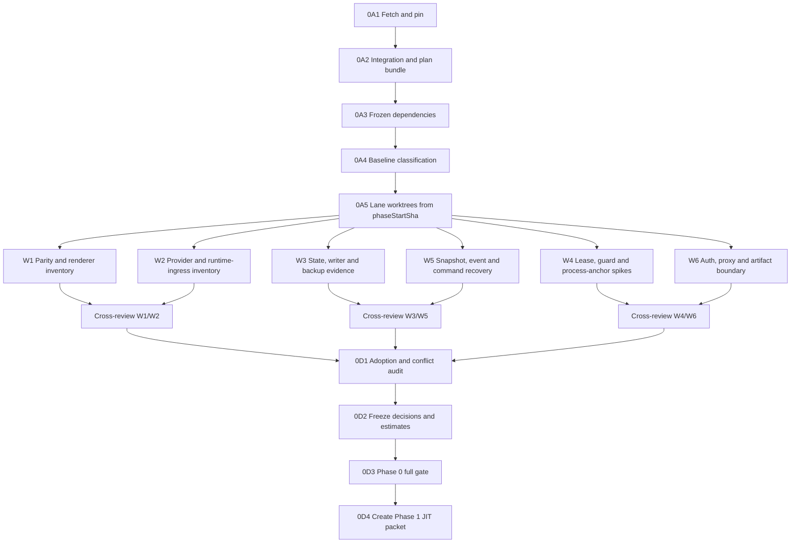

# Hosted Web Phase 0: Just-in-Time Execution Packet

## Status and authority

- Status: historical Phase 0 packet; for the live phase status see
  [docs/hosted-web-phases/EXECUTION_INDEX.json](hosted-web-phases/EXECUTION_INDEX.json)
  (single source of truth) — the line below reflects the state at authoring time
- Status at authoring time: ready for execution after explicit implementation start
- Packet revision: `phase-00-r2`
- Scope: Phase 0 only
- Parent plan: [Hosted Web Runtime: End-to-End Completion Plan](./hosted-web-e2e-completion-plan.md)
- Execution router: [Hosted Web Execution Router](./hosted-web-phases/README.md)
- Packet standard: [Hosted Web Execution Packet Standard](./hosted-web-phases/PACKET_STANDARD.md)
- Canonical repository: `777genius/agent-teams-ai`
- Base branch: `refactor/team-provisioning-round2-reapply`
- Implementation branch: `refactor/hosted-web-feature-boundaries`
- Current observed base SHA: `67548009b4d811d24ce3cb3ee0aed591e4922730`
- Pinning rule: fetch and record the remote SHA again immediately before branch creation
- Estimated Phase 0 diff: 4,000-6,500 changed lines, including executable spikes and tests
- Complexity: 9/10
- Initial Phase 0 risk: 8/10
- Hosted terminal: excluded; only a v1 absence assertion is allowed

This packet is the normative execution order for Phase 0. The parent plan remains authoritative for
architecture, threat model, ADR semantics and later phases. If they conflict, stop and reconcile the
documents before code changes.

## Phase objective

Turn the moving, partially red and Electron-coupled baseline into a pinned, measured and evidence-
backed starting point for Phase 1.

Phase 0 does not implement hosted team product behavior. It must answer, with checked-in evidence:

1. Which exact base and current failures are being inherited?
2. Which renderer actions and API members require replacement or deliberate exclusion?
3. Which provider/runtime paths, state files, external writers and native artifacts exist?
4. Can the proposed lease, workspace guard, process ownership, backup, event handoff, command recovery
   and authentication boundaries work in the target production topology?
5. Which ADRs are closed, narrowed or reopened before feature implementation?
6. Is the 28k-45k v1 estimate still credible when counted by unique packages and actions?

## Explicit non-goals

- No hosted create/launch/task/message/review route is enabled.
- No renderer team screen is migrated.
- No broad service extraction from `teams.ts`, TeamDataService, teamSlice or TeamDetailView occurs.
- No provider is launched against a real user project.
- No terminal daemon, gateway, WebSocket route, store, migration or artifact is added.
- No production schema migration is applied to user state.
- No dependency is installed merely to make a spike convenient.
- No refactor is accepted because it looks cleaner without closing a Phase 0 evidence question.

## Definition of Ready

The controller may start 0A only when all conditions below are true:

- explicit user authorization to begin implementation has been received;
- canonical remote resolves to `https://github.com/777genius/agent-teams-ai.git`;
- broker tools and project-scoped controller manifest are available on the chosen execution host;
- the controller has an isolated project root plus empty/reserved integration and worktree roots owned
  only by this project; creation of the integration worktree is part of 0A;
- no worker will use the user's current dirty local `dev` checkout;
- the target host has enough capacity for the admitted worker pool;
- all test launches use new sandbox/test state and workspaces;
- secrets can be passed only through approved runtime mechanisms and never printed into evidence.

If broker-only enforcement is unavailable, stop. Do not fall back to raw tmux, raw registry writes,
untracked workers or `danger_full_access` orchestration.

Role separation is strict: the host operator creates the isolated project/controller manifest; the
broker-only controller schedules and observes jobs; child workers run repository commands only inside
their owned worktrees; the integration owner adopts through broker integration attempts. The controller
itself is not a raw shell/git writer.

## Repository and worktree bootstrap: 0A

0A is serialized and owned by the integration controller. No child implementation worker starts
before 0A.1-0A.4 are complete.

### 0A.1 - Fetch and pin

Run inside a broker-owned 0A baseline job or approved host-operator preflight, not from the broker-only
controller and not from the user's dirty checkout:

```bash
git fetch origin refactor/team-provisioning-round2-reapply
git rev-parse origin/refactor/team-provisioning-round2-reapply
git remote get-url origin
```

Record:

- `baseBranch`;
- `baseSha`;
- fetch timestamp;
- remote URL;
- Node, pnpm, OS, kernel and architecture;
- controller manifest ID and project slug;
- lockfile hash.

The branch name may move later; Phase 0 stays on the recorded SHA. A later remote update triggers an
explicit rebase/impact decision, never an automatic mid-phase rebase.
If the broker cannot fetch/resolve and record the remote SHA, stop instead of performing an unmanaged
host-side worktree fallback.

### 0A.2 - Create isolated integration state

Use project-scoped broker lifecycle to create:

- one integration worktree at the pinned SHA;
- branch `refactor/hosted-web-feature-boundaries`;
- one registry namespace containing only this project's jobs;
- one integration-attempt namespace.

The integration worktree is the only writer for shared manifests, package scripts, global docs index,
RouteCatalog prototypes and final Phase 0 decision records.

Before any child worktree exists, adopt the reviewed plan bundle into the implementation branch through
the policy integration lifecycle. The bundle contains the parent plan, execution router, packet
standard, active Phase 0 controller packet and all six lane packets. Record `planBundleCommit`, packet
revision and file hashes. A controller-side `/control/plans` copy is an operator audit artifact, not a
substitute for in-worktree packet files.

If the plan bundle cannot be adopted cleanly on the pinned base, stop with `packet_stale`; do not let
workers read an out-of-worktree path or use a plan commit based on different ancestry without review.

### 0A.3 - Materialize dependencies without changing them

Use the pinned lockfile:

```bash
pnpm install --frozen-lockfile
```

If installation changes `pnpm-lock.yaml`, stop and classify the environment mismatch. Do not update a
dependency in Phase 0 unless the parent plan explicitly requires version research and a separate
reviewed dependency decision.

### 0A.4 - Baseline gate

Run and capture exit code, duration and final 20 lines for each command:

```bash
pnpm typecheck:workspace 2>&1 | tail -20
pnpm lint:fast 2>&1 | tail -20
pnpm test:workspace:ci 2>&1 | tail -20
pnpm standalone:build 2>&1 | tail -20
pnpm check:ci 2>&1 | tail -20
```

The broad gate is diagnostic at this point. A pre-existing failure does not authorize changing its
test. Classify every failure as:

- `base_blocker`: prevents any safe Phase 0 evidence;
- `base_owned_fix`: independently correct and suitable for a narrow prerequisite PR;
- `isolated_known_failure`: does not contaminate the relevant evidence and has a named owner;
- `environment_failure`: host/toolchain problem, not repository behavior;
- `unknown`: blocks dependent worker admission until resolved.

After classification, adopt the 0A base/baseline evidence through the integration lifecycle and record
the resulting immutable `phaseStartSha`. It must descend from both `baseSha` and `planBundleCommit`.

### 0A.5 - Materialize lane worktrees

Only after 0A.4 passes, create six dedicated controller-owned lane branches/worktrees from the exact
`phaseStartSha`. Never check out the integration branch itself in a child worktree. Verify in each lane:

- `HEAD == phaseStartSha` before its first lane commit;
- packet revision `phase-00-r2` and the assigned lane packet are present inside the worktree;
- writable paths do not overlap another live lane;
- frozen install succeeds without changing the lockfile;
- the rendered prompt names the in-worktree lane packet and worktree-local handoff path.

The generic capacity controller remains `dryRun=true` and no capacity timer is enabled until this gate
passes. Enabling refill before 0A.5 would start evidence workers against an unpinned or packet-less base.

### 0A outputs

The controller owns these future-branch paths:

```text
docs/research/hosted-web/phase-0/index.md
docs/research/hosted-web/phase-0/base.json
docs/research/hosted-web/phase-0/baseline.md
docs/research/hosted-web/phase-0/lane-ledger.json
docs/research/hosted-web/phase-0/estimate-ledger.md
docs/research/hosted-web/phase-0/salvage-ledger.md
docs/research/hosted-web/phase-0/decision-register.md
```

`base.json` records `baseSha`, `planBundleCommit`, `phaseStartSha`, packet revision, plan/packet hashes,
toolchain envelope and inherited-failure ledger reference. These three SHAs must not be collapsed into
one field: they answer different ancestry and reproducibility questions.

0A passes only when the base is immutable for the phase, the baseline is reproducible, every failure
has one classification, `phaseStartSha` contains the reviewed plan/evidence bundle, all lane worktrees
start from that SHA and no worker depends on an `unknown` failure.

## Execution DAG



0B is the inventory portion of each W lane. 0C is its executable evidence or negative control. Each
worker owns both for one bounded concern so research cannot be declared complete without a reproducible
artifact.

## Worker pool and orchestration policy

- Target: six fresh, useful child workers while host load/admission is safe.
- Controller/integration owner is not counted as a child worker.
- Requested worker profile: configured fast GPT-5.6 profile with xhigh reasoning. The controller must
  verify the exact broker-supported model/profile identifiers rather than inventing flags.
- Every child is `isolated_workspace_write` in exactly one worktree.
- Every child is controller-owned and visible in project status/events.
- Controller checks progress at least every ten minutes while work is active.
- If host load exceeds the accepted threshold, do not add processes merely to preserve worker count.
- A finished lane moves to its assigned review or estimate reconciliation; it does not start surprise
  implementation work from later phases.
- A stale/no-output lane is first inspected for blocker, overlap or oversized scope, then split or
  redirected through broker tools. It is not silently replaced by an invisible worker.
- The target of six applies only while six unique ready lane/review slots exist. The controller never
  creates duplicate evidence work merely to preserve a process count, and serialized 0A/0D gates may
  run below six.

The current hosted-controller policy uses load `<=16` as the admission ceiling unless the host runbook
or current controller manifest defines a stricter value.

### Capacity epochs and unique lane slots

Phase 0 capacity advances through three explicit epochs:

1. `evidence`: one live slot for each of W1-W6;
2. `cross_review`: one reciprocal review slot per original lane after paired handoffs exist;
3. `integration`: serialized correction, adoption and freeze owned by the integration controller.

The controller maintains `docs/research/hosted-web/phase-0/lane-ledger.json`. Each slot records lane ID,
epoch, attempt, job/worktree IDs, `phaseStartSha`, packet revision, owned evidence IDs, state, last useful
progress, handoff hash and superseded job ID. Slot states are `unstarted`, `active`, `handoff`, `review`,
`correction`, `adopted`, `blocked`, `failed` or `superseded`.

Static capacity templates are a catalog, not a refill queue. Automatic refill is allowed only for a
staged request that names an existing ready slot and either has no prior attempt or records the salvage/
supersession decision for a stale or failed attempt. If the generic capacity controller cannot enforce
that identity, keep its producer target at zero and let the broker-only controller launch the exact six
declared jobs. Never turn `desiredWorkers=6` on against reusable W1-W6 templates without lane-ledger
deduplication.

After an evidence handoff, the slot transitions to reciprocal review; it is not refilled as another
producer. After all reviews, capacity may fall below six because 0D is intentionally serialized.

## Ownership rules

All workers may read the pinned repository. Writes are exclusive:

| Owner      | Writable surface                                                                                                                  |
| ---------- | --------------------------------------------------------------------------------------------------------------------------------- |
| Controller | phase index, base/baseline, estimate/salvage ledgers, decision register, shared package scripts, final integration fixes          |
| W1         | `docs/research/hosted-web/phase-0/parity-renderer/**`, `scripts/hosted-web/phase-0/parity-renderer/**`, matching tests            |
| W2         | `docs/research/hosted-web/phase-0/provider-runtime/**`, `scripts/hosted-web/phase-0/provider-runtime/**`, matching fixtures/tests |
| W3         | `docs/research/hosted-web/phase-0/state-writers/**`, `scripts/hosted-web/phase-0/state-writers/**`, matching fixtures/tests       |
| W4         | `docs/research/hosted-web/phase-0/host-primitives/**`, `scripts/hosted-web/phase-0/host-primitives/**`, matching fixtures/tests   |
| W5         | `docs/research/hosted-web/phase-0/recovery-events/**`, `scripts/hosted-web/phase-0/recovery-events/**`, matching fixtures/tests   |
| W6         | `docs/research/hosted-web/phase-0/auth-artifacts/**`, `scripts/hosted-web/phase-0/auth-artifacts/**`, matching fixtures/tests     |

Matching tests live below:

```text
test/architecture/hosted-web/phase-0/<lane>/**
```

Workers do not edit `package.json`, `pnpm-lock.yaml`, shared architecture docs, production source,
Docker entrypoints or another lane's files. If a runnable alias is useful, the worker documents the
exact command and the controller adds the shared package script after adoption review.

### Worker lane entrypoints

The sections below remain the controller's compact mission and acceptance registry. Each child worker
receives the corresponding lane packet in full; it does not receive the entire parent plan as a prompt.

| Lane | Autonomous packet                                                                                     | Evidence concern                                              |
| ---- | ----------------------------------------------------------------------------------------------------- | ------------------------------------------------------------- |
| W1   | [`w1-parity-renderer.md`](./hosted-web-phases/phase-00/lanes/w1-parity-renderer.md)                   | API/action parity and renderer reachability                   |
| W2   | [`w2-provider-runtime.md`](./hosted-web-phases/phase-00/lanes/w2-provider-runtime.md)                 | provider topology, runtime ingress and environment provenance |
| W3   | [`w3-state-writers-backup.md`](./hosted-web-phases/phase-00/lanes/w3-state-writers-backup.md)         | state authority, external writers and safe backup             |
| W4   | [`w4-lease-guard-process.md`](./hosted-web-phases/phase-00/lanes/w4-lease-guard-process.md)           | Linux lease, descriptor guard and process ownership           |
| W5   | [`w5-events-commands-recovery.md`](./hosted-web-phases/phase-00/lanes/w5-events-commands-recovery.md) | snapshot/event and command/effect recovery                    |
| W6   | [`w6-auth-proxy-artifacts.md`](./hosted-web-phases/phase-00/lanes/w6-auth-proxy-artifacts.md)         | auth, proxy/origin and standalone artifact truth              |

## W1 - Parity and renderer reachability

### Mission

Produce the exact API/action ledger that prevents method-name parity and hidden Electron-only effects.

### Required reads

Read TeamsAPI/ReviewAPI/CrossTeamAPI in `src/shared/types/api.ts`, teamSlice/store event wiring,
TeamList/TeamDetail/CreateTeam and child controls, HttpAPIClient/renderer composition, preload/IPC
channels and their characterization tests.

### Deliverables

- `api-parity-ledger.json`, `renderer-action-inventory.json`, `legacy-bypass-inventory.json`;
- `selection-reconciliation-invariants.md` and `estimate-input.json`;
- deterministic `scan-api-and-actions.ts` plus its negative/positive fixture test.

Every ledger row contains stable ID, legacy symbol/signature, renderer callers, owning feature,
`direct | decomposed | desktop-only | deferred`, security class, required semantic evidence and target
phase/work package.

### Acceptance

- Counts match the pinned AST, not historical numbers. A difference from 86/20/3 is explained.
- Every visible team control maps to one action or deliberate absence-before-mount.
- Dynamic dispatch has an explicit annotation/fixture; it is not omitted because static scanning is hard.
- Direct `window.electronAPI.teams`, global mega-client and fabricated-success browser paths are listed.
- Selection, thin/full snapshots, tombstones, pagination and event/poll races are captured as invariants.
- Scanner failure on a deliberately missing/duplicate action fixture is tested.

Do not migrate renderer code, create client facets or treat optional chaining/method existence as
capability proof.

## W2 - Provider, runtime ingress and environment truth

### Mission

Describe the actual execution topologies and every machine callback/credential/environment boundary.

### Required reads

Read deterministic provisioning/TeamProvisioning modules, TeamRuntimeAdapterRegistry and lane planner,
OpenCode runtime/delivery routes, provider-management/profile features, environment/settings/MCP/
binary resolution and relevant provider/fake-runtime tests.

### Deliverables

- execution topology, credential exposure and fake-runtime fixture matrices;
- `runtime-ingress-inventory.json`, `environment-provenance.json`, `estimate-input.json`;
- deterministic `scan-runtime-surfaces.ts` plus its fixture test.

### Acceptance

- Distinguish four provider identities from two execution backend families.
- Every bootstrap/delivery/task/heartbeat/permission operation has direction, caller, authority,
  idempotency, body IDs, persisted evidence and current route.
- Every provider child environment key has provenance and required/optional/forbidden classification.
- Browser session and runtime-ingress authority are proven disjoint in the proposed mapping.
- Anthropic/Codex/Gemini compatibility assumptions and OpenCode-specific differences are explicit.
- No secret value, auth payload or private provider payload appears in evidence.

Do not invent a universal provider interface, rewrite adapters, execute a live provider or use an
existing project.

## W3 - State families, external writers and backup truth

### Mission

Catalog durable authority and prove the minimum safe SQLite backup primitive without pretending all
provider-owned files are transactional.

### Required reads

Read ConfigManager, TeamDataService, task/Kanban/inbox/review writers and watchers, OpenCode stores/
journals, TeamBackupService, internal-storage/SQLite driver and corruption/concurrency tests.

### Deliverables

- state-family, writer-coordination, unknown-field/schema and backup-behavior catalogs;
- `sqlite-online-backup-spike.md`, `estimate-input.json`;
- runnable SQLite backup spike plus its fault-injected test.

### Acceptance

- Every state family has owner, writer set, schema/version, atomicity, corruption policy and backup role.
- Each required mutation is app-exclusive, cooperative, provider-mediated, quiescent-only or unavailable.
- Negative fixtures show an app-only in-process lock does not coordinate an external writer.
- SQLite spike uses the supported Online Backup API, runs with active WAL, reopens independently and
  fails rather than raw-copying DB/WAL/SHM on BUSY/corruption.
- No user `~/.claude` data is read or written; all fixtures are temporary and marker-owned.

Do not add a universal repository, migrate provider JSON into SQLite or modify production backup
behavior.

## W4 - Host lease, workspace guard and process ownership

### Mission

Run the Linux feasibility work that TypeScript mocks cannot prove: one writer, descriptor-bound
workspace effects and owned process-tree drain.

### Required reads

Read standalone/Docker/init, process spawn/kill paths, workspace/Git/provider-spawn adapters, final
seccomp/user/mount topology and ADR-16/28/31.

### Deliverables

- target-host envelope, lease/guard/anchor result reports, native artifact proposal and estimate input;
- isolated instance-lock, workspace-guard and process-anchor spike directories;
- marker-owned container/native fixture tests for all three primitives.

### Acceptance

- Two containers/manual starts on one supported local volume prove only one reaches Node/effect code.
- Paused/killed owners, duplicate FD close ordering and anchor path replacement cannot create overlap.
- `openat2`/`statx`/seccomp/filesystem probes run inside the final-shape Linux container.
- Parent/final symlink, root rename, bind-mount and stale-generation races produce zero outside-marker
  file/Git/provider-spawn effects; raw Node path checks provide the failing negative control.
- Process anchor proves spawn nonce, ready evidence, pidfd/subreaper ownership, double-fork reap,
  TERM/KILL escalation, controller EOF and typed drained/unclassified outcomes.
- `/proc/<pid>/fd` scan proves lease/control descriptors do not leak into fake provider/Git/helpers.

If the active worker host is not the target Linux topology, local source work may proceed, but the lane
cannot become `verified` until its container probes run on an admitted target host.

Do not touch unrelated processes, accept NFS/CIFS without explicit support, or productionize spike
artifacts before 0D.

## W5 - Snapshot/event and command/effect recovery

### Mission

Prove that snapshot plus replay cannot lose a concurrent mutation and that transport retries cannot
repeat an ambiguous external effect.

### Required reads

Read event broadcast/renderer EventSource, snapshots/watchers, provisioning idempotency/OpenCode
delivery journals, reconciliation tests and ADR-27/33/34.

### Deliverables

- event/cursor inventory and snapshot-handoff scheduler report;
- command catalog, effect matrix, fingerprint golden vectors and estimate input;
- runnable schedule/catalog generators and their deterministic tests.

### Acceptance

- Deterministic scheduler pauses before/after read, commit, cursor, serialization, listener and replay.
- Negative controls reproduce the cursor-after-read and query-then-listen lost-event schedules.
- Accepted design converges with duplicates but no gap for SQLite and external-file projection cases.
- Every required mutation has one versioned normalized intent/fingerprint and effect recovery class.
- Same idempotency key with changed intent conflicts; non-reconcilable ambiguity becomes
  `operator_required`, never an automatic body replay.
- Golden vectors cover schema/fingerprint/key version changes and retained comparison behavior.

Do not introduce event sourcing, claim exactly-once without evidence or persist sensitive command
bodies in receipts/fingerprints.

## W6 - Browser authentication, proxy contract and artifact truth

### Mission

Prove restart-safe single-operator authentication and the exact standalone/bundle boundary before any
remote mutation route is enabled.

### Required reads

Read standalone/HttpServer/routes/Docker, renderer boot and CORS behavior, internal-storage/build/native
stubs, ADR-7/17 and official package metadata for version-dependent facts.

### Deliverables

- auth transition, proxy/origin threat and cookie-version evidence;
- artifact inventory, ABI/stub report, terminal-absence report and estimate input;
- standalone artifact scanner plus auth/proxy/artifact negative tests.

### Acceptance

- Pairing -> durable device family -> short session -> renew/rotate/revoke/reset schedules cover restart,
  expiry, response loss, two tabs, replay after grace and keyring failure.
- PUBLIC_ORIGIN and exact trusted-proxy CIDRs are the only browser authority source; direct HTTP,
  forwarded-header spoof, wildcard CORS and sibling authority fail before body/idempotency work.
- No stateless signed cookie becomes session authority and no plaintext recovery credential is durable.
- Artifact report proves current standalone/static/API topology, emitted worker needs, Node/Electron ABI
  splits and every empty/missing stub risk.
- V1 terminal daemon/gateway/SDK/routes/migrations are absent from the proposed hosted artifact.

Do not enable auth/change CORS, install the cookie dependency before 0D or expose sensitive values.

## Worker prompt contract

The controller renders each worker prompt from this template:

```text
You own Phase 0 package <Wn> only.
Base SHA/worktree: <sha> / <isolated path>
Phase start SHA / plan bundle commit: <phaseStartSha> / <planBundleCommit>
Parent plan: docs/hosted-web-e2e-completion-plan.md
Execution packet: docs/hosted-web-phase-0-execution-packet.md
Lane packet: docs/hosted-web-phases/phase-00/lanes/<lane>.md
Packet revision: phase-00-r2
Writable paths: <exact lane paths>
Read-only source surfaces: <listed inputs>
Deliverables and acceptance: <files and checks>
Forbidden scope: <listed exclusions>
Characterize before changing. Use only new sandbox/temp fixtures. Do not print secrets.
Do not edit shared files, package.json, lockfile, production source or another lane.
Return status, evidence, diff stat, checks, assumptions and ADR recommendation. Never claim verified
when a required target-host probe did not run.
```

The controller injects immutable runtime facts and the handoff path defined by the packet standard.
Worker prompts do not contain broad instructions such as “improve architecture”, “finish Phase 0” or
“help another lane”. Cross-lane questions go through the controller. A stale revision, missing heading
or ownership conflict returns `packet_stale` or `packet_conflict` before edits.

## Progress monitoring and intervention

Every check records only project state: host admission, controller/timer health, fresh worker count,
last useful output, lane state/next evidence, overlap/dirty risk, review/adoption queue, red prerequisite
and estimate burn by unique bucket rather than raw output lines. Fresh worker count is reconciled against
unique active slots in `lane-ledger.json`; duplicate jobs never increase useful capacity.

Intervene when:

- no useful output for two intervals or a worker edits outside ownership;
- lanes define overlapping authority/evidence or replace a spike with prose/mocks;
- later-phase implementation or a real project/provider/secret enters the task;
- output exceeds budget without new required risk;
- a negative control is weakened instead of understood.

Preferred interventions are: narrow the question, split a fixture from implementation, hand a shared
decision to the controller, redirect a finished worker to its paired review, or mark a genuine blocker.

## Review pairing

Review begins after both paired lanes have a self-reviewed output:

| Reviewer pair                | Review focus                                                           |
| ---------------------------- | ---------------------------------------------------------------------- |
| W1 reviews W2; W2 reviews W1 | renderer actions agree with provider/runtime capability and direction  |
| W3 reviews W5; W5 reviews W3 | command/event recovery matches actual writer/storage atomicity         |
| W4 reviews W6; W6 reviews W4 | host primitives agree with auth/pairing/artifact/container assumptions |

Reviewers do not edit the other worker's branch. They produce findings with evidence path, severity,
required correction and affected ADR/decision. The owner corrects the output or records a contested
decision for 0D.

Required self-review before review handoff:

```bash
git status --short
git diff --stat
git diff --check
pnpm lint:fast:files -- <changed ts/tsx/js files> 2>&1 | tail -20
pnpm exec vitest run <owned tests> 2>&1 | tail -20
```

Documentation-only lanes still run formatting/checks and validate JSON/schema fixtures. Native/container
lanes attach the exact build/run command, final image identity and marker-owned cleanup evidence.

## Diff and commit budget

- Inventory/scanner lane: target 400-800 changed lines.
- Executable spike plus tests: target 700-1,300 changed lines.
- Any single adoption above 1,500 changed lines must be split or explicitly approved by the controller.
- Commit only deterministic evidence; summarize/hash large raw artifacts outside Git.
- One lane should normally produce one to three conventional commits.

Example commit subjects:

```text
docs(hosted-web): inventory phase zero runtime surfaces
test(hosted-web): add snapshot handoff negative schedules
build(hosted-web): add workspace guard feasibility harness
```

Do not commit unrelated baseline fixes with evidence work. A necessary base fix receives its own narrow
prerequisite commit/PR and the baseline is rerun before dependent adoption.

## Integration and adoption order: 0D.1

Integration uses the project policy lifecycle, not raw worker-branch merges:

1. Verify worker status, clean scope, self-review, targeted checks, `git diff --check` and no secrets.
2. Open one integration attempt at the current integration-head SHA.
3. Adopt deterministic scanners and fixture schemas first.
4. Adopt W1/W2 inventories and reconcile capability/provider terminology.
5. Adopt W3/W5 state, writer, event and recovery evidence together.
6. Adopt W4/W6 host/auth/artifact evidence only after their container assumptions agree.
7. Controller regenerates shared estimate/salvage ledgers from all lane `estimate-input.json` files.
8. Resolve contested findings in the decision register; do not hide disagreement in prose.
9. Run targeted combined checks, then the Phase 0 broad gate.
10. Commit/push only after the integration attempt is green and reviewed.

An integration conflict in a shared source path is evidence that ownership was violated. Do not solve
it by accepting both implementations. Select one authority or return the package to its owner.

## Shared evidence schemas

| Record           | Required fields                                                                                                                                      |
| ---------------- | ---------------------------------------------------------------------------------------------------------------------------------------------------- |
| Decision         | decisionId, question, sourceEvidence, options, outcome, confidence, affected capabilities/ADRs, owner, `accepted \| narrowed \| reopened \| blocked` |
| Estimate         | bucketId, packages, production/test/deleted lines, excluded generated/vendor lines, overlap, confidence, assumptions, evidenceRefs                   |
| Baseline failure | command, exitCode, classification, first-known-bad evidence, affected packages, owner, isolation/fix and rerun evidence                              |

Machine-readable files use versioned JSON schemas, deterministic ordering and stable IDs. Markdown is a
review projection, not the only authority for parity or estimate calculations.

## Phase 0 combined verification: 0D.3

Required narrow gates:

- every scanner has positive and deliberate negative fixtures;
- every JSON evidence file validates against its checked-in schema;
- every spike has exact environment, command, positive result and failing negative control;
- every state/writer/provider/action row has one disposition and owner;
- no lane writes outside its owned paths;
- no evidence contains secrets, raw auth payloads or real-project paths;
- terminal implementation/artifacts remain absent.

Required repository gates after adoption:

```bash
pnpm typecheck:workspace 2>&1 | tail -20
pnpm lint:fast 2>&1 | tail -20
pnpm test:workspace:ci 2>&1 | tail -20
pnpm standalone:build 2>&1 | tail -20
pnpm check:ci 2>&1 | tail -20
git diff --check
```

Do not run `pnpm lint:fix`. `pnpm check:ci` includes the full root/MCP lint gates; `lint:fast` remains
the iteration preflight, not final evidence.

## Stop and fail-closed conditions

Stop dependent work immediately when:

- canonical remote/base SHA cannot be verified;
- baseline has an unknown failure affecting the evidence surface;
- broker/controller ownership or isolated worktrees cannot be enforced;
- host load is above admission policy;
- a target Linux syscall/filesystem/process primitive cannot be proven;
- a proposed solution requires a real user project, live user team or unrestricted host cleanup;
- state authority/writer coordination cannot be classified for a required mutation;
- a secret may have entered Git, logs or artifacts;
- the estimate grows outside 28k-45k or a unique bucket varies over 20% without scope review;
- an ADR negative control succeeds unexpectedly or its positive proof is non-reproducible;
- Phase 0 needs a hosted terminal implementation to pass.

A failed feasibility spike does not mean “try a weaker fallback”. It produces one of:

- narrow/remove the dependent v1 capability;
- change the supported deployment envelope;
- reopen the ADR with explicitly scored alternatives;
- block Phase 1 until the external condition changes.

## Phase 0 freeze: 0D.2

The controller may freeze Phase 0 only when the decision register records outcomes for:

- exact v1 scope and capability exclusions;
- contract/route/facet conventions;
- TeamId/WorkspaceId/MemberId identity authority;
- provider execution topology and runtime-ingress direction;
- state ownership and external-writer classes;
- child environment and credential exposure policy;
- instance lease, workspace guard and process-anchor feasibility;
- snapshot/event handoff and command/effect recovery;
- auth/device/session/reset and proxy/origin contract;
- artifact/build/SQLite worker and backup feasibility;
- terminal absence from v1;
- updated estimate and Phase 1 prerequisites.

Each outcome is `accepted`, `narrowed`, `reopened` or `blocked`; “TBD” is not a frozen state.

## Definition of Done and Phase 1 handoff

Phase 0 is complete only when:

- 0A base/baseline evidence is reproducible from the pinned SHA;
- every lane starts at the recorded `phaseStartSha`, which contains `planBundleCommit` and reviewed 0A
  evidence;
- all six lanes are reviewed and adopted or explicitly rejected with a decision;
- every parent-plan Phase 0 exit gate has an evidence reference;
- native/container claims ran in the supported target topology;
- estimate/salvage/parity/state/provider/artifact ledgers are generated and validated;
- required broad gates are green or only accepted isolated base failures remain;
- no hosted product mutation or terminal implementation was enabled;
- integration worktree is clean after the conventional Phase 0 commit sequence;
- the controller writes a concise Phase 0 completion report with residual risks;
- a new Phase 1 JIT execution packet is generated from the frozen decisions and current integration SHA.

Phase 1 workers must not be prestarted. Their owned paths, contract IDs and tasks depend on the Phase 0
freeze, so creating them earlier would turn just-in-time planning back into speculative architecture.
The packet is materialized through the execution router and packet standard; a free-form continuation
prompt is not an acceptable Phase 1 packet.
