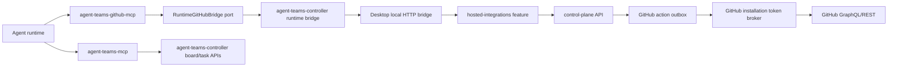

# Phase 12 - Separate Agent Teams GitHub MCP Plan

## Summary

Create a separate `agent-teams-github-mcp` server for GitHub integration tools.

The goal is not to make MCP a new GitHub authority. The GitHub MCP is only an
agent-facing adapter:

```text
agent
  -> agent-teams-github-mcp
  -> agent-teams-controller runtime bridge
  -> desktop local HTTP bridge
  -> hosted-integrations feature
  -> control-plane API
  -> policy, outbox, token broker
  -> GitHub GraphQL/REST
```

The control-plane remains the security boundary. GitHub tokens, installation
tokens, repository authorization, outbox dispatch, audit, retries, and GitHub
App identity stay in the backend/control-plane path.

This phase should split GitHub-specific MCP responsibilities out of the existing
`agent-teams-mcp`. The existing MCP keeps team/task/kanban/review/runtime tools.
The new MCP owns only GitHub integration tools.

## Decision

Use a separate workspace package:

```text
mcp-servers/
  github/
    package.json
    src/
      index.ts
      tools/
      core/
      adapters/
```

Package name:

```text
agent-teams-github-mcp
```

MCP server name in generated config:

```text
agent-teams-github
```

Why:

- SRP: task board MCP and GitHub MCP have different reasons to change.
- ISP: agents see a smaller GitHub-specific tool surface only when relevant.
- DIP: GitHub MCP depends on a runtime bridge port, not on GitHub SDKs or
  control-plane internals.
- OCP: future `agent-teams-telegram-mcp`, `agent-teams-slack-mcp`, and
  integration-specific MCPs can follow the same pattern.

## Alternatives Considered

### Option 1 - Separate `agent-teams-github-mcp` package

🎯 9 🛡️ 9 🧠 6

Estimated change size: 1200-2200 LOC.

Recommended.

Pros:

- clean SRP boundary;
- GitHub tools can be injected only when GitHub integration is connected;
- easier to keep tool names/descriptions focused for agents;
- future integrations can copy the pattern;
- easy to remove/deprecate GitHub tools from `agent-teams-mcp`.

Cons:

- MCP launch/config builder needs multi-server support;
- packaged app must stage/copy more than one MCP bundle;
- active runtimes may need restart when GitHub integration is enabled/disabled.

### Option 2 - Keep one MCP, move GitHub to `githubTools.ts`

🎯 6 🛡️ 6 🧠 3

Estimated change size: 400-900 LOC.

Pros:

- fastest implementation;
- no new package or packaging path;
- fewer launch paths.

Cons:

- `agent-teams-mcp` becomes a broad integration catch-all;
- weaker SOLID boundary;
- hard to keep GitHub tools hidden when not connected;
- future Telegram/Slack/billing tools would repeat the same problem.

### Option 3 - One dynamic MCP gateway with feature toolsets

🎯 7 🛡️ 8 🧠 8

Estimated change size: 1800-3200 LOC.

Pros:

- elegant long-term extension model;
- one server process;
- pluggable toolsets.

Cons:

- too much framework work now;
- we would be building our own MCP plugin system before proving the GitHub UX;
- higher risk around dynamic tool availability and provider behavior.

## Current State

Already implemented:

- control-plane GitHub action outbox;
- server-side GitHub App token broker;
- repository target binding and enabled target policy;
- desktop hosted integration feature;
- local desktop HTTP bridge:
  - `POST /api/teams/:teamName/hosted-integrations/github-actions`
  - `GET /api/teams/:teamName/hosted-integrations/github-actions/:actionRequestId`
- auto target resolution by local `remote.origin.url` plus enabled target;
- low-level MCP tools in `agent-teams-mcp`:
  - `hosted_github_action_submit`
  - `hosted_github_action_status`
- existing supported action types:
  - `github.issue_comment.create`
  - `github.pull_request_comment.create_top_level`
  - `github.pull_request_review.create`
  - `github.check_run.create_or_update`

Problems in current MCP shape:

- GitHub tools are mixed into general runtime tools.
- The low-level submit tool is too raw for agents.
- `targetId` is still required by the MCP schema even though desktop can now
  auto-resolve by local Git remote.
- GitHub tools are not conditionally injected based on connected integration
  state.
- Agent prompt does not yet teach when to use GitHub MCP tools.

Migration inventory:

| Current place                                    | Current responsibility                          | Target place                                       | Target responsibility                                                                       |
| ------------------------------------------------ | ----------------------------------------------- | -------------------------------------------------- | ------------------------------------------------------------------------------------------- |
| `mcp-server/src/tools/runtimeTools.ts`           | `hosted_github_action_submit` low-level tool    | `mcp-servers/github/src/tools/rawSubmitTool.ts`    | temporary raw compatibility tool                                                            |
| `mcp-server/src/tools/runtimeTools.ts`           | `hosted_github_action_status` low-level tool    | `mcp-servers/github/src/tools/actionStatusTool.ts` | GitHub action polling tool                                                                  |
| `agent-teams-controller/src/internal/runtime.js` | desktop hosted GitHub submit/status bridge      | keep and harden                                    | shared runtime bridge implementation                                                        |
| `agent-teams-controller/src/mcpToolCatalog.js`   | registers GitHub tools under runtime tool group | split catalogs                                     | `agent-teams` catalog excludes GitHub tools, `agent-teams-github` catalog owns GitHub tools |
| `src/main/services/team/TeamMcpConfigBuilder.ts` | writes one generated MCP server                 | extend                                             | writes `agent-teams` and optional `agent-teams-github`                                      |
| provisioning prompts                             | no GitHub MCP guidance                          | conditional prompt block                           | teach agents only when GitHub MCP is injected                                               |

## Goals

- Create a separate GitHub MCP server with a small, agent-friendly tool surface.
- Keep GitHub token access out of MCP and out of agent runtime.
- Make tool names map to agent intent, not backend action type names.
- Make `targetId` optional and prefer auto target resolution by local Git remote.
- Inject GitHub MCP only when the workspace has an active hosted GitHub
  integration and at least one enabled repository target.
- Give agents a clear status/capabilities tool so they know what is available.
- Preserve idempotency with `localAttemptId`.
- Keep current low-level tools temporarily as deprecated compatibility shims or
  move them after prompt/tooling migration.

## Non-Goals

- Do not let MCP call GitHub directly.
- Do not expose GitHub installation tokens, desktop tokens, OAuth tokens, or
  control-plane secrets to agents.
- Do not add PR/issue/commit creation in this phase unless backend action types
  already exist.
- Do not make the desktop app require control-plane for normal local-first use.
- Do not build a generic MCP plugin framework yet.
- Do not dynamically mutate an already-running MCP tool list. Use teammate
  restart/relaunch for GitHub MCP enable/disable changes.

## Architecture



Responsibilities:

| Layer                       | Responsibility                                                                            |
| --------------------------- | ----------------------------------------------------------------------------------------- |
| `agent-teams-github-mcp`    | agent-facing tool schemas, intent mapping, status/capability display                      |
| `agent-teams-controller`    | local runtime bridge to desktop local HTTP API                                            |
| desktop HTTP bridge         | trusted runtime validation, active team/member validation, local remote target resolution |
| hosted-integrations feature | desktop token, safe request envelope, target state cache                                  |
| control-plane               | authorization, policy, outbox, token broker, GitHub dispatch                              |

## Clean Architecture Model

The GitHub MCP should be a small vertical slice with the same dependency rule as
the control-plane packages:

```text
tools/presentation
  -> application/use-cases
  -> domain/core contracts
  -> ports

adapters
  -> ports
```

Dependency direction:

- tools can import application use cases and DTO schemas;
- use cases can import domain value objects, action mapping, and ports;
- ports define what the outside world can do;
- adapters implement ports and may import `agent-teams-controller`;
- no domain/application code imports FastMCP, desktop, Electron, GitHub SDKs, or
  control-plane packages.

Simple DDD language:

| Term                  | Meaning                                               |
| --------------------- | ----------------------------------------------------- |
| `GitHubActionIntent`  | agent-level intent, for example "comment on issue"    |
| `GitHubActionCommand` | trusted command sent to desktop bridge                |
| `GitHubActionRequest` | persisted backend/outbox request                      |
| `RepositoryTarget`    | enabled repo binding owned by workspace policy        |
| `RuntimeIdentity`     | team/member/run/session identity for attribution      |
| `Capability`          | policy-backed action family available to this runtime |
| `LocalAttemptId`      | idempotency key for one user-visible agent attempt    |

The MCP should not model GitHub installation state as an aggregate. That state is
owned by control-plane. MCP only observes a safe capability/status view and sends
commands through a port.

## Shared Runtime Bridge

The important architectural piece is not only a GitHub MCP. It is a reusable
runtime integration bridge pattern:

```ts
interface RuntimeIntegrationBridge<TCommand, TResult, TStatus> {
  submit(command: TCommand): Promise<TResult>;
  getStatus(input: { actionRequestId: string }): Promise<TStatus>;
  getCapabilities(input: RuntimeCapabilityQuery): Promise<RuntimeCapabilityView>;
}
```

For GitHub V1 this becomes:

```ts
interface RuntimeGitHubBridge {
  submitAction(input: GitHubMcpSubmitActionInput): Promise<GitHubMcpActionResult>;
  getActionStatus(input: GitHubMcpActionStatusInput): Promise<GitHubMcpActionStatus>;
  getIntegrationStatus(input: GitHubMcpStatusInput): Promise<GitHubMcpIntegrationStatus>;
}
```

Future MCPs should repeat the same bridge shape:

| MCP                        | Bridge port                        | Backend authority                          |
| -------------------------- | ---------------------------------- | ------------------------------------------ |
| `agent-teams-github-mcp`   | `RuntimeGitHubBridge`              | hosted GitHub integration/control-plane    |
| `agent-teams-telegram-mcp` | `RuntimeMessengerBridge`           | hosted messenger integration/control-plane |
| `agent-teams-slack-mcp`    | `RuntimeMessengerBridge`           | hosted messenger integration/control-plane |
| `agent-teams-billing-mcp`  | likely not agent-facing by default | billing service/control-plane              |

Bridge rules:

- the bridge accepts agent intent plus trusted runtime identity;
- the bridge never returns secrets;
- the bridge returns safe status/capabilities, not raw provider objects;
- every integration-specific MCP depends on its bridge port, not on desktop
  internals;
- adapters are replaceable, so a hosted desktop bridge can later be swapped for
  a remote runtime bridge without rewriting tools.

## Package Shape

```text
mcp-servers/github/
  package.json
  tsconfig.json
  tsup.config.ts
  src/
    index.ts
    controller.ts
    core/
      githubActionTypes.ts
      idempotency.ts
      toolDescriptions.ts
      validation.ts
    ports/
      runtimeGithubBridge.ts
    adapters/
      agentTeamsControllerGithubBridge.ts
    tools/
      statusTool.ts
      commentIssueTool.ts
      commentPullRequestTool.ts
      reviewPullRequestTool.ts
      createCheckRunTool.ts
      actionStatusTool.ts
      rawSubmitTool.ts
      index.ts
```

Root workspace update:

```yaml
packages:
  - agent-teams-controller
  - mcp-server
  - mcp-servers/*
  - landing
  - packages/agent-graph
```

Root scripts update:

```json
{
  "prebuild": "... && pnpm --filter agent-teams-github-mcp build",
  "typecheck:workspace": "... && pnpm --filter agent-teams-github-mcp typecheck",
  "build:workspace": "... && pnpm --filter agent-teams-github-mcp build",
  "test:workspace": "... && pnpm --filter agent-teams-github-mcp test",
  "lint:github-mcp": "pnpm --filter agent-teams-github-mcp lint"
}
```

## Tool Surface

### Tool 1 - `github_integration_status`

Purpose:

Tell the agent whether GitHub integration is usable for the current team runtime.

Parameters:

```ts
{
  teamName: string;
  claudeDir?: string;
  controlUrl?: string;
  waitTimeoutMs?: number;
}
```

Response:

```ts
{
  connected: boolean;
  githubMcpEnabled: boolean;
  currentTarget?: {
    owner: string;
    repo: string;
    displayFullName: string;
  };
  capabilities: string[];
  reason?: string;
  safeErrorCode?: string;
}
```

Implementation detail:

- Preferred: add a desktop local bridge endpoint that returns integration status
  and auto-target resolution result without creating an action.
- Acceptable first step: call existing hosted integrations state/list targets
  APIs through `agent-teams-controller`, then return a conservative status.

Agent instruction:

- Call this before the first GitHub action if unsure whether GitHub is
  connected.
- If `connected=false`, do not attempt GitHub actions. Report that GitHub
  integration needs to be connected or target enabled.

### Tool 2 - `github_comment_issue`

Purpose:

Post an agent-attributed comment on a GitHub issue in the current repository.

Parameters:

```ts
{
  teamName: string;
  runId: string;
  runtimeSessionId: string;
  memberName: string;
  issueNumber: number;
  body: string;
  localAttemptId?: string;
  targetId?: string;
  correlationId?: string;
  claudeDir?: string;
  controlUrl?: string;
  waitTimeoutMs?: number;
}
```

Maps to:

```ts
{
  actionType: 'github.issue_comment.create';
  payload: {
    issueNumber: number;
    body: string;
  }
}
```

Notes:

- `targetId` should be optional. Desktop resolves it from local
  `remote.origin.url` and enabled target.
- `localAttemptId` defaults to a deterministic MCP-generated value only when
  enough stable inputs exist. Safer first version requires the caller to pass it
  or uses random UUID with clear "do not retry by re-calling manually" response.
- Body must not contain reserved Agent Teams markers.

### Tool 3 - `github_comment_pull_request`

Purpose:

Post a top-level PR conversation comment.

Parameters:

```ts
{
  teamName: string;
  runId: string;
  runtimeSessionId: string;
  memberName: string;
  pullRequestNumber: number;
  body: string;
  localAttemptId?: string;
  targetId?: string;
  correlationId?: string;
  claudeDir?: string;
  controlUrl?: string;
  waitTimeoutMs?: number;
}
```

Maps to:

```ts
{
  actionType: 'github.pull_request_comment.create_top_level';
  payload: {
    pullRequestNumber: number;
    body: string;
  }
}
```

Agent instruction:

- Use for conversation-level PR comments.
- Do not use for line-level code comments. That needs a future
  `github_comment_pull_request_line` tool after backend support exists.

### Tool 4 - `github_review_pull_request`

Purpose:

Create an agent-attributed PR review comment. In current backend this supports
only `COMMENT`, not approve/request changes.

Parameters:

```ts
{
  teamName: string;
  runId: string;
  runtimeSessionId: string;
  memberName: string;
  pullRequestNumber: number;
  body: string;
  event?: "COMMENT";
  localAttemptId?: string;
  targetId?: string;
  correlationId?: string;
  claudeDir?: string;
  controlUrl?: string;
  waitTimeoutMs?: number;
}
```

Maps to:

```ts
{
  actionType: 'github.pull_request_review.create';
  payload: {
    pullRequestNumber: number;
    body: string;
    event: 'COMMENT';
  }
}
```

Future extension:

- When backend supports it, extend event to:
  - `APPROVE`
  - `REQUEST_CHANGES`
  - `COMMENT`
- Until then, tool description must explicitly say it does not approve or
  request changes.

### Tool 5 - `github_create_check_run`

Purpose:

Create or update an Agent Teams check run.

Parameters:

```ts
{
  teamName: string;
  runId: string;
  runtimeSessionId: string;
  memberName: string;
  name: string;
  headSha: string;
  status: "queued" | "in_progress" | "completed";
  conclusion?:
    | "action_required"
    | "cancelled"
    | "failure"
    | "neutral"
    | "skipped"
    | "success"
    | "timed_out";
  title?: string;
  summary?: string;
  text?: string;
  checkRunId?: string;
  localAttemptId?: string;
  targetId?: string;
  correlationId?: string;
  claudeDir?: string;
  controlUrl?: string;
  waitTimeoutMs?: number;
}
```

Maps to:

```ts
{
  actionType: "github.check_run.create_or_update";
  payload: {
    name: string;
    headSha: string;
    status: string;
    conclusion?: string;
    title?: string;
    summary?: string;
    text?: string;
  };
}
```

Open decision:

- Current backend supports stored check run id internally. The public command
  DTO does not expose `checkRunId`. Decide whether updates are driven by
  idempotency/repository state or whether this tool should wait until backend
  exposes a safe update contract.

Recommendation:

- Implement create-only first unless backend already supports safe check run
  update by existing action request state.

### Tool 6 - `github_action_status`

Purpose:

Poll action status after submit.

Parameters:

```ts
{
  teamName: string;
  actionRequestId: string;
  claudeDir?: string;
  controlUrl?: string;
  waitTimeoutMs?: number;
}
```

Returns:

```ts
{
  actionRequestId: string;
  status: "queued" | "dispatching" | "succeeded" | "failed" | "dead_lettered";
  githubUrl?: string;
  safeError?: {
    code: string;
    message: string;
    retryable: boolean;
  };
}
```

### Tool 7 - `github_raw_action_submit`

Purpose:

Temporary compatibility and debugging tool, not the preferred agent UX.

Parameters:

Same as current low-level `hosted_github_action_submit`, but:

- `targetId?: string`;
- name belongs to GitHub MCP;
- description says "use only when instructed by system/developer prompt".

Migration:

- Keep current `hosted_github_action_submit` in `agent-teams-mcp` for one
  compatibility window.
- Mark it deprecated in description.
- Update prompts to prefer the new GitHub MCP tools.
- Remove from `agent-teams-mcp` after one release when no launch prompt or
  smoke test references it.

## Runtime Context And Identity

GitHub MCP tools need runtime identity for safe attribution:

```ts
{
  teamName: string;
  memberName: string;
  runId: string;
  runtimeSessionId: string;
}
```

The agent should not invent these fields. They should be injected into the MCP
environment or prompt at runtime launch.

Recommended environment variables for the GitHub MCP process:

```text
AGENT_TEAMS_MCP_CLAUDE_DIR
CLAUDE_TEAM_CONTROL_URL
AGENT_TEAMS_RUNTIME_TEAM_NAME
AGENT_TEAMS_RUNTIME_MEMBER_NAME
AGENT_TEAMS_RUNTIME_RUN_ID
AGENT_TEAMS_RUNTIME_SESSION_ID
AGENT_TEAMS_GITHUB_MCP_ENABLED=1
```

Then tool schemas can make `teamName`, `memberName`, `runId`, and
`runtimeSessionId` optional for the agent-facing call and fill them from env.

Recommended final tool shape:

```ts
{
  pullRequestNumber: number;
  body: string;
  localAttemptId?: string;
  correlationId?: string;
}
```

Adapter fills runtime fields:

```ts
{
  teamName: env.AGENT_TEAMS_RUNTIME_TEAM_NAME;
  memberName: env.AGENT_TEAMS_RUNTIME_MEMBER_NAME;
  runId: env.AGENT_TEAMS_RUNTIME_RUN_ID;
  runtimeSessionId: env.AGENT_TEAMS_RUNTIME_SESSION_ID;
}
```

Why:

- easier for agents;
- fewer hallucinated identifiers;
- safer runtime validation;
- better tool descriptions.

Fallback:

- Keep explicit fields accepted for tests and nonstandard launchers.
- If env and explicit values conflict, fail closed.

## Conditional Enablement

GitHub MCP should be injected only when:

- hosted integrations feature is available;
- desktop is paired with the control-plane;
- GitHub installation is connected;
- at least one repository target is enabled;
- current team project has a local GitHub remote that matches exactly one
  enabled target, or the user explicitly configured a target for the team.

Implementation in desktop:

```text
TeamMcpConfigBuilder
  -> always inject agent-teams
  -> optionally inject agent-teams-github
```

Recommended input:

```ts
interface WriteMcpConfigOptions {
  mcpPolicy?: TeamMemberMcpPolicy;
  controlApiBaseUrl?: string | null;
  hostedGithub?: {
    enabled: boolean;
    reason?: string;
    runtimeIdentity?: {
      teamName: string;
      memberName: string;
      runId: string;
      runtimeSessionId: string;
    };
  };
}
```

Launch behavior:

- If GitHub integration is not connected at runtime launch, do not inject
  `agent-teams-github`.
- If user connects GitHub while agents are running, show "restart teammate to
  enable GitHub tools".
- If user disconnects GitHub while agents are running, tools may still be listed
  by the already-running MCP server, but every call must fail closed through the
  desktop/control-plane checks.

Reason:

- MCP clients generally discover tools at server startup.
- Dynamic tool mutation during a long-running session is provider-dependent and
  riskier than relaunch.

State machine:

```text
disconnected
  -> connected_no_target
  -> connected_target_ready
  -> injected_on_next_launch
  -> active_runtime_with_github_tools
```

Failure transitions:

```text
active_runtime_with_github_tools
  -> target_disabled
  -> tool_calls_fail_closed

active_runtime_with_github_tools
  -> integration_disconnected
  -> tool_calls_fail_closed

connected_target_ready
  -> local_remote_changed
  -> next_launch_preflight_rechecks_target
```

UX consequences:

- connect/install GitHub App should not silently change running agents;
- launch/restart is the boundary where tools become visible;
- disable/disconnect is immediate in policy, even if tools remain listed by the
  MCP client;
- status tool gives agents a safe explanation instead of leaking backend state.

## Agent Prompt Additions

Only add this block when GitHub MCP is injected:

```text
GitHub integration is available for this team.

Use the agent-teams-github MCP tools for GitHub repository actions:
- github_integration_status: check current connection, target, and capabilities.
- github_comment_issue: comment on an issue in the current repository.
- github_comment_pull_request: post a top-level PR conversation comment.
- github_review_pull_request: create a COMMENT review on a PR.
- github_create_check_run: create an Agent Teams check run when explicitly useful.

Do not call GitHub directly for these actions.
Do not ask for GitHub tokens.
Do not pass owner/repo unless a tool explicitly asks for it.
The app resolves the repository from the local git remote and enabled target.
If a GitHub tool says integration is unavailable, report that GitHub needs to be
connected or the repository target enabled.
```

Do not add this block when GitHub MCP is not injected. This prevents agents from
trying tools that are unavailable.

## Tool Naming

Use action-oriented names:

```text
github_integration_status
github_comment_issue
github_comment_pull_request
github_review_pull_request
github_create_check_run
github_action_status
github_raw_action_submit
```

Avoid backend-shaped names in normal tools:

```text
hosted_github_action_submit
github.issue_comment.create
github.pull_request_review.create
```

Backend action type strings stay inside adapters.

## Agent Method Selection Guide

This is the guidance that should be encoded in tool descriptions and prompt
fragments. Agents should not need to know backend action type strings.

| User intent                    | Agent should call             | Required user-visible input      | Notes                                      |
| ------------------------------ | ----------------------------- | -------------------------------- | ------------------------------------------ |
| "Comment on issue 12"          | `github_comment_issue`        | `issueNumber`, `body`            | Current repo is inferred from local remote |
| "Comment on PR 18"             | `github_comment_pull_request` | `pullRequestNumber`, `body`      | Top-level PR conversation only             |
| "Leave a review note on PR 18" | `github_review_pull_request`  | `pullRequestNumber`, `body`      | V1 review event is `COMMENT` only          |
| "Approve PR"                   | no V1 tool                    | none                             | wait for backend approve action            |
| "Request changes"              | no V1 tool                    | none                             | wait for backend request-changes action    |
| "Comment on this line"         | no V1 tool                    | file/path/line not supported yet | future line-level comment tool             |
| "Create an issue"              | no V1 tool                    | title/body/labels later          | future backend action                      |
| "Create a PR"                  | no V1 tool                    | branch/base/title/body later     | future backend action                      |
| "Push commits"                 | no V1 tool                    | commit plan/files later          | future high-risk action                    |
| "Check if GitHub is connected" | `github_integration_status`   | none                             | safe capability check                      |

Agent rule of thumb:

- if a matching GitHub MCP tool exists, use it instead of GitHub CLI/browser;
- if no matching tool exists, explain that the GitHub App action is not
  available yet and ask whether to proceed manually through local git/gh;
- never invent `owner`/`repo` from prompt text for V1;
- do not retry mutating calls with a new `localAttemptId` after an unknown
  timeout.

## Mapping To Backend Actions

| MCP tool                      | Backend action type                            | Transport             |
| ----------------------------- | ---------------------------------------------- | --------------------- |
| `github_comment_issue`        | `github.issue_comment.create`                  | GraphQL               |
| `github_comment_pull_request` | `github.pull_request_comment.create_top_level` | GraphQL               |
| `github_review_pull_request`  | `github.pull_request_review.create`            | GraphQL               |
| `github_create_check_run`     | `github.check_run.create_or_update`            | REST                  |
| `github_action_status`        | status endpoint                                | desktop/control-plane |

Future actions:

| Future MCP tool                       | Future backend action type                   | GitHub API                     |
| ------------------------------------- | -------------------------------------------- | ------------------------------ |
| `github_create_issue`                 | `github.issue.create`                        | GraphQL `createIssue`          |
| `github_create_pull_request`          | `github.pull_request.create`                 | GraphQL `createPullRequest`    |
| `github_create_commit`                | `github.commit.create_on_branch`             | GraphQL `createCommitOnBranch` |
| `github_merge_pull_request`           | `github.pull_request.merge`                  | GraphQL `mergePullRequest`     |
| `github_approve_pull_request`         | `github.pull_request_review.approve`         | GraphQL `addPullRequestReview` |
| `github_request_pull_request_changes` | `github.pull_request_review.request_changes` | GraphQL `addPullRequestReview` |
| `github_add_labels`                   | `github.labels.add`                          | GraphQL                        |
| `github_assign_users`                 | `github.assignees.add`                       | GraphQL                        |
| `github_comment_pull_request_line`    | `github.pr_line_comment.create`              | GraphQL or REST after proof    |

Do not add future tools until backend action types, policy capabilities, and
outbox dispatch exist.

## Idempotency

Every mutating tool must send `localAttemptId`.

Rules:

- If the agent provides `localAttemptId`, pass it through.
- If omitted, adapter may generate one with UUID and return it in the result.
- Retrying the exact same user-visible action should reuse the same
  `localAttemptId`.
- Tool result must include:
  - `actionRequestId`;
  - `localAttemptId`;
  - `status`;
  - `githubUrl?`;
  - `safeError?`.

Open edge:

- Agents are not reliable at reusing IDs across turns. The prompt should tell
  agents to reuse `localAttemptId` from a failed/unknown result if they retry.
- For high-risk future actions like commits/merge, backend should enforce
  stronger idempotency and state checks before enabling tools.

## Error Model

MCP tools should return safe JSON, not raw stack traces.

Recommended success:

```json
{
  "ok": true,
  "actionRequestId": "act_...",
  "localAttemptId": "agent-local-...",
  "status": "queued",
  "message": "GitHub action queued.",
  "githubUrl": null
}
```

Recommended failure:

```json
{
  "ok": false,
  "safeError": {
    "code": "HOSTED_GITHUB_INTEGRATION_UNAVAILABLE",
    "message": "GitHub integration is not available for this team.",
    "retryable": false
  },
  "guidance": "Ask the user to connect GitHub or enable the repository target."
}
```

Do not expose:

- desktop token;
- control-plane bearer token;
- GitHub installation token;
- OAuth token;
- full local environment;
- full control-plane URL with credentials;
- raw provider response body if it may include private repository names outside
  the enabled target.

## Edge Cases

### GitHub integration connected after agent launch

Problem:

- Agent's MCP tool list will not include `agent-teams-github`.

Expected behavior:

- UI says teammate restart is required to expose GitHub tools.
- New launches include the GitHub MCP.
- Existing runtimes cannot bypass this with direct GitHub access.

### GitHub integration disconnected after agent launch

Problem:

- Already-running agent may still see GitHub tools.

Expected behavior:

- Tool calls fail closed in desktop/control-plane.
- Return safe unavailable error.
- Do not queue local offline actions.

### Repository target disabled after launch

Expected behavior:

- Tool call fails at desktop target resolution or control-plane policy.
- Agent receives safe message: target disabled or no enabled target matches
  local project.

### Multiple enabled targets match local project

Expected behavior:

- Fail closed.
- Ask user to resolve duplicate target configuration.
- Do not let agent choose based on owner/repo text.

### Local project has no GitHub remote

Expected behavior:

- GitHub MCP may not be injected if preflight can detect this.
- If injected, action calls fail closed with "local project GitHub remote is
  unknown".

### Local remote is not GitHub.com

Expected behavior:

- V1 returns unavailable for hosted official GitHub App.
- Future GitHub Enterprise support can use explicit endpoint and host policy.

### Fork pull requests

Risk:

- Comments/reviews must target the base repository installed target, not
  arbitrary fork text from agent.

Expected behavior:

- Current top-level PR comment/review uses bound repository and PR number.
- Future line comments must verify PR base repository and commit/path/position
  through backend before dispatch.

### Stale runtime identity

Expected behavior:

- Desktop validates `runId`, runtime liveness, and active member.
- Tool returns safe stale-runtime error if runtime has stopped or restarted.

### Agent passes another member name

Expected behavior:

- If env identity exists, explicit conflicting `memberName` fails.
- Desktop still validates active member.
- Attribution is rendered by control-plane from trusted envelope.

### Tool call after network timeout

Expected behavior:

- Backend idempotency should dedupe by request id.
- MCP result should include enough data for the agent to call
  `github_action_status`.
- Unknown mutation result must not blindly retry if backend reports unknown.

### Body contains reserved Agent Teams marker

Expected behavior:

- Desktop/core policy rejects before control-plane dispatch.
- Tool returns safe validation error.

### Body too large

Expected behavior:

- Tool schema should cap body size before sending.
- Backend remains authoritative and rejects oversized body.

### User asks agent to use direct GitHub CLI

Expected behavior:

- Prompt says use GitHub MCP tools when integration is connected.
- Agent should not ask for tokens or use `gh` for product-path actions unless
  user explicitly asks for local manual operation outside GitHub App identity.

## Security Rules

- GitHub MCP never imports Octokit, GraphQL client, REST client, or GitHub SDK.
- GitHub MCP never receives GitHub tokens.
- GitHub MCP never receives control-plane desktop token directly.
- GitHub MCP talks only to local desktop control URL via
  `agent-teams-controller`.
- Desktop validates:
  - team exists;
  - runtime is alive;
  - run id matches;
  - member is active;
  - local project remote matches enabled target;
  - hosted integration is available.
- Control-plane validates:
  - workspace pairing;
  - desktop client auth;
  - target status and policy capability;
  - repository installation access;
  - action payload;
  - outbox idempotency.

## Migration Plan

### Step 1 - Add package scaffold

- Add `mcp-servers/github`.
- Add package scripts: `build`, `typecheck`, `lint`, `test`.
- Add root workspace entry.
- Add root CI/workspace scripts.

Verification:

```bash
pnpm --filter agent-teams-github-mcp typecheck
pnpm --filter agent-teams-github-mcp test
pnpm --filter agent-teams-github-mcp build
```

### Step 2 - Extract GitHub MCP bridge port

Add a small port in GitHub MCP:

```ts
interface RuntimeGitHubBridge {
  submitAction(input: GitHubMcpSubmitActionInput): Promise<GitHubMcpActionResult>;
  getActionStatus(input: GitHubMcpActionStatusInput): Promise<GitHubMcpActionResult>;
  getIntegrationStatus(input: GitHubMcpStatusInput): Promise<GitHubMcpIntegrationStatus>;
}
```

Implement with `agent-teams-controller.runtime.hostedGithubActionSubmit`.

No direct GitHub or control-plane imports.

### Step 3 - Add GitHub MCP tools

Implement:

- `github_integration_status`
- `github_comment_issue`
- `github_comment_pull_request`
- `github_review_pull_request`
- `github_action_status`
- `github_raw_action_submit`

Potentially defer:

- `github_create_check_run`, if check run update semantics are not clear enough.

### Step 4 - Make `targetId` optional end-to-end

Required changes:

- `mcp-server` current low-level schema: `targetId?: string`.
- `agent-teams-github-mcp`: all normal tools use optional `targetId`.
- `agent-teams-controller` runtime bridge should omit `targetId` when undefined.
- desktop bridge already supports optional target after auto-target work.

### Step 5 - Add conditional injection

Add a resolver:

```ts
resolveAgentTeamsGitHubMcpLaunchSpec();
```

Extend `TeamMcpConfigBuilder`:

```ts
generatedServers["agent-teams"] = ...

if (hostedGithub.enabled) {
  generatedServers["agent-teams-github"] = ...
}
```

Inputs should come from launch-time hosted integration state and repository
target preflight.

### Step 6 - Update provisioning prompt

- Add GitHub MCP instructions only when GitHub MCP is injected.
- Keep board MCP instructions unchanged.
- Make clear:
  - use GitHub MCP for GitHub actions;
  - do not use direct GitHub tokens;
  - current repo is resolved automatically;
  - use status tool if unsure.

### Step 7 - Deprecate old low-level tools in `agent-teams-mcp`

Temporary:

- keep `hosted_github_action_submit`;
- keep `hosted_github_action_status`;
- update descriptions with "Deprecated. Prefer agent-teams-github MCP tools."

Later:

- remove after tests and prompts no longer reference them.

### Step 8 - Tests

Add tests for:

- GitHub MCP tool schemas;
- tool-to-action mapping;
- `targetId` omitted;
- env identity filling;
- explicit identity conflict fails;
- unavailable integration status;
- safe error serialization;
- conditional MCP config injection;
- no GitHub MCP in generated config when integration is disconnected;
- GitHub MCP present when connected and enabled target exists;
- old low-level MCP tools still work during compatibility window;
- prompt includes GitHub block only when GitHub MCP is injected.

### Step 9 - Smoke checks

Local mocked smoke:

```bash
pnpm --filter agent-teams-github-mcp test
pnpm --filter agent-teams-github-mcp build
pnpm typecheck:workspace
pnpm lint:fast:files -- <changed files>
```

Runtime smoke:

- launch a team with GitHub disconnected;
- verify only `agent-teams` MCP is present;
- connect GitHub and enable target;
- restart teammate;
- verify `agent-teams-github` MCP is present;
- call `github_integration_status`;
- call `github_comment_pull_request` against sandbox;
- verify comment attribution and GitHub App actor through live E2E when staging
  credentials are available.

## Open Decisions

### Decision 1 - Should GitHub MCP expose `github_create_check_run` in first split?

Recommendation:

Delay if update semantics are not clear. Comment/review tools are enough to
prove the separate MCP architecture.

### Decision 2 - Should normal tools require `localAttemptId`?

Recommendation:

Make it optional for agent UX, generate one in MCP, and return it. But if a
tool call fails after an unknown provider result, tell agent to reuse the
returned id when checking status or retrying.

### Decision 3 - Should `github_integration_status` exist if GitHub MCP is only injected when connected?

Recommendation:

Yes. It helps agents verify target/capabilities and gives a safe failure when
state changes after launch.

### Decision 4 - Should GitHub MCP support owner/repo parameters?

Recommendation:

No for V1 normal tools. The app resolves current repository from local Git
remote and enabled target. Add explicit owner/repo only for future admin tools
and keep backend verification authoritative.

## Implementation Quality Bar

- No GitHub SDK dependencies in GitHub MCP.
- No control-plane backend package imports in GitHub MCP.
- No renderer imports in MCP.
- No secrets in tool output.
- Tool descriptions must be concrete enough for agents to choose correctly.
- All mutating tools return status and status-check guidance.
- GitHub MCP package can build and test independently.
- Existing board/task MCP behavior remains unchanged.

## Acceptance Criteria

The phase is complete when:

- `agent-teams-github-mcp` exists as a separate workspace package.
- GitHub tools are no longer introduced as general board/runtime tools.
- GitHub MCP is injected only when GitHub integration is connected and target
  preflight passes.
- Agent prompt mentions GitHub tools only when injected.
- `targetId` is optional in agent-facing GitHub MCP tools.
- Existing comment/review/check action path still reaches desktop/control-plane.
- Existing tests and new GitHub MCP tests pass.
- GitHub disconnected launch does not expose GitHub MCP tools.
- GitHub connected launch exposes GitHub MCP tools and status tool returns
  safe capabilities.
