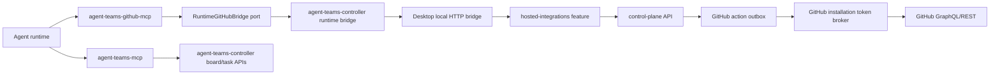

# Phase 12 - Separate Agent Teams GitHub MCP Plan

## Summary

Create a separate `agent-teams-github-mcp` server for GitHub integration tools.

The goal is not to make MCP a new GitHub authority. The GitHub MCP is only an
agent-facing adapter:

```text
agent
  -> agent-teams-github-mcp
  -> agent-teams-controller runtime bridge
  -> desktop local HTTP bridge
  -> hosted-integrations feature
  -> control-plane API
  -> policy, outbox, token broker
  -> GitHub GraphQL/REST
```

The control-plane remains the security boundary. GitHub tokens, installation
tokens, repository authorization, outbox dispatch, audit, retries, and GitHub
App identity stay in the backend/control-plane path.

This phase should split GitHub-specific MCP responsibilities out of the existing
`agent-teams-mcp`. The existing MCP keeps team/task/kanban/review/runtime tools.
The new MCP owns only GitHub integration tools.

## Decision

Use a separate workspace package:

```text
mcp-servers/
  github/
    package.json
    src/
      index.ts
      tools/
      core/
      adapters/
```

Package name:

```text
agent-teams-github-mcp
```

MCP server name in generated config:

```text
agent-teams-github
```

Why:

- SRP: task board MCP and GitHub MCP have different reasons to change.
- ISP: agents see a smaller GitHub-specific tool surface only when relevant.
- DIP: GitHub MCP depends on a runtime bridge port, not on GitHub SDKs or
  control-plane internals.
- OCP: future `agent-teams-telegram-mcp`, `agent-teams-slack-mcp`, and
  integration-specific MCPs can follow the same pattern.

## Alternatives Considered

### Option 1 - Separate `agent-teams-github-mcp` package

🎯 9 🛡️ 9 🧠 6

Estimated change size: 1200-2200 LOC.

Recommended.

Pros:

- clean SRP boundary;
- GitHub tools can be injected only when GitHub integration is connected;
- easier to keep tool names/descriptions focused for agents;
- future integrations can copy the pattern;
- easy to remove/deprecate GitHub tools from `agent-teams-mcp`.

Cons:

- MCP launch/config builder needs multi-server support;
- packaged app must stage/copy more than one MCP bundle;
- active runtimes may need restart when GitHub integration is enabled/disabled.

### Option 2 - Keep one MCP, move GitHub to `githubTools.ts`

🎯 6 🛡️ 6 🧠 3

Estimated change size: 400-900 LOC.

Pros:

- fastest implementation;
- no new package or packaging path;
- fewer launch paths.

Cons:

- `agent-teams-mcp` becomes a broad integration catch-all;
- weaker SOLID boundary;
- hard to keep GitHub tools hidden when not connected;
- future Telegram/Slack/billing tools would repeat the same problem.

### Option 3 - One dynamic MCP gateway with feature toolsets

🎯 7 🛡️ 8 🧠 8

Estimated change size: 1800-3200 LOC.

Pros:

- elegant long-term extension model;
- one server process;
- pluggable toolsets.

Cons:

- too much framework work now;
- we would be building our own MCP plugin system before proving the GitHub UX;
- higher risk around dynamic tool availability and provider behavior.

## Current State

Already implemented:

- control-plane GitHub action outbox;
- server-side GitHub App token broker;
- repository target binding and enabled target policy;
- desktop hosted integration feature;
- local desktop HTTP bridge:
  - `POST /api/teams/:teamName/hosted-integrations/github-actions`
  - `GET /api/teams/:teamName/hosted-integrations/github-actions/:actionRequestId`
- auto target resolution by local `remote.origin.url` plus enabled target;
- low-level MCP tools in `agent-teams-mcp`:
  - `hosted_github_action_submit`
  - `hosted_github_action_status`
- existing supported action types:
  - `github.issue_comment.create`
  - `github.pull_request_comment.create_top_level`
  - `github.pull_request_review.create`
  - `github.check_run.create_or_update`

Problems in current MCP shape:

- GitHub tools are mixed into general runtime tools.
- The low-level submit tool is too raw for agents.
- `targetId` is still required by the MCP schema even though desktop can now
  auto-resolve by local Git remote.
- GitHub tools are not conditionally injected based on connected integration
  state.
- Agent prompt does not yet teach when to use GitHub MCP tools.

Weak spots studied in local code:

- `TeamMcpConfigBuilder.isWriteMcpConfigOptions()` currently recognizes only
  `mcpPolicy` and `controlApiBaseUrl`. If implementation passes only
  `hostedGithub`, it will be misread as a `TeamMemberMcpPolicy`. The plan must
  update this guard before using the new option.
- `TeamMcpConfigBuilder.readAgentTeamsMcpLaunchSpec()` validates only the
  `agent-teams` server entry. Optional GitHub MCP validation needs a separate
  reader/preflight path and must not break disconnected launches.
- Packaged MCP copy logic is hard-coded to `process.resourcesPath/mcp-server`
  and `userData/mcp-server/<appVersion>`. A second MCP bundle needs a reusable
  packaged server copy helper keyed by package/resource name.
- `src/main/http/teams.ts` accepts optional `targetId` at the local HTTP
  boundary, but `HostedGitHubActionCommandDto` still requires `targetId` after
  resolution. The split between draft command and resolved command must stay
  explicit.
- `agent-teams-controller/src/mcpToolCatalog.js` registers
  `hosted_github_action_submit/status` under the general runtime group. Removing
  them must update catalog expectations and any generated tool references.
- `mcp-server/src/agent-teams-controller.d.ts` currently exposes the hosted
  GitHub bridge on `ControllerRuntimeApi`. New status/capability bridge methods
  need matching type declarations.
- Existing required MCP preflight tools do not include hosted GitHub tools, so
  removing old GitHub tools from the core MCP should not break launch preflight.
  GitHub MCP should have its own optional preflight when injected.
- Existing hosted action request id is stable over
  `localAttemptId + targetId + actionType + payloadFingerprint`. This is good
  after target resolution, but dangerous if MCP hides `localAttemptId` and then
  loses it on timeout. The MCP must generate the id before transport and include
  it in timeout-safe responses.
- Root `package.json` packages only `mcp-server/dist/index.js` and
  `mcp-server/package.json` under `extraResources`. A new
  `mcp-servers/github` package will not ship in packaged builds unless
  `extraResources`, `prebuild`, `typecheck:workspace`, `build:workspace`,
  `test:workspace`, and lint scripts are updated.
- OpenCode runtime integration is not only `--mcp-config`. The desktop injects
  core Agent Teams MCP into OpenCode through
  `CLAUDE_MULTIMODEL_AGENT_TEAMS_MCP_*` env and the orchestrator
  `OpenCodeMcpManager`, which currently owns one app MCP server name:
  `agent-teams`. A separate GitHub MCP needs an explicit OpenCode path or the
  feature will work for Claude-style MCP config but not for OpenCode teammates.
- `AgentTeamsMcpHttpServer` starts one app-owned HTTP MCP process with one
  launch spec and identity hash. If GitHub MCP should be available through the
  OpenCode HTTP bridge, it needs a multi-managed-server model or a deliberate
  decision to keep GitHub MCP stdio/local-config only for V1.
- Current MCP utility `jsonTextContent()` serializes JSON as text but does not
  mark tool-level failures with `isError`. MCP spec recommends tool-originated
  errors be reported in the tool result, not as protocol-level JSON-RPC errors.
  GitHub MCP should add a safe result helper that can set `isError` for failed
  external actions when supported by FastMCP.
- Existing auth-retry MCP config regeneration calls `writeConfigFile()` with
  only `controlApiBaseUrl`, so it would drop GitHub MCP injection after a
  regenerated config unless launch-time GitHub context is persisted on the run.

Migration inventory:

| Current place                                    | Current responsibility                          | Target place                                       | Target responsibility                                                                       |
| ------------------------------------------------ | ----------------------------------------------- | -------------------------------------------------- | ------------------------------------------------------------------------------------------- |
| `mcp-server/src/tools/runtimeTools.ts`           | `hosted_github_action_submit` low-level tool    | `mcp-servers/github/src/tools/rawSubmitTool.ts`    | temporary raw compatibility tool                                                            |
| `mcp-server/src/tools/runtimeTools.ts`           | `hosted_github_action_status` low-level tool    | `mcp-servers/github/src/tools/actionStatusTool.ts` | GitHub action polling tool                                                                  |
| `agent-teams-controller/src/internal/runtime.js` | desktop hosted GitHub submit/status bridge      | keep and harden                                    | shared runtime bridge implementation                                                        |
| `agent-teams-controller/src/mcpToolCatalog.js`   | registers GitHub tools under runtime tool group | split catalogs                                     | `agent-teams` catalog excludes GitHub tools, `agent-teams-github` catalog owns GitHub tools |
| `src/main/services/team/TeamMcpConfigBuilder.ts` | writes one generated MCP server                 | extend                                             | writes `agent-teams` and optional `agent-teams-github`                                      |
| provisioning prompts                             | no GitHub MCP guidance                          | conditional prompt block                           | teach agents only when GitHub MCP is injected                                               |

## Goals

- Create a separate GitHub MCP server with a small, agent-friendly tool surface.
- Keep GitHub token access out of MCP and out of agent runtime.
- Make tool names map to agent intent, not backend action type names.
- Make `targetId` optional and prefer auto target resolution by local Git remote.
- Inject GitHub MCP only when the workspace has an active hosted GitHub
  integration and at least one enabled repository target.
- Give agents a clear status/capabilities tool so they know what is available.
- Preserve idempotency with `localAttemptId`.
- Keep current low-level tools temporarily as deprecated compatibility shims or
  move them after prompt/tooling migration.

## Non-Goals

- Do not let MCP call GitHub directly.
- Do not expose GitHub installation tokens, desktop tokens, OAuth tokens, or
  control-plane secrets to agents.
- Do not add PR/issue/commit creation in this phase unless backend action types
  already exist.
- Do not make the desktop app require control-plane for normal local-first use.
- Do not build a generic MCP plugin framework yet.
- Do not dynamically mutate an already-running MCP tool list. Use teammate
  restart/relaunch for GitHub MCP enable/disable changes.

## Architecture



Responsibilities:

| Layer                       | Responsibility                                                                            |
| --------------------------- | ----------------------------------------------------------------------------------------- |
| `agent-teams-github-mcp`    | agent-facing tool schemas, intent mapping, status/capability display                      |
| `agent-teams-controller`    | local runtime bridge to desktop local HTTP API                                            |
| desktop HTTP bridge         | trusted runtime validation, active team/member validation, local remote target resolution |
| hosted-integrations feature | desktop token, safe request envelope, target state cache                                  |
| control-plane               | authorization, policy, outbox, token broker, GitHub dispatch                              |

## Clean Architecture Model

The GitHub MCP should be a small vertical slice with the same dependency rule as
the control-plane packages:

```text
tools/presentation
  -> application/use-cases
  -> domain/core contracts
  -> ports

adapters
  -> ports
```

Dependency direction:

- tools can import application use cases and DTO schemas;
- use cases can import domain value objects, action mapping, and ports;
- ports define what the outside world can do;
- adapters implement ports and may import `agent-teams-controller`;
- no domain/application code imports FastMCP, desktop, Electron, GitHub SDKs, or
  control-plane packages.

Simple DDD language:

| Term                  | Meaning                                               |
| --------------------- | ----------------------------------------------------- |
| `GitHubActionIntent`  | agent-level intent, for example "comment on issue"    |
| `GitHubActionCommand` | trusted command sent to desktop bridge                |
| `GitHubActionRequest` | persisted backend/outbox request                      |
| `RepositoryTarget`    | enabled repo binding owned by workspace policy        |
| `RuntimeIdentity`     | team/member/run/session identity for attribution      |
| `Capability`          | policy-backed action family available to this runtime |
| `LocalAttemptId`      | idempotency key for one user-visible agent attempt    |

The MCP should not model GitHub installation state as an aggregate. That state is
owned by control-plane. MCP only observes a safe capability/status view and sends
commands through a port.

## Shared Runtime Bridge

The important architectural piece is not only a GitHub MCP. It is a reusable
runtime integration bridge pattern:

```ts
interface RuntimeIntegrationBridge<TCommand, TResult, TStatus> {
  submit(command: TCommand): Promise<TResult>;
  getStatus(input: { actionRequestId: string }): Promise<TStatus>;
  getCapabilities(input: RuntimeCapabilityQuery): Promise<RuntimeCapabilityView>;
}
```

For GitHub V1 this becomes:

```ts
interface RuntimeGitHubBridge {
  submitAction(input: GitHubMcpSubmitActionInput): Promise<GitHubMcpActionResult>;
  getActionStatus(input: GitHubMcpActionStatusInput): Promise<GitHubMcpActionStatus>;
  getIntegrationStatus(input: GitHubMcpStatusInput): Promise<GitHubMcpIntegrationStatus>;
}
```

Future MCPs should repeat the same bridge shape:

| MCP                        | Bridge port                        | Backend authority                          |
| -------------------------- | ---------------------------------- | ------------------------------------------ |
| `agent-teams-github-mcp`   | `RuntimeGitHubBridge`              | hosted GitHub integration/control-plane    |
| `agent-teams-telegram-mcp` | `RuntimeMessengerBridge`           | hosted messenger integration/control-plane |
| `agent-teams-slack-mcp`    | `RuntimeMessengerBridge`           | hosted messenger integration/control-plane |
| `agent-teams-billing-mcp`  | likely not agent-facing by default | billing service/control-plane              |

Bridge rules:

- the bridge accepts agent intent plus trusted runtime identity;
- the bridge never returns secrets;
- the bridge returns safe status/capabilities, not raw provider objects;
- every integration-specific MCP depends on its bridge port, not on desktop
  internals;
- adapters are replaceable, so a hosted desktop bridge can later be swapped for
  a remote runtime bridge without rewriting tools.

Illustrative shared bridge contracts:

```ts
type SafeToolError = Readonly<{
  code: string;
  message: string;
  retryable: boolean;
  category?: string;
}>;

type GitHubMcpActionResult = Readonly<
  | {
      ok: true;
      actionRequestId: string;
      localAttemptId: string;
      status: 'queued' | 'dispatching' | 'processing' | 'succeeded';
      githubUrl?: string;
    }
  | {
      ok: false;
      localAttemptId?: string;
      safeError: SafeToolError;
      guidance: string;
    }
>;

type RuntimeIdentity = Readonly<{
  teamName: string;
  memberName: string;
  runId: string;
  runtimeSessionId: string;
}>;

type GitHubMcpSubmitActionInput = RuntimeIdentity &
  Readonly<{
    actionType: GitHubMcpBackendActionType;
    payload: unknown;
    localAttemptId: string;
    targetId?: string;
    correlationId?: string;
  }>;
```

The `localAttemptId` is required at the bridge boundary even if the public MCP
tool accepts it as optional. Tool adapters may generate it, but use cases should
not accept a missing id.

## Package Shape

```text
mcp-servers/github/
  package.json
  tsconfig.json
  tsup.config.ts
  src/
    index.ts
    controller.ts
    core/
      githubActionTypes.ts
      idempotency.ts
      toolDescriptions.ts
      validation.ts
    ports/
      runtimeGithubBridge.ts
    adapters/
      agentTeamsControllerGithubBridge.ts
    tools/
      statusTool.ts
      commentIssueTool.ts
      commentPullRequestTool.ts
      reviewPullRequestTool.ts
      createCheckRunTool.ts
      actionStatusTool.ts
      rawSubmitTool.ts
      index.ts
```

Root workspace update:

```yaml
packages:
  - agent-teams-controller
  - mcp-server
  - mcp-servers/*
  - landing
  - packages/agent-graph
```

Root scripts update:

```json
{
  "prebuild": "... && pnpm --filter agent-teams-github-mcp build",
  "typecheck:workspace": "... && pnpm --filter agent-teams-github-mcp typecheck",
  "build:workspace": "... && pnpm --filter agent-teams-github-mcp build",
  "test:workspace": "... && pnpm --filter agent-teams-github-mcp test",
  "lint:github-mcp": "pnpm --filter agent-teams-github-mcp lint"
}
```

Packaged resource update:

```json
{
  "build": {
    "extraResources": [
      {
        "from": "mcp-server/dist/index.js",
        "to": "mcp-server/index.js"
      },
      {
        "from": "mcp-server/package.json",
        "to": "mcp-server/package.json"
      },
      {
        "from": "mcp-servers/github/dist/index.js",
        "to": "mcp-servers/github/index.js"
      },
      {
        "from": "mcp-servers/github/package.json",
        "to": "mcp-servers/github/package.json"
      }
    ]
  }
}
```

Release-bundle rule:

- source/dev launch may resolve from workspace package directories;
- packaged launch must resolve from `process.resourcesPath`;
- a missing GitHub MCP packaged resource disables GitHub MCP injection only;
- a missing core `agent-teams` packaged resource remains a launch-blocking
  error;
- tests should assert the package config contains both resource groups so this
  does not regress only in signed builds.

## Tool Surface

Common public parameters for mutating tools:

```ts
type GitHubMcpCommonMutationInput = Readonly<{
  localAttemptId?: string;
  targetId?: string;
  correlationId?: string;
  waitTimeoutMs?: number;

  // Test and nonstandard-launcher fallback only. Normal launches fill these
  // from env and fail if explicit values conflict with env.
  teamName?: string;
  runId?: string;
  runtimeSessionId?: string;
  memberName?: string;
  claudeDir?: string;
  controlUrl?: string;
}>;
```

Common result:

```ts
type GitHubMcpSubmitToolResult = Readonly<{
  ok: boolean;
  actionRequestId?: string;
  localAttemptId: string;
  status?: string;
  githubUrl?: string;
  safeError?: SafeToolError;
  nextAction:
    | 'none'
    | 'poll_status'
    | 'retry_same_local_attempt_id'
    | 'ask_user_to_connect_github'
    | 'ask_user_to_enable_target';
}>;
```

Tool implementation rule:

- public schemas may make runtime identity optional for agent UX;
- application use cases receive a fully resolved `RuntimeIdentity`;
- explicit runtime fields are allowed only for tests/nonstandard launchers;
- env/explicit conflicts fail closed before any local HTTP request.

### Tool 1 - `github_integration_status`

Purpose:

Tell the agent whether GitHub integration is usable for the current team runtime.

Parameters:

```ts
{
  teamName: string;
  claudeDir?: string;
  controlUrl?: string;
  waitTimeoutMs?: number;
}
```

Response:

```ts
{
  connected: boolean;
  githubMcpEnabled: boolean;
  currentTarget?: {
    owner: string;
    repo: string;
    displayFullName: string;
  };
  capabilities: string[];
  reason?: string;
  safeErrorCode?: string;
}
```

Implementation detail:

- Preferred: add a desktop local bridge endpoint that returns integration status
  and auto-target resolution result without creating an action.
- Acceptable first step: call existing hosted integrations state/list targets
  APIs through `agent-teams-controller`, then return a conservative status.

Agent instruction:

- Call this before the first GitHub action if unsure whether GitHub is
  connected.
- If `connected=false`, do not attempt GitHub actions. Report that GitHub
  integration needs to be connected or target enabled.

### Tool 2 - `github_comment_issue`

Purpose:

Post an agent-attributed comment on a GitHub issue in the current repository.

Parameters:

```ts
{
  teamName: string;
  runId: string;
  runtimeSessionId: string;
  memberName: string;
  issueNumber: number;
  body: string;
  localAttemptId?: string;
  targetId?: string;
  correlationId?: string;
  claudeDir?: string;
  controlUrl?: string;
  waitTimeoutMs?: number;
}
```

Maps to:

```ts
{
  actionType: 'github.issue_comment.create';
  payload: {
    issueNumber: number;
    body: string;
  }
}
```

Notes:

- `targetId` should be optional. Desktop resolves it from local
  `remote.origin.url` and enabled target.
- `localAttemptId` defaults to a deterministic MCP-generated value only when
  enough stable inputs exist. Safer first version requires the caller to pass it
  or uses random UUID with clear "do not retry by re-calling manually" response.
- Body must not contain reserved Agent Teams markers.

### Tool 3 - `github_comment_pull_request`

Purpose:

Post a top-level PR conversation comment.

Parameters:

```ts
{
  teamName: string;
  runId: string;
  runtimeSessionId: string;
  memberName: string;
  pullRequestNumber: number;
  body: string;
  localAttemptId?: string;
  targetId?: string;
  correlationId?: string;
  claudeDir?: string;
  controlUrl?: string;
  waitTimeoutMs?: number;
}
```

Maps to:

```ts
{
  actionType: 'github.pull_request_comment.create_top_level';
  payload: {
    pullRequestNumber: number;
    body: string;
  }
}
```

Agent instruction:

- Use for conversation-level PR comments.
- Do not use for line-level code comments. That needs a future
  `github_comment_pull_request_line` tool after backend support exists.

### Tool 4 - `github_review_pull_request`

Purpose:

Create an agent-attributed PR review comment. In current backend this supports
only `COMMENT`, not approve/request changes.

Parameters:

```ts
{
  teamName: string;
  runId: string;
  runtimeSessionId: string;
  memberName: string;
  pullRequestNumber: number;
  body: string;
  event?: "COMMENT";
  localAttemptId?: string;
  targetId?: string;
  correlationId?: string;
  claudeDir?: string;
  controlUrl?: string;
  waitTimeoutMs?: number;
}
```

Maps to:

```ts
{
  actionType: 'github.pull_request_review.create';
  payload: {
    pullRequestNumber: number;
    body: string;
    event: 'COMMENT';
  }
}
```

Future extension:

- When backend supports it, extend event to:
  - `APPROVE`
  - `REQUEST_CHANGES`
  - `COMMENT`
- Until then, tool description must explicitly say it does not approve or
  request changes.

### Tool 5 - `github_create_check_run`

Purpose:

Create or update an Agent Teams check run.

Parameters:

```ts
{
  teamName: string;
  runId: string;
  runtimeSessionId: string;
  memberName: string;
  name: string;
  headSha: string;
  status: "queued" | "in_progress" | "completed";
  conclusion?:
    | "action_required"
    | "cancelled"
    | "failure"
    | "neutral"
    | "skipped"
    | "success"
    | "timed_out";
  title?: string;
  summary?: string;
  text?: string;
  checkRunId?: string;
  localAttemptId?: string;
  targetId?: string;
  correlationId?: string;
  claudeDir?: string;
  controlUrl?: string;
  waitTimeoutMs?: number;
}
```

Maps to:

```ts
{
  actionType: "github.check_run.create_or_update";
  payload: {
    name: string;
    headSha: string;
    status: string;
    conclusion?: string;
    title?: string;
    summary?: string;
    text?: string;
  };
}
```

Open decision:

- Current backend supports stored check run id internally. The public command
  DTO does not expose `checkRunId`. Decide whether updates are driven by
  idempotency/repository state or whether this tool should wait until backend
  exposes a safe update contract.

Recommendation:

- Implement create-only first unless backend already supports safe check run
  update by existing action request state.

### Tool 6 - `github_action_status`

Purpose:

Poll action status after submit.

Parameters:

```ts
{
  teamName: string;
  actionRequestId: string;
  claudeDir?: string;
  controlUrl?: string;
  waitTimeoutMs?: number;
}
```

Returns:

```ts
{
  actionRequestId: string;
  status: "queued" | "dispatching" | "succeeded" | "failed" | "dead_lettered";
  githubUrl?: string;
  safeError?: {
    code: string;
    message: string;
    retryable: boolean;
  };
}
```

### Tool 7 - `github_raw_action_submit`

Purpose:

Temporary compatibility and debugging tool, not the preferred agent UX.

Parameters:

Same as current low-level `hosted_github_action_submit`, but:

- `targetId?: string`;
- name belongs to GitHub MCP;
- description says "use only when instructed by system/developer prompt".

Migration:

- Keep current `hosted_github_action_submit` in `agent-teams-mcp` for one
  compatibility window.
- Mark it deprecated in description.
- Update prompts to prefer the new GitHub MCP tools.
- Remove from `agent-teams-mcp` after one release when no launch prompt or
  smoke test references it.

## Runtime Context And Identity

GitHub MCP tools need runtime identity for safe attribution:

```ts
{
  teamName: string;
  memberName: string;
  runId: string;
  runtimeSessionId: string;
}
```

The agent should not invent these fields. They should be injected into the MCP
environment or prompt at runtime launch.

Recommended environment variables for the GitHub MCP process:

```text
AGENT_TEAMS_MCP_CLAUDE_DIR
CLAUDE_TEAM_CONTROL_URL
AGENT_TEAMS_RUNTIME_TEAM_NAME
AGENT_TEAMS_RUNTIME_MEMBER_NAME
AGENT_TEAMS_RUNTIME_RUN_ID
AGENT_TEAMS_RUNTIME_SESSION_ID
AGENT_TEAMS_GITHUB_MCP_ENABLED=1
```

Then tool schemas can make `teamName`, `memberName`, `runId`, and
`runtimeSessionId` optional for the agent-facing call and fill them from env.

Recommended final tool shape:

```ts
{
  pullRequestNumber: number;
  body: string;
  localAttemptId?: string;
  correlationId?: string;
}
```

Adapter fills runtime fields:

```ts
{
  teamName: env.AGENT_TEAMS_RUNTIME_TEAM_NAME;
  memberName: env.AGENT_TEAMS_RUNTIME_MEMBER_NAME;
  runId: env.AGENT_TEAMS_RUNTIME_RUN_ID;
  runtimeSessionId: env.AGENT_TEAMS_RUNTIME_SESSION_ID;
}
```

Why:

- easier for agents;
- fewer hallucinated identifiers;
- safer runtime validation;
- better tool descriptions.

Fallback:

- Keep explicit fields accepted for tests and nonstandard launchers.
- If env and explicit values conflict, fail closed.

Illustrative runtime identity resolver:

```ts
function resolveRuntimeIdentity(input: {
  explicit: Partial<RuntimeIdentity>;
  env: NodeJS.ProcessEnv;
}): RuntimeIdentity {
  const fromEnv = {
    teamName: input.env.AGENT_TEAMS_RUNTIME_TEAM_NAME,
    memberName: input.env.AGENT_TEAMS_RUNTIME_MEMBER_NAME,
    runId: input.env.AGENT_TEAMS_RUNTIME_RUN_ID,
    runtimeSessionId: input.env.AGENT_TEAMS_RUNTIME_SESSION_ID,
  };

  for (const key of Object.keys(fromEnv) as (keyof RuntimeIdentity)[]) {
    const envValue = fromEnv[key]?.trim();
    const explicitValue = input.explicit[key]?.trim();
    if (envValue && explicitValue && envValue !== explicitValue) {
      throw new Error(`Runtime identity conflict for ${key}`);
    }
  }

  const resolved = {
    teamName: input.explicit.teamName ?? fromEnv.teamName,
    memberName: input.explicit.memberName ?? fromEnv.memberName,
    runId: input.explicit.runId ?? fromEnv.runId,
    runtimeSessionId: input.explicit.runtimeSessionId ?? fromEnv.runtimeSessionId,
  };

  if (!resolved.teamName || !resolved.memberName || !resolved.runId || !resolved.runtimeSessionId) {
    throw new Error('GitHub MCP runtime identity is incomplete');
  }
  return resolved as RuntimeIdentity;
}
```

Implementation note:

- do not pass trusted attribution fields directly from agent text;
- MCP can pass runtime identity, but desktop still validates the runtime is
  alive and member exists;
- avatar URL should come from trusted member metadata/env, not from the
  user-authored GitHub comment body.

## Conditional Enablement

GitHub MCP should be injected only when:

- hosted integrations feature is available;
- desktop is paired with the control-plane;
- GitHub installation is connected;
- at least one repository target is enabled;
- current team project has a local GitHub remote that matches exactly one
  enabled target, or the user explicitly configured a target for the team.

Implementation in desktop:

```text
TeamMcpConfigBuilder
  -> always inject agent-teams
  -> optionally inject agent-teams-github
```

Recommended input:

```ts
interface WriteMcpConfigOptions {
  mcpPolicy?: TeamMemberMcpPolicy;
  controlApiBaseUrl?: string | null;
  hostedGithub?: {
    enabled: boolean;
    reason?: string;
    runtimeIdentity?: {
      teamName: string;
      memberName: string;
      runId: string;
      runtimeSessionId: string;
    };
  };
}
```

Required guard update:

```ts
function isWriteMcpConfigOptions(value: unknown): value is WriteMcpConfigOptions {
  return (
    value !== null &&
    typeof value === 'object' &&
    ('mcpPolicy' in value || 'controlApiBaseUrl' in value || 'hostedGithub' in value)
  );
}
```

Multi-server config sketch:

```ts
const generatedServers: Record<string, McpServerConfig> = Object.create(null);

generatedServers['agent-teams'] = buildAgentTeamsServerConfig({
  launchSpec: await resolveAgentTeamsMcpLaunchSpec(),
  claudeDir,
  controlApiBaseUrl,
});

if (options.hostedGithub?.enabled) {
  generatedServers['agent-teams-github'] = buildGitHubMcpServerConfig({
    launchSpec: await resolveAgentTeamsGitHubMcpLaunchSpec(),
    claudeDir,
    controlApiBaseUrl,
    runtimeIdentity: options.hostedGithub.runtimeIdentity,
  });
}
```

Name collision rule:

```ts
const RESERVED_GENERATED_MCP_SERVER_NAMES = new Set(['agent-teams', 'agent-teams-github']);

// readAllowlistedServers must skip every reserved generated name, not only
// "agent-teams". User config should not override managed runtime bridges.
```

Launch behavior:

- If GitHub integration is not connected at runtime launch, do not inject
  `agent-teams-github`.
- If user connects GitHub while agents are running, show "restart teammate to
  enable GitHub tools".
- If user disconnects GitHub while agents are running, tools may still be listed
  by the already-running MCP server, but every call must fail closed through the
  desktop/control-plane checks.

Reason:

- MCP clients generally discover tools at server startup.
- Dynamic tool mutation during a long-running session is provider-dependent and
  riskier than relaunch.

State machine:

```text
disconnected
  -> connected_no_target
  -> connected_target_ready
  -> injected_on_next_launch
  -> active_runtime_with_github_tools
```

Failure transitions:

```text
active_runtime_with_github_tools
  -> target_disabled
  -> tool_calls_fail_closed

active_runtime_with_github_tools
  -> integration_disconnected
  -> tool_calls_fail_closed

connected_target_ready
  -> local_remote_changed
  -> next_launch_preflight_rechecks_target
```

UX consequences:

- connect/install GitHub App should not silently change running agents;
- launch/restart is the boundary where tools become visible;
- disable/disconnect is immediate in policy, even if tools remain listed by the
  MCP client;
- status tool gives agents a safe explanation instead of leaking backend state.

## Provider Runtime Compatibility

The plan cannot assume every provider consumes the generated `--mcp-config`
file. Local code has at least two runtime paths:

| Runtime path                  | Current shape                                                               | GitHub MCP risk                                       |
| ----------------------------- | --------------------------------------------------------------------------- | ----------------------------------------------------- |
| Claude-style local MCP config | generated config can include multiple `mcpServers`                          | straightforward multi-server injection                |
| OpenCode app MCP bridge       | desktop exports `CLAUDE_MULTIMODEL_AGENT_TEAMS_MCP_*` for one app-owned MCP | GitHub MCP is invisible unless bridge supports two    |
| Other provider adapters       | may reuse config file, env bridge, or provider-specific launch arguments    | must be verified before claiming full provider parity |

Top 3 implementation options:

### Option 1 - Multi-managed OpenCode app MCP servers

🎯 8 🛡️ 8 🧠 7

Approx changes: 350-700 lines.

Extend desktop and orchestrator OpenCode integration from one hard-coded
`agent-teams` app MCP server to a list of managed app MCP servers. Keep the
legacy env for backward compatibility and add a new JSON env for multiple
servers.

Illustrative env contract:

```ts
type ManagedOpenCodeMcpServerEnvSpec = Readonly<{
  name: 'agent-teams' | 'agent-teams-github';
  command?: string;
  args?: readonly string[];
  env?: Readonly<Record<string, string>>;
  remoteUrl?: string;
}>;

const OPEN_CODE_MANAGED_MCP_SERVERS_ENV = 'CLAUDE_MULTIMODEL_APP_MCP_SERVERS_JSON';
```

Compatibility rule:

- if `CLAUDE_MULTIMODEL_APP_MCP_SERVERS_JSON` exists, OpenCode uses the list;
- else fallback to the current `CLAUDE_MULTIMODEL_AGENT_TEAMS_MCP_*` env;
- the `agent-teams` entry stays mandatory;
- `agent-teams-github` is optional and appears only when launch preflight
  enables it.

Recommendation:

Use this if Phase 12 should be complete for OpenCode teammates too.

### Option 2 - Config-file providers first, OpenCode explicit follow-up

🎯 6 🛡️ 7 🧠 3

Approx changes: 120-250 lines.

Implement the separate GitHub MCP only for providers that receive generated MCP
config. Mark OpenCode support as unsupported in the plan and UI copy until the
OpenCode bridge is upgraded.

Pros:

- fastest delivery;
- avoids cross-repo orchestrator changes in this phase.

Cons:

- feature is not fully available to all agents;
- easy to overclaim "GitHub integration works" while OpenCode agents still have
  only the core MCP.

### Option 3 - Keep GitHub tools inside core MCP for OpenCode only

🎯 4 🛡️ 5 🧠 5

Approx changes: 250-450 lines.

Keep the separate GitHub MCP for config-file providers but duplicate or expose
GitHub tools through the core `agent-teams` MCP when the runtime is OpenCode.

Pros:

- avoids changing OpenCode app MCP manager.

Cons:

- violates the single-responsibility goal;
- creates provider-specific tool surfaces;
- doubles test matrix and makes future Telegram/Slack splits harder.

Recommendation:

Prefer Option 1 for architectural correctness. If the implementation budget is
tight, choose Option 2 explicitly and do not call the feature complete for
OpenCode. Avoid Option 3.

## MCP Tool List Lifecycle

MCP supports `tools/list` and optional tool-list changed notifications, but
client support and provider refresh behavior vary. The latest stable MCP tools
spec defines `listChanged` and tool execution errors with `isError`; the current
draft also tightens stateful tool guidance. For V1, use process launch as the
stable visibility boundary.

Tool visibility states:

```ts
type GitHubMcpVisibility =
  | 'not_in_config'
  | 'configured_not_started'
  | 'visible_after_restart'
  | 'visible_active'
  | 'listed_but_policy_disabled';
```

Rules:

- do not depend on `notifications/tools/list_changed` for GitHub connect or
  disconnect;
- connect/enable target affects next teammate launch or restart;
- disconnect/disable target affects policy immediately but may leave listed
  tools visible until restart;
- listed-but-disabled tools must return safe unavailable results, not attempt
  provider calls;
- prompt injection must follow the same launch decision that generated the MCP
  config.

## Agent Prompt Additions

Only add this block when GitHub MCP is injected:

```text
GitHub integration is available for this team.

Use the agent-teams-github MCP tools for GitHub repository actions:
- github_integration_status: check current connection, target, and capabilities.
- github_comment_issue: comment on an issue in the current repository.
- github_comment_pull_request: post a top-level PR conversation comment.
- github_review_pull_request: create a COMMENT review on a PR.
- github_create_check_run: create an Agent Teams check run when explicitly useful.

Do not call GitHub directly for these actions.
Do not ask for GitHub tokens.
Do not pass owner/repo unless a tool explicitly asks for it.
The app resolves the repository from the local git remote and enabled target.
If a GitHub tool says integration is unavailable, report that GitHub needs to be
connected or the repository target enabled.
```

Do not add this block when GitHub MCP is not injected. This prevents agents from
trying tools that are unavailable.

## Tool Naming

Use action-oriented names:

```text
github_integration_status
github_comment_issue
github_comment_pull_request
github_review_pull_request
github_create_check_run
github_action_status
github_raw_action_submit
```

Avoid backend-shaped names in normal tools:

```text
hosted_github_action_submit
github.issue_comment.create
github.pull_request_review.create
```

Backend action type strings stay inside adapters.

## Agent Method Selection Guide

This is the guidance that should be encoded in tool descriptions and prompt
fragments. Agents should not need to know backend action type strings.

| User intent                    | Agent should call             | Required user-visible input      | Notes                                      |
| ------------------------------ | ----------------------------- | -------------------------------- | ------------------------------------------ |
| "Comment on issue 12"          | `github_comment_issue`        | `issueNumber`, `body`            | Current repo is inferred from local remote |
| "Comment on PR 18"             | `github_comment_pull_request` | `pullRequestNumber`, `body`      | Top-level PR conversation only             |
| "Leave a review note on PR 18" | `github_review_pull_request`  | `pullRequestNumber`, `body`      | V1 review event is `COMMENT` only          |
| "Approve PR"                   | no V1 tool                    | none                             | wait for backend approve action            |
| "Request changes"              | no V1 tool                    | none                             | wait for backend request-changes action    |
| "Comment on this line"         | no V1 tool                    | file/path/line not supported yet | future line-level comment tool             |
| "Create an issue"              | no V1 tool                    | title/body/labels later          | future backend action                      |
| "Create a PR"                  | no V1 tool                    | branch/base/title/body later     | future backend action                      |
| "Push commits"                 | no V1 tool                    | commit plan/files later          | future high-risk action                    |
| "Check if GitHub is connected" | `github_integration_status`   | none                             | safe capability check                      |

Agent rule of thumb:

- if a matching GitHub MCP tool exists, use it instead of GitHub CLI/browser;
- if no matching tool exists, explain that the GitHub App action is not
  available yet and ask whether to proceed manually through local git/gh;
- never invent `owner`/`repo` from prompt text for V1;
- do not retry mutating calls with a new `localAttemptId` after an unknown
  timeout.

Illustrative tool adapter:

```ts
const githubCommentPullRequestTool = {
  name: 'github_comment_pull_request',
  parameters: z.object({
    pullRequestNumber: z.number().int().positive(),
    body: z.string().min(1).max(58_000),
    localAttemptId: z.string().min(1).optional(),
    targetId: z.string().min(1).optional(),
    correlationId: z.string().min(1).optional(),
  }),
  execute: async (input) => {
    const identity = resolveRuntimeIdentity({
      explicit: {},
      env: process.env,
    });
    const localAttemptId =
      input.localAttemptId ?? createLocalAttemptId('github_comment_pull_request');

    return submitGitHubIntent({
      ...identity,
      actionType: 'github.pull_request_comment.create_top_level',
      localAttemptId,
      payload: {
        pullRequestNumber: input.pullRequestNumber,
        body: input.body,
      },
      ...(input.targetId ? { targetId: input.targetId } : {}),
      ...(input.correlationId ? { correlationId: input.correlationId } : {}),
    });
  },
};
```

The exact FastMCP call shape can follow the existing `mcp-server/src/tools/*`
pattern. The important contract is that backend action type strings stay inside
the adapter and normal agents see intent-shaped tool names.

## Mapping To Backend Actions

| MCP tool                      | Backend action type                            | Transport             |
| ----------------------------- | ---------------------------------------------- | --------------------- |
| `github_comment_issue`        | `github.issue_comment.create`                  | GraphQL               |
| `github_comment_pull_request` | `github.pull_request_comment.create_top_level` | GraphQL               |
| `github_review_pull_request`  | `github.pull_request_review.create`            | GraphQL               |
| `github_create_check_run`     | `github.check_run.create_or_update`            | REST                  |
| `github_action_status`        | status endpoint                                | desktop/control-plane |

Future actions:

| Future MCP tool                       | Future backend action type                   | GitHub API                     |
| ------------------------------------- | -------------------------------------------- | ------------------------------ |
| `github_create_issue`                 | `github.issue.create`                        | GraphQL `createIssue`          |
| `github_create_pull_request`          | `github.pull_request.create`                 | GraphQL `createPullRequest`    |
| `github_create_commit`                | `github.commit.create_on_branch`             | GraphQL `createCommitOnBranch` |
| `github_merge_pull_request`           | `github.pull_request.merge`                  | GraphQL `mergePullRequest`     |
| `github_approve_pull_request`         | `github.pull_request_review.approve`         | GraphQL `addPullRequestReview` |
| `github_request_pull_request_changes` | `github.pull_request_review.request_changes` | GraphQL `addPullRequestReview` |
| `github_add_labels`                   | `github.labels.add`                          | GraphQL                        |
| `github_assign_users`                 | `github.assignees.add`                       | GraphQL                        |
| `github_comment_pull_request_line`    | `github.pr_line_comment.create`              | GraphQL or REST after proof    |

Do not add future tools until backend action types, policy capabilities, and
outbox dispatch exist.

## Idempotency

Every mutating tool must send `localAttemptId`.

Rules:

- If the agent provides `localAttemptId`, pass it through.
- If omitted, adapter may generate one with UUID and return it in the result.
- Retrying the exact same user-visible action should reuse the same
  `localAttemptId`.
- Tool result must include:
  - `actionRequestId`;
  - `localAttemptId`;
  - `status`;
  - `githubUrl?`;
  - `safeError?`.

Open edge:

- Agents are not reliable at reusing IDs across turns. The prompt should tell
  agents to reuse `localAttemptId` from a failed/unknown result if they retry.
- For high-risk future actions like commits/merge, backend should enforce
  stronger idempotency and state checks before enabling tools.

Important local implementation fact:

- desktop currently derives stable `requestId` from
  `localAttemptId + targetId + actionType + payloadFingerprint`;
- `targetId` is resolved before `submitAgentGithubAction()`, so auto-target
  still participates in idempotency;
- if MCP generates `localAttemptId`, it must do so before the HTTP call and
  include it in all safe error responses, including timeout errors.

Decision options for public `localAttemptId`:

### Option A - Require `localAttemptId` in every mutating tool

🎯 8 🛡️ 9 🧠 3

Approx changes: 80-160 lines.

Pros:

- strongest retry story with current backend;
- simplest semantics;
- no hidden duplicate risk.

Cons:

- worse agent UX;
- agents may invent unstable ids anyway.

### Option B - Optional `localAttemptId`, MCP generates UUID and returns it

🎯 8 🛡️ 7 🧠 4

Approx changes: 120-240 lines.

Pros:

- better agent UX;
- works for normal successful calls;
- can return the generated id when the local HTTP call fails or times out.

Cons:

- if MCP process crashes before returning the safe error, the id may be lost;
- agent retries can still duplicate if it ignores returned id.

### Option C - Optional `localAttemptId`, MCP derives deterministic key from payload

🎯 5 🛡️ 6 🧠 6

Approx changes: 180-320 lines.

Pros:

- fewer duplicates after process-local crashes;
- no id burden for agents.

Cons:

- two intended identical comments can collapse into one action;
- hard to define stable but non-surprising dedupe semantics.

Recommendation:

Use Option B for V1, but make the application bridge require a resolved
`localAttemptId`. Add tool descriptions that tell agents to reuse returned
`localAttemptId` when retrying an unknown result.

Illustrative timeout-safe flow:

```ts
async function submitWithGeneratedAttemptId(input: PublicToolInput) {
  const localAttemptId = input.localAttemptId ?? `github-mcp:${crypto.randomUUID()}`;

  try {
    return await bridge.submitAction({
      ...mapInput(input),
      localAttemptId,
    });
  } catch (error) {
    return {
      ok: false,
      localAttemptId,
      safeError: toSafeToolError(error),
      nextAction: 'retry_same_local_attempt_id',
    };
  }
}
```

## Error Model

MCP tools should return safe JSON, not raw stack traces.

Recommended success:

```json
{
  "ok": true,
  "actionRequestId": "act_...",
  "localAttemptId": "agent-local-...",
  "status": "queued",
  "message": "GitHub action queued.",
  "githubUrl": null
}
```

Recommended failure:

```json
{
  "ok": false,
  "safeError": {
    "code": "HOSTED_GITHUB_INTEGRATION_UNAVAILABLE",
    "message": "GitHub integration is not available for this team.",
    "retryable": false
  },
  "guidance": "Ask the user to connect GitHub or enable the repository target."
}
```

Do not expose:

- desktop token;
- control-plane bearer token;
- GitHub installation token;
- OAuth token;
- full local environment;
- full control-plane URL with credentials;
- raw provider response body if it may include private repository names outside
  the enabled target.

HTTP/local bridge error mapping:

```ts
function toSafeToolError(error: unknown): SafeToolError {
  const message = error instanceof Error ? error.message : String(error);
  if (message.includes('inactive or stale runtime')) {
    return {
      code: 'AGENT_TEAMS_RUNTIME_STALE',
      message: 'This agent runtime is no longer active.',
      retryable: false,
    };
  }
  if (message.includes('no enabled GitHub target matches')) {
    return {
      code: 'HOSTED_GITHUB_TARGET_NOT_ENABLED',
      message: 'No enabled GitHub repository target matches this local project.',
      retryable: false,
    };
  }
  if (message.includes('local project GitHub remote is unknown')) {
    return {
      code: 'HOSTED_GITHUB_REMOTE_UNKNOWN',
      message: 'The local project GitHub remote could not be resolved.',
      retryable: false,
    };
  }
  return {
    code: 'HOSTED_GITHUB_ACTION_FAILED',
    message: 'GitHub action could not be submitted safely.',
    retryable: true,
  };
}
```

Implementation note:

- use code-based errors when the bridge exposes them;
- string matching is acceptable only as a temporary adapter around existing
  local HTTP errors;
- do not show the raw local project path in safe MCP output unless the user is
  already operating inside that project path.
- expected tool failures should return MCP tool results with `isError: true`
  when the SDK supports it, not throw JSON-RPC protocol errors;
- protocol errors are reserved for malformed tool wiring, unsupported tool
  names, invalid JSON-RPC, or other conditions where the MCP call itself cannot
  be handled.

Safe MCP result helper:

```ts
type JsonToolResult = Readonly<{
  content: readonly [{ type: 'text'; text: string }];
  isError?: boolean;
}>;

function jsonToolResult(value: unknown, options: { isError?: boolean } = {}): JsonToolResult {
  return {
    content: [{ type: 'text', text: JSON.stringify(value, null, 2) }],
    ...(options.isError ? { isError: true } : {}),
  };
}

function githubToolSuccess(value: GitHubMcpSubmitToolResult): JsonToolResult {
  return jsonToolResult(value);
}

function githubToolFailure(value: GitHubMcpSubmitToolResult): JsonToolResult {
  return jsonToolResult(value, { isError: true });
}
```

Failure taxonomy:

| Code family                       | `retryable` | `nextAction`                       |
| --------------------------------- | ----------- | ---------------------------------- |
| `HOSTED_GITHUB_INTEGRATION_*`     | false       | `ask_user_to_connect_github`       |
| `HOSTED_GITHUB_TARGET_*`          | false       | `ask_user_to_enable_target`        |
| `AGENT_TEAMS_RUNTIME_STALE`       | false       | `none`                             |
| `HOSTED_GITHUB_VALIDATION_FAILED` | false       | `none`                             |
| `HOSTED_GITHUB_RATE_LIMITED`      | true        | `poll_status` or retry after delay |
| `HOSTED_GITHUB_UNKNOWN_RESULT`    | false       | `poll_status`                      |
| `HOSTED_GITHUB_TRANSPORT_TIMEOUT` | true        | `retry_same_local_attempt_id`      |
| `HOSTED_GITHUB_ACTION_FAILED`     | true        | `retry_same_local_attempt_id`      |

Important guard:

- if backend or dispatcher returns an unknown mutation result after reaching
  GitHub, the tool should not tell the agent to submit a new mutation. It should
  return `nextAction: 'poll_status'` with the same `actionRequestId` when
  available.

## Edge Cases

### GitHub integration connected after agent launch

Problem:

- Agent's MCP tool list will not include `agent-teams-github`.

Expected behavior:

- UI says teammate restart is required to expose GitHub tools.
- New launches include the GitHub MCP.
- Existing runtimes cannot bypass this with direct GitHub access.

### GitHub integration disconnected after agent launch

Problem:

- Already-running agent may still see GitHub tools.

Expected behavior:

- Tool calls fail closed in desktop/control-plane.
- Return safe unavailable error.
- Do not queue local offline actions.

### Repository target disabled after launch

Expected behavior:

- Tool call fails at desktop target resolution or control-plane policy.
- Agent receives safe message: target disabled or no enabled target matches
  local project.

### Multiple enabled targets match local project

Expected behavior:

- Fail closed.
- Ask user to resolve duplicate target configuration.
- Do not let agent choose based on owner/repo text.

### Local project has no GitHub remote

Expected behavior:

- GitHub MCP may not be injected if preflight can detect this.
- If injected, action calls fail closed with "local project GitHub remote is
  unknown".

### Local remote is not GitHub.com

Expected behavior:

- V1 returns unavailable for hosted official GitHub App.
- Future GitHub Enterprise support can use explicit endpoint and host policy.

### Fork pull requests

Risk:

- Comments/reviews must target the base repository installed target, not
  arbitrary fork text from agent.

Expected behavior:

- Current top-level PR comment/review uses bound repository and PR number.
- Future line comments must verify PR base repository and commit/path/position
  through backend before dispatch.

### Stale runtime identity

Expected behavior:

- Desktop validates `runId`, runtime liveness, and active member.
- Tool returns safe stale-runtime error if runtime has stopped or restarted.

### Agent passes another member name

Expected behavior:

- If env identity exists, explicit conflicting `memberName` fails.
- Desktop still validates active member.
- Attribution is rendered by control-plane from trusted envelope.

### Tool call after network timeout

Expected behavior:

- Backend idempotency should dedupe by request id.
- MCP result should include enough data for the agent to call
  `github_action_status`.
- Unknown mutation result must not blindly retry if backend reports unknown.

### Body contains reserved Agent Teams marker

Expected behavior:

- Desktop/core policy rejects before control-plane dispatch.
- Tool returns safe validation error.

### Body too large

Expected behavior:

- Tool schema should cap body size before sending.
- Backend remains authoritative and rejects oversized body.

### User asks agent to use direct GitHub CLI

Expected behavior:

- Prompt says use GitHub MCP tools when integration is connected.
- Agent should not ask for tokens or use `gh` for product-path actions unless
  user explicitly asks for local manual operation outside GitHub App identity.

### Packaged app has one copied MCP bundle but source adds two

Risk:

- current packaged copy helper is specific to `mcp-server`;
- adding `mcp-servers/github` without packaging changes can work in dev and fail
  only after release packaging.

Expected behavior:

- create a reusable packaged MCP resolver that accepts resource name and package
  name;
- copy each bundle to an independent versioned stable directory;
- validate both `index.js` and `package.json`;
- packaged app should fail GitHub MCP injection safely if the optional bundle is
  missing, without breaking `agent-teams` MCP.

### Strict MCP allowlist contains a user server named `agent-teams-github`

Expected behavior:

- managed server names are reserved;
- generated `agent-teams-github` wins;
- user-configured server with the same name is ignored and logged at debug/warn
  level;
- no user MCP config can override the managed GitHub runtime bridge.

### MCP config is regenerated after auth failure or stale file cleanup

Risk:

- existing regeneration paths may call `writeConfigFile()` with only old
  options, losing `hostedGithub` injection state.

Expected behavior:

- persist enough launch context to regenerate the same managed server set;
- if context is unavailable, regenerate only core `agent-teams` and tell the UI
  teammate restart is required to regain GitHub tools.

### GitHub MCP is injected but optional preflight fails

Expected behavior:

- core `agent-teams` preflight remains mandatory;
- GitHub MCP preflight is mandatory only when `hostedGithub.enabled=true`;
- if GitHub preflight fails, launch should fail with an actionable diagnostic
  instead of silently launching an agent whose prompt mentions missing tools.

### Runtime local remote changes while teammate is running

Expected behavior:

- launch-time injection is only a convenience preflight;
- every mutating call still resolves current `remote.origin.url`;
- if the remote no longer matches exactly one enabled target, fail closed.

### `origin` points to a fork but user wants to comment on upstream PR

Expected behavior:

- V1 auto-target binds to local `origin`;
- do not infer upstream/base repository from PR text;
- user should enable the repository that matches the local working copy or wait
  for an explicit advanced target selection flow.

### Status polling after runtime becomes stale

Expected behavior:

- status polling may remain allowed because the action can outlive the runtime;
- new mutation must still reject stale runtime;
- status response must be scoped by desktop workspace/control-plane actor and
  never by an arbitrary action id alone.

### Old core MCP GitHub tools remain while new GitHub MCP is injected

Expected behavior:

- prompt prefers `agent-teams-github` tools;
- old tools are marked deprecated;
- tests verify the old low-level submit has optional `targetId` until removal;
- removal is a later compatibility step after no launch prompt references old
  names.

### OpenCode teammate gets only the core app MCP bridge

Risk:

- Claude-style providers can see `agent-teams-github` through generated MCP
  config, but OpenCode still receives only the single hard-coded
  `agent-teams` app MCP server.

Expected behavior:

- either implement multi-managed OpenCode MCP servers in the same phase;
- or explicitly mark GitHub MCP unsupported for OpenCode in acceptance criteria
  and UI/status copy until that bridge is upgraded;
- do not silently claim GitHub MCP availability for OpenCode if the tool list
  cannot expose it.

### OpenCode app MCP HTTP bridge reuses stale identity hash

Risk:

- the app-owned HTTP MCP server has launch spec and identity hash reuse logic;
- adding a second managed server or new env shape can accidentally reuse an old
  handle without the GitHub MCP entry.

Expected behavior:

- identity hash includes the managed MCP server list, command, args, env, and
  remote URL values after secret redaction;
- changing GitHub MCP enabled state forces reattach/restart for the app MCP
  bridge;
- stale handle diagnostics include safe server names and reason codes only.

### Packaged app resource exists in source but not in signed bundle

Risk:

- dev works because workspace paths exist;
- packaged build fails only for installed users.

Expected behavior:

- packaged smoke validates both `mcp-server/index.js` and
  `mcp-servers/github/index.js`;
- optional GitHub MCP missing results in
  `github_mcp_injection_skipped:bundle_missing`;
- core teammate launch remains healthy when GitHub integration is disconnected.

### MCP tool-list changed notifications are unsupported by a client

Risk:

- a provider may ignore `notifications/tools/list_changed` even if the server
  can emit it.

Expected behavior:

- no V1 behavior relies on dynamic tool refresh;
- UI and prompt copy use restart/relaunch as the supported path;
- future dynamic refresh work must be provider-tested separately.

### Auth retry regenerates MCP config without GitHub context

Risk:

- auth retry or stale config cleanup regenerates MCP config with only
  `controlApiBaseUrl`, dropping `hostedGithub` options.

Expected behavior:

- launch context persists a redacted `hostedGithub` decision for config
  regeneration;
- if regeneration cannot prove the original GitHub context, it writes only core
  MCP and returns a restart-required diagnostic;
- tests cover a `hostedGithub`-only `WriteMcpConfigOptions` input.

### Tool throws JSON-RPC error for expected GitHub failure

Risk:

- agents and clients may treat protocol errors as broken tooling instead of an
  actionable integration state.

Expected behavior:

- expected failures return safe JSON with `isError: true`;
- protocol throws are limited to malformed internal wiring or impossible
  request handling;
- every expected failure includes `safeError.code`, `retryable`, and
  `nextAction`.

### Provider result is unknown after GitHub mutation

Risk:

- GitHub accepted a comment/review/check-run request but the network failed
  before the dispatcher confirmed the provider URL.

Expected behavior:

- backend marks request as unknown or processing, not immediate blind failure;
- MCP returns `nextAction: 'poll_status'` if `actionRequestId` exists;
- agent must not resubmit with a new `localAttemptId`;
- backend idempotency must return the same request when the same
  `localAttemptId` is retried.

### Check run update needs a safe public contract

Risk:

- backend may store a GitHub check run id internally, but the agent-facing tool
  cannot safely accept arbitrary `checkRunId` from model text.

Expected behavior:

- V1 either create-only check runs or updates only by backend-owned existing
  action state;
- do not expose raw `checkRunId` until backend validates ownership by target,
  head SHA, check name, and previous action request;
- if update semantics are unclear, defer `github_create_check_run` from the
  first split and keep the plan honest.

### GitHub rate limit or abuse detection

Risk:

- repeated agent actions can hit GitHub rate limits or secondary abuse
  protection.

Expected behavior:

- backend maps rate limit headers and retry hints into safe status details;
- MCP exposes only safe `retryAfterMs` and generic code, not raw provider
  headers;
- mutating tools return `nextAction: 'poll_status'` or a retry-after guidance,
  never a tight retry loop.

## Security Rules

- GitHub MCP never imports Octokit, GraphQL client, REST client, or GitHub SDK.
- GitHub MCP never receives GitHub tokens.
- GitHub MCP never receives control-plane desktop token directly.
- GitHub MCP talks only to local desktop control URL via
  `agent-teams-controller`.
- Desktop validates:
  - team exists;
  - runtime is alive;
  - run id matches;
  - member is active;
  - local project remote matches enabled target;
  - hosted integration is available.
- Control-plane validates:
  - workspace pairing;
  - desktop client auth;
  - target status and policy capability;
  - repository installation access;
  - action payload;
  - outbox idempotency.

## Observability And Rollback

Diagnostics should make the split debuggable without leaking secrets or private
repository data.

Safe diagnostic events:

```text
github_mcp_launch_state_resolved
github_mcp_injection_skipped:<reason>
github_mcp_bundle_missing
github_mcp_preflight_failed:<safeCode>
github_mcp_runtime_identity_conflict
github_mcp_action_submit_failed:<safeCode>
github_mcp_action_unknown_result
github_mcp_action_status_failed:<safeCode>
```

Allowed diagnostic fields:

- managed MCP server name;
- boolean connected/enabled flags;
- safe reason code;
- provider family name, for example `github.com`;
- target display name only when it is already visible in the UI;
- action type string;
- action request id;
- generated `localAttemptId`;
- safe retry-after milliseconds.

Never log:

- GitHub installation token;
- desktop/control-plane tokens;
- raw `Authorization` headers;
- remotes with embedded credentials;
- full provider error body;
- arbitrary environment dumps.

Kill switch:

```text
AGENT_TEAMS_GITHUB_MCP_DISABLE=1
```

Kill-switch behavior:

- disables only `agent-teams-github` injection;
- leaves core `agent-teams` MCP and board/task tools intact;
- old compatibility tools remain available only if they are still intentionally
  shipped;
- prompt block is omitted;
- diagnostic reason is `github_mcp_injection_skipped:kill_switch`.

Rollback plan:

1. Disable GitHub MCP injection through env/config kill switch.
2. Keep backend/control-plane GitHub actions untouched.
3. Keep deprecated core low-level tools for one compatibility window.
4. Re-enable after fixing packaging/runtime bridge issues.

## External API Constraints Checked

From GitHub official docs:

- GraphQL has mutations for issue/PR comments and PR reviews:
  `addComment`, `addPullRequestReview`, and related review-thread mutations.
- GraphQL has future mutations for `createPullRequest`,
  `createCommitOnBranch`, and `mergePullRequest`, but these should remain future
  backend action types, not part of this split.
- `createCommitOnBranch` authors commits as the credential owner and does not
  support custom author/committer. That matters for future "push commits"
  product UX.
- Check runs are REST API territory in the current backend. GitHub says
  managing check runs requires a GitHub App with `checks:write`; only GitHub
  Apps can write check runs through that REST path.

Plan consequence:

- keep comment/review/check-run wrapper tools aligned to existing backend
  dispatchers;
- do not add create PR, merge, approve, request changes, or commit tools until
  backend action types and permission policies exist;
- mention in future plans that commit authorship will be the GitHub App
  credential identity, not arbitrary agent/user identity.

## Migration Plan

### Step 0 - Add read-only launch diagnostics

Before behavior changes, add a diagnostic helper that computes the future
GitHub MCP launch decision without injecting a new MCP server.

```ts
type HostedGitHubMcpLaunchDecision =
  | { inject: true; reason: 'connected_target_ready'; targetId: string }
  | {
      inject: false;
      reason:
        | 'kill_switch'
        | 'control_plane_unpaired'
        | 'github_not_connected'
        | 'no_enabled_target'
        | 'remote_unknown'
        | 'remote_not_github'
        | 'multiple_targets'
        | 'bundle_missing';
    };
```

Rules:

- this step emits safe diagnostics only;
- no prompt, config, or tool behavior changes yet;
- use it to verify real launch states before adding `agent-teams-github`;
- keep private URLs and tokens out of diagnostics.

Verification:

- disconnected workspace reports `github_not_connected`;
- connected workspace with no matching target reports `no_enabled_target` or
  `remote_unknown`;
- connected workspace with matching target reports `connected_target_ready`.

### Step 1 - Add package scaffold

- Add `mcp-servers/github`.
- Add package scripts: `build`, `typecheck`, `lint`, `test`.
- Add root workspace entry.
- Add root CI/workspace scripts.
- Add root package `extraResources` entries for the GitHub MCP bundle.
- Add a package-config regression test that proves both MCP bundles are shipped.

Verification:

```bash
pnpm --filter agent-teams-github-mcp typecheck
pnpm --filter agent-teams-github-mcp test
pnpm --filter agent-teams-github-mcp build
```

### Step 1.5 - Generalize MCP launch spec resolution

Before wiring GitHub MCP into launch config, extract reusable helpers from
`TeamMcpConfigBuilder`:

```ts
type ManagedMcpServerId = 'agent-teams' | 'agent-teams-github';

interface ManagedMcpServerDescriptor {
  id: ManagedMcpServerId;
  packageDir: string;
  resourceDirName: string;
  packageName: string;
}

async function resolveManagedMcpLaunchSpec(
  descriptor: ManagedMcpServerDescriptor,
  options?: McpLaunchSpecResolveOptions
): Promise<McpLaunchSpec> {
  // same dev/source/built/packaged fallback order as agent-teams today,
  // but parameterized by packageDir and resourceDirName.
}
```

Guardrails:

- keep `resolveAgentTeamsMcpLaunchSpec()` as a thin wrapper for compatibility;
- add `resolveAgentTeamsGitHubMcpLaunchSpec()`;
- keep Node 24 runtime validation shared;
- do not make GitHub MCP package resolution a dependency of core MCP launch when
  `hostedGithub.enabled=false`.

### Step 2 - Extract GitHub MCP bridge port

Add a small port in GitHub MCP:

```ts
interface RuntimeGitHubBridge {
  submitAction(input: GitHubMcpSubmitActionInput): Promise<GitHubMcpActionResult>;
  getActionStatus(input: GitHubMcpActionStatusInput): Promise<GitHubMcpActionResult>;
  getIntegrationStatus(input: GitHubMcpStatusInput): Promise<GitHubMcpIntegrationStatus>;
}
```

Implement with `agent-teams-controller.runtime.hostedGithubActionSubmit`.

No direct GitHub or control-plane imports.

Bridge adapter sketch:

```ts
export class AgentTeamsControllerGitHubBridge implements RuntimeGitHubBridge {
  constructor(private readonly controllerFactory: ControllerFactory) {}

  async submitAction(input: GitHubMcpSubmitActionInput) {
    const controller = this.controllerFactory.create({
      teamName: input.teamName,
      claudeDir: input.claudeDir,
    });

    return controller.runtime.hostedGithubActionSubmit({
      actionType: input.actionType,
      payload: input.payload,
      localAttemptId: input.localAttemptId,
      runId: input.runId,
      runtimeSessionId: input.runtimeSessionId,
      memberName: input.memberName,
      ...(input.targetId ? { targetId: input.targetId } : {}),
      ...(input.correlationId ? { correlationId: input.correlationId } : {}),
      ...(input.controlUrl ? { controlUrl: input.controlUrl } : {}),
      ...(input.waitTimeoutMs ? { waitTimeoutMs: input.waitTimeoutMs } : {}),
    });
  }
}
```

### Step 3 - Add GitHub MCP tools

Implement:

- `github_integration_status`
- `github_comment_issue`
- `github_comment_pull_request`
- `github_review_pull_request`
- `github_action_status`
- `github_raw_action_submit`

Potentially defer:

- `github_create_check_run`, if check run update semantics are not clear enough.

Tool-to-action mapper sketch:

```ts
function mapIntentToAction(input: GitHubIntent): GitHubBackendAction {
  switch (input.kind) {
    case 'commentIssue':
      return {
        actionType: 'github.issue_comment.create',
        payload: {
          issueNumber: input.issueNumber,
          body: input.body,
        },
      };
    case 'commentPullRequest':
      return {
        actionType: 'github.pull_request_comment.create_top_level',
        payload: {
          pullRequestNumber: input.pullRequestNumber,
          body: input.body,
        },
      };
    case 'reviewPullRequest':
      return {
        actionType: 'github.pull_request_review.create',
        payload: {
          pullRequestNumber: input.pullRequestNumber,
          body: input.body,
          event: 'COMMENT',
        },
      };
  }
}
```

### Step 4 - Make `targetId` optional end-to-end

Required changes:

- `mcp-server` current low-level schema: `targetId?: string`.
- `agent-teams-github-mcp`: all normal tools use optional `targetId`.
- `agent-teams-controller` runtime bridge should omit `targetId` when undefined.
- desktop bridge already supports optional target after auto-target work.

Contract split:

```ts
type HostedGitHubActionCommandDraft = Omit<HostedGitHubActionCommandDto, 'targetId'> & {
  readonly targetId?: string;
};

// local HTTP accepts draft, then resolveHostedGitHubActionCommandTarget()
// returns the canonical HostedGitHubActionCommandDto with targetId required.
```

Do not weaken `HostedGitHubActionCommandDto` globally unless every downstream
consumer is ready for missing `targetId`. The resolved command should stay
strict.

### Step 5 - Add conditional injection

Add a resolver:

```ts
resolveAgentTeamsGitHubMcpLaunchSpec();
```

Extend `TeamMcpConfigBuilder`:

```ts
generatedServers["agent-teams"] = ...

if (hostedGithub.enabled) {
  generatedServers["agent-teams-github"] = ...
}
```

Inputs should come from launch-time hosted integration state and repository
target preflight.

Preflight helper sketch:

```ts
type HostedGitHubLaunchState =
  | { enabled: false; reason: string }
  | {
      enabled: true;
      target: {
        targetId: string;
        displayFullName: string;
      };
      runtimeIdentity: RuntimeIdentity;
    };

async function resolveHostedGitHubLaunchState(input: {
  teamName: string;
  memberName: string;
  runId: string;
  runtimeSessionId: string;
  projectPath: string;
}): Promise<HostedGitHubLaunchState> {
  // Use cached state for UX, but never as final authorization.
  // Final target resolution still happens on every mutation call.
}
```

Config regeneration guard:

- persist the redacted `HostedGitHubLaunchState` on the team launch context;
- regenerate the same managed server set after auth retry when context is still
  valid;
- if context is missing, regenerate core MCP only and surface
  `github_mcp_injection_skipped:context_missing`.

### Step 5.5 - Add OpenCode provider compatibility

Choose one of the Provider Runtime Compatibility options before claiming the
feature works for every teammate runtime.

Recommended implementation:

- add multi-managed MCP server env for OpenCode;
- preserve current single-server env fallback;
- include `agent-teams` and optional `agent-teams-github` in the managed list;
- include the managed server list in the app MCP HTTP identity hash;
- ensure reattach happens when GitHub MCP enabled state changes.

Illustrative launcher output:

```ts
const managedServers: ManagedOpenCodeMcpServerEnvSpec[] = [
  {
    name: 'agent-teams',
    remoteUrl: coreMcpRemoteUrl,
  },
  ...(githubMcpEnabled
    ? [
        {
          name: 'agent-teams-github' as const,
          command: githubLaunchSpec.command,
          args: githubLaunchSpec.args,
          env: githubLaunchSpec.env,
        },
      ]
    : []),
];
```

If this step is deferred:

- mark OpenCode unsupported in this phase;
- acceptance criteria must say the feature is available only for config-file
  MCP providers;
- add a UI/status diagnostic that prevents silent confusion.

### Step 6 - Update provisioning prompt

- Add GitHub MCP instructions only when GitHub MCP is injected.
- Keep board MCP instructions unchanged.
- Make clear:
  - use GitHub MCP for GitHub actions;
  - do not use direct GitHub tokens;
  - current repo is resolved automatically;
  - use status tool if unsure.
- The prompt decision must use the same launch decision as config injection.
- Do not mention GitHub MCP when package resolution or optional preflight failed.

### Step 7 - Deprecate old low-level tools in `agent-teams-mcp`

Temporary:

- keep `hosted_github_action_submit`;
- keep `hosted_github_action_status`;
- update descriptions with "Deprecated. Prefer agent-teams-github MCP tools."

Later:

- remove after tests and prompts no longer reference them.

Deprecation sequencing:

1. new GitHub MCP added and prompt prefers new tools;
2. old tools kept in core MCP with optional `targetId`;
3. telemetry/log search verifies no generated prompt references old names;
4. remove old tools and remove them from `AGENT_TEAMS_RUNTIME_TOOL_NAMES`.

### Step 8 - Tests

Add tests for:

- GitHub MCP tool schemas;
- tool-to-action mapping;
- `targetId` omitted;
- env identity filling;
- explicit identity conflict fails;
- unavailable integration status;
- safe error serialization;
- conditional MCP config injection;
- no GitHub MCP in generated config when integration is disconnected;
- GitHub MCP present when connected and enabled target exists;
- old low-level MCP tools still work during compatibility window;
- prompt includes GitHub block only when GitHub MCP is injected.
- `isWriteMcpConfigOptions()` recognizes `hostedGithub`-only input;
- strict allowlist cannot override `agent-teams-github`;
- packaged launch spec can resolve both MCP bundles independently;
- preflight still passes when GitHub is disconnected;
- GitHub preflight fails launch only when GitHub MCP was meant to be injected;
- optional `targetId` is omitted from controller call when not supplied;
- generated `localAttemptId` is returned in timeout-safe failures.
- root package `extraResources` includes both core and GitHub MCP bundles;
- packaged resolver missing GitHub MCP bundle skips GitHub injection without
  breaking core MCP launch;
- `AGENT_TEAMS_GITHUB_MCP_DISABLE=1` prevents injection and omits prompt block;
- OpenCode managed MCP env preserves legacy single-server behavior;
- OpenCode multi-server env includes `agent-teams-github` only when enabled;
- app MCP HTTP identity hash changes when the managed MCP server list changes;
- auth retry config regeneration preserves GitHub context when available;
- auth retry config regeneration drops only GitHub MCP when context is missing;
- safe tool failures return JSON with `isError: true`;
- unknown provider result returns `nextAction: 'poll_status'` instead of blind
  resubmit guidance;
- check-run tool is either create-only with tests or deferred with an explicit
  acceptance-criteria note;
- GitHub rate-limit response maps to safe retry guidance without raw provider
  headers.

### Step 9 - Smoke checks

Local mocked smoke:

```bash
pnpm --filter agent-teams-github-mcp test
pnpm --filter agent-teams-github-mcp build
pnpm typecheck:workspace
pnpm lint:fast:files -- <changed files>
```

Runtime smoke:

- launch a team with GitHub disconnected;
- verify only `agent-teams` MCP is present;
- connect GitHub and enable target;
- restart teammate;
- verify `agent-teams-github` MCP is present;
- call `github_integration_status`;
- call `github_comment_pull_request` against sandbox;
- verify comment attribution and GitHub App actor through live E2E when staging
  credentials are available.

Packaged smoke:

- build packaged app artifacts;
- verify `resources/mcp-server/index.js` exists;
- verify `resources/mcp-servers/github/index.js` exists;
- launch with GitHub disconnected and confirm core MCP still works;
- launch with kill switch and connected GitHub, confirm prompt omits GitHub
  tools;
- launch with connected sandbox target and confirm GitHub MCP tools are visible.

Provider smoke:

- Claude-style generated config includes two managed MCP servers when enabled;
- OpenCode legacy env still attaches core `agent-teams`;
- OpenCode multi-server env attaches both managed servers when enabled;
- disabling target while agent runs leaves tools listed but returns safe
  unavailable results.

## Open Decisions

### Decision 1 - Should GitHub MCP expose `github_create_check_run` in first split?

Recommendation:

Delay if update semantics are not clear. Comment/review tools are enough to
prove the separate MCP architecture.

### Decision 2 - Should normal tools require `localAttemptId`?

Recommendation:

Make it optional for agent UX, generate one in MCP, and return it. But if a
tool call fails after an unknown provider result, tell agent to reuse the
returned id when checking status or retrying.

### Decision 3 - Should `github_integration_status` exist if GitHub MCP is only injected when connected?

Recommendation:

Yes. It helps agents verify target/capabilities and gives a safe failure when
state changes after launch.

### Decision 4 - Should GitHub MCP support owner/repo parameters?

Recommendation:

No for V1 normal tools. The app resolves current repository from local Git
remote and enabled target. Add explicit owner/repo only for future admin tools
and keep backend verification authoritative.

### Decision 5 - Should GitHub MCP status call require live runtime identity?

Recommendation:

No for status polling, yes for mutations. Status should be scoped by desktop
workspace/control-plane auth and action id. Mutations must require live runtime
identity because they create new external side effects with agent attribution.

### Decision 6 - Should GitHub MCP launch be mandatory if connected preflight is inconclusive?

Recommendation:

No. If launch-time target preflight cannot prove a single enabled repository,
do not inject GitHub MCP. The user can restart after fixing integration state.
This avoids prompting agents to use tools that are likely to fail.

### Decision 7 - Should OpenCode support ship in the same phase?

Recommendation:

Yes if the product claim is "agents can use GitHub MCP", because OpenCode is a
real teammate runtime in this repo and does not rely only on generated
`--mcp-config`. If implementation needs to be sliced, explicitly mark OpenCode
as a follow-up and keep acceptance criteria scoped to config-file MCP providers.
Do not solve it by duplicating GitHub tools back into the core MCP.

## Implementation Quality Bar

- No GitHub SDK dependencies in GitHub MCP.
- No control-plane backend package imports in GitHub MCP.
- No renderer imports in MCP.
- No secrets in tool output.
- Tool descriptions must be concrete enough for agents to choose correctly.
- All mutating tools return status and status-check guidance.
- GitHub MCP package can build and test independently.
- Existing board/task MCP behavior remains unchanged.
- Generated managed MCP server names are reserved and cannot be overridden by
  user MCP config.
- GitHub MCP launch spec resolution is optional when disconnected and mandatory
  only when injection was requested.
- Generated `localAttemptId` is available to the agent even on safe transport
  failures.
- Status polling and mutation submission have separate authorization/liveness
  expectations.
- Expected GitHub failures return safe JSON tool results with `isError: true`
  when supported, not raw protocol exceptions.
- Packaged app resource resolution is tested for both managed MCP packages.
- OpenCode support is either implemented with multi-managed MCP servers or
  explicitly excluded from the phase scope.
- Kill switch disables only GitHub MCP injection and never breaks core team MCP.
- Unknown provider mutation results lead to polling/status guidance, not blind
  duplicate mutations.

## Acceptance Criteria

The phase is complete when:

- `agent-teams-github-mcp` exists as a separate workspace package.
- GitHub tools are no longer introduced as general board/runtime tools.
- GitHub MCP is injected only when GitHub integration is connected and target
  preflight passes.
- Agent prompt mentions GitHub tools only when injected.
- `targetId` is optional in agent-facing GitHub MCP tools.
- Existing comment/review/check action path still reaches desktop/control-plane.
- Existing tests and new GitHub MCP tests pass.
- GitHub disconnected launch does not expose GitHub MCP tools.
- GitHub connected launch exposes GitHub MCP tools and status tool returns
  safe capabilities.
- Packaged app has both MCP bundles copied/resolved in a stable way.
- `agent-teams` MCP launch still works if GitHub MCP bundle is absent and GitHub
  integration is not enabled.
- Old low-level GitHub tools are either deprecated with compatibility tests or
  removed only after prompts/tests stop referencing them.
- Kill switch and disconnected state omit both GitHub MCP config and prompt
  block.
- Expected tool failures are safe, structured, and marked as tool errors.
- Provider compatibility is proven for OpenCode or explicitly deferred in docs,
  tests, and UI diagnostics.
- Live sandbox E2E proves at least one comment/review action reaches GitHub
  through GitHub App identity before marking the integration product-ready.

## References Checked

- GitHub GraphQL mutations: <https://docs.github.com/en/graphql/reference/mutations>
- GitHub REST checks guide:
  <https://docs.github.com/en/rest/guides/using-the-rest-api-to-interact-with-checks>
- MCP tools specification:
  <https://modelcontextprotocol.io/specification/2025-11-25/server/tools>
- MCP draft tools specification:
  <https://modelcontextprotocol.io/specification/draft/server/tools>
