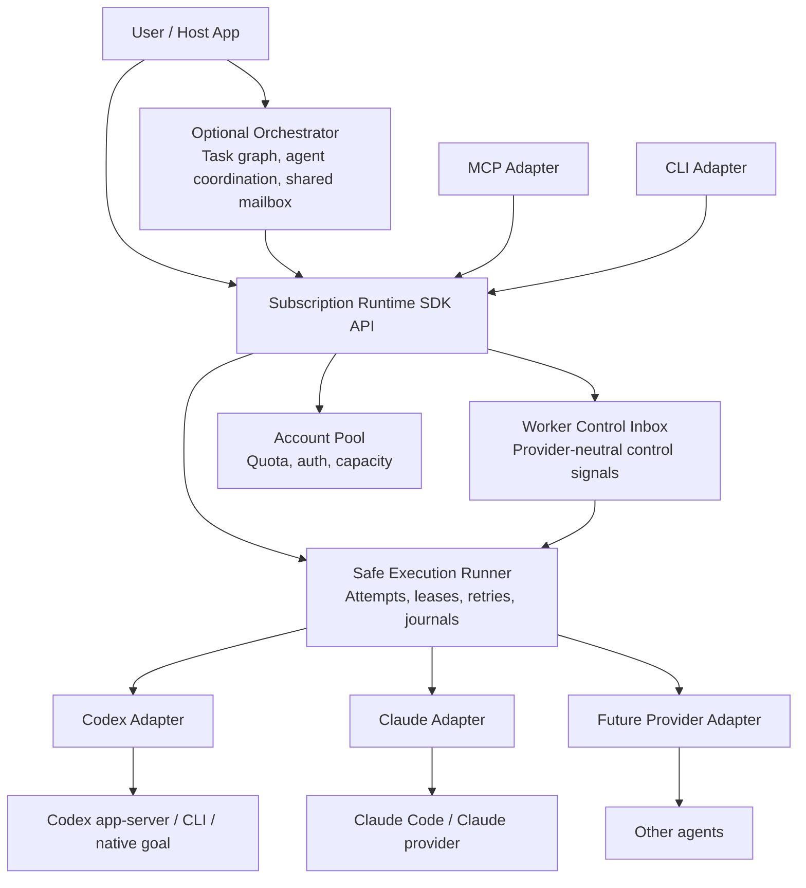
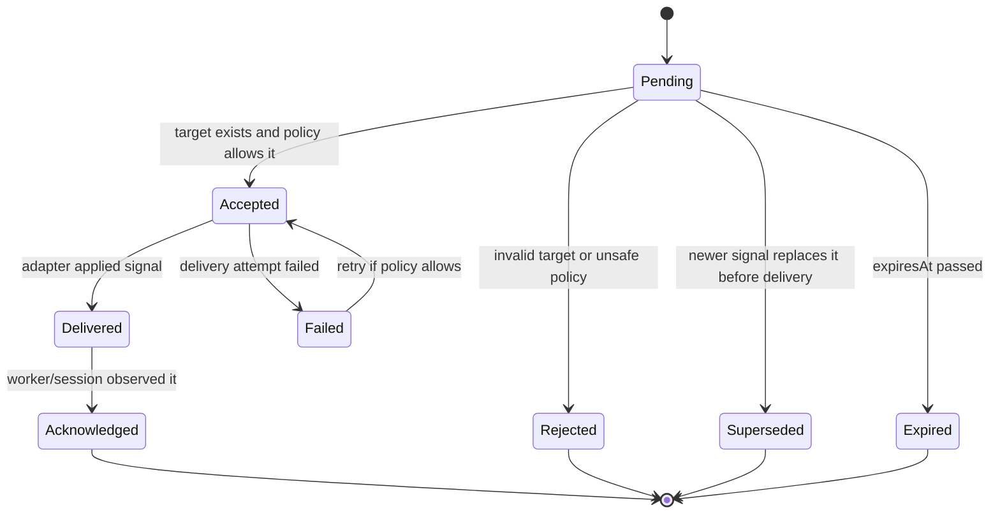

# Subscription Runtime Boundaries and Worker Control Inbox

Status: current baseline implemented, with explicit future delivery modes

This document explains why `subscription-runtime` should have its own worker
control inbox, how that inbox differs from a future orchestrator mailbox, and
where the runtime boundary should stay as the system grows.

The short version: `subscription-runtime` should remain a low-level agent
execution runtime. It should not become the product/task orchestrator. However,
it still needs a small, durable, provider-neutral control inbox because only the
runtime can safely coordinate control messages with worker sessions, leases,
provider capabilities, account state, retry policy, and workspace safety.

## Executive Summary

`subscription-runtime` should own a **Worker Control Inbox**.

That inbox is not an agent-to-agent mailbox. It is a technical control plane for
messages that target a concrete worker run, session, or task attempt:

- operator guidance for the next safe continuation;
- pause, stop, cancel, and resume requests;
- policy updates such as "do not run the full benchmark yet";
- review notes that must be attached to the worker journal;
- repair or reconnect instructions;
- safe continuation messages after quota, auth, reconnect, timeout, or host
  interruption.

A future orchestrator may have a richer **Agent Mailbox** or **Task Mailbox**.
That mailbox should model conversations between agents, shared project rooms,
task assignment, parent-child worker coordination, and product-level workflow.
It can use the runtime inbox as a low-level delivery mechanism when a message
must reach a running worker, but it should not force the runtime to understand
global orchestration semantics.

The clean architectural split is:

- **Orchestrator** decides what should happen and why.
- **Subscription Runtime** decides whether a specific worker can safely receive
  or apply a control signal, and when.
- **Provider adapter** decides how that control signal maps to Claude, Codex, or
  another execution engine.

## Runtime Responsibility Boundary

`subscription-runtime` is responsible for running and supervising agents through
provider-neutral primitives.

It should own:

- provider instance and account pool selection;
- account health, quota, reconnect, and capacity state;
- worker process lifecycle;
- provider session lifecycle;
- safe retries and continuation attempts;
- workspace leases and single-writer safety;
- execution journals and result files;
- normalized task status;
- provider-neutral failure classification;
- observability for a concrete worker run;
- durable technical control signals for a concrete worker run.

It should not own:

- product backlog or issue management;
- global task DAGs;
- deciding which business task matters most;
- cross-agent debate or planning;
- shared project memory;
- long-term agent identity;
- multi-agent social semantics such as personal mailboxes, team rooms, mentions,
  threads, priorities, votes, or approvals;
- semantic merge decisions between competing implementation branches.

In other words, `subscription-runtime` should answer:

> Can this worker run safely, continue, pause, stop, receive guidance, or switch
> accounts right now?

It should not answer:

> Which feature should the organization build next, which agent should own it,
> and how should agents negotiate the plan?

## Why the Runtime Needs Its Own Inbox

At first it may look like all messaging belongs in an orchestrator. That is true
for agent-to-agent communication, but not for worker control. A runtime-level
inbox is needed for several reasons.

### 1. Safe delivery depends on runtime-only facts

The runtime is the layer that knows:

- whether a worker process is alive;
- whether a provider turn is currently active;
- whether the workspace is dirty;
- whether the worktree lease is still valid;
- whether the current account is quota-limited, auth-invalid, or reconnecting;
- whether the provider supports live input, idle-turn input, or only restart
  continuation;
- whether a previous attempt produced a partial result;
- whether the latest journal, result file, and status index agree.

An orchestrator can request "send this guidance", but it cannot safely decide
how to inject it into a Codex `/goal` session or a Claude Code session without
duplicating provider/runtime internals.

### 2. Worker control must be durable

Long agent tasks can run for hours. The operator, MCP server, CLI process, host
app, or orchestrator can restart while the worker keeps running.

Control messages therefore need to be stored durably as runtime facts:

- append-only signal log;
- idempotency key;
- target worker/task/session identity;
- delivery mode;
- delivery attempts;
- acknowledgement or rejection reason;
- relation to the safe execution journal.

If guidance only exists in an orchestrator memory or a transient MCP request,
the runtime cannot reliably include it in the next continuation.

### 3. The runtime owns continuation semantics

For long Codex and Claude tasks, the safest default is not "send a live chat
message". The safer default is:

1. record the guidance;
2. wait for a safe boundary;
3. include it in the next continuation packet;
4. preserve the worker's transcript, dirty workspace, and failure context.

Only the runtime knows where safe boundaries exist. For example:

- after a quota failure;
- after a reconnect failure;
- after a controlled stop;
- after a task timeout;
- after a provider session becomes idle;
- before starting the next attempt.

### Worked continuation example

Scenario:

- Codex `/goal` job `job-123` is running in `/work/memo-stack`;
- account A hits quota during attempt 1;
- the worktree is dirty because the first attempt wrote `src/retrieval.ts`;
- an operator queued guidance: "do not run full 600 yet; use targeted slices";
- account B is available.

The runtime must not ask the orchestrator how to resume this. The runtime has
the execution journal, account state, workspace snapshot, and pending control
signals, so it builds a continuation packet like this:

```txt
Continue the same task in the current workspace.
Task id: task-123
Attempt: 2
Provider: codex
Workspace: /work/memo-stack
Previous attempt stopped because: quota_limited

Original task:
Improve LoCoMo retrieval quality.

Current workspace summary:
Git workspace has 1 changed status entries.

Runtime control inbox instructions:

The following durable control signals were queued for this worker after the original task text. Treat them as current runtime instructions for the same task.

1. guidance (next_safe_point, normal)
Signal id: signal-1
Created by: operator at 2026-06-30T00:00:00.000Z
Message:
Do not run full 600 yet; use targeted slices.

Changed files:
- src/retrieval.ts

Important instruction:
Do not restart from scratch. Inspect the current workspace state and continue from the existing partial changes.
```

This packet is a runtime artifact, not a generic mailbox message. It preserves
original task text, failure reason, dirty workspace context, and delivered
control signals without printing auth tokens or provider raw payloads.

### 4. Provider capabilities are not uniform

Different agents support different control modes:

- Codex app-server may support thread-based turns, but only if no active turn is
  running and the thread/session is valid.
- Native `/goal` continuation should usually be controlled through safe
  restart/continuation rather than concurrent live injection.
- Claude Code may have different resume/session semantics.
- Future providers may expose a clean live-control API.
- Some providers may only support record-and-restart.

The core domain needs a neutral model, while adapters expose capability-specific
delivery strategies.

### 5. It prevents the orchestrator from learning provider internals

Without a runtime inbox, every orchestrator would eventually need to know:

- how to detect active Codex turns;
- how to restart a Codex app-server session;
- how to classify `reconnect_required`;
- how to preserve a safe continuation packet;
- how to avoid double-writing in a worktree;
- how to attach guidance to a retry without losing transcript context.

That is exactly the provider glue `subscription-runtime` exists to hide.

### Why not an orchestrator-owned durable queue?

A higher-level orchestrator can persist messages durably, so durability alone
is not the decisive reason for a runtime inbox. The decisive reason is safe
delivery.

The orchestrator can decide what it wants to say and why. The runtime must
decide whether that signal can be applied now, delayed until the next safe
point, rejected, or attached to a continuation packet. If the orchestrator owns
that decision, it has to duplicate provider state, process state, account
capacity, workspace locks, and continuation semantics. That would move runtime
responsibility into every orchestrator.

## What the Runtime Inbox Is Not

The runtime inbox should not become a general mailbox.

It is not:

- a chat system;
- a team inbox;
- a project discussion thread;
- a global task queue;
- an agent memory system;
- a planning board;
- a human approval workflow;
- a replacement for an orchestrator.

It should only store control signals that directly affect a concrete worker run
or its next safe continuation.

Good runtime inbox messages:

- "Pause after current safe point."
- "Stop and preserve dirty work."
- "When continuing, focus on category 3 reasoning and avoid full 600 benchmark
  until targeted slices improve."
- "Account A is auth-invalid; do not retry it until relogin."
- "Attach this operator note to the next continuation."

Bad runtime inbox messages:

- "Agent A, ask Agent B what it thinks about the product roadmap."
- "Vote on which feature to build."
- "Store all discussions about project X."
- "Assign the next sprint task to the least busy agent."
- "Merge branch A into branch B because the product owner approved it."

Those belong in an orchestrator or collaboration layer.

## Runtime Inbox vs Orchestrator Mailbox

| Dimension | Worker Control Inbox in `subscription-runtime` | Agent/Task Mailbox in Orchestrator |
| --- | --- | --- |
| Primary purpose | Safely control a concrete worker run | Coordinate agents and tasks |
| Scope | One worker, task, attempt, session, workspace, or account pool | Project, team, task DAG, parent-child workers, agent rooms |
| Message type | Technical control signal | Conversation, assignment, review, negotiation, decision |
| Ownership | Runtime domain | Orchestrator domain |
| Delivery decision | Based on leases, provider sessions, active turns, dirty workspace, account health | Based on task graph, priorities, agent roles, business workflow |
| Persistence | Execution journal adjacent, append-only control log | Conversation/task database |
| Semantics | At-least-once with idempotency, safe-point delivery | Domain-specific messaging semantics |
| Provider knowledge | Hidden inside runtime adapters | Should be provider-agnostic |
| Examples | pause, stop, guidance-on-next-continuation, reconnect repair | assign task, ask child worker, broadcast status, request review |

The orchestrator can depend on the runtime inbox, but the runtime must not
depend on the orchestrator mailbox.

## Layering Model



The key point is that MCP and CLI are adapters. The canonical behavior should
live in the SDK/domain use cases, not inside MCP-specific code.

## Current Domain Model

The runtime inbox is modeled as a provider-neutral domain capability in
`src/worker-core/control`.

Core concepts:

```ts
export type WorkerControlIntent =
  | "guidance"
  | "pause_requested"
  | "stop_requested"
  | "cancel_requested"
  | "resume_requested"
  | "repair_requested"
  | "policy_update"
  | "operator_note";

export type WorkerControlDeliveryMode =
  | "record_only"
  | "next_safe_point"
  | "pause_then_continue"
  | "idle_turn_if_supported"
  | "live_if_supported";

export type WorkerControlTarget = {
  readonly jobId: string;
  readonly taskId?: string;
  readonly workerId?: string;
  readonly attemptId?: string;
  readonly providerSessionId?: string;
  readonly workspaceId?: string;
};

export type WorkerControlSignal = {
  readonly schemaVersion: 1;
  readonly signalId: string;
  readonly idempotencyKey: string;
  readonly target: WorkerControlTarget;
  readonly intent: WorkerControlIntent;
  readonly deliveryMode: WorkerControlDeliveryMode;
  readonly body: string;
  readonly createdAt: Date;
  readonly createdBy: "user" | "operator" | "orchestrator" | "runtime" | "agent";
  readonly priority: "low" | "normal" | "high";
  readonly expiresAt?: Date;
  readonly supersedesSignalIds: readonly string[];
  readonly metadata: Readonly<Record<string, string>>;
};
```

The store should record delivery state separately:

```ts
export type WorkerControlDeliveryState =
  | "pending"
  | "accepted"
  | "delivered"
  | "acknowledged"
  | "superseded"
  | "expired"
  | "rejected"
  | "failed";

export type WorkerControlDeliveryReceipt = {
  readonly schemaVersion: 1;
  readonly receiptId: string;
  readonly signalId: string;
  readonly target: WorkerControlTarget;
  readonly state: WorkerControlDeliveryState;
  readonly createdAt: Date;
  readonly deliveryAttemptId?: string;
  readonly deliveredAt?: Date;
  readonly appliedAt?: Date;
  readonly rejectedReason?: string;
  readonly failure?: {
    readonly code: string;
    readonly message: string;
  };
  readonly metadata: Readonly<Record<string, string>>;
};
```

The important design choice is that "message exists" and "message was delivered"
are separate facts. This makes recovery and auditing possible.

## Delivery Modes

### `record_only`

Store the signal and attach it to the job journal. Do not attempt to affect the
running worker.

Use for:

- operator notes;
- audit comments;
- future review context.

### `next_safe_point`

Store the signal now and include it in the next continuation packet or next
provider-safe boundary.

This should be the default for guidance.

Use for:

- "next time you continue, focus on this";
- "do not run full benchmark yet";
- "after quota switch, continue with this constraint."

### `pause_then_continue`

Request a controlled stop at a safe boundary, then continue with the signal
included.

Use for:

- changing direction while preserving dirty work;
- applying a significant new constraint;
- recovering from silent-stale behavior.

### `idle_turn_if_supported`

Deliver a new input only when the provider reports that the session is idle and
the adapter can prove there is no active turn.

Use carefully for:

- providers with safe thread/turn APIs;
- low-risk follow-up messages.

### `live_if_supported`

Potential future mode. It should be disabled by default unless a provider
adapter can prove safety.

Live injection is dangerous because it can create two active turns, corrupt a
native goal, or make the transcript inconsistent with the execution journal.

## Control Signal Lifecycle



The runtime should not promise exactly-once delivery. A better contract is:

- durable append-only signals;
- idempotency keys;
- at-least-once delivery attempts;
- provider adapter acknowledgements when possible;
- safe deduplication at continuation packet construction time.

Supersession only applies before delivery. Once a signal is `accepted`, it may
already be in-flight, so the runtime must not replace it silently. Once a signal
is `delivered` or `acknowledged`, it cannot be un-delivered. The correct way to
change direction after delivery is to enqueue a new corrective signal.

## Required Invariants

1. **Single-writer workspace safety**
   A control signal must not create a second writer in the same worktree.

2. **No concurrent provider turns**
   Live or idle-turn delivery must be rejected if the provider has an active
   turn or if active-turn state cannot be proven.

3. **Append-only audit trail**
   Signals and delivery receipts should be appended. Derived status files can be
   rebuilt from the log.

4. **Idempotent enqueue**
   Repeating the same `idempotencyKey` must not create duplicate guidance.

5. **Provider-neutral core**
   Core types must not import Codex, Claude, OpenAI SDKs, FastAPI, SQLAlchemy,
   Qdrant, or provider-specific process code.

6. **Capability-aware delivery**
   Unsupported delivery modes must be rejected or downgraded according to
   explicit policy, never silently guessed.

7. **Sensitive data hygiene**
   Control signal bodies must be treated as user input. Do not print tokens,
   auth JSON, cookies, refresh tokens, bearer headers, or raw provider payloads.

8. **Completion-aware behavior**
   If a signal arrives after a job completed, default to `record_only` or reject
   with `job_already_completed`. Do not restart completed work implicitly.

## Edge Cases to Handle

### Status/index mismatch

The index may say a job is running while the process is gone, or the process may
be alive while the result file is missing. The control service should reconcile:

- process status;
- tmux status;
- app-server status;
- lock file;
- journal tail;
- latest result file;
- workspace dirty state.

A derived index should never be the only source of truth.

### Worker alive, stdout silent

Long-running agents can be alive but produce no stdout for a while. The runtime
should track multiple freshness signals:

- process alive;
- CPU activity if available;
- app-server heartbeat if available;
- journal writes;
- artifact writes;
- result file writes;
- configured quiet timeout.

The inbox should support a `pause_requested` or `operator_note` without assuming
silence means failure.

### Active turn running

If an active provider turn is running, do not inject a new live message. Use
`next_safe_point` or `pause_then_continue`.

### Dirty workspace

If the workspace is dirty, unknown/runtime/code/test failures should not cause
blind account switching or blind restart. Guidance can be recorded, but unsafe
continuation should require inspection or an explicit policy.

### Account changed mid-run

If a signal targets a session whose account became auth-invalid or was switched,
the runtime should record the signal and deliver it only after a safe
continuation on a valid account.

### Provider session repaired

If reconnect repair creates a new app-server session, pending guidance should be
attached to the new session through the safe continuation packet. The signal
should not be lost because the provider session id changed.

### Duplicate messages

MCP clients, CLI clients, and orchestrators can retry. The inbox must dedupe by
`idempotencyKey`.

### Superseded guidance

An operator may send "do not run full 600" and later "full 600 is allowed now".
The model should support superseding signals, not only appending contradictory
text.

Supersession is only valid for not-yet-delivered signals. If the older signal
was already delivered to a continuation packet, the replacement must be a new
corrective guidance signal, not a supersede receipt.

### Expired guidance

Some instructions should expire, for example "wait 30 minutes before retrying".
Expired signals should remain in the audit log but should not be delivered.

## API, MCP, and CLI Surfaces

The canonical surface is the TypeScript SDK/domain API. MCP and CLI call the
same use cases:

```ts
export interface WorkerControlService {
  enqueueSignal(input: EnqueueWorkerControlSignalInput): Promise<WorkerControlSignal>;
  listSignals(query: ListWorkerControlSignalsQuery): Promise<readonly WorkerControlSignalView[]>;
  getDecision(input: WorkerControlDecisionInput): Promise<WorkerControlDecision>;
  reconcile(input: WorkerControlReconcileInput): Promise<WorkerControlReconciliationReport>;
  markSuperseded(input: SupersedeWorkerControlSignalInput): Promise<WorkerControlDeliveryReceipt>;
  consumeForContinuation(input: ConsumeWorkerControlContinuationInput): Promise<WorkerControlContinuationBatch>;
}
```

Current Codex MCP tools:

- `codex_goal_control_enqueue`
- `codex_goal_control_list`
- `codex_goal_control_decision`
- `codex_goal_control_reconcile`
- `codex_goal_control_supersede`

Current CLI shortcuts:

- `subscription-runtime-codex-goal control-enqueue`
- `subscription-runtime-codex-goal control-list`
- `subscription-runtime-codex-goal control-decision`
- `subscription-runtime-codex-goal control-reconcile`
- `subscription-runtime-codex-goal control-supersede`

The CLI should remain an escape hatch for humans and scripts. MCP should be the
first-class interface for other agents. Both should be thin adapters over the
same API.

### Authorization

`createdBy` is provenance, not authorization. The runtime API accepts an
optional caller object and an authorization policy hook:

```ts
export type WorkerControlCaller = {
  readonly kind: "user" | "operator" | "orchestrator" | "runtime" | "agent";
  readonly id?: string;
};

export interface WorkerControlAuthorizationPolicy {
  authorizeWorkerControl(input: WorkerControlAuthorizationInput):
    | WorkerControlAuthorizationDecision
    | Promise<WorkerControlAuthorizationDecision>;
}
```

The default local policy is permissive for backwards compatibility. Hosted or
multi-agent deployments can plug in a stricter policy that answers questions
like:

- can this agent enqueue guidance for this job?
- can this caller request stop or pause?
- can this caller supersede another caller's pending signal?

MCP and CLI pass caller identity through to the domain service, but they should
not implement the policy themselves.

## Provider Adapter Responsibilities

The core runtime should decide whether a signal is valid and safe in general.
The provider adapter should decide how to apply it for a specific execution
engine.

A provider adapter can expose capabilities like:

```ts
export type WorkerControlCapability = {
  readonly supportsRecordOnly: true;
  readonly supportsNextSafePoint: boolean;
  readonly supportsPauseThenContinue: boolean;
  readonly supportsIdleTurnInput: boolean;
  readonly supportsLiveInput: boolean;
  readonly canDetectActiveTurn: boolean;
  readonly canAcknowledgeDelivery: boolean;
};
```

Codex example:

- `record_only`: safe;
- `next_safe_point`: safe and recommended;
- `pause_then_continue`: blocked by default; safe only if the runner explicitly
  advertises that it can stop and continue without discarding work;
- `idle_turn_if_supported`: possible only when app-server session is healthy and
  no active turn exists;
- `live_if_supported`: disabled by default;
- native `/goal`: prefer safe continuation packets over live injection.

Claude example:

- `record_only`: safe;
- `next_safe_point`: safe and supported by injecting guidance before the next
  Claude worker task or logical thread run;
- `pause_then_continue`: blocked by default unless the Claude adapter explicitly
  proves safe pause-and-continue semantics;
- live input: adapter-specific and must prove no active turn conflict.

## Current Package Layout

Keep domain and adapters separated:

```txt
src/
  worker-core/
    control/
      types.ts
      worker-control-service.ts
      continuation-signal-compiler.ts
  store-local-file/
    local-worker-control-inbox-store.ts
  worker-codex/
    file-backend-codex-safe-executor.ts
    codex-goal-mcp.ts
    codex-goal-cli.ts
    codex-run-observation.ts
  worker-claude/
    file-backend-claude-worker.ts
    claude-run-observation.ts
  worker-local/
    claude-run-watch.ts
```

The store interface belongs in core. The local file implementation belongs in a
store adapter. Provider-specific delivery belongs in provider workers/adapters.
MCP and CLI only expose use cases.

The current implementation follows that split:

- core owns signal semantics, target matching, delivery states, reconciliation,
  and continuation message compilation;
- `store-local-file` owns durable append-only signal and receipt persistence;
- Codex consumes pending signals through `SafeExecutionRunner` continuation
  packets;
- Claude consumes pending signals at the next worker safe point before a direct
  task or logical thread task starts;
- Codex MCP/CLI expose job-scoped control tools without becoming a general
  orchestrator mailbox.

## How This Helps a Future Orchestrator

A future orchestrator can build richer behavior on top:

- spawn child workers;
- assign tasks;
- maintain parent-child worker relationships;
- keep personal and shared agent mailboxes;
- ask agents to review each other;
- decide when to merge branches;
- schedule retries across a task DAG;
- aggregate progress across projects.

When that orchestrator needs to influence a concrete worker, it can call the
runtime:

```txt
orchestrator mailbox message
  -> orchestrator decides it affects worker job-123
  -> runtime worker control signal target=job-123 deliveryMode=next_safe_point
  -> runtime safely applies it according to provider/session/workspace state
```

This keeps both layers clean:

- the orchestrator owns intent and coordination;
- the runtime owns safe execution and delivery mechanics.

## Non-Goals

Do not build these inside `subscription-runtime`:

- global agent social graph;
- organization-wide mailbox;
- task marketplace;
- product backlog;
- multi-agent debate protocol;
- automatic semantic merge policy;
- long-term knowledge base;
- arbitrary chat transcript storage.

Those can exist above the runtime.

## Implementation Status and Roadmap

### Implemented - Durable guidance queue

`guidance` and `operator_note` signals exist with `record_only` and
`next_safe_point`.

This solves the most important problem: agents and humans can safely add context
that will be included in the next continuation without touching a running turn.

### Partially implemented - Pause and stop controls

The domain supports `pause_requested`, `stop_requested`, and
`pause_then_continue`. Codex exposes soft pause markers and control inbox
signals. Provider-specific hard stop/pause semantics remain adapter-specific.

This lets operators redirect a worker safely when it is stale, wrong, or needs a
new constraint.

### Partially implemented - Reconciliation and stronger status

The current baseline includes:

- control inbox reconciliation and stale accepted-claim repair;
- read-only run observation for Codex goal jobs;
- Claude run artifact observation;
- safe live e2e harness with default skip mode.

Future reconciliation can compare more signals:

- control log;
- execution journal;
- result file;
- process/tmux state;
- workspace lock;
- app-server state where available.

This addresses the practical pain where a worker is alive but logs are quiet, or
the status index disagrees with process reality.

### Future - Provider-specific idle-turn delivery

Allow `idle_turn_if_supported` for providers that can prove the session is idle
and support safe thread input.

This should be opt-in per provider and disabled by default for native goal
flows until safety is proven.

## Recommendation

Build the runtime inbox, but keep it deliberately narrow.

The best design is not "subscription-runtime has a mailbox like an orchestrator".
The best design is:

- `subscription-runtime` has a **durable worker control inbox**;
- the orchestrator has an optional **agent/task mailbox**;
- the orchestrator can translate high-level messages into runtime control
  signals when needed;
- the runtime never needs to understand global orchestration semantics;
- provider adapters handle only provider-specific delivery details.

This gives us the operational safety we need for long-running workers without
polluting the runtime with product orchestration responsibilities.
