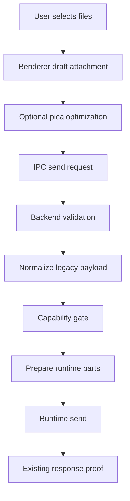
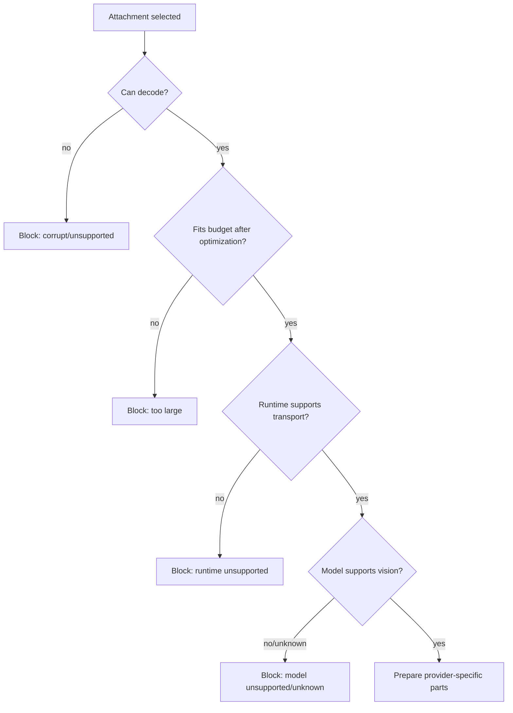
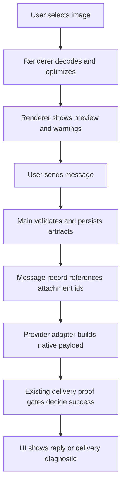

# Agent attachments architecture plan

## Summary

Goal: support screenshots/images and later documents across Claude, Codex, and OpenCode teammates without treating base64 as a universal transport and without destabilizing team launch/runtime delivery.

Chosen architecture: **shared attachment normalization + artifact variants + runtime capability gate + provider-specific delivery adapters**.

🎯 9.1   🛡️ 8.7   🧠 7.0  
Estimated total implementation size: `650-1100` LOC across phased work, excluding broad tests and fixtures.

Risk if implemented in phases: `3/10`.
Risk if implemented as one big change across all runtimes: `7/10`.

Repos involved:

- `/Users/belief/dev/projects/claude/claude_team`
- `/Users/belief/dev/projects/claude/agent_teams_orchestrator`

## Live research facts

The design is based on live smoke tests run on May 8-9, 2026.

### Claude

Claude subscription is working for image input in streaming mode.

Confirmed path:

```text
@anthropic-ai/claude-agent-sdk query({ prompt: async iterable with image block })
PNG -> red
JPEG -> red
```

Important nuance:

```text
claude -p / single-message mode is not the right validation path for images.
```

Official Claude Code docs say image uploads are supported in streaming input mode and not in single-message mode. Our team lead process uses long-lived `--input-format stream-json`, so Claude support is viable.

### Codex

Codex subscription image input works through CLI file attachment:

```bash
codex exec --json --skip-git-repo-check -C /tmp --model gpt-5.4-mini --image red-card-valid.png -
```

Result:

```text
red
```

Therefore Codex native delivery should use optimized image files and `--image <path>`, not inline base64 in prompt text.

### OpenCode

OpenCode OpenAI OAuth image input works:

```bash
opencode run --pure --format json --dir /tmp --model openai/gpt-5.4-mini "..." -f red-card-valid.png
```

Result:

```text
red
```

OpenCode OpenRouter works when `OPENROUTER_API_KEY` is present:

```text
openrouter/moonshotai/kimi-k2.6 -> red
openrouter/z-ai/glm-4.5v -> red
openrouter/z-ai/glm-5.1 -> model replied it cannot view images
```

Therefore OpenCode support is not only provider-level. It needs model-level vision capability gating.

## Non-goals

- Do not change team launch/bootstrap semantics.
- Do not make attachments part of readiness or liveness truth.
- Do not send base64 blobs as plain text to any model.
- Do not silently drop attachments for unsupported runtimes.
- Do not attempt to make every OpenRouter model vision-capable.
- Do not add a native image processing dependency in Electron main for v1.
- Do not introduce a new retry loop for attachment failures.

## Core invariants

1. Original user attachment is immutable.
2. Optimized variants are derived artifacts with deterministic metadata.
3. Delivery is blocked before send if the selected runtime/model cannot accept the attachment.
4. Delivery success does not mean model understood the image; it only means the runtime accepted the attachment transport.
5. A model that says it cannot view an image is a model capability failure, not a transport failure.
6. The renderer can optimize for UX and payload size, but the backend is the final validation authority.
7. No runtime adapter should know about React, IPC, or draft UI state.
8. No renderer code should know filesystem runtime log paths or process internals.
9. No app shell code should deep-import feature internals.
10. All user-visible attachment errors must be actionable and specific.

## Why not universal base64

Universal base64 looks simple but is the wrong abstraction.

Claude accepts inline image content blocks in streaming mode.
Codex accepts image file paths through `--image`.
OpenCode accepts file parts through `-f` / session message parts.
OpenRouter models vary by capability.

Sending base64 text to all providers creates false success:

```text
transport accepted prompt text
model sees base64 noise
user thinks image was attached
agent silently fails to use screenshot
```

The right abstraction is a normalized attachment plus runtime-specific prepared parts.

## Target feature layout

Medium-sized cross-process feature should follow `docs/FEATURE_ARCHITECTURE_STANDARD.md`.

Recommended home:

```text
src/features/agent-attachments/
  contracts/
    api.ts
    dto.ts
    channels.ts
  core/
    domain/
      AttachmentModel.ts
      AttachmentCapability.ts
      AttachmentBudget.ts
      AttachmentDeliveryDecision.ts
    application/
      AttachmentNormalizer.ts
      AttachmentCapabilityResolver.ts
      AttachmentDeliveryPlanner.ts
      AttachmentVariantSelector.ts
      ports.ts
  main/
    composition/
      createAgentAttachmentsFeature.ts
    adapters/
      input/
        ipc/registerAgentAttachmentIpc.ts
      output/
        ClaudeStreamJsonAttachmentAdapter.ts
        CodexNativeAttachmentAdapter.ts
        OpenCodeAttachmentAdapter.ts
    infrastructure/
      AttachmentArtifactStore.ts
      AttachmentMetadataStore.ts
      RuntimeModelCapabilityCatalog.ts
      ServerImageBudgetValidator.ts
  preload/
    createAgentAttachmentsBridge.ts
  renderer/
    hooks/
      useAttachmentPreparation.ts
      useAttachmentCapabilityWarnings.ts
    ui/
      AttachmentPreviewList.tsx
      AttachmentCapabilityNotice.tsx
    utils/
      picaImageOptimizer.ts
```

Do not move existing composer code wholesale in one step. Introduce the feature and connect it gradually.

## Domain model sketch

```ts
export type AgentAttachmentKind = 'image' | 'document' | 'text' | 'unsupported';

export type AttachmentDataRef =
  | { kind: 'inline-base64'; base64: string }
  | { kind: 'artifact-file'; path: string; sha256: string }
  | { kind: 'text'; text: string };

export interface NormalizedAgentAttachment {
  id: string;
  originalName: string;
  mimeType: string;
  kind: AgentAttachmentKind;
  originalBytes: number;
  originalRef: AttachmentDataRef;
  variants: AgentAttachmentVariant[];
  warnings: AttachmentWarning[];
}

export interface AgentAttachmentVariant {
  id: string;
  sourceAttachmentId: string;
  purpose:
    | 'preview'
    | 'claude-inline-image'
    | 'claude-inline-document'
    | 'codex-image-file'
    | 'opencode-file-part';
  mimeType: string;
  byteSize: number;
  width?: number;
  height?: number;
  ref: AttachmentDataRef;
}

export interface AttachmentWarning {
  code:
    | 'image_resized'
    | 'format_converted'
    | 'animated_gif_not_supported'
    | 'model_does_not_support_images'
    | 'attachment_too_large'
    | 'unknown_runtime_capability';
  message: string;
  severity: 'info' | 'warning' | 'error';
}
```

## Capability model sketch

```ts
export type AttachmentRuntimeKind = 'claude-stream-json' | 'codex-native' | 'opencode';

export interface AttachmentRuntimeContext {
  teamName: string;
  memberName?: string;
  providerId: 'anthropic' | 'codex' | 'opencode' | string;
  modelId: string;
  runtimeKind: AttachmentRuntimeKind;
  deliveryTarget: 'lead' | 'member' | 'opencode-secondary';
}

export interface RuntimeAttachmentCapability {
  supportsImages: boolean;
  supportsDocuments: boolean;
  supportedImageMimeTypes: string[];
  maxInlineBytes?: number;
  maxFileBytes?: number;
  modelCapabilitySource: 'static' | 'catalog' | 'live-probe' | 'unknown';
  reason?: string;
}

export interface AttachmentCapabilityDecision {
  allowed: boolean;
  warnings: AttachmentWarning[];
  blockers: AttachmentWarning[];
  capability: RuntimeAttachmentCapability;
}
```

## Delivery planner sketch

```ts
export interface PreparedAttachmentPart {
  runtimeKind: AttachmentRuntimeKind;
  attachmentId: string;
  part:
    | { kind: 'claude-content-block'; value: Record<string, unknown> }
    | { kind: 'codex-image-arg'; path: string }
    | { kind: 'opencode-file-part'; value: Record<string, unknown> };
  diagnostics: string[];
}

export interface AttachmentDeliveryAdapter {
  runtimeKind: AttachmentRuntimeKind;
  canDeliver(
    ctx: AttachmentRuntimeContext,
    attachment: NormalizedAgentAttachment,
  ): AttachmentCapabilityDecision;
  prepare(
    ctx: AttachmentRuntimeContext,
    attachment: NormalizedAgentAttachment,
  ): Promise<PreparedAttachmentPart>;
}

export class AttachmentDeliveryPlanner {
  constructor(private readonly adapters: AttachmentDeliveryAdapter[]) {}

  async prepareAll(
    ctx: AttachmentRuntimeContext,
    attachments: NormalizedAgentAttachment[],
  ): Promise<PreparedAttachmentPart[]> {
    const adapter = this.adapters.find(candidate => candidate.runtimeKind === ctx.runtimeKind);
    if (!adapter) {
      throw new Error(`Attachments are not supported for runtime ${ctx.runtimeKind}`);
    }

    const prepared: PreparedAttachmentPart[] = [];
    for (const attachment of attachments) {
      const decision = adapter.canDeliver(ctx, attachment);
      if (!decision.allowed) {
        throw new Error(decision.blockers.map(blocker => blocker.message).join('\n'));
      }
      prepared.push(await adapter.prepare(ctx, attachment));
    }
    return prepared;
  }
}
```

## Phase map

### Phase 1 - normalization, image optimization, budgets, and UI warnings

🎯 9.4   🛡️ 9.3   🧠 5.8  
Estimated change size: `260-420` LOC.

Create feature skeleton, normalize attachments, optimize images with `pica@9.0.1`, enforce hard server-side budgets, and show capability/budget warnings. Do not change provider delivery paths yet except to fail oversized images earlier.

Plan file:

```text
docs/team-management/agent-attachments-phase-1-normalization-and-budgets-plan.md
```

### Phase 2 - Claude stream-json adapter

🎯 9.0   🛡️ 8.8   🧠 5.8  
Estimated change size: `180-320` LOC.

Route existing Claude lead attachments through the new planner while preserving current content block semantics. This removes ad-hoc attachment serialization from `TeamProvisioningService` without changing launch.

Plan file:

```text
docs/team-management/agent-attachments-phase-2-claude-stream-json-plan.md
```

### Phase 3 - Codex native image adapter

🎯 8.6   🛡️ 8.4   🧠 6.6  
Estimated change size: `260-440` LOC across two repos.

Write optimized image artifacts and pass them to Codex native via `--image <path>`. Extend Codex native exec input from text-only to text plus image paths.

Plan file:

```text
docs/team-management/agent-attachments-phase-3-codex-native-plan.md
```

### Phase 4 - OpenCode file parts and model vision gate

🎯 8.3   🛡️ 8.0   🧠 7.2  
Estimated change size: `320-560` LOC across two repos.

Support OpenCode file parts and model capability gating. Block text-only models like `openrouter/z-ai/glm-5.1` before send. Allow vision models like Kimi K2.6 and GLM 4.5V.

Plan file:

```text
docs/team-management/agent-attachments-phase-4-opencode-vision-plan.md
```

### Phase 5 - cross-runtime E2E, diagnostics, docs, and polish

🎯 8.8   🛡️ 8.7   🧠 5.4  
Estimated change size: `180-320` LOC plus tests/docs.

Add live e2e scripts, UI copy, diagnostics, and documentation. Keep this separate to avoid mixing correctness changes with polish.

Plan file:

```text
docs/team-management/agent-attachments-phase-5-e2e-and-polish-plan.md
```

## Shared testing strategy

Use three levels of tests.

### Unit tests

- image optimizer budget decisions;
- capability resolver decisions;
- adapter serialization output;
- artifact idempotency;
- redaction of secrets in diagnostics.

### Fixture integration tests

- renderer attachment preview and warnings;
- IPC validation rejects oversized or unsupported attachments;
- planner blocks unsupported runtime/model;
- delivery paths produce correct content parts without live provider calls.

### Live e2e smoke tests

Run only when explicitly requested or behind live test env.

Live models already validated manually:

```text
Claude subscription PNG/JPEG -> red
Codex gpt-5.4-mini PNG -> red
OpenCode openai/gpt-5.4-mini PNG -> red
OpenCode openrouter/moonshotai/kimi-k2.6 PNG -> red
OpenCode openrouter/z-ai/glm-4.5v PNG -> red
OpenCode openrouter/z-ai/glm-5.1 PNG -> text-only refusal
```

## Release safety

Default rollout order:

1. Land Phase 1 alone.
2. Verify no regressions in text-only sends.
3. Land Phase 2 for Claude only.
4. Land Phase 3 Codex after focused native exec tests.
5. Land Phase 4 OpenCode after model capability tests.
6. Land Phase 5 e2e/polish.

Do not bundle all phases into one release commit.

## Main bug risks and mitigations

| Risk | Impact | Mitigation |
|---|---:|---|
| Oversized image crashes or kills lead process | High | renderer optimization + backend serialized budget |
| Unsupported model silently ignores image | High | capability gate blocks before send |
| Base64 leaked into prompt text | Medium | adapters never produce plain text base64 |
| Retry loses attachment artifact | Medium | artifact store rebuilds from original or fails loudly |
| OpenCode model catalog changes | Medium | static curated map plus explicit unknown capability state |
| Cross-process API becomes too broad | Medium | feature contracts expose only DTOs and use cases |
| Existing Claude path regresses | Medium | Phase 2 keeps exact content block semantics and tests current behavior |

## Decision record

Use `pica@9.0.1` in renderer for high-quality browser image resizing.

Do not use `sharp` in Electron main for this phase because native packaging risk is not worth it before release.

Do not use `@squoosh/lib` because it is stale and heavier operationally.

Do not use text dedupe or model-specific prompt hacks for attachments.

Do not treat OpenCode provider support as model support.

## Deep implementation guardrails

This section tightens the plan after reviewing the first draft. The most important correction is that the attachment feature must not become a generic utility imported everywhere. It should be a feature with a small public facade and strict contracts. Provider-specific code should depend on feature ports, not on renderer utilities or raw DTOs.

### Ownership boundaries

| Layer | Owns | Must not own |
|---|---|---|
| Renderer | user preview, local optimization attempt, UI warnings | final safety decision, filesystem artifact paths, runtime args |
| Main feature application | normalization policy, budget policy, delivery planning | direct process spawning, React state, OpenCode/Codex implementation details |
| Main infrastructure | artifact store, filesystem reads/writes, byte validation | provider business rules |
| Runtime adapters | provider-specific serialization | UI messages, attachment optimization algorithm |
| TeamProvisioningService | send orchestration and runtime state | image resizing, model capability catalog, base64 parsing details |
| Orchestrator | actual Codex/OpenCode runtime bridge | desktop UI validation, user-facing attachment UX |

Concrete rule:

```ts
// Good: app service asks a feature facade to prepare parts.
const prepared = await this.agentAttachments.prepareForRuntime(ctx, attachments);

// Bad: team service knows provider-specific conversion details.
const jpeg = await picaResizeInTeamProvisioningService(...);
const codexArgs = ['--image', jpeg.path];
```

### Dependency direction

```text
renderer UI -> feature renderer hooks -> contracts
main IPC -> feature application -> domain -> ports
main composition -> infrastructure/adapters
team services -> feature facade only
runtime provider adapters -> feature contracts only
```

No circular dependency should exist between:

```text
TeamProvisioningService <-> agent-attachments internals
OpenCodePromptDeliveryLedger <-> agent-attachments internals
CodexNativeTurnExecutor <-> desktop renderer contracts
```

### Correct source of truth per decision

| Decision | Source of truth |
|---|---|
| Is the file selected by the user? | renderer draft state |
| Is the file safe to upload? | backend validator |
| Is the image optimized enough? | attachment budget policy |
| Can the runtime accept the transport? | provider adapter capability |
| Can the model interpret images? | model capability catalog/probe |
| Did the agent answer? | existing delivery proof gates |
| Is teammate alive/ready? | existing runtime/bootstrap proof |

Do not collapse these into one boolean like `supportsAttachments`.

### Cross-runtime delivery matrix

| Runtime | Transport | Transport proof | Model understanding proof |
|---|---|---|---|
| Claude stream-json | content block `{ type: 'image', source: base64 }` | stdin write accepted, no immediate CLI schema error | normal assistant response |
| Codex native | `codex exec --image <file>` | process spawned with image path, no CLI arg error | normal Codex response |
| OpenCode | session file part / CLI `-f` equivalent | OpenCode accepted message part | existing OpenCode response proof |
| OpenCode OpenRouter text-only model | file part may be accepted | transport may succeed | model may say it cannot view image, so capability gate should prevent send |

The subtle case is OpenCode/OpenRouter: transport can succeed while the model is text-only. That must be represented as capability failure before send.

### Error taxonomy

Use typed errors internally. Do not parse English UI messages later.

```ts
export type AttachmentFailureCode =
  | 'attachment_too_large_original'
  | 'attachment_too_large_optimized'
  | 'attachment_serialized_payload_too_large'
  | 'attachment_unsupported_mime'
  | 'attachment_corrupt_image'
  | 'attachment_runtime_unsupported'
  | 'attachment_model_vision_unsupported'
  | 'attachment_model_vision_unknown'
  | 'attachment_artifact_missing'
  | 'attachment_artifact_write_failed'
  | 'attachment_provider_auth_required'
  | 'attachment_provider_quota_exceeded';

export interface AttachmentFailure {
  code: AttachmentFailureCode;
  severity: 'warning' | 'error';
  userMessage: string;
  diagnostic: string;
  retryable: boolean;
}
```

UI should render `userMessage`. Logs/copy diagnostics may include `diagnostic` after redaction.

### Idempotency requirements

Attachment artifacts need stable identity. Repeated sends/retries/watchdog runs must not create unbounded duplicate files.

Recommended id:

```ts
const attachmentId = sha256([
  teamName,
  originalMessageId,
  filename,
  mimeType,
  originalBytes,
  originalSha256,
].join('\0')).slice(0, 24);
```

Variant id:

```ts
const variantId = sha256([
  attachmentId,
  purpose,
  outputMimeType,
  width,
  height,
  byteSize,
  optimizerVersion,
].join('\0')).slice(0, 24);
```

This prevents retry storms from creating multiple equivalent optimized copies.

### Backward compatibility

Current renderer payload shape is still:

```ts
{ data: string; mimeType: string; filename?: string }
```

Do not break this in Phase 1. Instead normalize at the boundary:

```ts
const normalized = await agentAttachments.normalizeLegacyPayloads(legacyAttachments);
```

Only later introduce a richer DTO if needed. Existing IPC clients and tests should continue to work until explicitly migrated.

### What not to do

- Do not pass base64 as a textual paragraph to Codex/OpenCode.
- Do not auto-convert PDFs to images in v1.
- Do not mark delivery success because an attachment was accepted.
- Do not infer OpenCode vision support from provider id alone.
- Do not run live model probes on every send.
- Do not store API keys in artifact metadata.
- Do not log image base64 or data URLs.
- Do not delete Codex image files immediately after process spawn.
- Do not make unknown model capability permissive by default before release.

### Suggested implementation order inside each phase

1. Add pure domain/application types and tests.
2. Add infrastructure behind ports.
3. Add adapter tests with fake artifacts.
4. Wire into one call site.
5. Add UI copy or diagnostics.
6. Run focused tests.
7. Only then expand to the next runtime.

### Minimal safe rollback strategy

Each phase should be revertable independently.

- Phase 1 rollback: disable new validator facade and keep current attachmentUtils path.
- Phase 2 rollback: switch Claude `sendMessageToRun()` back to old content-block builder.
- Phase 3 rollback: keep Codex text-only guard and block image attachments.
- Phase 4 rollback: restore OpenCode `opencode_attachments_not_supported_for_secondary_runtime` block.
- Phase 5 rollback: remove smoke/docs only.

Do not make a database migration mandatory for Phase 1-4.

## Additional edge-case matrix

| Edge case | Expected behavior | Reason |
|---|---|---|
| User attaches image then switches recipient to unsupported OpenCode model | Composer warning changes and send is blocked | capability belongs to current target |
| User sends while team goes offline | Existing offline/send guard wins; attachment path does not queue fake delivery | avoid confusing offline queue |
| Attachment optimization succeeds but artifact write fails | Block send with retryable local error | runtime never saw file |
| Artifact exists but checksum mismatch | Rebuild from original if possible, otherwise block | avoid corrupted screenshots |
| Original missing but optimized variant present | Allow only if variant checksum is valid and policy permits | useful for old drafts but risky, log diagnostic |
| Multiple recipients have mixed capability | Block and explain unsupported recipients, unless product explicitly supports per-recipient partial send | avoid silent partial delivery |
| User includes a text file and images | Claude may support text document, Codex/OpenCode v1 may block non-image | runtime-specific adapters decide |
| OpenRouter key missing | Provider auth error, not attachment bug | clear setup path |
| OpenRouter quota exceeded | Preserve provider exact error | user needs credits/key change |
| Model returns “I cannot see images” despite catalog says supported | mark delivery responded, surface model capability diagnostic, update catalog later | do not convert response into transport crash |

## Phase readiness gates

Before implementing any phase, the phase must pass these gates on paper.

### Gate A - Contract clarity

Every new public type must answer:

- who creates it;
- who consumes it;
- whether it crosses IPC/preload;
- whether it can contain base64;
- whether it can contain filesystem paths;
- whether it is safe to log.

If a type contains base64 or filesystem paths, it must not be exposed broadly to renderer UI or copied diagnostics.

### Gate B - Runtime isolation

A phase is not ready if implementation requires touching all three runtime providers at once.

Good phase boundary:

```text
Phase 2 touches Claude stream-json only.
Phase 3 touches Codex native only.
Phase 4 touches OpenCode only.
```

Bad phase boundary:

```text
Add attachments everywhere and fix broken cases later.
```

### Gate C - Rollback clarity

Each phase must have a single revert path:

```text
remove feature facade call -> restore previous behavior
```

If rollback requires data migration cleanup, the phase is too large.

### Gate D - No readiness coupling

Attachment delivery must never influence:

- `confirmed_alive`;
- `bootstrapConfirmed`;
- `runtimeAlive`;
- `launchState`;
- `member_work_sync` status.

The only allowed interactions are message delivery validation and diagnostics.

## Review checklist for implementation PRs

Use this checklist in code review.

- New code does not parse provider errors with regex for core behavior.
- Runtime-specific serialization lives in an adapter, not in UI or `TeamProvisioningService`.
- The backend validates size even if renderer already optimized.
- Unsupported runtime/model blocks before send.
- Text-only sends use the old behavior path or equivalent no-op path.
- No base64/data URL in logs, notifications, copied diagnostics, or thrown Error messages.
- OpenCode attachment accepted does not mark ledger delivered without response proof.
- Codex image file path comes from app artifact store, not renderer input.
- Claude stream-json payload budget is checked before `stdin.write`.
- Tests include negative cases, not only happy path.

## Suggested shared code comments

Some comments are valuable because this feature has non-obvious transport differences.

```ts
// Attachments are normalized once, but delivery is runtime-specific.
// Do not send base64 as plain prompt text. Codex expects image files,
// Claude expects content blocks, and OpenCode expects file parts.
```

```ts
// Model vision support is separate from OpenCode file-part transport support.
// Some OpenRouter models accept the prompt but cannot interpret images.
```

```ts
// Attachment transport acceptance is not delivery proof. OpenCode still needs
// the existing visible reply / relay / work-sync proof gates.
```

## Data lifecycle



Key rule: `J` is existing delivery proof, not a new attachment proof.

## Failure lifecycle



## Compatibility with current codebase

Current code has multiple attachment entry points:

```text
renderer attachmentUtils
renderer useComposerDraft
main IPC validateAttachments
TeamProvisioningService.sendMessageToRun
OpenCode secondary delivery block
Codex native text-only guard
```

The safe strategy is not to delete these immediately. Wrap and replace one boundary at a time.

### Compatibility adapter

```ts
export interface LegacyTeamMessageAttachment {
  data: string;
  mimeType: string;
  filename?: string;
}

export async function normalizeLegacyTeamMessageAttachments(
  attachments: LegacyTeamMessageAttachment[] | undefined,
): Promise<NormalizedAgentAttachment[]> {
  if (!attachments?.length) return [];
  return attachments.map(normalizeLegacyTeamMessageAttachment);
}
```

This lets existing call sites pass their current shape while the new feature owns policy.

## Implementation anti-patterns to reject

### Anti-pattern 1 - runtime switch in TeamProvisioningService

```ts
if (provider === 'codex') {
  // build --image
} else if (provider === 'opencode') {
  // build file part
}
```

Reject this. It breaks SRP and makes future providers risky.

### Anti-pattern 2 - capability by provider only

```ts
if (provider === 'openrouter') supportsImages = true;
```

Reject this. GLM 5.1 proved provider support is not model support.

### Anti-pattern 3 - best-effort partial send

```ts
const supported = attachments.filter(canSend);
send(supported);
```

Reject this unless product explicitly designs partial delivery UI. Silent partial sends are dangerous.

### Anti-pattern 4 - live probe on every send

```ts
await opencode.runProbe(modelId, tinyImage);
```

Reject this. It adds latency, cost, auth failure modes, and quota usage to normal send.

## Confidence summary after deeper review

- Phase 1 risk: `2/10` because it is mostly validation/optimization and can block unsafe sends.
- Phase 2 risk: `3/10` because it preserves Claude content block shape.
- Phase 3 risk: `4/10` because it crosses repo boundary and changes Codex exec args.
- Phase 4 risk: `5/10` because OpenCode/OpenRouter model capabilities are dynamic.
- Phase 5 risk: `2/10` because it is mostly tooling/docs/diagnostics.

Overall phased risk remains `3/10` if phases are landed separately.

## Implementation governance v2

This section exists to prevent the most likely failure mode: a correct design implemented as a broad, risky refactor.

### One-phase-at-a-time rule

Only one runtime delivery path may be changed per implementation phase.

Allowed:

```text
Phase 2 changes Claude stream-json only.
```

Not allowed:

```text
Phase 2 also sneaks in Codex image args because the abstraction is nearby.
```

If a phase needs code in both repos, the cross-repo contract must be documented in that phase and tested with fixtures before any live e2e.

### Exit criteria for every phase

A phase is not complete until these are true:

- text-only message path is unchanged or equivalently tested;
- unsupported attachment fails before runtime call;
- copied diagnostics contain no base64/data URL/secrets;
- error message is user-actionable;
- rollback is one commit revert or one facade switch;
- no attachment state is used as teammate readiness/liveness proof.

### Attachment feature facade

Expose a small facade to app shell code.

```ts
export interface AgentAttachmentsFeatureFacade {
  validateLegacyPayloadsForSend(input: ValidateLegacyPayloadsInput): Promise<ValidationResult>;
  normalizeLegacyPayloads(input: LegacyTeamMessageAttachment[]): Promise<NormalizedAgentAttachment[]>;
  prepareForRuntime(
    ctx: AttachmentRuntimeContext,
    attachments: NormalizedAgentAttachment[],
  ): Promise<PreparedAttachmentPart[]>;
  describeCapability(
    ctx: AttachmentRuntimeContext,
    attachments: NormalizedAgentAttachment[],
  ): AttachmentCapabilitySummary;
}
```

App shell should not import adapter classes directly.

### Prepared part exhaustiveness

Every runtime integration must exhaustively switch on prepared part kind.

```ts
function assertNever(value: never): never {
  throw new Error(`Unhandled attachment part kind: ${JSON.stringify(value)}`);
}

for (const prepared of parts) {
  switch (prepared.part.kind) {
    case 'claude-content-block':
      contentBlocks.push(prepared.part.value);
      break;
    default:
      assertNever(prepared.part);
  }
}
```

This prevents accidentally passing a Codex/OpenCode prepared part into Claude.

### Unknown capability policy

Before release, unknown means blocked for binary/image attachments.

```ts
if (capability.kind === 'unknown') {
  return block({
    code: 'attachment_model_vision_unknown',
    userMessage: `Image input support for ${displayModelName(modelId)} is not verified. Choose a verified vision model.`,
  });
}
```

Do not downgrade unknown to warning until there is explicit product UI for “send anyway”.

### Diagnostic redaction contract

Any feature diagnostic must pass through a single redactor.

```ts
export function redactAttachmentDiagnostic(input: string): string {
  return input
    .replace(/data:image\/[a-z0-9.+-]+;base64,[A-Za-z0-9+/=]+/gi, 'data:image/[REDACTED];base64,[REDACTED]')
    .replace(/sk-or-v1-[A-Za-z0-9_-]+/g, 'sk-or-v1-[REDACTED]')
    .replace(/sk-ant-[A-Za-z0-9_-]+/g, 'sk-ant-[REDACTED]')
    .replace(/(OPENAI_API_KEY|ANTHROPIC_API_KEY|OPENROUTER_API_KEY)=\S+/g, '$1=[REDACTED]')
    .replace(/Bearer\s+[A-Za-z0-9._-]+/gi, 'Bearer [REDACTED]');
}
```

### Observability fields

Safe fields to log:

```ts
{
  attachmentCount: 2,
  kinds: ['image'],
  optimizedBytes: 812345,
  estimatedSerializedBytes: 1092345,
  runtimeKind: 'opencode',
  modelId: 'openrouter/moonshotai/kimi-k2.6',
  capability: 'supported',
}
```

Unsafe fields:

```ts
{
  base64: '...',
  dataUrl: '...',
  apiKey: '...',
  rawPayload: '...',
}
```

### Test matrix by responsibility

| Responsibility | Unit | Integration | Live |
|---|---|---|---|
| budget estimate | required | required | no |
| pica optimization | required | renderer required | no |
| Claude content block | required | service required | optional |
| Codex args | required | orchestrator required | optional |
| OpenCode file part | required | bridge required | optional |
| model capability | required | renderer/backend required | optional |
| provider auth errors | fixture | service required | optional |

## Full edge-case backlog

These are intentionally broad. Not all need implementation in v1, but each should have an explicit decision.

| Area | Edge case | Decision for v1 |
|---|---|---|
| image format | HEIC/AVIF | block with clear unsupported message |
| image format | SVG | block, no rasterization in v1 |
| image format | animated GIF | keep only if small, otherwise block |
| image format | transparent PNG | preserve alpha, no silent JPEG |
| image quality | tiny text screenshot | prefer higher quality, block instead of unreadable compression |
| size | compressed small but huge dimensions | block by megapixels |
| size | many small images | total serialized budget wins |
| draft | optimization completes after recipient switch | discard stale result |
| draft | app restart with old base64 draft | revalidate/re-optimize on send |
| artifact | checksum mismatch | rewrite from original or block |
| artifact | cleanup while retry pending | retry rebuilds or fails loudly |
| runtime | team offline | existing offline error wins |
| runtime | lead busy | existing delivery semantics win |
| runtime | provider auth expired | exact provider error wins |
| OpenCode | model accepts file but refuses vision | capability catalog update, no transport blame |
| Codex | image path missing | pre-spawn local error |
| Claude | API says image invalid | provider/runtime error, not optimizer error |

## Execution Protocol for Implementation

This project should be implemented as a sequence of narrow commits. Each commit must preserve all existing non-attachment behavior.

Recommended commit sequence:

1. `feat(attachments): add normalized attachment domain`
2. `feat(attachments): add renderer image optimization`
3. `feat(attachments): route claude images through stream-json blocks`
4. `feat(attachments): pass codex images through native image args`
5. `feat(attachments): pass opencode vision images through file parts`
6. `test(attachments): add cross-provider image delivery e2e`

Rules during implementation:

- Do not mix launch/runtime stabilization changes into attachment commits.
- Do not change bootstrap, member readiness, process backend, tmux fallback, or work-sync semantics.
- Do not add a native image processing dependency to Electron main in Phase 1.
- Do not introduce provider-specific image normalization logic in renderer.
- Do not trust renderer-computed budget/capability decisions as final authority.
- Do not log attachment base64, OAuth tokens, API keys, absolute temp artifact content, or full prompt payloads.

## Cross-Phase Compatibility Contract

All phases should agree on the same normalized attachment contract. This prevents Phase 2/3/4 from each inventing a slightly different shape.

```ts
export interface AgentAttachmentPayload {
  id: string;
  originalName: string;
  mimeType: 'image/png' | 'image/jpeg' | 'image/webp' | 'application/pdf' | 'text/plain' | string;
  sizeBytes: number;
  kind: 'image' | 'file';
  source: 'composer' | 'clipboard' | 'drag-drop' | 'task' | 'inbox';
  storage: {
    originalPath?: string;
    optimizedPath?: string;
    thumbnailPath?: string;
  };
  image?: {
    width?: number;
    height?: number;
    animated?: boolean;
    optimizedWidth?: number;
    optimizedHeight?: number;
    optimization: 'none' | 'lossless' | 'resized' | 'jpeg-reencoded' | 'unsupported';
  };
  warnings: string[];
}
```

Compatibility rules:

- New fields must be optional until every consumer is migrated.
- Existing persisted message attachments must continue rendering even if they lack normalized metadata.
- Provider adapters must accept both freshly normalized attachments and old persisted attachments after backend hydration.
- Missing optimized variant must not crash delivery. It should fall back to original only if the provider budget allows it.
- Missing original path must fail visibly for delivery, but must not corrupt the inbox record.

## Provider Adapter Boundary

Use a single boundary where provider-specific logic begins.

```ts
export interface AttachmentDeliveryAdapter {
  readonly providerId: 'anthropic' | 'codex' | 'opencode';

  canDeliverAttachment(input: {
    model: string;
    attachment: AgentAttachmentPayload;
    capability: AgentAttachmentCapability;
  }): AttachmentDeliveryDecision;

  buildDeliveryParts(input: {
    text: string;
    attachments: AgentAttachmentPayload[];
    budget: AgentAttachmentBudget;
  }): Promise<ProviderDeliveryParts>;
}
```

Architecture intent:

- Renderer owns user experience and local image optimization.
- Main process owns validation, redaction, budget enforcement, and persistence.
- Provider adapters own transport-specific serialization.
- Orchestrator owns CLI/runtime invocation details where those details are outside Electron.

This keeps SOLID boundaries clear:

- Single Responsibility: normalization, capability, and transport are separate modules.
- Open-Closed: adding a new provider should add an adapter, not mutate every call site.
- Interface Segregation: UI code should not know about `--image`, OpenCode `-f`, or Claude stream-json details.
- Dependency Inversion: delivery flow depends on adapter interfaces, not concrete provider branches.

## Invariants and Enforcement Points

| Invariant | Enforced in renderer | Enforced in main | Enforced in adapter | Notes |
|---|---:|---:|---:|---|
| No raw base64 text in prompt | yes | yes | yes | Base64 may exist in provider-native SDK block only when required. |
| Original attachment remains immutable | yes | yes | no | Optimized files are derived artifacts. |
| User sees unsupported-model warning before send | yes | yes | no | Backend still blocks if renderer is stale. |
| Attachments do not change launch readiness | no | yes | yes | Delivery errors are message-level, not bootstrap truth. |
| Provider limits are bounded | yes | yes | yes | Renderer preflight is UX, backend is authority. |
| Secrets are never copied into diagnostics | no | yes | yes | Provider stderr tails must be redacted. |
| File paths are never supplied by renderer unchecked | no | yes | no | Backend resolves managed artifact ids to paths. |

## Failure Taxonomy

Attachment failures should be separated from runtime failures.

```ts
type AttachmentDeliveryFailureCode =
  | 'attachment_too_large'
  | 'attachment_type_unsupported'
  | 'attachment_model_unsupported'
  | 'attachment_optimization_failed'
  | 'attachment_artifact_missing'
  | 'attachment_provider_rejected'
  | 'attachment_runtime_transport_failed';
```

Mapping rules:

- `attachment_model_unsupported`: show before send when possible. Do not start delivery.
- `attachment_too_large`: show before send when possible. Do not start delivery.
- `attachment_artifact_missing`: message stays saved, delivery fails actionable, no team offline state.
- `attachment_provider_rejected`: delivery failure with exact redacted provider error.
- `attachment_runtime_transport_failed`: delivery failure, not teammate spawn failure unless runtime actually exits.

## Release Risk Budget

Overall implementation risk if all phases are done at once: `6/10`.

Recommended risk after phased implementation: `3/10`.

Why phased risk is lower:

- Phase 1 is UI/domain-only and can ship disabled from provider paths until Phase 2.
- Claude, Codex, and OpenCode adapters can be validated independently.
- E2E can prove each provider before enabling broad UX expectations.
- Rollback of a provider adapter does not require removing normalization.

## Whole-Project Definition of Done

The attachment architecture should be considered done only when all of these are true:

- A user can attach a large screenshot and see deterministic resize/compression feedback before send.
- Claude subscription path receives the image as a real image and answers a visual question.
- Codex subscription path receives the image as a real image and answers a visual question.
- OpenCode OpenAI vision-capable model receives the image as a real image and answers a visual question.
- OpenCode OpenRouter vision-capable model receives the image as a real image and answers a visual question.
- OpenCode non-vision model is blocked or clearly warned, not allowed to silently hallucinate.
- Multiple images are budgeted deterministically.
- Message delivery failure does not mark the teammate offline unless the teammate runtime actually dies.
- Diagnostics explain whether the problem is size, type, model capability, provider rejection, or runtime crash.
- Existing text-only messages, task delegation, work-sync, and bootstrap flows behave exactly as before.


## Deep Hardening Addendum

### Top 3 architectural options considered

1. Provider-native adapters with shared normalization - 🎯 9.4   🛡️ 9.3   🧠 5.5, примерно `900-1500` строк across all phases.

   This is the selected approach. The shared layer owns optimization, budgets, capability checks, and diagnostics. Each provider adapter only knows how to serialize already-normalized artifacts into its native transport.

   Why this is safest:

   - No fake universal base64 prompt format.
   - Each provider receives images through a mechanism already proven in prototypes.
   - Attachment support can be rolled out provider-by-provider.
   - Text-only behavior remains unchanged.

2. Universal base64-in-text fallback - 🎯 4.5   🛡️ 3   🧠 3, примерно `250-450` строк.

   This looks simple, but it is the wrong abstraction. It bloats prompts, breaks stdin/process limits, degrades model understanding, and makes provider behavior unpredictable. It also risks causing exactly the kind of runtime crashes we have been trying to stabilize.

3. Fully external artifact URL service - 🎯 7   🛡️ 7.5   🧠 8.5, примерно `1600-2600` строк.

   This may be good long-term for remote/cloud agents, but it is too much for the current release. It introduces upload lifecycle, access control, expiry, privacy, and offline-mode concerns.

### Global go/no-go gates

Do not implement the next phase until the previous phase satisfies its gate.

| Gate | Required before |
|---|---|
| Normalized attachment type is stable and tested | Claude/Codex/OpenCode provider work |
| Renderer optimizer does not mutate existing composer behavior | Any provider delivery wiring |
| Backend can reject forged attachment metadata | Any real provider send |
| Claude image smoke passes | Shipping Claude support |
| Codex image smoke passes | Shipping Codex support |
| OpenCode model capability matrix is explicit | Shipping OpenCode support |
| Negative unsupported-model UX is clear | Any broad release |

### Migration seams to keep stable

These seams should become small stable boundaries. Do not leak implementation details across them.

```ts
// Renderer boundary
prepareComposerAttachmentsForSend(files, target): Promise<PreparedComposerAttachment[]>;

// Main boundary
hydrateAndValidateAgentAttachments(messageDraft, target): Promise<ValidatedAgentAttachmentBundle>;

// Delivery boundary
planAttachmentDelivery(providerTarget, attachments): AttachmentDeliveryPlan;

// Provider boundary
adapter.buildDeliveryParts({ text, attachments, budget }): Promise<ProviderDeliveryParts>;
```

If a future provider is added, only `planAttachmentDelivery` and a provider adapter should change. The composer should not grow provider-specific branches.

### Data compatibility strategy

Persisted messages can exist in three versions:

1. Legacy messages without attachments.
2. Current messages with file/image metadata but no optimized variant metadata.
3. New normalized attachment messages.

Hydration should be tolerant:

```ts
export function hydratePersistedAttachment(raw: unknown): AgentAttachmentPayload | null {
  if (isNormalizedAttachment(raw)) return raw;
  if (isLegacyImageAttachment(raw)) return normalizeLegacyImageAttachment(raw);
  if (isLegacyFileAttachment(raw)) return normalizeLegacyFileAttachment(raw);
  return null;
}
```

Rules:

- Do not mutate old message JSON on read.
- Normalize in memory for delivery/rendering.
- Only write new schema for newly created or edited messages.
- If old attachment cannot be hydrated, show it as unavailable, not crash message rendering.

### Security checklist

Before implementation PR is accepted:

- Renderer cannot pass arbitrary absolute paths to backend.
- Backend resolves attachment ids to managed artifact paths.
- IPC rejects `../`, absolute member-controlled paths, unknown attachment ids, and unknown log paths.
- Diagnostics redact API keys and bearer tokens.
- Copy diagnostics does not include raw image content.
- Temp artifacts are not world-readable if stored outside app data.
- Provider errors are exact enough to debug but redacted.

### Performance checklist

- Large images are downscaled before send.
- Renderer optimization is cancellable when attachment is removed.
- Multiple concurrent optimizations are bounded.
- Message JSON does not contain base64 blobs.
- Virtualized rendering is not required for attachment previews in v1, but previews should use thumbnails.
- Main process does not synchronously read huge files on UI-critical IPC handlers.

### Reliability checklist

- Delivery success is still provider proof-based, not “we attached a file”.
- Attachment failure does not imply teammate offline.
- Runtime crash after attachment send is surfaced separately with stderr/process diagnostics.
- Retry uses same artifact if available, otherwise fails as artifact missing.
- User can remove/replace attachment after validation failure.
- Unsupported vision model is blocked before expensive runtime call.


## Red-Team Review: Most Likely Regressions

These are the failure modes most likely to slip into implementation if the plan is not followed strictly.

### Regression 1 - Attachments accidentally become launch/runtime truth

Risk: attachment delivery failure gets mixed with teammate liveness or bootstrap projection.

How to prevent:

- Keep attachment failures in message delivery diagnostics only.
- Do not write attachment errors into `launch-state.json`.
- Do not update member `spawnStatus` from attachment provider errors.
- If the process exits, runtime liveness code may report that separately, but the attachment layer must not infer it.

Review question:

```text
Can this code path mark a member failed/offline without process/liveness evidence?
```

If yes, reject the implementation.

### Regression 2 - Renderer paths become backend file access

Risk: UI sends `/Users/.../secret` path and backend reads it as an attachment.

How to prevent:

- Renderer sends attachment ids and normalized metadata.
- Backend resolves ids to managed artifact paths.
- Backend rejects paths outside the managed artifact root.
- Provider adapters never accept user-supplied paths directly.

Review question:

```text
Could a malicious renderer cause main process to read an arbitrary local file?
```

If yes, reject the implementation.

### Regression 3 - Text-only delivery changes subtly

Risk: refactor changes text message serialization while adding image support.

How to prevent:

- Add fast path for `attachments.length === 0` that calls existing text-only function.
- Add regression tests for text-only direct user, delegate, ask, task, work-sync, and system delivery.
- Do not normalize text-only messages through provider image adapters.

Review question:

```text
Does this PR modify text-only provider payload shape?
```

If yes, require explicit tests and reason.

### Regression 4 - OpenCode weak models get infinite repair loops

Risk: image support and proof repair interact, causing repeated retries.

How to prevent:

- Capability block is terminal and not retryable.
- Provider rejection follows existing ledger maxAttempts.
- Empty assistant turn remains bounded by existing ledger policy.
- Semantic “I cannot view images” visible reply is not transport retry.

Review question:

```text
Can this path enqueue another prompt without consuming one bounded ledger attempt?
```

If yes, reject.

### Regression 5 - Image optimization hides too much quality loss

Risk: screenshots become unreadable, model fails, user blames agent.

How to prevent:

- Use conservative max edge and JPEG quality floor.
- Show optimized size and warning if aggressive compression was required.
- Never upscale.
- Preserve PNG for small UI screenshots or transparency where practical.

Review question:

```text
Can the user understand that the image was compressed and why?
```

If no, improve UX before release.

## File Ownership Map by Phase

This is not a hard rule, but it helps keep PR blast radius contained.

| Phase | Primary ownership | Must avoid |
|---|---|---|
| Phase 1 | `src/features/agent-attachments`, composer UI, shared validation | Provider runtime code, launch code |
| Phase 2 | Claude delivery adapter/call site | Codex/OpenCode runtime changes |
| Phase 3 | Codex adapter + orchestrator command builder | Codex auth/session logic |
| Phase 4 | OpenCode adapter + capability matrix | OpenCode launch/bootstrap logic |
| Phase 5 | tests, docs, diagnostics | broad runtime refactors |

## Suggested Review Order

For each implementation PR, review in this order:

1. Public contract and type shape.
2. Path/security validation.
3. Text-only no-regression path.
4. Provider-specific serialization.
5. Error mapping and diagnostics.
6. Retry/lifecycle interaction.
7. Tests.
8. UI copy.

Do not start by reviewing UI. Most severe bugs will be in path validation, lifecycle coupling, or provider transport.


## Implementation Playbook Addendum

### Schema versioning

Attachment metadata should have an explicit schema version from day one. This prevents future migrations from relying on brittle field existence checks.

```ts
export const AGENT_ATTACHMENT_SCHEMA_VERSION = 1 as const;

export interface VersionedAgentAttachmentPayload extends AgentAttachmentPayload {
  schemaVersion: typeof AGENT_ATTACHMENT_SCHEMA_VERSION;
}
```

Versioning rules:

- New messages write `schemaVersion: 1`.
- Old messages without `schemaVersion` are hydrated as legacy attachments in memory.
- Hydration must be pure and non-mutating.
- A future migration can upgrade persisted records, but Phase 1 should not rewrite historical inboxes.

### Managed artifact storage layout

Use deterministic app-managed storage. Do not store optimized files in random temp locations that disappear before retry.

Recommended layout:

```text
~/.claude/teams/<teamName>/attachments/<messageId>/<attachmentId>/original.<ext>
~/.claude/teams/<teamName>/attachments/<messageId>/<attachmentId>/optimized.<ext>
~/.claude/teams/<teamName>/attachments/<messageId>/<attachmentId>/thumb.<ext>
~/.claude/teams/<teamName>/attachments/<messageId>/<attachmentId>/meta.json
```

Storage rules:

- `teamName`, `messageId`, and `attachmentId` must be validated identifiers, not raw paths.
- Original artifact is immutable after initial write.
- Optimized artifacts may be regenerated if missing and original exists.
- Thumbnail is UI-only and must not be used for provider delivery.
- Artifact cleanup must be reachability-based or age-based, never immediate after send.

### Artifact metadata example

```json
{
  "schemaVersion": 1,
  "attachmentId": "att_abc123",
  "messageId": "msg_abc123",
  "originalName": "screenshot.png",
  "mimeType": "image/png",
  "originalBytes": 1452000,
  "optimizedBytes": 422000,
  "width": 2560,
  "height": 1440,
  "optimizedWidth": 1600,
  "optimizedHeight": 900,
  "createdAt": "2026-05-09T00:00:00.000Z"
}
```

Do not store provider credentials, prompt text, or base64 content in this metadata.

### Concurrency model

Attachment processing has three independent concurrency domains:

1. Renderer optimization jobs.
2. Main-process artifact validation and persistence.
3. Provider delivery attempts.

They should not share mutable state directly.

```ts
export interface AttachmentProcessingToken {
  draftId: string;
  generation: number;
  attachmentIds: string[];
}
```

Concurrency rules:

- Renderer jobs are invalidated by draft generation.
- Main-process validation is tied to message id.
- Provider delivery is tied to ledger/delivery attempt id.
- Retry must use message id and attachment id, not current composer draft state.

### Garbage collection policy

Attachment artifacts can grow large. Add a conservative GC policy but do not make it part of the critical send path.

Safe GC inputs:

- Message records that still reference attachments.
- Delivery ledger records that are still retryable.
- Artifact creation time.
- Team deletion/removal.

Unsafe GC behavior:

- Deleting artifacts immediately after first successful delivery.
- Deleting artifacts while a retry is pending.
- Deleting original while keeping optimized only.
- Running expensive GC synchronously during send.

Recommended first version:

```ts
export interface AttachmentGarbageCollectionPolicy {
  minAgeBeforeUnreferencedDeleteMs: number;
  maxTotalBytesPerTeam?: number;
  dryRun?: boolean;
}
```

Phase 1 can define the policy and tests. Actual scheduled GC can be a later small PR if release risk is high.

### Telemetry and diagnostics boundaries

Useful diagnostic summary:

```ts
export interface AgentAttachmentDeliveryDiagnostic {
  messageId: string;
  targetProvider: string;
  targetModel: string;
  attachmentCount: number;
  totalOriginalBytes: number;
  totalOptimizedBytes: number;
  capabilityDecision: string;
  failureCode?: AttachmentDeliveryFailureCode;
}
```

Never include:

- Raw image bytes.
- Base64 strings.
- OCR output.
- Secret-bearing provider request payloads.
- Full local absolute artifact path in normal UI diagnostics.

### Explicit accepted risks

These are acceptable for the first release:

- Some image formats are unsupported even if the browser can preview them.
- Unknown OpenCode models are blocked for image delivery until tested.
- Optimized screenshots may lose minor visual fidelity.
- Artifact GC may initially be conservative and leave extra files.
- Full image search/annotation/editing is out of scope.

These are not acceptable:

- Images pasted as base64 text to all providers.
- Unsupported model silently receiving image-less prompt.
- Attachment failure marking teammate spawn failed.
- Arbitrary renderer path read by backend.
- Text-only messaging regression.


## Traceability Matrix: Real Problems to Design Decisions

This section maps the original user pain points to concrete technical controls. It should be used during implementation review to verify that the plan solves the actual problem, not only the happy path.

| Problem observed | Root risk | Design decision | Phase |
|---|---|---|---|
| Large screenshots may crash or destabilize runtime delivery | Huge base64/stdin payloads and unbounded image bytes | Optimize in renderer, enforce backend budgets, never paste base64 as plain text | 1 |
| Different providers support images differently | False universal abstraction | Shared normalization plus provider-native adapters | 2, 3, 4 |
| Codex and OpenCode may not support every model equally | Model capability ambiguity | Capability matrix and backend final support gate | 3, 4 |
| User needs clear UI when model cannot see images | Silent hallucination or confusing failure | Pre-send warnings/blocking with exact provider/model reason | 1, 4, 5 |
| Attachment failure could be mistaken for team crash | Lifecycle coupling | Attachment errors remain message-delivery diagnostics only | all |
| Existing launch stability is fragile | Accidental runtime/provisioning changes | No launch/readiness imports in attachment feature | all |
| Retry could resend without files or as text fallback | Silent data loss | Retry preserves attachment identity, missing artifact is explicit failure | 3, 4, 5 |
| User privacy across teammates | Accidental fanout | Attachments follow explicit message route only | 4 |

## Dependency Policy

Phase 1 may add or use `pica` in the renderer for high-quality resizing only if dependency review passes.

Before adding or updating dependency:

```bash
pnpm view pica version
pnpm view pica license
pnpm view pica time --json
```

Dependency rules:

- Prefer an already-installed dependency if it satisfies quality and maintenance needs.
- Do not add native dependencies to Electron main for image processing in this phase.
- Do not add a full log/image viewer package for basic image resizing.
- Record the checked version and date in the PR description.
- If the installed version is older than latest, decide explicitly whether to upgrade or use current lockfile version.

Recommended dependency risk rating for `pica` approach:

- 🎯 8.8   🛡️ 8.7   🧠 3.5, roughly `120-220` LOC renderer integration.

Why not sharp/jimp in main for v1:

- `sharp` adds native packaging risk in Electron.
- `jimp` is slower and lower quality for large screenshots.
- Renderer has browser decode/canvas APIs and keeps image work close to the user action.

## Phase Slicing for Small PRs

Even inside each phase, split implementation into small reviewable PRs where possible.

### Phase 1 PR slices

1. Shared types and pure budget/capability functions.
2. Artifact storage/path validation in main.
3. Renderer optimization hook and UI warnings.
4. Composer send blocking and backend validation integration.

### Phase 2 PR slices

1. Claude adapter pure serializer and tests.
2. Claude delivery call-site integration behind attachment-present branch.
3. Claude live smoke and diagnostics polish.

### Phase 3 PR slices

1. Desktop Codex adapter request shape.
2. Orchestrator Codex image arg builder.
3. End-to-end Codex smoke and failure mapping.

### Phase 4 PR slices

1. OpenCode vision capability matrix.
2. OpenCode file-part adapter.
3. Ledger/proof interaction tests.
4. OpenRouter model smoke and unsupported-model UX.

### Phase 5 PR slices

1. Automated test matrix.
2. Manual smoke scripts/docs.
3. Diagnostics and release notes.

Do not ship a phase as one huge PR unless the repo owner explicitly accepts the higher review risk.

## Contract Boundaries That Must Not Be Crossed

```text
Renderer composer
  -> normalized draft attachment metadata
Main attachment feature
  -> validated managed artifact bundle
Provider delivery adapter
  -> provider-native delivery parts
Runtime/orchestrator
  -> process/CLI execution only
Delivery ledger
  -> proof/retry state only
Launch/provisioning
  -> no dependency on attachments
```

Forbidden imports:

- Launch/provisioning code importing `agent-attachments`.
- Attachment adapter importing launch-state helpers.
- Renderer optimizer importing main-process path/storage helpers.
- OpenCode repair policy importing model vision capability to decide retry loops.

## Design Comments to Add in Code

Add short comments only where the decision is non-obvious.

Example near provider-native base64 block:

```ts
// This base64 is part of Claude's structured image block, not plain prompt text.
// Do not replace this with data:image text, because that breaks provider-native image handling.
```

Example near launch/liveness separation:

```ts
// Attachment delivery errors are message-level diagnostics.
// They must not update teammate launchState/spawnStatus unless runtime liveness independently reports an exit.
```

Example near OpenCode capability block:

```ts
// OpenCode image support is model-specific. Unknown models are blocked for reliability instead of silently receiving image-less prompts.
```


## Implementation Contract Addendum

### No feature flags, but explicit capability gates

This project should not use hidden feature flags or environment flags for the final behavior. The safe gating mechanism is provider/model capability, not runtime flags.

Rules:

- If a provider/model supports images, the UI may allow image send after validation.
- If a provider/model does not support images, the UI blocks image send with explanation.
- If support is unknown, default to safe block for release.
- Do not add `ENABLE_AGENT_ATTACHMENTS`, `USE_NEW_ATTACHMENTS`, or similar flags.
- Temporary local dev toggles are allowed only in uncommitted experiments, not in final implementation.

Reason:

Feature flags would create two production paths and double the regression surface. Capability gates are part of the domain and must remain after release.

### Public API and IPC principles

Attachments should not create broad filesystem IPC. If new IPC is required, it should be attachment-specific and validated.

Allowed IPC style:

```ts
attachments:prepareImageArtifact(draftAttachmentId, metadata)
attachments:getAttachmentPreview(attachmentId)
attachments:removeDraftAttachment(attachmentId)
```

Avoid IPC style:

```ts
fs:readFile(path)
attachments:readArbitraryPath(path)
provider:sendRawPayload(payload)
```

IPC validation requirements:

- Validate all ids.
- Validate MIME type against allowlist.
- Validate declared byte size against file stat when file exists.
- Reject unknown provider/model values unless they pass existing provider metadata validation.
- Return typed errors, not raw thrown stack traces.

### Error class pattern

Use typed domain errors so UI and provider adapters can map failures consistently.

```ts
export class AgentAttachmentError extends Error {
  constructor(
    readonly code: AttachmentDeliveryFailureCode,
    message: string,
    readonly details: Record<string, unknown> = {}
  ) {
    super(message);
    this.name = 'AgentAttachmentError';
  }
}
```

Mapping rule:

- Domain validation throws/returns `AgentAttachmentError`.
- Provider adapter wraps provider rejection into `AgentAttachmentError` after redaction.
- UI consumes `code` for behavior and `message` for display.
- Logs may include safe `details`, never raw bytes or secrets.

### DTO stability

Keep DTOs discriminated and serializable.

```ts
export type AttachmentValidationResult =
  | { ok: true; warnings: AttachmentWarning[] }
  | { ok: false; code: AttachmentDeliveryFailureCode; message: string; warnings: AttachmentWarning[] };
```

Avoid returning `Error` objects over IPC. Convert to plain JSON.

### Attachment lifecycle diagram



Critical separation:

- Steps A-C are draft UX.
- Steps D-F are persistence and validation.
- Step G is provider transport.
- Step H is existing message proof lifecycle.
- None of these steps should mutate launch/bootstrap state.

### Multi-repo sequencing

When a phase touches both `claude_team` and `agent_teams_orchestrator`, use this sequence:

1. Add passive types/tests in `claude_team`.
2. Add orchestrator command builder support with tests.
3. Wire desktop to send new request shape.
4. Run focused tests in both repos.
5. Run one manual smoke.
6. Commit both repos only after compatible state is reached.

Do not merge desktop code that emits image request fields before orchestrator understands them.


## Implementation Readiness Addendum

### Definition of Ready before coding

Do not start production implementation until these decisions are accepted:

- Image delivery uses provider-native channels, not base64 plain text.
- OpenCode unknown vision models are blocked for release reliability.
- Attachments are message delivery artifacts, not launch/runtime truth.
- Renderer optimization is allowed, but backend remains final authority.
- No feature flags are used for final behavior; capability gates are the product behavior.
- Non-image file semantics are not expanded until image flow is stable.

### Image vs file scope boundary

This plan is primarily for image attachments. Existing file attachments should not be redesigned in this phase.

| Attachment kind | Phase behavior |
|---|---|
| PNG/JPEG screenshot | Supported through image pipeline. |
| WebP | Optional only if all provider paths are tested. Otherwise block or convert explicitly. |
| GIF/animated image | Unsupported in v1 unless first-frame conversion is intentionally implemented. |
| PDF | Keep current file behavior. Do not pretend all agents can visually inspect PDF pages. |
| TXT/MD/code file | Keep current file/path/text behavior. Not part of image pipeline. |
| Arbitrary binary | Unsupported for agent delivery unless existing file flow already supports it. |

If users attach non-image files while targeting a provider with image support, do not route those files through image adapters.

### Persisted message attachment example

New messages should reference attachments, not embed bytes.

```json
{
  "id": "msg_123",
  "from": "user",
  "to": "lead",
  "text": "What is wrong with this screenshot?",
  "attachments": [
    {
      "schemaVersion": 1,
      "id": "att_1",
      "kind": "image",
      "originalName": "screenshot.png",
      "mimeType": "image/png",
      "sizeBytes": 1452000,
      "storage": {
        "originalArtifactId": "art_original_1",
        "optimizedArtifactId": "art_optimized_1",
        "thumbnailArtifactId": "art_thumb_1"
      },
      "image": {
        "width": 2560,
        "height": 1440,
        "optimizedWidth": 1600,
        "optimizedHeight": 900,
        "optimization": "resized"
      },
      "warnings": ["image_was_resized"]
    }
  ]
}
```

Forbidden persisted shape:

```json
{
  "text": "What is wrong with this screenshot? data:image/png;base64,..."
}
```

### Provider payload examples

Claude structured image block:

```ts
[
  { type: 'text', text: 'What color is this square?' },
  {
    type: 'image',
    source: {
      type: 'base64',
      media_type: 'image/png',
      data: '<base64 bytes loaded from managed artifact>',
    },
  },
]
```

Codex native runtime request:

```ts
{
  text: 'What color is this square?',
  images: [
    { path: '/managed/team/msg/att/optimized.png', mimeType: 'image/png' },
  ],
}
```

OpenCode native runtime request:

```ts
{
  text: 'What color is this square?',
  files: [
    { path: '/managed/team/msg/att/optimized.png', mimeType: 'image/png' },
  ],
}
```

### Rollback by phase

| Phase | Safe rollback |
|---|---|
| Phase 1 | Disable composer attachment preparation call. Leave pure modules unused. |
| Phase 2 | Disable Claude image adapter branch. Text-only Claude path remains. |
| Phase 3 | Disable Codex image capability gate. Orchestrator image arg builder can remain unused. |
| Phase 4 | Mark OpenCode image capability unsupported for all models. Text-only OpenCode remains. |
| Phase 5 | Remove only smoke scripts/docs if unstable. Runtime behavior unaffected. |

Rollback must not delete persisted messages or artifacts. If needed, UI can show attachments as unavailable until support is restored.


## Final Implementation Guardrails Addendum

### Bug ledger to keep during implementation

During implementation, keep a short bug ledger in the PR description. This prevents hidden tradeoffs from being forgotten.

```md
## Attachment implementation bug ledger

| Risk | Status | Mitigation |
|---|---|---|
| Text-only path changed | checked | attachments.length === 0 uses legacy path |
| Renderer path could escape storage | checked | backend id-based resolver only |
| Unsupported OpenCode model silently accepts image | checked | capability block before delivery |
| Retry loses attachment artifact | checked | retry resolves same artifact id |
| Attachment error mutates launch state | checked | no launch-state imports |
```

### Acceptance-test specification format

Every phase should define tests in this style before code is written:

```md
Given: a user attaches a 5 MB PNG screenshot
When: the selected model supports images
Then: the image is optimized below the provider budget
And: the persisted message references artifact ids, not base64
And: provider delivery uses the native image channel
```

This keeps implementation aligned with product behavior instead of internal mechanics only.

### Provider capability maintenance policy

Capabilities are product behavior, so changes must be reviewed like code, not treated as config trivia.

Rules:

- Add a test for every new model capability entry.
- Include evidence for `vision: yes` and `vision: no`.
- Prefer `unknown` or blocked over optimistic support.
- Remove or downgrade support if live smoke becomes unstable.
- Do not infer that all OpenRouter models support vision because one OpenRouter model worked.

### Provider capability review table

| Decision | Required evidence | Risk if wrong |
|---|---|---|
| Mark model vision-capable | live image smoke or official docs | user sends image, model cannot see it |
| Mark model unsupported | live refusal or official docs | false negative, user cannot use capable model |
| Keep model unknown | no stable evidence | safest release behavior |

### Architectural quality score target

Implementation should target:

- SOLID: `8.5/10` or higher.
- DRY: `8/10` or higher.
- Provider isolation: `9/10` or higher.
- Launch/runtime isolation: `9.5/10` or higher.
- Testability: `8.5/10` or higher.

If a phase drops below these, do not continue to the next provider. Refactor the boundary first.

### What not to optimize prematurely

Do not add these before the basic image path is stable:

- Full image gallery management.
- Image annotation/editing.
- OCR extraction.
- Remote artifact upload service.
- Streaming upload progress per provider.
- Cross-teammate automatic attachment forwarding.
- Automatic model selection based on attachment.

Each adds product and reliability complexity that is not needed for the first stable release.


## Pre-Mortem: How This Project Could Fail

Use this section before implementation and before merge. If any item becomes true, stop and fix the design before continuing.

| Failure mode | Early warning sign | Prevention |
|---|---|---|
| Attachment logic leaks into launch | `agent-attachments` imported from provisioning/runtime bootstrap files | Keep attachment layer under message delivery only. |
| Provider adapters duplicate validation | Same budget/type checks copy-pasted in Claude/Codex/OpenCode adapters | Shared validator produces validated bundle before adapter. |
| UI says image sent but provider got text only | Provider payload tests do not assert native image channel | Add serialization tests for each provider. |
| Retry loses image | Retry code reads current composer draft instead of persisted message attachments | Retry resolves attachments by message id and attachment id. |
| OpenCode weak model loops forever | Capability unsupported case creates ledger attempt | Capability block happens before delivery attempt. |
| Codex auth regresses | Image support touches auth/env construction | Keep Codex auth path untouched and test diagnostics. |
| Attachments bloat inbox files | Message JSON contains base64 | Persist artifact ids only. |
| Screenshots become unreadable | Aggressive compression without warning | Conservative quality floor and explicit warning. |
| User image leaks to all teammates | Team send fanouts attachment automatically | Attachments follow explicit route only. |

## Error Propagation Contract

Errors should move through the system with enough structure to drive UI and diagnostics.

```ts
export interface AgentAttachmentErrorJson {
  code: AttachmentDeliveryFailureCode;
  message: string;
  providerId?: string;
  model?: string;
  attachmentId?: string;
  retryable: boolean;
  safeDetails?: Record<string, string | number | boolean | null>;
}
```

Rules:

- Renderer displays `message` and may branch on `code`.
- Main logs `safeDetails` only after redaction.
- Provider adapter must preserve provider/model in error context.
- `retryable` means the same message can be attempted again without user edits.
- Capability errors are not retryable until user changes model or removes attachment.
- Artifact missing is not retryable unless original can be regenerated.

## Test Builder Conventions

Use builders to keep tests readable and avoid fragile object literals.

```ts
export function fakeImageAttachment(overrides: Partial<AgentAttachmentPayload> = {}): AgentAttachmentPayload {
  return {
    schemaVersion: 1,
    id: 'att_test_1',
    kind: 'image',
    originalName: 'red-square.png',
    mimeType: 'image/png',
    sizeBytes: 1024,
    storage: {
      originalArtifactId: 'art_original_1',
      optimizedArtifactId: 'art_optimized_1',
    },
    image: {
      width: 64,
      height: 64,
      optimizedWidth: 64,
      optimizedHeight: 64,
      optimization: 'none',
    },
    warnings: [],
    ...overrides,
  };
}
```

Builder rules:

- Defaults should represent a valid supported image.
- Invalid cases should override one field at a time.
- Builders must not hide required fields with `as any`.
- Provider adapter tests should use fake artifact readers, not real files unless testing storage.

## Review Grep Checklist

Run these searches during implementation review.

```bash
rg "data:image|base64" src test
rg "launchState|spawnStatus|bootstrapConfirmed" src/features/agent-attachments src/main/services/team
rg "--image|-f" src /Users/belief/dev/projects/claude/agent_teams_orchestrator/src
rg "readFile\(|writeFile\(" src/features/agent-attachments src/main/services
rg "OPENAI_API_KEY|ANTHROPIC_API_KEY|CODEX_API_KEY|Authorization" src/features/agent-attachments src/main/services
```

Review meaning:

- `base64` should appear only in Claude structured image block code/tests.
- `launchState`/`spawnStatus` should not appear inside attachment feature.
- `--image` should appear only in Codex runtime command builder/tests.
- `-f` should appear only in OpenCode runtime file-part builder/tests.
- Secret env names should appear only in redaction tests or existing auth code, not attachment diagnostics.

## Minimum Viable Shipping Scope

If release pressure is high, ship only this subset:

1. Phase 1 normalization, optimization, validation, and warnings.
2. Claude image delivery if real app-path smoke is green.
3. Codex image delivery if `--image` support and subscription auth are green.
4. OpenCode support only for models with live smoke evidence.

Do not ship broad “all OpenCode models support images” behavior.

