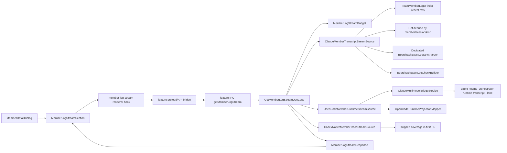

# Member Log Stream V2 Implementation Plan

## Goal

Сделать в попапе участника новый формат логов, визуально и поведенчески близкий к `Task Log Stream`, но со scope "все доступные логи выбранного участника", а не "логи конкретной задачи".

Ключевой продуктовый ответ:

- Показываем логи только выбранного участника, а не всех агентов команды.
- Если у выбранного участника есть безопасно доступные Claude/OpenCode/Codex источники, они могут быть показаны в одном stream.
- Вариант 2 не обещает абсолютно полный provider-wide audit log для всех runtime. Для этого нужен вариант 3.
- Старый `MemberLogsTab` не удаляем на первом шаге. Он остается fallback, чтобы снизить риск регрессий.

## Decision

Выбран вариант 2:

🎯 8.5   🛡️ 8.5   🧠 6  
Оценка изменений: примерно 1500-2300 строк вместе с тестами, если делать canonical feature slice, аккуратную source-port архитектуру, dedupe cumulative subagent snapshots, вынести OpenCode projection mapper, покрыть fallback boundary, добавить member tracking activation, OpenCode/renderer in-flight protection и аккуратно отделить provider-neutral message hygiene от board/task sanitization.

Почему не frontend-only:

- Старый `MemberLogsTab` работает с session summaries и раскрытием `MemberExecutionLog`.
- Новый stream требует готовый normalized response: participants, segments, chunks, source metadata.
- Делать это в renderer означало бы тащить parsing/composition туда, где уже нет нужных main-process primitives и где выше риск UI freeze.

Почему не вариант 3:

- Полный member-wide Codex native stream требует отдельного trace index/read path по owner/member без taskId.
- Полный OpenCode multi-lane stream требует либо безопасного list-all-lanes contract, либо явного lane resolution в desktop.
- Это полезно, но заметно повышает риск смешать чужие логи или показать неполную картину как полную.

## Options Considered

| Вариант | Оценка | Пример LOC | Что делает | Главный риск |
| --- | --- | ---: | --- | --- |
| 1. Frontend-only reuse старых member logs | 🎯 6 🛡️ 5 🧠 3 | 150-250 | Renderer берет `getMemberLogs` и пытается отрисовать похоже на stream | Старый формат данных не равен stream, легко получить UI-псевдопаритет без реального качества |
| 2. Canonical feature slice плюс source ports | 🎯 8.5 🛡️ 9 🧠 7 | 1500-2300 | `src/features/member-log-stream` owns contracts/core/source ports/renderer, app shell only integrates it | Нужно держать provider sources маленькими, dedupe cumulative logs, жестко ограничить response и не мигрировать task logs в этом PR |
| 3. Maximum provider/runtime log stream | 🎯 6 🛡️ 6 🧠 9 | 1000-1800+ | Отдельный provider-wide member log index для Claude/OpenCode/Codex | Высокий риск ошибок в Codex/OpenCode attribution и долгий rollout |

## Current Code Facts

Точки интеграции в `claude_team`:

- `src/renderer/components/team/members/MemberDetailDialog.tsx` сейчас показывает `<MemberLogsTab teamName={teamName} memberName={member.name} />`.
- `src/renderer/components/team/members/MemberLogsTab.tsx` вызывает `api.teams.getMemberLogs(...)` и рендерит старые session logs.
- `src/renderer/components/team/taskLogs/TaskLogStreamSection.tsx` вызывает `api.teams.getTaskLogStream(teamName, taskId)` и рендерит новый stream через `MemberExecutionLog`.
- `TaskLogStreamSection` only subscribes to `onTeamChange`; `TaskLogsPanel` separately enables `setTaskLogStreamTracking`. Member popup needs its own tracking activation.
- `TeamLogSourceTracker` tracks activity only while at least one consumer is active. Its consumer counts are per team and per consumer name, so member stream should add a semantic `member_log_stream` consumer instead of starting a separate watcher layer.
- `TaskLogStreamSection.normalizeResponse()` preserves only known task response fields, so a reused copy can drop member fields like `coverage`, `warnings`, `metadata`, `truncated`, `generatedAt` and `segment.source`.
- `BoardTaskLogParticipant` is actor identity, not source identity. Provider/session/lane labels for member logs must stay in `MemberLogStreamSegment.source`, not in fake provider-specific participants.
- `src/main/services/team/taskLogs/stream/BoardTaskLogStreamService.ts` возвращает `BoardTaskLogStreamResponse`.
- `src/shared/types/team.ts` уже содержит `BoardTaskLogParticipant`, `BoardTaskLogSegment`, `BoardTaskLogStreamResponse`.
- `src/shared/types/team.ts` уже содержит `TeamMemberSnapshot.providerBackendId`, `selectedFastMode`, `resolvedFastMode`, `laneId`, `laneKind`, `laneOwnerProviderId`, но `ResolvedTeamMember` пока не объявляет эти поля.
- `src/renderer/store/slices/teamSlice.ts` в `buildResolvedMember()` возвращает `{ ...snapshot, status, messageCount, lastActiveAt }`, поэтому runtime object уже несет эти поля. Это почти type-contract change, а не новая data mapping ветка.
- `src/main/services/team/TeamMemberLogsFinder.ts` уже умеет искать member logs и содержит attribution precedence.
- `src/main/services/team/taskLogs/exact/BoardTaskExactLogStrictParser.ts` умеет strict-parse JSONL transcript files с cache и concurrency.
- `BoardTaskExactLogStrictParser.parseFiles()` вызывает `cache.retainOnly(uniquePaths)`, а underlying `BoardTaskActivityParseCache.retainOnly()` удаляет не только parsed cache, но и `inFlight` entries вне текущего набора файлов. Поэтому parser instance нельзя шарить между task stream и member stream без изменения cache ownership.
- `src/main/services/team/taskLogs/exact/BoardTaskExactLogChunkBuilder.ts` строит `EnhancedChunk[]`, которые уже понимает `MemberExecutionLog`.
- `src/main/services/runtime/ClaudeMultimodelBridgeService.ts` уже имеет `getOpenCodeTranscript(...)`, но пока без `laneId`.
- `CodexNativeTraceReader.readTaskRuns()` is task-keyed and scans `processed/<team>/<task>` plus optional `incoming/<team>/<task>`, then caps recent candidates before parsing. It has no member-wide owner index.
- `CodexNativeTraceProjector` only projects native tool events (`toolSource === 'native'`), not full Codex chat/runtime history.
- `src/main/ipc/teams.ts`, `src/preload/index.ts`, `src/preload/constants/ipcChannels.ts` уже имеют аналогичные handlers/channels для `getTaskLogStream`.
- `initializeTeamHandlers()` сейчас принимает много optional dependencies позиционно, и `test/main/ipc/teams.test.ts` передает их в этом порядке. Новую feature нельзя встраивать туда как очередной owned team service.
- `src/renderer/api/httpClient.ts` имеет browser-mode stub для `getTaskLogStream`; для member stream нужен такой же safe fallback, иначе можно сломать browser compile/test path.
- `findRecentMemberLogFileRefsByMember()` сейчас принимает третий аргумент только как numeric/null `mtimeSinceMs`, не object options; не передает `forceRefresh`; добавляет lead transcript до mtime filter; и возвращает refs без `kind`/`sizeBytes`/`messageCount`.
- В OpenCode сейчас есть два mapper-like `toParsedMessage()`: richer private mapper в `OpenCodeTaskLogStreamSource` и более lossy mapper в `OpenCodeTaskStallEvidenceSource`. Канонический источник для shared mapper - task stream source, не stall monitor.

Дополнительный deep research зафиксирован в:

- `docs/team-management/member-log-stream-v2-research-addendum.md`.

Самые важные уточнения оттуда:

- для Claude/member transcript использовать `TeamMemberLogsFinder.findRecentMemberLogFileRefsByMember()`, не `findMemberLogPaths()`;
- для OpenCode передавать `laneId` из member snapshot в `getMemberLogStream` options;
- `ResolvedTeamMember` type нужно явно расширить runtime/lane fields: `providerBackendId`, `selectedFastMode`, `resolvedFastMode`, `laneId`, `laneKind`, `laneOwnerProviderId`;
- Codex native в варианте 2 должен быть skipped или partial native-tool trace, но не "полный Codex log";
- member stream source stack должен иметь отдельный `BoardTaskExactLogStrictParser`, потому что `parseFiles().retainOnly()` вычищает cache и `inFlight` parse entries вне текущего набора файлов.
- архитектурно лучше выбрать canonical feature slice: `src/features/member-log-stream` owns contracts/core/application/source ports/renderer, while existing team surfaces remain thin app-shell integration points;
- response нужно ограничивать на backend: `maxTranscriptFiles=40`, `maxSegments=30`, `maxChunks=250`, `maxSourceMessages=1200`, `maxMessagesPerSegment=300`, `openCodeMessageLimit=400`;
- `laneId` нельзя валидировать как member name, нужен отдельный optional validator с поддержкой `secondary:opencode:<member>`.
- `findRecentMemberLogFileRefsByMember()` dedupe только by `filePath`, а cumulative subagent snapshots могут дублировать turn history;
- лучше расширить `MemberLogFileRef` optional `kind`/`sizeBytes` и dedupe subagent refs by `memberName + sessionId` до parse;
- OpenCode projection conversion сейчас private внутри task-specific source, поэтому нужен маленький shared mapper вместо копипаста.
- shared OpenCode mapper нужно извлекать из `OpenCodeTaskLogStreamSource`; mapper в stall monitor не подходит как источник, потому что он теряет часть content/tool-result семантики.
- `maxChunks` недостаточен как единственный budget, потому что один AI chunk может содержать сотни tool calls/messages;
- member popup live refresh должен слушать same-team `log-source-change` и `task-log-change`, но не `tool-activity`.
- `setMemberLogStreamTracking()` should map to a new `TeamLogSourceTracker` consumer `member_log_stream`. Reusing the task-named API would work technically but creates semantic coupling.
- Codex native member stream remains skipped in first PR because current trace reader is task-first and current projector is native-tool-only.
- новый IPC handler нужно регистрировать feature-owned способом и не сдвигать existing positional dependencies в `initializeTeamHandlers()`;
- browser-mode API fallback должен возвращать полный empty `MemberLogStreamResponse`, а не бросать ошибку.

Точки интеграции в orchestrator:

- `runtime transcript` уже принимает `--team`, `--member`, `--lane`, `--projection-only`, `--limit`.
- `resolveOpenCodeSessionRecordForCli()` специально требует `--lane`, если есть несколько session records для одного `team/member`.
- Поэтому orchestrator менять кодом не нужно для варианта 2, если desktop начнет передавать `laneId` там, где он надежно известен.

## Target User Experience

В попапе участника раздел `Logs` должен выглядеть как новый stream:

- header остается понятным для member popup: `Logs`, не `Task Log Stream`;
- визуальный формат chunks, tool calls, message blocks и spacing должен быть как в `Task Log Stream`;
- описание source не должно говорить "Task-scoped";
- при пустом stream показываем спокойный empty state;
- при ошибке нового stream показываем fallback-кнопку или inline fallback на старый `MemberLogsTab`;
- для одного участника chips обычно не нужны;
- если у участника несколько sessions/lanes, segment headers должны оставаться видимыми, чтобы не превратить разные сессии в один непрозрачный блок.

⚠️ Важное поведение: stream не должен показывать "логи всех агентов вместе". Он показывает только выбранного member. Если внутри выбранного member есть разные provider/runtime источники, они могут быть объединены только после безопасной attribution/resolution.

## Target Architecture



Main-process feature adapters own source discovery, parsing, chunking, cache, provider fallback, response budget and truncation semantics. Renderer feature code owns loading state, visual rendering, source text and fallback UI.

🧭 Architecture decision: create a canonical `src/features/member-log-stream` slice in the first implementation. This feature spans process boundaries, owns merge/budget/provider policy, needs transport wiring and has a provider roadmap, so it matches `docs/FEATURE_ARCHITECTURE_STANDARD.md`.

Compatibility rule:

- do not migrate existing task log stream or legacy `MemberLogsTab` in this PR;
- app shell may keep small compatibility methods in `api.teams` if that is the least disruptive integration point, but those methods should delegate to feature-owned contracts/channels/use case;
- outside callers import only feature public entrypoints: `@features/member-log-stream/contracts`, `@features/member-log-stream/main`, `@features/member-log-stream/preload`, `@features/member-log-stream/renderer`;
- provider logic must live behind source ports, not in IPC handlers or React components.

Expected feature layout:

```text
src/features/member-log-stream/
  contracts/
    api.ts
    channels.ts
    dto.ts
    index.ts
    normalize.ts
  core/
    domain/
      policies/
      models/
    application/
      ports/
      use-cases/
  main/
    composition/
    adapters/
      input/ipc/
      output/sources/
      output/presenters/
    infrastructure/
  preload/
  renderer/
    adapters/
    hooks/
    ui/
    utils/
```

## Architecture Compliance Checklist

This feature must follow `docs/FEATURE_ARCHITECTURE_STANDARD.md` exactly enough to be reviewable by structure, imports and tests.

Clean Architecture mapping:

- `contracts/`: `MemberLogStreamResponse`, request options, API fragment, IPC channels and normalize helpers only.
- `core/domain/`: pure policies for merge order, dedupe keys, source coverage, truncation decisions and render-safe source metadata.
- `core/application/`: `GetMemberLogStreamUseCase`, `SetMemberLogStreamTrackingUseCase`, source ports, cache/clock/logger ports and budget models.
- `main/adapters/input/ipc/`: validate IPC input, reject unknown option keys, call use cases and normalize IPC output.
- `main/adapters/output/sources/`: Claude/OpenCode/Codex source adapters that implement `MemberLogStreamSource`.
- `main/infrastructure/`: TTL/in-flight cache helpers, parser wrappers, bridge/runtime clients and filesystem-specific helpers.
- `main/composition/`: `createMemberLogStreamFeature(...)` wires dependencies and exposes a small facade.
- `preload/`: `createMemberLogStreamBridge(...)` only invokes feature channels and depends on contracts.
- `renderer/hooks/`: loading, tracking, team-change subscription, reload coalescing and fallback state.
- `renderer/adapters/`: DTO-to-view mapping and small renderer-only normalization.
- `renderer/ui/`: presentational components only, no store/API/Electron access.

Dependency direction:

- core/domain imports no process, framework, adapter or infrastructure code.
- core/application depends on domain models and ports, not on main/preload/renderer.
- main adapters depend inward on core/application and contracts.
- renderer UI depends on contracts/view models and local props only.
- app shell imports only public feature entrypoints.
- `src/main/ipc/teams.ts`, `src/preload/index.ts` and `src/renderer/components/team/members/MemberDetailDialog.tsx` may integrate the feature, but must not own member stream policy.

SOLID guardrails:

- SRP: one class/module has one reason to change. Provider IO changes source adapters; merge/budget changes core policies/use case; transport changes IPC/preload; visual changes renderer UI.
- OCP: adding `CodexPartialMemberTraceSource` later means adding a new source adapter and registering it, not changing renderer or the use case switch logic.
- LSP: every `MemberLogStreamSource` must return the same result contract with `included`, `partial` or `skipped`; no adapter should throw for expected provider absence.
- ISP: keep narrow ports: source loading, tracking activation, clock/logger/cache. Do not pass `TeamDataService` or renderer member objects through core.
- DIP: use cases depend on source/cache/logger ports. Concrete `TeamMemberLogsFinder`, `ClaudeMultimodelBridgeService`, parsers and trace readers stay in main adapters/infrastructure.

DRY guardrails:

- Reuse the stream renderer through a public `@features/member-log-stream/renderer` entrypoint instead of copying `TaskLogStreamSection`.
- Extract the OpenCode projection mapper from `OpenCodeTaskLogStreamSource` once and reuse it for task/member streams.
- Extract provider-neutral message hygiene helpers once, but keep board/task JSON cleanup scoped to task logs.
- Do not duplicate DTOs in `src/shared/types/team.ts` and feature contracts. Feature contracts are the owner.
- Do not duplicate feature API methods across `api.teams` and feature bridge unless the `api.teams` method is a thin compatibility delegate.

Lint guardrails:

- The repo already has generic feature boundary rules in `eslint.config.js` for `src/features/*`.
- If implementation needs stricter member-log-stream-specific messages, mirror the `recent-projects` feature-specific guard rails.
- Targeted verification should include `pnpm exec eslint src/features/member-log-stream --cache --cache-location .eslintcache --cache-strategy content` plus full `pnpm lint` before merge.

### Project Standard Traceability Matrix

This matrix is the implementation checklist for `CLAUDE.md`, `docs/FEATURE_ARCHITECTURE_STANDARD.md`, existing `eslint.config.js` feature rules and the `src/features/recent-projects` reference slice.

| Standard requirement | Member-log-stream implementation rule | Verification |
| --- | --- | --- |
| New medium/large cross-process features live in `src/features/<feature-name>` | Create `src/features/member-log-stream` and keep legacy team files as integration points only | `rg "@features/member-log-stream" src/main src/preload src/renderer` shows public entrypoint imports only |
| `contracts/` owns cross-process API | DTOs, API fragment types, channel constants and normalize helpers live only in feature contracts | No duplicated member stream DTOs in `src/shared/types/team.ts`; contracts tests cover fallback shape |
| `core/domain/` is pure | Merge order, dedupe keys, coverage state, budget/truncation policy and source metadata are pure functions/models | Domain tests plus `feature-core-domain-guards` |
| `core/application/` owns use cases and ports | `GetMemberLogStreamUseCase`, `SetMemberLogStreamTrackingUseCase`, source/cache/clock/logger/tracking ports | Use-case tests with fake ports; no Electron, Fastify, React, Zustand or child process imports |
| `main/adapters/input/` owns transport translation | IPC adapter validates unknown option keys, exact optional `laneId`, response normalization and fail-soft errors | Feature IPC tests register/remove feature channels without `initializeTeamHandlers()` ownership |
| `main/adapters/output/` owns source adapters | Claude/OpenCode/Codex adapters implement `MemberLogStreamSource` and translate runtime data to core models | Adapter mapping tests for Claude refs, OpenCode projection and Codex skipped coverage |
| `main/infrastructure/` owns concrete IO | Parser wrappers, runtime bridge clients, TTL/in-flight cache and filesystem helpers stay outside core | Source adapters are thin around infrastructure helpers |
| `main/composition/` is the composition root | `createMemberLogStreamFeature(...)` wires sources, use cases, cache, logger and tracker facade | App main imports `@features/member-log-stream/main`, not feature internals |
| `preload/` is a thin bridge | `createMemberLogStreamBridge()` invokes feature channels and depends on contracts | Preload does not import main composition or renderer code |
| `renderer/hooks/` orchestrate interaction | Loading, tracking activation, reload coalescing, fallback and team-change cleanup live in hooks | Hook tests cover mount/unmount, team changes, reload coalescing and browser fallback |
| `renderer/ui/` is presentational | `ExecutionLogStreamView` and section UI receive props/view models only | `feature-renderer-ui-guards`; no imports from `@renderer/api`, store, Electron or main |
| Public entrypoints only | External code imports only `@features/member-log-stream/contracts`, `/main`, `/preload`, `/renderer` | `feature-public-entrypoints-only` and targeted eslint |
| Reference feature shape matches `recent-projects` | Public indexes mirror the reference pattern: contracts/main/preload/renderer expose only supported surface | Review tree against `src/features/recent-projects` before implementation PR |

## Public API And Types

Add feature-owned contracts in `src/features/member-log-stream/contracts`, not by mutating task stream semantics:

```ts
export type MemberLogStreamProvider = 'claude_transcript' | 'opencode_runtime' | 'codex_native_trace';
export type MemberLogStreamSource =
  | 'member_transcript'
  | 'member_mixed_runtime'
  | 'member_runtime_only'
  | 'member_empty';

export interface MemberLogStreamCoverage {
  provider: MemberLogStreamProvider;
  status: 'included' | 'partial' | 'skipped';
  reason?: string;
}

export interface MemberLogStreamWarning {
  code:
    | 'opencode_ambiguous_lane'
    | 'opencode_missing_runtime_session'
    | 'opencode_runtime_unavailable'
    | 'opencode_runtime_timeout'
    | 'codex_member_wide_not_supported'
    | 'large_log_window_limited'
    | 'segment_message_window_limited'
    | 'message_content_limited'
    | 'unreadable_transcript_file';
  message: string;
}

export interface MemberLogStreamMetadata {
  scannedTranscriptFileCount: number;
  includedTranscriptFileCount: number;
  droppedSegmentCount: number;
  droppedChunkCount: number;
  droppedMessageCount: number;
}

export interface MemberLogStreamSegmentSource {
  provider: MemberLogStreamProvider;
  label: string;
  sessionId?: string;
  laneId?: string;
  messageCount?: number;
  truncated?: boolean;
}

export interface MemberLogStreamSegment extends BoardTaskLogSegment {
  source: MemberLogStreamSegmentSource;
}

export interface MemberLogStreamResponse {
  participants: BoardTaskLogParticipant[];
  defaultFilter: 'all' | string;
  segments: MemberLogStreamSegment[];
  source: MemberLogStreamSource;
  coverage: MemberLogStreamCoverage[];
  warnings: MemberLogStreamWarning[];
  truncated: boolean;
  generatedAt: string;
  metadata: MemberLogStreamMetadata;
}
```

Important TS boundary:

- Do not make `MemberLogStreamResponse extends BoardTaskLogStreamResponse`.
- `BoardTaskLogStreamResponse.source` is a task-only union: `transcript`, OpenCode task fallback values and Codex task trace values.
- Reusing that response type would either reject member-specific source values or pollute task stream semantics with member values.
- Share the low-level render units instead: `BoardTaskLogParticipant`, `BoardTaskLogSegment` and `EnhancedChunk`.
- Prefer feature contracts for `MemberLogStreamResponse`; export them through `@features/member-log-stream/contracts`.
- If `src/shared/types/api.ts` needs a temporary compatibility reference for `api.teams`, import the feature contract type there or use a narrow adapter type. Do not duplicate DTO definitions in `src/shared/types/team.ts` and feature contracts.

Internal budget:

```ts
interface MemberLogStreamBudget {
  maxTranscriptFiles: number;
  maxSegments: number;
  maxChunks: number;
  maxSourceMessages: number;
  maxMessagesPerSegment: number;
  maxTotalContentChars: number;
  maxMessageContentChars: number;
  maxToolResultContentChars: number;
  openCodeMessageLimit: number;
  openCodeTimeoutMs: number;
}
```

Extend finder metadata in a backward-compatible way:

```ts
interface MemberLogFileRef {
  memberName: string;
  sessionId: string;
  filePath: string;
  mtimeMs: number;
  sizeBytes?: number;
  messageCount?: number;
  kind?: 'lead_session' | 'member_session' | 'subagent';
}
```

This is needed because cumulative subagent snapshots can duplicate history. Existing callers can ignore the optional fields.

Also adjust `findRecentMemberLogFileRefsByMember()` to include requested member names in the attribution `knownMembers` set. Syntax-only IPC validation is not enough for removed or historical members if they are no longer present in current config/meta/inbox.

Do this without breaking existing finder callers. `TeamMemberRuntimeAdvisoryService` and existing tests already pass the third argument as positional `mtimeSinceMs`, including numeric values and `null`.

```ts
type FindRecentMemberLogFileRefsOptions =
  | number
  | null
  | {
      mtimeSinceMs?: number | null;
      forceRefresh?: boolean;
    };
```

Rules:

- numeric third arg still means `mtimeSinceMs`;
- `null` still means no mtime window;
- object form is added for member stream and can pass `forceRefresh`;
- only object form should bypass `discoverProjectSessions()` cache;
- `mtimeSinceMs` must apply to lead transcript refs as well as member/subagent candidates;
- do not migrate advisory callers in the same PR unless needed by tests.

Recommended default:

```ts
const DEFAULT_MEMBER_LOG_STREAM_BUDGET = {
  maxTranscriptFiles: 40,
  maxSegments: 30,
  maxChunks: 250,
  maxSourceMessages: 1200,
  maxMessagesPerSegment: 300,
  maxTotalContentChars: 800_000,
  maxMessageContentChars: 80_000,
  maxToolResultContentChars: 120_000,
  openCodeMessageLimit: 400,
  openCodeTimeoutMs: 5_000,
};
```

Add IPC/preload API:

```ts
getMemberLogStream(
  teamName: string,
  memberName: string,
  options?: {
    limitSegments?: number;
    since?: string;
    laneId?: string;
    forceRefresh?: boolean;
  }
): Promise<MemberLogStreamResponse>
```

Add member stream tracking API:

```ts
setMemberLogStreamTracking(teamName: string, enabled: boolean): Promise<void>
```

Why this is separate from `setTaskLogStreamTracking()`:

- `TaskLogStreamSection` listens to `onTeamChange`, but `TaskLogsPanel` is what enables `TeamLogSourceTracker`.
- Member popup has no `TaskLogsPanel` wrapper.
- Reusing the task-named method from member UI would work mechanically, but it creates semantic drift.
- A dedicated member tracking API can map to the same underlying watcher with a separate `member_log_stream` consumer count.

Default behavior:

- `limitSegments` defaults to 30 and is clamped to `1..80`.
- `since` is optional and only used as a performance hint, but invalid dates should be rejected by IPC validation.
- First renderer implementation should not pass `since` for background reload replacement. Without an explicit incremental-merge contract, replacing the visible stream with a since-filtered partial response can hide older segments.
- `laneId` is optional and used only for safe OpenCode runtime projection.
- `forceRefresh` is optional and should be used only by renderer background reloads after `log-source-change`.
- Handler validates `teamName` and `memberName`.
- Handler validates `laneId` separately from `memberName`, because valid runtime lanes can contain `:`.
- Handler must trim but otherwise preserve `laneId`; do not lowercase or rewrite it.
- Handler validates `forceRefresh` as boolean when present.
- Put new validators in `src/main/ipc/guards.ts` as exported functions, or define local validator result types. `ValidationResult` is currently not exported from `guards.ts`.
- Handler should not reject deleted/removed members just because they are absent from current config. Old logs are still useful.
- Handler rejects unknown option keys, matching the stricter `TEAM_GET_DATA` options policy.
- Tracking handler validates `teamName` and boolean `enabled`.

Suggested lane validator:

```ts
export function validateOptionalRuntimeLaneId(value: unknown) {
  if (value == null) return { valid: true, value: undefined };
  if (typeof value !== 'string') return { valid: false, error: 'laneId must be a string' };
  const trimmed = value.trim();
  if (!trimmed) return { valid: true, value: undefined };
  if (trimmed.length > 256) return { valid: false, error: 'laneId exceeds max length (256)' };
  if (/[\0-\x1F\x7F/\\]/.test(trimmed)) {
    return { valid: false, error: 'laneId contains invalid characters' };
  }
  return { valid: true, value: trimmed };
}
```

## Main Process Implementation

Create the application use case and source ports inside `src/features/member-log-stream/core/application`. Main-process source adapters live in `src/features/member-log-stream/main/adapters/output/sources`.

Existing task log stream services can still be reused as infrastructure dependencies where appropriate, but member stream orchestration must not live inside `src/main/ipc/teams.ts` or a monolithic `src/main/services/team` class.

Recommended internal source-port interface:

```ts
interface MemberLogStreamSourceInput {
  teamName: string;
  memberName: string;
  laneId?: string;
  budget: MemberLogStreamBudget;
  sinceMs?: number | null;
  forceRefresh?: boolean;
}

interface MemberLogStreamSourceResult {
  provider: MemberLogStreamProvider;
  status: 'included' | 'partial' | 'skipped';
  segments: MemberLogStreamSegment[];
  warnings: MemberLogStreamWarning[];
}

interface MemberLogStreamSource {
  readonly provider: MemberLogStreamProvider;
  load(input: MemberLogStreamSourceInput): Promise<MemberLogStreamSourceResult>;
}
```

First PR sources:

- `ClaudeMemberTranscriptStreamSource`;
- `OpenCodeMemberRuntimeStreamSource`;
- `CodexNativeMemberTraceStreamSource`, but only as skipped coverage adapter in first PR.

Recommended responsibilities:

- service normalizes already-validated options and budget;
- source classes discover and load their provider/runtime data;
- service merges source results in deterministic provider order;
- service calls provider sources fail-soft through `Promise.allSettled()` or equivalent per-source try/catch;
- service joins identical active requests by team/member/lane/limit/since key, with no long-lived response cache in the first PR;
- service enforces `maxSourceMessages`, `maxMessagesPerSegment`, `maxSegments` and `maxChunks`;
- service enforces content-size budgets before chunk build, because one huge tool result can freeze the renderer even when message count is low;
- service uses provider-neutral `ParsedMessage` hygiene/truncation helpers and must not apply task/board-specific JSON payload cleanup across all member logs;
- service sorts segments by timestamp ascending in the response;
- service normalizes participant key to selected member;
- service returns structured coverage/warnings instead of throwing for partial provider failures.

Claude source responsibilities:

- discover transcript files for selected member through `TeamMemberLogsFinder.findRecentMemberLogFileRefsByMember()`;
- extend/use optional ref metadata `kind` and `sizeBytes`;
- ensure finder `mtimeSinceMs` filters lead transcript refs too, not only collected member/subagent candidates;
- dedupe cumulative subagent refs by `memberName + sessionId`, keeping largest `messageCount` when available, otherwise largest `sizeBytes`, then newest `mtimeMs`;
- do not parse every candidate just to compute `messageCount`; use `messageCount` only when existing attribution logic already knows it cheaply, otherwise use `sizeBytes` as the cumulative snapshot proxy;
- cap candidate refs by `maxTranscriptFiles` after dedupe;
- strict-parse only candidate files;
- trim very large parsed files with pair-aware message truncation before chunk build;
- trim or summarize oversized message content/tool-result content before chunk build, preserving tool ids and result pairing;
- do not reuse `sanitizeJsonLikeToolResultPayloads()` wholesale for member stream, because board/task-specific sanitization can hide legitimate JSON tool outputs;
- build one segment per session/log file by default;
- populate segment `source` metadata with provider/session/message counts, but never absolute file paths;
- include sidechain chunks through existing chunk builder.

OpenCode source responsibilities:

- use `laneId` when present;
- call `ClaudeMultimodelBridgeService.getOpenCodeTranscript()` with `--lane`, `--limit` and a popup-specific timeout;
- keep a small source-local TTL cache and `inFlight` join keyed by team/member/lane/limit, matching the task source pattern closely enough to avoid repeated bridge calls;
- treat ambiguous lane as skipped provider with warning;
- treat runtime timeout/binary errors as skipped or partial provider warnings, not whole-popup failure;
- map projection output into `MemberLogStreamSegment[]` through extracted `OpenCodeRuntimeProjectionMapper`.

Codex source responsibilities in first PR:

- return coverage status `skipped`;
- add warning `codex_member_wide_not_supported` only when useful for diagnostics;
- do not scan all Codex trace directories yet.
- do not call `CodexNativeTraceReader.readTaskRuns()` from member stream, because it requires task ids and returns only task-keyed native tool traces.
- if a follow-up adds partial Codex support, call it `codex_native_trace_partial` and cap `maxTaskDirs`, `maxTraceCandidates` and `maxTraceRuns` before parsing.

Important implementation constraints:

- Do not reuse one `BoardTaskExactLogStrictParser` instance between task stream and member stream unless cache ownership is changed. `parseFiles()` currently calls `retainOnly()`, so sharing the parser can evict both task-stream parsed cache and task-stream `inFlight` parse dedupe.
- Do not use `findMemberLogPaths()` as the main source. It lacks `sessionId`, `mtimeMs`, and sorted recent refs.
- Do not directly import renderer code into main.
- Do not manually construct `EnhancedChunk` if `BoardTaskExactLogChunkBuilder` can build it.
- Do not use task-specific filtering rules for member stream. Member stream scope is source/member attribution, not task interval.
- Do not reuse `CodexNativeTaskLogStreamSource` for member logs. It is task-owner scoped and relies on `readTaskRuns({ taskIds })`.
- Do not use `OpenCodeTaskLogStreamSource` directly for member logs. It is task-window and task-marker aware.
- Do not copy `toParsedMessage()` into member source. Extract generic OpenCode projection mapping from `OpenCodeTaskLogStreamSource` and let both task/member sources import it. Do not base the shared mapper on `OpenCodeTaskStallEvidenceSource`, because that mapper is intentionally narrower and does not preserve all task-stream rendering data.
- Keep main handler fail-soft. A single unreadable transcript file should become a warning, not a failed popup.
- Keep response bounded. Any cap hit sets `truncated: true` and warning `large_log_window_limited`.
- If a single file/session exceeds message budget, use `segment_message_window_limited` and drop the oldest message window before chunk build.
- Do not add member stream policy or service ownership to `initializeTeamHandlers()`. The feature should have its own main composition and IPC registration path.

Segment rules:

- Segment id should be stable across refreshes: include provider, normalized team/member, session id or hashed file fingerprint, first timestamp.
- Do not put absolute file paths in segment ids.
- Segment timestamps come from first/last parsed message.
- Empty parsed files are ignored.
- Very large files are parsed through existing stream parser, not loaded wholesale in renderer.
- If chunks are empty after normalization, skip segment.
- If total chunks exceed `maxChunks`, keep recent useful chunks and mark response truncated.
- Do not text-truncate inside `EnhancedChunk` in first PR.
- Do not leave orphan tool results after message trimming. Keep matching assistant tool call by `sourceToolUseID`, or drop the orphan result.
- Do not synthesize fake `Process` entries for OpenCode. Its projection should render through normal tool/output chunks.
- Do not rely on collapsed UI state for safety. `MemberExecutionLog` keeps AI groups expanded by default and expanded tool rows can render full content.

## Transport And Composition Integration

This part is easy to underestimate. The feature is not only a service and renderer component; it must pass through feature contracts, preload, browser fallback and IPC registration without disturbing existing task-log handlers.

Required transport edits:

- Add feature channel constants in `src/features/member-log-stream/contracts/channels.ts`, for example `MEMBER_LOG_STREAM_GET` and `MEMBER_LOG_STREAM_SET_TRACKING`.
- Prefer feature channel names such as `member-log-stream:getMemberLogStream` over new `TEAM_*` constants. If a compatibility alias is needed, it should still point to feature-owned contracts.
- Add `MemberLogStreamApi` in `src/features/member-log-stream/contracts/api.ts`.
- Add `createMemberLogStreamBridge()` in `src/features/member-log-stream/preload`.
- Add feature IPC registration in `src/features/member-log-stream/main/adapters/input/ipc/registerMemberLogStreamIpc.ts`.
- Register/remove feature IPC handlers from app main composition through `@features/member-log-stream/main`, not through `registerTeamHandlers()`.
- Add `createMemberLogStreamFeature(...)` in `src/features/member-log-stream/main/composition`.
- Instantiate the feature facade in `src/main/index.ts` or the existing main composition root after finder/parser/bridge/tracker dependencies are available.
- Expose renderer access through a feature-friendly API path, for example `api.memberLogStream`. If `api.teams.getMemberLogStream(...)` is kept for compatibility, it must be a thin delegate to the feature API.
- Add browser-mode fallback returning a complete empty `MemberLogStreamResponse`, not `null` and not a thrown error.
- Add browser-mode no-op fallback for member stream tracking.
- Add `member_log_stream` to `TeamLogSourceTrackingConsumer`.
- Map feature tracking enable to `TeamLogSourceTracker.enableTracking(teamName, 'member_log_stream')`.
- Map feature tracking disable to `TeamLogSourceTracker.disableTracking(teamName, 'member_log_stream')`.
- Keep the tracker consumer team-scoped, not member-scoped. `TeamLogSourceTracker` already scopes watch targets by team sessions and uses reference counts, so multiple open member popups for the same team should increment/decrement the same `member_log_stream` consumer count.
- Cleanup must run for the exact team used on mount. If `teamName` changes while the dialog stays mounted, disable tracking for the previous team before enabling it for the next team.

Important integration rule:

🎯 8.5   🛡️ 9   🧠 4  
Примерно 80-180 LOC.

Use feature-owned composition:

```ts
const memberLogStreamFeature = createMemberLogStreamFeature({
  logsFinder,
  logSourceTracker,
  runtimeBridge,
  logger,
});

registerMemberLogStreamIpc(ipcMain, memberLogStreamFeature);
```

Do not insert member stream dependencies into `initializeTeamHandlers()`. Current tests and likely other setup code pass optional team services positionally; adding this feature there would create a false ownership boundary and risk confusing service assignment failures.

Alternative:

🎯 7   🛡️ 9   🧠 7  
Примерно 250-450 LOC.

Refactor all existing `initializeTeamHandlers()` dependencies to a dependency object. This is cleaner long-term for legacy team IPC, but it is a separate IPC hygiene PR and should not be bundled unless the implementation intentionally pays that cost.

Browser fallback shape:

```ts
const emptyMemberLogStreamResponse: MemberLogStreamResponse = {
  participants: [],
  defaultFilter: 'all',
  segments: [],
  source: 'member_empty',
  coverage: [],
  warnings: [],
  truncated: false,
  generatedAt: new Date().toISOString(),
  metadata: {
    scannedTranscriptFileCount: 0,
    includedTranscriptFileCount: 0,
    droppedSegmentCount: 0,
    droppedChunkCount: 0,
    droppedMessageCount: 0,
  },
};
```

This keeps browser-mode tests honest while making it obvious that real stream loading is Electron-only.

## Renderer Implementation

Refactor the stream UI so `TaskLogStreamSection` is not copied wholesale.

Recommended shape:

- Extract a generic render-only component, for example `ExecutionLogStreamView`.
- It receives `title`, `description`, `stream`, `loading`, `error`, `emptyTitle`, `emptyDescription`, `teamName`, `forceSegmentHeaders`, `boundedHistoryNote`, and optional `buildSegmentRenderKey`.
- It must not import `api.teams`, `MemberLogsTab`, feature gates, provider sources or task/member loading hooks.
- It should receive already loaded `teamMembers` from the container, so pure view tests do not need the app store.
- `TaskLogStreamSection` keeps task-specific loading logic and task-specific descriptions.
- New `MemberLogStreamSection` owns member-specific loading logic and descriptions.
- `ExecutionLogStreamView` should be exported from `@features/member-log-stream/renderer` as a public render primitive if legacy `TaskLogStreamSection` needs to reuse it.
- `MemberDetailDialog` renders `MemberLogStreamSection` in the existing Logs tab area.
- `MemberLogsTab` remains available as fallback.
- Do not modify `MemberLogsTab` behavior in the first PR. It is also used by `ExecutionSessionsSection` in task logs, so changing it would widen the regression surface.
- Put the renderer feature-gate decision at the `MemberDetailDialog` Logs tab boundary. `MemberLogStreamSection` should not import or own the legacy `MemberLogsTab`.
- On first-load failure in the new stream, show the member stream error and an explicit legacy fallback panel below it. Do not silently replace the new stream with old logs, because that hides QA failures.
- Do not add virtualization in the first PR. `MemberExecutionLog` currently renders all groups, so protection must come from backend `maxSegments`/`maxChunks`.
- If `stream.truncated` is true or warning `large_log_window_limited` exists, show a short note that the popup is showing the recent bounded stream.
- Keep `normalizeResponse()` generic enough to convert every segment `chunks` through `asEnhancedChunkArray`.
- Generic response normalization must preserve the original stream shape with object spread. Do not reconstruct only task fields, because member-only metadata and `segment.source` are part of the contract.
- Keep participant identity actor-based. For a selected member, prefer one member participant plus per-segment `source` labels; do not create provider/session pseudo-participants just to show Claude/OpenCode/Codex labels.
- If source filtering is needed later, add a separate source filter. Do not overload participant chips with provider identity.
- Preserve current task-stream render-key behavior by default: `participantKey:firstChunkId`. This keeps expanded state stable when a task segment grows.
- For member stream, pass a source-aware render key based on safe `segment.id` plus first chunk id or start timestamp. This avoids collisions between providers/sessions for the same participant.
- Keep date handling consistent with task stream. Electron IPC should preserve `Date` objects through structured clone, but renderer tests and browser-mode stubs may use JSON-like strings.
- If `ExecutionLogStreamView` starts accepting JSON-like fixtures, add one shared chunk date normalizer instead of ad hoc `new Date()` calls in each component.
- Keep `describeStreamSource()` source-specific. Do not reuse task copy in member popup.

Member-specific UI text:

- Loading: `Loading member log stream...`
- Empty: `No log stream entries were found for this member yet.`
- Error: `Failed to load member log stream`
- Source description should mention member-scoped transcript/runtime logs, not task-scoped logs.

Live refresh:

- Enable feature tracking bridge while `MemberLogStreamSection` is mounted, then disable it on unmount. If `api.teams.setMemberLogStreamTracking` is kept for compatibility, it delegates to the feature bridge.
- Do not rely on `TaskLogsPanel` to keep `TeamLogSourceTracker` active. Member popup can be opened without task logs panel mounted.
- Do not call `setTaskLogStreamTracking()` from member UI. It would work technically, but it couples member stream lifecycle to task stream naming and tests.
- Reuse the existing team change subscription path for now. Do not create a second event bus in this PR.
- Reload on same-team `log-source-change` with `forceRefresh: true` to bypass the finder discovery cache.
- Reload on same-team `task-log-change`, because that is a log freshness signal and does not include memberName.
- Do not reload on `tool-activity`.
- Debounce 500-750ms, slightly more conservative than task stream.
- Background reload replaces the full bounded response. Do not request a `since`-only response from renderer until the service exposes a response merge contract.
- Coalesce duplicate background reloads while one member stream request is active. Keep at most one pending reload and run it after the active request settles.
- Background reload with `forceRefresh: true` should not start a parallel request if a request for the same member key is already running.
- Do not clear old stream on background refresh failure.

## Provider Coverage

| Provider/runtime | Variant 2 coverage | Reliability | Notes |
| --- | --- | --- | --- |
| Claude JSONL transcript | Good | 🛡️ 9 | Existing member attribution, recent refs, session ids and JSONL parsing are enough for first release |
| OpenCode runtime projection | Good if session/lane is resolvable | 🛡️ 8 | Safe when desktop passes `laneId`; ambiguous records are skipped, not guessed |
| Codex native trace | Explicitly skipped in first PR | 🛡️ 8 | Honest coverage is safer than partial trace presented as full Codex logs |

Claude transcript path:

- Use `TeamMemberLogsFinder` as the source locator.
- Do not re-implement member attribution in renderer.
- Trust existing precedence: process/team metadata over routing sender over teammate id over text mention.

OpenCode path:

- Extend `ClaudeMultimodelBridgeService.getOpenCodeTranscript()` params with optional `laneId`.
- If desktop knows a safe lane for the member, pass `--lane`. Renderer can pass `member.laneId` from `TeamMemberSnapshot` through `getMemberLogStream` options.
- If lane is unknown, calling without lane is allowed only as best-effort and must catch the orchestrator "pass --lane" error.
- On ambiguity, skip OpenCode runtime projection and add `opencode_ambiguous_lane` warning.
- Do not merge multiple OpenCode lanes unless a later orchestrator contract exposes safe list-by-member output.

Codex native path:

- Do not claim full member-wide Codex support in variant 2.
- Existing trace headers include `ownerName`, so partial member-wide native tool trace is possible as a follow-up.
- Current `CodexNativeTraceReader` is task-first and `CodexNativeTraceProjector` is native-tool-only.
- First PR should return coverage status `skipped` with `codex_member_wide_not_supported`.
- Optional second PR can add `readMemberRuns()` and label it as partial native tool trace, not full Codex logs.

## Edge Cases And Mitigations

1. Member removed from team.
   - Keep handler validation syntax-only for `memberName`.
   - Allow logs finder to search historical logs.
   - UI should still render if popup can open from historical data.

2. Member renamed.
   - Variant 2 uses exact current/historical name passed by caller.
   - Do not guess aliases.
   - Future work can add alias map from team config history.

3. Lead member.
   - Use existing `isLeadMember` and participant role conventions.
   - Do not assume lead means non-sidechain in every transcript.

4. Multiple members with similar names.
   - Do not use loose substring matching in the new service.
   - Rely on `TeamMemberLogsFinder` attribution signals.

5. OpenCode multiple lanes.
   - Treat as ambiguous unless lane is known.
   - Do not silently pick first record.

6. OpenCode runtime unavailable or slow.
   - Missing binary returns transcript-only stream with warning, not hard error.
   - Use popup-specific `openCodeTimeoutMs`.
   - Return Claude transcript segments even when OpenCode times out.
   - Add `opencode_runtime_timeout` warning.

7. Huge member history.
   - Limit transcript refs, source messages, per-segment messages, segment count and total chunks.
   - Limit content characters as well as message count.
   - Prefer most recent files first if finder supports mtime.
   - Expose warning `large_log_window_limited`.
   - Set `truncated: true`.
   - Avoid rendering thousands of chunks in one popup.

7.1 Huge single tool result or output.
    - A single parsed message can contain a massive tool result or markdown output.
    - Apply `maxMessageContentChars`, `maxToolResultContentChars` and `maxTotalContentChars` before chunk build.
    - Preserve tool call/result ids and replace truncated content with a clear bounded placeholder.
    - Add `message_content_limited` warning and set `truncated: true`.
    - Extract provider-neutral message hygiene helpers instead of applying board/task-specific JSON sanitization to every member log.
    - JSON-looking Bash/API outputs should remain visible unless they exceed content budget, in which case they are truncated, not blanked.

8. Partial or malformed JSONL.
   - Strict parser already skips invalid/unreadable records.
   - Service should continue with remaining files.

9. Empty logs.
   - Return `member_empty`, no exception.
   - UI empty state should not look like failure.

10. Provider duplication.
    - If OpenCode runtime projection duplicates transcript-derived entries, prefer transcript when there is a stable message uuid.
    - If no stable uuid, do not attempt risky fuzzy dedupe in first release.
    - Deduplicate cumulative Claude subagent snapshots before parse, using ref metadata.

11. Sorting across sessions.
    - Response sorted ascending.
    - Renderer may reverse for newest-first, matching task stream behavior.
    - Mixed provider segments should be sorted by timestamp, not provider priority.

12. Cache invalidation.
    - Cache key should include team, member, candidate file mtimes/sizes and runtime projection identity.
    - Do not keep stale stream after log-source-change event.
    - If no explicit service-level cache is added in first PR, document that dedicated parser/runtime caches are the only caches.
    - `TeamMemberLogsFinder` discovery cache has a 30s TTL, so member stream needs a force-refresh path after `log-source-change`.
    - OpenCode member runtime source should have its own short TTL and in-flight join so repeated live refreshes do not spawn duplicate `runtime transcript` calls.
    - `forceRefresh` may bypass completed OpenCode cache, but should still join an existing in-flight call for the same team/member/lane/limit.

13. Renderer memory pressure.
    - Keep `limitSegments` plus backend `maxChunks` and message budgets.
    - Avoid storing raw logs in React state.
    - Store only normalized stream response.
    - Defer virtualization until there is a real need for audit-sized popup history.

14. Old fallback hiding new bugs.
    - Fallback should be visible as fallback, not silently replace new stream in a way that masks errors during QA.

15. Browser mode API client.
    - `src/renderer/api/httpClient.ts` should add unavailable stub like existing `getTaskLogStream`.
    - Do not break browser-mode compile.

16. Unsafe or malformed `laneId`.
    - Do not validate with `validateMemberName`.
    - Allow colon-separated runtime lane ids.
    - Reject NUL/newline and oversized values.
    - Treat invalid `laneId` as IPC validation error, not as "no lane".

17. OpenCode mapper drift.
    - Do not duplicate projection message mapping in the new member source.
    - Extract generic mapper from `OpenCodeTaskLogStreamSource`.
    - Keep task marker/window filtering inside the task source.

18. Tool call/result split by trimming.
    - Truncate parsed messages before chunk build with pair-aware logic.
    - If a retained tool result has `sourceToolUseID`, retain the matching assistant tool call when possible.
    - If the matching call cannot fit the hard budget, drop the orphan result.

19. Live refresh noise.
    - Member stream cannot filter `task-log-change` by member because the event has no `memberName`.
    - Reload on same-team `task-log-change` only while popup is mounted and debounced.
    - Skip `tool-activity` reloads to avoid heavy parser churn.

20. Feature IPC ownership drift.
    - `initializeTeamHandlers()` has many optional dependencies passed positionally.
    - Adding member stream there would both risk positional service drift and put new feature policy in legacy team IPC.
    - Register member stream through feature-owned IPC/composition instead. Leave legacy dependency-object cleanup as a separate PR.

21. Browser mode fallback drift.
    - Browser mode does not support Electron IPC, but the renderer API still must satisfy the feature API.
    - Return a complete empty `MemberLogStreamResponse` from the feature/browser fallback path.
    - Add a small test or compile check so shared type changes do not break browser fallback.

22. Historical member not in current config.
    - `TeamMemberLogsFinder` attribution uses `knownMembers`.
    - If the requested member is removed from config/meta/inbox, attribution can miss old files.
    - Add requested member names into the finder attribution set for `findRecentMemberLogFileRefsByMember()`.

23. Mixed-provider segment headers.
    - Plain `BoardTaskLogSegment` has no provider/session label for renderer.
    - Use `MemberLogStreamSegment.source` metadata for safe labels.
    - Do not expose absolute transcript paths in segment metadata or warnings.

24. Path leakage through stable ids.
    - Segment ids are visible to renderer and can end up in test snapshots.
    - Use a short hash/fingerprint of `filePath + mtimeMs + sizeBytes`, not the absolute path itself.
    - Warnings should say counts/provider/session labels, not local filesystem paths.

25. Discovery cache stale after launch/log source changes.
    - Finder discovery cache can keep old session ids briefly.
    - Renderer should pass `forceRefresh: true` after same-team `log-source-change`.
    - Service should pass that through with object-form finder options: `{ mtimeSinceMs, forceRefresh }`.
    - For OpenCode runtime calls, keep source-local TTL/in-flight protection. `forceRefresh` should bypass completed cache only, not duplicate an active bridge call.

26. Validator placement/type drift.
    - `src/main/ipc/guards.ts` currently keeps `ValidationResult` local.
    - Prefer exporting concrete validators such as `validateOptionalRuntimeLaneId()` and `validateOptionalBooleanOption()`.
    - If validators stay local in `teams.ts`, avoid importing the private `ValidationResult` type.

27. Date object assumptions in renderer.
    - `groupTransformer` calls `.getTime()` on chunk/step dates.
    - Existing task stream relies on Electron structured clone preserving dates.
    - New shared tests should cover Date-shaped chunks and avoid accidentally feeding raw JSON date strings into `MemberExecutionLog`.
    - If JSON-like chunks are needed in tests or browser mode, add one shared `normalizeEnhancedChunkDates()` helper.

28. Fallback boundary drift.
    - `MemberLogsTab` is shared by the member popup and task `Execution Sessions`.
    - Changing `MemberLogsTab` itself can break task-log legacy browsing.
    - Keep the new-vs-old decision in `MemberDetailDialog` only.
    - Test renderer gate on/off at dialog level.

29. Hidden stream failure during QA.
    - If the new stream error silently switches to old logs, failures can ship unnoticed.
    - Show the error and a clearly labeled fallback.
    - Background refresh failures can preserve the previous good stream, but initial load failures should be visible.

30. Resolved member lane type drift.
    - `TeamMemberSnapshot` already has runtime/lane fields: `providerBackendId`, `selectedFastMode`, `resolvedFastMode`, `laneId`, `laneKind`, `laneOwnerProviderId`.
    - `ResolvedTeamMember` currently does not declare them, even though `buildResolvedMember()` spreads the snapshot.
    - Add explicit fields to the shared type instead of using casts in `MemberLogStreamSection`.
    - Do not add duplicate renderer mapping unless tests prove a real runtime gap.

31. OpenCode bridge call churn.
    - Live refresh can fire more than once while a popup is open.
    - Mirror the task OpenCode source pattern with a short TTL cache and `inFlight` join.
    - Cache both success and null briefly, and keep timeout warnings fail-soft.

32. Board/task sanitization leakage.
    - Task stream has private helpers that clean board-tool JSON payloads.
    - Member stream is wider and may legitimately contain JSON output from Bash/API tools.
    - Reuse only provider-neutral clone/prune/truncate helpers, or rename board-specific cleanup so it cannot be accidentally applied globally.

33. Finder third-arg compatibility drift.
    - `findRecentMemberLogFileRefsByMember()` already has numeric/null positional callers.
    - Adding `forceRefresh` as object-only third arg can break runtime advisory or live tests.
    - Add a compatibility parser that accepts `number`, `null` and `{ mtimeSinceMs, forceRefresh }`.
    - Member stream should use object form, existing advisory code can keep numeric/null form.

34. Lead transcript bypasses `mtimeSinceMs`.
    - Current recent-ref finder applies `mtimeSinceMs` to collected candidates, but lead transcript is pushed before that scan.
    - If selected member is lead and `since` is used as a performance window, old lead logs can be returned unexpectedly.
    - Apply the same mtime filter to lead transcript stat before pushing the lead ref.

35. Renderer duplicate reload pressure.
    - `TaskLogStreamSection` ignores stale responses with `requestSeqRef`, but still can start parallel IPC calls.
    - Member stream requests are heavier because they can parse many files and call OpenCode runtime transcript.
    - Coalesce active member stream loads in `MemberLogStreamSection`, and join identical active requests in `GetMemberLogStreamUseCase`.

36. Segment render key collision.
    - Task stream default render key uses `participantKey:firstChunkId` to preserve expanded state when a segment tail grows.
    - Member stream can have multiple providers/sessions for one participant, so that default can collide.
    - Keep the task default, but let member stream pass a source-aware `buildSegmentRenderKey`.

37. Live tracking not activated.
    - `TaskLogStreamSection` subscribes to `onTeamChange`, but `TaskLogsPanel` enables `setTaskLogStreamTracking`.
    - Member popup has no equivalent parent, so it can miss `task-log-change` and `log-source-change` events if no other UI consumer is active.
    - Add `setMemberLogStreamTracking()` and a `member_log_stream` tracker consumer.
    - Enable tracking only while `MemberLogStreamSection` is mounted and disable it on unmount.

38. IPC option typo drift.
    - Existing `TEAM_GET_DATA` rejects unknown option keys before dispatching.
    - If `getMemberLogStream` silently accepts unknown keys, typos in `laneId`, `since` or `forceRefresh` can create stale or ambiguous logs while tests still pass.
    - Use an allow-list: `limitSegments`, `since`, `laneId`, `forceRefresh`.
    - Return `Unknown getMemberLogStream option: ${key}` before calling the service.

39. Participant/source identity drift.
    - `BoardTaskLogParticipant` drives actor chips, color lookup and member labels.
    - If provider/session is encoded as participant identity, one selected member can appear as multiple people and filters become misleading.
    - Keep `participantKey` actor-based, for example `member:<normalizedName>` or existing lead/unknown conventions.
    - Put provider/session/lane details only in `MemberLogStreamSegment.source`.

40. Since-only reload hides older visible segments.
    - `since` is useful as a backend performance hint, but a since-filtered response is partial unless the API says otherwise.
    - Renderer background reload currently replaces state, it does not merge old and new segments.
    - First PR should do full bounded background reloads, with `forceRefresh` on `log-source-change`.
    - Use `since` only in tests/service paths where the expected partial semantics are explicit.

41. Parser `retainOnly()` in-flight eviction.
    - `BoardTaskExactLogStrictParser.parseFiles()` calls `retainOnly()` before parsing.
    - `BoardTaskActivityParseCache.retainOnly()` deletes `inFlight` entries outside the requested file set.
    - If task and member streams share a parser, one stream can remove the other's in-flight dedupe and cause duplicate reads or cache churn.
    - Treat parser instance ownership as per stream source stack. Do not inject the existing task parser into the member stream source stack.

42. Wrong OpenCode mapper source.
    - `OpenCodeTaskLogStreamSource.toParsedMessage()` preserves content blocks, sanitized display text, `toolUseResult`, `sourceToolUseID`, `sourceToolAssistantUUID`, `isMeta`, subtype and level.
    - `OpenCodeTaskStallEvidenceSource.toParsedMessage()` is narrower and maps non-string content to an empty array.
    - Extract the shared mapper from task stream source only; stall monitor migration can be a separate cleanup if needed.

43. Finder metadata overreach.
    - Adding `messageCount` to `MemberLogFileRef` is useful only when that value is already cheaply known from existing attribution records.
    - Parsing every candidate file inside the finder just to count messages would double the IO before the strict parser runs.
    - Keep finder metadata lightweight: `kind`, `sizeBytes`, `mtimeMs` and optional existing `messageCount`.

44. Tracking consumer leaks or semantic drift.
    - `TeamLogSourceTracker` keeps reference counts by team and consumer name.
    - Reusing `task_log_stream` from member popup is technically possible but makes task/member lifecycles indistinguishable in tests and diagnostics.
    - Add `member_log_stream` as a separate consumer and ensure every mount enable has a matching unmount or team-change disable.

45. Generic renderer view grows side effects.
    - `TaskLogStreamSection` currently owns fetch, debounce, stale-response protection and task copy.
    - If `ExecutionLogStreamView` imports `api.teams`, feature gates or `MemberLogsTab`, it stops being a reusable render primitive.
    - Keep the generic view pure: render normalized stream, participants, segment headers and state. Containers own loading, tracking and fallback.

46. Codex partial trace presented as complete.
    - `CodexNativeTraceReader` is task-keyed and `CodexNativeTraceProjector` keeps only native tool events.
    - Reusing the task source for member logs would either require a task id or scan all task dirs, and the result still would not be full Codex chat history.
    - First PR keeps Codex coverage `skipped`. A later partial trace must be explicitly labeled `codex_native_trace_partial`.

47. Runtime lane validation too strict or too loose.
    - `validateMemberName()` rejects `secondary:opencode:<member>` because of `:`.
    - Do not lowercase or rewrite `laneId`; orchestrator/session records may expect exact lane ids.
    - Add an optional lane validator that trims, accepts `primary` and colon-separated runtime lanes, rejects empty strings, NUL/newlines/control characters, path separators and length over 256.

48. DTO inheritance/source union drift.
    - `BoardTaskLogStreamResponse.source` is task-scoped and does not include member values.
    - Do not extend `BoardTaskLogStreamResponse` for member logs or broaden its `source` union.
    - Define standalone `MemberLogStreamResponse` with shared participant/segment primitives, then test that task stream source values stay unchanged.

49. Feature boundary drift.
    - The easiest regression is to put policy in `src/main/ipc/teams.ts`, preload glue or React containers because those files already exist.
    - Keep the feature-owned policy in `src/features/member-log-stream/core` and provider IO in feature main adapters.
    - App-shell files may register, delegate or mount the feature, but they must not know merge order, budgets, source coverage rules or provider-specific parsing details.

## Rollout And Feature Gates

Add separate gates:

- Main: `CLAUDE_TEAM_MEMBER_LOG_STREAM_READ_ENABLED`, default true.
- Renderer: `VITE_MEMBER_LOG_STREAM_UI_ENABLED`, default true.
- Put main gate in `src/features/member-log-stream/main` or feature contracts/helpers, following existing truthy/falsy parsing semantics.
- Put renderer gate in `src/features/member-log-stream/renderer` or a feature renderer helper. Do not read `import.meta.env` outside renderer code.

Fallback behavior:

- If main gate is off, handler returns empty response or unavailable result consistently.
- If renderer gate is off, `MemberDetailDialog` uses old `MemberLogsTab`.
- If new stream errors, show error plus old logs fallback.
- If task log `Execution Sessions` renders old session logs, it stays unchanged. It imports `MemberLogsTab` directly and should not be coupled to member stream rollout.

Rollback:

- Flip renderer gate off to restore old member logs UI.
- Flip main gate off if parsing causes unexpected load.
- No data migration needed.

## Testing Plan

Main-process tests:

- Core domain policy tests cover merge order, source coverage status, budget decisions, dedupe keys and DTO-safe source metadata without main/preload/renderer imports.
- Core application use-case tests inject fake `MemberLogStreamSource` ports, fake clock/logger/cache ports and verify fail-soft source behavior.
- Core application tests prove adding a new source adapter does not require changing renderer or transport code.
- `GetMemberLogStreamUseCase` returns empty stream for no files.
- It builds one or more segments from synthetic Claude JSONL files for selected member.
- It does not include logs attributed to another member.
- It skips unreadable/malformed files and records warnings.
- It respects `limitSegments`.
- It respects `maxTranscriptFiles`, `maxSegments` and `maxChunks`.
- It respects `maxSourceMessages` and `maxMessagesPerSegment`.
- It respects `maxTotalContentChars`, `maxMessageContentChars` and `maxToolResultContentChars`.
- It sets `truncated: true` and `large_log_window_limited` when budget is hit.
- It records `message_content_limited` when content budget is hit.
- It preserves JSON-looking tool output unless content budget requires truncation.
- It does not apply board/task-specific JSON payload sanitization globally.
- It records `segment_message_window_limited` when trimming one oversized segment.
- It preserves tool call/result pairs when trimming, or drops orphan results.
- It preserves tool ids and source ids when truncating oversized content.
- It dedupes cumulative subagent refs by member/session before parse.
- It keeps segment ids stable across repeated calls.
- It does not expose absolute file paths in segment ids, metadata or warnings.
- It does not share parser cache with task stream service.
- It uses a member-owned `BoardTaskExactLogStrictParser` so member parsing cannot call `retainOnly()` on the task stream parser or clear task `inFlight` entries.
- A task-stream parse in flight stays joined after a member-stream parse starts for a different file set.
- It handles removed member name without requiring current team membership.
- It augments finder attribution with requested member names for historical/removed members.
- `TeamMemberLogsFinder.findRecentMemberLogFileRefsByMember()` can return optional `kind` and `sizeBytes` without breaking existing callers.
- `TeamMemberLogsFinder.findRecentMemberLogFileRefsByMember()` does not parse candidate transcript files just to compute `messageCount`.
- `TeamMemberLogsFinder.findRecentMemberLogFileRefsByMember()` keeps legacy numeric/null third-arg behavior.
- `TeamMemberLogsFinder.findRecentMemberLogFileRefsByMember()` supports object options `{ mtimeSinceMs, forceRefresh }`.
- `TeamMemberLogsFinder.findRecentMemberLogFileRefsByMember()` passes `forceRefresh` to `discoverProjectSessions()`.
- `TeamMemberLogsFinder.findRecentMemberLogFileRefsByMember()` applies `mtimeSinceMs` to lead transcript refs.
- It merges source results in deterministic order.
- It joins identical active `GetMemberLogStreamUseCase` requests and does not add long-lived response cache.
- It returns `MemberLogStreamSegment.source` metadata without leaking file paths.
- Provider source tests cover Claude included, OpenCode skipped, Codex skipped.
- First-PR Codex skipped adapter does not call `CodexNativeTraceReader.readTaskRuns()` and does not scan trace dirs.
- `OpenCodeRuntimeProjectionMapper` preserves tool calls, tool results, `sourceToolUseID`, `sourceToolAssistantUUID`, `toolUseResult`, `isMeta` and sanitized text content.
- `OpenCodeTaskLogStreamSource` and `OpenCodeMemberRuntimeStreamSource` both use `OpenCodeRuntimeProjectionMapper`.
- Mapper fixture tests cover non-string content blocks so member stream does not regress to the narrower stall-monitor conversion.
- `OpenCodeMemberRuntimeStreamSource` joins duplicate in-flight bridge calls for the same team/member/lane/limit.
- `OpenCodeMemberRuntimeStreamSource` honors `forceRefresh` by bypassing completed TTL cache but still joining active in-flight work.
- `ResolvedTeamMember` exposes runtime/lane fields without renderer casts: `providerBackendId`, `selectedFastMode`, `resolvedFastMode`, `laneId`, `laneKind`, `laneOwnerProviderId`.
- `MemberLogStreamSection` passes `laneId` only for OpenCode members whose lane is owned by OpenCode.
- `MemberLogStreamSection` does not pass stale lane-like fields for non-OpenCode members.

IPC/preload tests:

- Feature IPC tests register/remove feature channels through `registerMemberLogStreamIpc()` and do not rely on `src/main/ipc/teams.ts` owning the handler.
- Feature preload tests cover `createMemberLogStreamBridge()` and import only feature contracts plus preload-safe helpers.
- `getMemberLogStream` validates `teamName` and `memberName`.
- It accepts colon-separated `laneId`, for example `secondary:opencode:alice`.
- It accepts `primary` as a lane id.
- It preserves exact lane id casing and punctuation when passing to the service.
- It rejects `laneId` with NUL/newline/control characters/path separators or length over 256.
- It clamps `limitSegments` to `1..80`.
- It rejects invalid `since`.
- It accepts boolean `forceRefresh` and rejects non-boolean values.
- It rejects unknown option keys before dispatching to `GetMemberLogStreamUseCase`.
- It registers and removes feature `MEMBER_LOG_STREAM_GET` channel.
- It registers and removes feature `MEMBER_LOG_STREAM_SET_TRACKING` channel.
- It calls the feature facade/use case with normalized options.
- It maps member stream tracking to `TeamLogSourceTracker` consumer `member_log_stream`.
- `TeamLogSourceTracker` supports `member_log_stream` as a separate consumer from `task_log_stream`.
- Multiple member stream mounts for the same team increment/decrement the same team-level consumer count without closing the watcher early.
- Disabling member stream tracking leaves the watcher alive if task stream or another consumer is still active.
- It does not add feature-owned services to existing positional `initializeTeamHandlers()` dependencies.
- Existing task stream IPC test still calls `BoardTaskLogStreamService.getTaskLogStream()` with the correct arguments after adding separate feature IPC registration.
- Browser-mode `httpClient` returns a complete empty `MemberLogStreamResponse`.
- Browser-mode `httpClient` exposes a no-op `setMemberLogStreamTracking`.

OpenCode tests:

- `ClaudeMultimodelBridgeService.getOpenCodeTranscript()` passes `--lane` when `laneId` is provided.
- It keeps old behavior when `laneId` is omitted.
- It accepts popup-specific `timeoutMs` and passes it to `execCli`.
- Member stream records `opencode_ambiguous_lane` when orchestrator reports multiple records.
- Member stream records `opencode_runtime_timeout` without failing Claude transcript segments.
- Member stream includes OpenCode projection only for the selected member.

Renderer tests:

- `renderer/ui` component tests pass props and never mock `@renderer/api` or `@renderer/store`.
- `renderer/hooks` tests own API calls, tracking, team-change subscription and reload coalescing.
- Feature renderer public entrypoint exports only supported components/hooks, and app shell does not deep-import `renderer/ui` internals.
- `MemberLogStreamSection` shows loading, empty, error and populated states.
- It renders chunks through the same execution-log renderer as task stream.
- It does not display `Task Log Stream` copy.
- It keeps old stream during failed background refresh.
- It shows fallback old logs path when new stream fails.
- `MemberDetailDialog` renders `MemberLogStreamSection` when renderer gate is on.
- `MemberDetailDialog` renders old `MemberLogsTab` when renderer gate is off.
- `MemberDetailDialog` first-load stream failure leaves the Logs tab active and shows explicit old logs fallback.
- Existing `test/renderer/components/team/members/MemberDetailDialog.test.ts` mocks `MemberLogsTab`; add a mock for `MemberLogStreamSection` instead of depending on the full stream component there.
- It shows bounded-history note when `truncated` is true.
- It reloads on same-team `log-source-change` and `task-log-change`.
- It sends `forceRefresh: true` for `log-source-change` reloads.
- It does not pass `since` for renderer background replacement reloads in the first PR.
- It calls the feature tracking bridge on mount and disables it on unmount.
- It disables member stream tracking for the previous team when `teamName` changes.
- It coalesces duplicate reloads while a member stream request is active.
- It does not reload on `tool-activity`.
- It keeps OpenCode segments with no `Process[]` rendering normal tool/output items.
- `TaskLogStreamSection` still renders unchanged after extracting shared view.
- `ExecutionLogStreamView` renders task and member streams from the same segment/chunk shape without task-specific text.
- `ExecutionLogStreamView` does not import `api.teams`, feature gates, `MemberLogsTab` or store-bound loading hooks.
- `ExecutionLogStreamView` handles the same Date-shaped chunk objects that `TaskLogStreamSection` handles today.
- `ExecutionLogStreamView` normalizes chunks without dropping unknown stream fields or member-specific `segment.source`.
- `ExecutionLogStreamView` preserves task tail-growth expanded state with the existing default render key behavior.
- `ExecutionLogStreamView` accepts member source-aware `buildSegmentRenderKey` to avoid provider/session key collisions.
- Shared type tests or compile checks prevent `MemberLogStreamResponse` from extending or mutating task `BoardTaskLogStreamResponse.source`.
- Member stream participant identity remains actor/member identity; provider/session/lane labels render from `segment.source`.
- Member stream does not create provider-specific pseudo-participants for Claude/OpenCode/Codex.

Architecture/lint tests:

- `pnpm exec eslint src/features/member-log-stream --cache --cache-location .eslintcache --cache-strategy content` passes.
- Full `pnpm lint` passes with generic `src/features/*` guard rails.
- No file outside `src/features/member-log-stream` deep-imports feature internals such as `core/**`, `main/adapters/**`, `preload/**` or `renderer/ui/**`.
- `core/domain` has no imports from `@main`, `@renderer`, `@preload`, Electron, Fastify or child process modules.
- `core/application` imports only domain, contracts and ports, not concrete source adapters.
- `renderer/ui` has no imports from `@renderer/api`, `@renderer/store`, `@main` or Electron.

Regression tests:

- Existing `BoardTaskLogStreamService` tests stay green.
- Existing `TaskLogStreamSection` tests stay green.
- Existing `MemberLogsTab` tests stay green because the fallback component remains.

Suggested commands:

```bash
pnpm vitest test/features/member-log-stream/core/application/GetMemberLogStreamUseCase.test.ts
pnpm vitest test/features/member-log-stream/main/adapters/input/registerMemberLogStreamIpc.test.ts
pnpm vitest test/features/member-log-stream/renderer/MemberLogStreamSection.test.tsx
pnpm vitest test/main/services/team/TeamMemberLogsFinder.test.ts
pnpm vitest test/main/services/runtime/ClaudeMultimodelBridgeService.test.ts
pnpm vitest test/renderer/components/team/taskLogs/TaskLogStreamSection.test.tsx
pnpm exec eslint src/features/member-log-stream --cache --cache-location .eslintcache --cache-strategy content
pnpm typecheck
```

Manual QA:

- Open participant popup for a Claude member with existing logs.
- Confirm UI looks like task stream but title/copy are member-specific.
- Open a member with no logs.
- Open a member while task activity/log-source events arrive.
- Test OpenCode member where one lane is resolvable.
- Test OpenCode member with ambiguous lane and confirm warning/fallback instead of wrong logs.

## Acceptance Criteria

- Participant popup Logs section uses the new stream format.
- Selected member stream does not include unrelated teammates.
- Claude transcript logs render in the same chunk UI as Task Log Stream.
- OpenCode is included only when runtime session resolution is safe.
- Codex native limitation is visible in coverage/warnings and not misrepresented.
- Large histories are capped and marked truncated instead of freezing the popup.
- Oversized single segments are capped by message budget, not only chunk count.
- `laneId` is passed and validated separately from member name.
- Cumulative subagent snapshot duplicates are not shown as repeated turns.
- Lead transcript refs respect `since`/`mtimeSinceMs` the same way member/subagent refs do.
- OpenCode projection rendering is shared with task stream through a mapper, not copy-pasted.
- Shared OpenCode mapper is extracted from task stream source, not from the narrower stall-monitor mapper.
- Member stream parser ownership is isolated, including parsed cache and in-flight parse dedupe.
- Member stream reloads coalesce instead of launching parallel expensive IPC requests.
- Member stream activates log-source tracking while mounted, without depending on Task Logs panel.
- Member stream segment render keys are source-aware and do not collide across provider/session segments.
- Repeated OpenCode member refreshes join in-flight bridge calls instead of spawning duplicate `runtime transcript` processes.
- Old `MemberLogsTab` remains available as fallback.
- No orchestrator code change is required for variant 2 unless desktop cannot pass existing `--lane`.
- Feature can be disabled with renderer/main gates.
- `src/features/member-log-stream` follows `docs/FEATURE_ARCHITECTURE_STANDARD.md`: contracts own DTO/channels, core is side-effect free, source ports live in application, provider IO lives in main adapters, renderer UI is presentational.
- App shell imports only public feature entrypoints and does not deep-import feature internals.
- Clean Architecture dependency direction is preserved: core has no framework/runtime imports, adapters depend inward, and concrete provider IO is hidden behind ports.
- SOLID is visible in code structure: provider adapters are replaceable, use cases depend on abstractions, and UI/transport/provider parsing have separate reasons to change.
- DRY is visible in shared renderer primitive, shared OpenCode projection mapper and single owner for member stream DTOs.
- Tests cover the main risky branches above.

## Explicit Non-goals

- Do not build a full provider-wide log audit system in variant 2.
- Do not add Codex member-wide trace index in variant 2.
- Do not merge all team agents into one participant popup stream.
- Do not remove old member logs UI in the first release.
- Do not silently pick an OpenCode lane when orchestrator says the session is ambiguous.

## Implementation Order

1. Create `src/features/member-log-stream` with contracts, core/application source ports, main composition, preload bridge and renderer public entrypoints.
2. Add feature-owned member stream DTOs, `MemberLogStreamSegment.source` metadata and `ResolvedTeamMember` runtime/lane fields.
3. Add feature IPC channel constants, feature preload bridge, browser-mode fallback and optional compatibility methods on `api.teams` if the existing member popup integration needs them.
4. Add IPC validation for `limitSegments`, `since`, `forceRefresh`, optional runtime `laneId` and unknown option keys in the feature input adapter or shared guard helpers.
5. Add feature main facade/composition and register IPC handlers without shifting existing positional `initializeTeamHandlers()` dependencies.
6. Add `MemberLogStreamBudget` and source-port interfaces.
7. Extend `MemberLogFileRef` with optional `kind`/`sizeBytes`/`messageCount`, add backward-compatible finder options parsing, apply `mtimeSinceMs` to lead refs, augment finder attribution with requested member names and add tests around cumulative subagent refs. Keep metadata cheap: do not parse every candidate file inside the finder just to compute `messageCount`.
8. Extract provider-neutral `ParsedMessage` hygiene helpers without moving board/task JSON cleanup into member stream.
9. Add pair-aware message trimming helper for oversized transcript windows.
10. Add content-size truncation helper that clones affected `ParsedMessage` objects before chunk build.
11. Add `ClaudeMemberTranscriptStreamSource` using recent member refs, ref dedupe, message/content trimming and dedicated parser.
12. Extract `OpenCodeRuntimeProjectionMapper` from `OpenCodeTaskLogStreamSource` without moving task-marker logic. Do not extract from `OpenCodeTaskStallEvidenceSource`; its mapper is lossy for stream rendering.
13. Add `GetMemberLogStreamUseCase` merge/sort/budget/truncation layer, identical active request join, and export/instantiate it in feature main composition.
14. Add `CodexNativeMemberTraceStreamSource` as skipped coverage adapter.
15. Add renderer feature `ExecutionLogStreamView` render-only extraction with shape-preserving normalization, source-aware key override and `MemberLogStreamSection` with tracking activation plus reload coalescing.
16. Wire `MemberDetailDialog` behind renderer feature gate with old fallback, importing only `@features/member-log-stream/renderer`.
17. Add OpenCode bridge `laneId` and timeout support.
18. Add `OpenCodeMemberRuntimeStreamSource` with mapper reuse, short TTL cache and in-flight join. Leave stall-monitor mapper migration out of scope unless tests show a shared helper can be adopted without changing stall evidence behavior.
19. Add coverage/warnings and empty/error states.
20. Add tests, including feature architecture import-boundary checks if the repo has a matching lint pattern.
21. Manual QA with Claude and OpenCode teams.
22. Decide separately whether to add partial Codex native tool trace or start variant 3.
