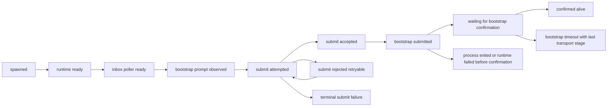

# Process backend bootstrap transport hardening plan

## Summary

Goal: make native process teammate launch stable, observable, and honestly represented in UI for Claude and Codex process teammates, without widening readiness semantics and without regressing OpenCode bridge behavior.

Chosen approach: **durable process-backend bootstrap transport state machine + bounded event reads + service-layer projection enrichment + runner timeout diagnostics**.

🎯 9.6   🛡️ 9.4   🧠 7.1  
Estimated change size: `560-860` LOC across two repos.

Repos:

- `/Users/belief/dev/projects/claude/agent_teams_orchestrator`
- `/Users/belief/dev/projects/claude/claude_team`

Target failures:

```text
Teammate process atlas@signal-ops did not submit bootstrap prompt: timed out waiting for bootstrap_submitted
Last stderr: Warning: no stdin data received in 3s, proceeding without it.
```

Target misleading UI states:

```json
{
  "launchState": "failed_to_start",
  "livenessKind": "stale_metadata",
  "pid": 65704,
  "runtimeDiagnostic": "persisted runtime pid is not alive",
  "diagnostics": [
    "Teammate process atlas@signal-ops did not submit bootstrap prompt: timed out waiting for bootstrap_submitted ..."
  ]
}
```

The root problem is not a single model/provider bug. It is missing transport-state evidence plus fallback projection:

```text
process spawned
-> runtime started
-> mailbox/bootstrap prompt path partially ran
-> parent waited only for bootstrap_submitted
-> no durable event explained where delivery stopped
-> runner/projection later guessed generic timeout, never spawned, or stale pid
```

## What success means

This phase does **not** make readiness easier. It makes failures clearer.

Readiness remains:

```text
confirmed_alive = durable bootstrap_confirmed proof only
```

Transport stages remain diagnostics:

```text
process_spawned != ready
runtime_ready != ready
inbox_poller_ready != ready
bootstrap_submitted != ready
```

## Deep code research findings

### 1. Existing parent wait loses causality

`/Users/belief/dev/projects/claude/agent_teams_orchestrator/src/utils/swarm/teammateRuntimeEvents.ts` waits for one event type and primarily matches by pid:

```ts
const match = events.find(
  event => event.type === params.type && matchesPid(event),
)
```

This cannot distinguish:

- prompt row never observed;
- prompt observed but submit deferred;
- submit attempted but rejected;
- submit accepted without UUID;
- runtime failed;
- process exited;
- stale event from a previous launch matched same pid.

### 2. Existing event reader reads full files

`readTeammateRuntimeEvents()` uses whole-file `readFile`. New wait loops must not use unbounded reads.

Keep the old helper unchanged for compatibility. Add a new helper:

```ts
readRecentTeammateRuntimeEvents(eventsPath, { maxBytes: 256 * 1024 })
```

Use it in new outcome waiters and timeout diagnostics.

### 3. `useInboxPoller` submit rejection is currently retryable by behavior

Current code:

```ts
if (!submitted.accepted) {
  logForDebugging('[InboxPoller] Submission rejected, keeping messages queued')
  return
}
```

This keeps the message queued. Therefore a submit rejection is not automatically terminal. The plan must record it as diagnostic, but final failure happens only on:

- later explicit `failed`;
- `exited`;
- accepted-without-uuid;
- non-retryable rejection if the submit layer can prove it;
- timeout.

### 4. Runtime event `runId` is ambiguous

Writers use `runId` differently:

- startup sentinel/runtime-ready path uses session id;
- `main.tsx` `cli_started` uses session id;
- native app-managed context uses bootstrap request run id;
- `mcp/client.ts` `member_briefing` proof uses session id;
- `useInboxPoller` uses bootstrap run id only when native app-managed injection exists, otherwise session id.

Therefore new launch-scoped events need a new optional `bootstrapRunId`. Do not redefine legacy `runId` globally.

### 5. `bootstrapMessageId` and mailbox id must stay separate

Use:

- `bootstrapMirrorId`: original mailbox/bootstrap row id;
- `bootstrapMessageId`: submitted session user message UUID from `onSubmitTeammateMessage`.

Do not overload one field for both.

### 6. Startup ready sentinel is not readiness proof

`/Users/belief/dev/projects/claude/agent_teams_orchestrator/src/utils/swarm/startupReadySentinel.ts` writes a temp `startup-ready.json`. The hook also writes `runtime_ready`.

This proves the child reached runtime init with hooks attached. It is not bootstrap completion and not teammate availability. Keep it separate from bootstrap confirmation.

### 7. Stdin must stay open

Do not change process backend spawn to:

```ts
stdio: ['ignore', 'pipe', 'pipe']
```

There is explicit process backend e2e coverage that stdin remains open because some wrappers treat stdin EOF as shutdown.

### 8. The 3 second stdin warning is startup probing

```text
Warning: no stdin data received in 3s, proceeding without it.
```

comes from non-TTY stdin peek. Text-mode headless teammate startup should skip this peek. Stream-json behavior should remain unchanged.

### 9. `TeamRuntimeLivenessResolver` already separates liveness from readiness

`/Users/belief/dev/projects/claude/claude_team/src/main/services/team/TeamRuntimeLivenessResolver.ts` already treats:

- OpenCode process with unconfirmed bootstrap as `runtime_process_candidate`;
- confirmed bootstrap as strong evidence;
- stale pid as liveness diagnostic;
- `sanitizeProcessCommandForDiagnostics()` as command redaction helper.

The new transport evidence reader must align with this model. It must not mark process liveness as readiness.

Process backend transport evidence should not modify `TeamRuntimeLivenessResolver` semantics. Liveness resolver answers "is there a verified/live runtime process or persisted runtime marker?". Transport enrichment answers "what happened during bootstrap submission?". Keep these separate and merge only in `TeamProvisioningService` status assembly.

Desktop command parsing rule:

- desktop may use `TeamRuntimeLivenessResolver` command matching only for liveness diagnostics;
- process termination identity belongs to orchestrator `killProcessBackendRuntime(...)`, not desktop;
- sanitized command text from desktop must never be used as proof of bootstrap confirmation or as a kill authorization token.

### 10. Failure reasons are persisted and emitted to users

`TeamBootstrapStateStore.markMemberResult()` persists `failureReason` in `bootstrap-state.json`. `TeamBootstrapProgressEmitter` emits `failedMembers` in structured output.

Therefore every new failure detail must be:

- bounded in length;
- redacted;
- stable enough to persist;
- not raw argv/env/stderr.

### 11. `TeamLaunchStateEvaluator` must stay pure

Do not add JSONL reads to `/Users/belief/dev/projects/claude/claude_team/src/main/services/team/TeamLaunchStateEvaluator.ts`. Evidence IO belongs in `TeamProvisioningService` and a dedicated evidence reader.

### 12. Bootstrap proof validation must not be reused for transport evidence

`BootstrapProofValidation.ts` is confirmation-only. It validates durable `bootstrap_confirmed` proof with strict token/run/hash checks.

Do not reuse it for `process_spawned`, `runtime_ready`, `inbox_poller_ready`, `bootstrap_submit_attempted`, or `bootstrap_submitted`.

### 13. `teamBootstrapRunner` currently reports low-signal timeout

`teamBootstrapRunner.ts` currently reads only `failed` events before generic timeout:

```text
Teammate was registered but did not bootstrap-confirm before timeout.
```

After transport events exist, timeout should include last relevant stage while still failing:

```text
Teammate was registered but did not bootstrap-confirm before timeout. Last transport stage: bootstrap_submitted.
```

### 14. `writeToMailbox()` does not return persisted message id

`/Users/belief/dev/projects/claude/agent_teams_orchestrator/src/utils/teammateMailbox.ts` currently returns `Promise<void>` from `writeToMailbox()`.

Therefore parent-owned spawn code cannot know the actual normalized mailbox row id. Do not fabricate `bootstrapMirrorId` in parent code. The only safe source for `bootstrapMirrorId` is `useInboxPoller`, after it has observed `bootstrapPendingMessage.messageId`.

### 15. `onSubmitTeammateMessage()` has no structured rejection reason

`useInboxPoller` receives only:

```ts
{ accepted: boolean; userMessageUuid?: string }
```

Do not write plan or tests that expect `submitted.reason`. A rejected submit can only be reported as a generic local prompt-handler rejection unless the submit API is explicitly extended.

### 16. `spawnMultiAgent.ts` has multiple spawn branches

The file has tmux, split-pane, native process, and in-process paths. Bootstrap runtime metadata appears in more than one place, and process backend can be selected by runtime policy.

Implementation must not patch one happy path only. Before editing, do a branch inventory and apply transport outcome handling to every branch that can persist `backendType: 'process'`, while keeping tmux and in-process behavior unchanged unless a test proves shared code is required.

### 17. Redaction must happen before persistence in orchestrator

`failureReason` and `failedMembers` become user-visible directly from orchestrator state/progress. Desktop-side redaction is not enough. The orchestrator must sanitize first, then desktop can sanitize defensively.

### 18. Runtime event paths must be treated as untrusted persisted metadata

`writeTeammateRuntimeEvent()` can write to an explicit `eventsPath` or to `CLAUDE_CODE_TEAMMATE_RUNTIME_EVENTS_PATH`. Parent code creates paths with `getTeammateRuntimePaths(teamName, agentName)`, but desktop later reads `bootstrapRuntimeEventsPath` from persisted team metadata.

Therefore desktop evidence readers must not blindly read arbitrary persisted paths. They should accept only paths that resolve under the expected team runtime directory, or fall back to recomputing the canonical path from `teamName + memberName`.

### 19. Launch-state size budget matters

`TeamLaunchStateStore` reads full `launch-state.json` up to `256 KiB`, while `TeamConfigReader` can use compact `launch-summary.json` for list/summary paths. New diagnostic fields can still make detailed launch-state reads fail if failure text or diagnostic arrays grow.

The plan must keep transport diagnostics short, bounded, and deduped. Do not persist raw event histories into `launch-state.json`; persist only the selected root cause, compact runtime diagnostic, and small bounded diagnostics list.

### 20. Team member bootstrap metadata is part of equality/update semantics

`teamHelpers.ts` includes `bootstrapExpectedAfter`, `bootstrapProofToken`, `bootstrapRunId`, `bootstrapProofMode`, hashes, and `bootstrapRuntimeEventsPath` in `TeamFile` and member equality. Any edit/restart/update path must preserve or intentionally replace these fields. Accidental clearing will break later correlation and cause false stale/never-spawned states.

Explicit lifecycle rules:

- pure roster/profile edit without restart keeps existing bootstrap metadata unchanged;
- member restart or team relaunch replaces `bootstrapExpectedAfter`, `bootstrapRunId`, proof token/hash fields, `bootstrapRuntimeEventsPath`, backend type, and runtime pid as one logical update;
- failed spawn before metadata publication must not leave a partially updated member that points to a new runtime events path without the matching run boundary;
- desktop projection must prefer the current launch snapshot/run boundary over older persisted team metadata if both exist and disagree;
- if edit/restart code cannot prove whether metadata belongs to the current run, it should drop transport enrichment and keep the existing conservative failed/pending state.

### 21. Desktop already has a bounded runtime proof event reader

`TeamProvisioningService` already has:

- `getBootstrapRuntimeEventsPath(...)`;
- `readRuntimeBootstrapProofEvents(...)`;
- `isRuntimeBootstrapProofEventValid(...)`;
- `findBootstrapRuntimeProofObservedAt(...)`.

This means implementation should not create a second unrelated JSONL tail reader in desktop. Extract or wrap the existing reader/path resolver into a small shared utility that both proof overlay and new transport evidence can use. The existing proof path must keep its strict `validateBootstrapRuntimeProofEnvelope(...)` semantics.

### 22. Runtime event filename sanitizer must match orchestrator

Orchestrator canonical runtime files use:

```ts
safeWindowsPathSegment(name.replace(/[^a-zA-Z0-9]/g, '-').toLowerCase())
```

Desktop currently has a local `sanitizeRuntimeEventFilePrefix(...)` with the non-alnum/lowercase part. The plan should align fallback path generation with orchestrator including Windows reserved basename handling, or prefer safe persisted path when available. Otherwise names like `con`, `aux`, or other reserved basenames can produce fallback mismatch on Windows.

Extra fragile detail: `agentName` passed to `getTeammateRuntimePaths(...)` is usually already `sanitizeAgentName(name)`, which only replaces `@` with `-`. Runtime filename generation then applies `sanitizeName(...)`. Desktop fallback must mimic the same source identity and filename codec:

```ts
const runtimeAgentName = persistedRuntimeMember?.name ?? memberName
const filePrefix = sanitizeName(runtimeAgentName)
```

Do not use display name, provider name, model id, or unsanitized `memberName` when persisted runtime member name is available.

Collision policy:

- if two configured members sanitize to the same runtime filename prefix, do not guess from filename alone;
- require payload identity (`agentName`/`agentId`) and current attempt identity;
- if both candidates remain ambiguous, return no enrichment for both and rely on generic timeout/proof paths;
- add a test with names that collide after the real two-step pipeline if such names are possible.

### 22.1 Runtime filename codec must be a tested contract, not a copied guess

The fragile part is not just the regex. The actual orchestrator pipeline is:

```ts
sanitizeAgentName(name) // only @ -> -
sanitizeName(agentName) // non-alnum -> -, lowercase, safeWindowsPathSegment(...)
```

`safeWindowsPathSegment(...)` prefixes Windows reserved basenames after trimming trailing spaces/dots and checking the basename stem. For example, `con`, `con.txt`, `aux`, `nul`, `com1`, and `lpt1` map to reserved-safe names.

Implementation rule:

- if desktop can reuse/import a small shared codec without crossing unsafe package/runtime boundaries, do that;
- if importing orchestrator code into Electron main is not acceptable, duplicate the tiny codec locally but add golden tests that lock it to orchestrator behavior;
- do not rely on visual/manual comparison of generated paths;
- do not “normalize better” on desktop. Better but different normalization is a bug because it breaks correlation.

Required golden vectors:

```ts
const runtimeFilePrefixCases = [
  ['', ''],
  ['bob', 'bob'],
  ['Bob', 'bob'],
  ['bob@team', 'bob-team'],
  ['bob.team', 'bob-team'],
  ['bob_team', 'bob-team'],
  ['con', '_con'],
  ['con.txt', 'con-txt'],
  ['aux', '_aux'],
  ['COM1', '_com1'],
  ['LPT9', '_lpt9'],
  ['---', '---'],
  ['алиса', '-----'],
]
```

The exact non-ASCII fallback looks ugly, but it matches current production behavior. Do not change it in this phase. A nicer slug format would require a separate migration because old runtime files already use the current codec.

### 22.2 Member identity precedence for runtime events

Runtime filename is only a lookup hint. It is not identity.

Use this precedence when associating runtime events with a member:

1. current launch attempt identity: `bootstrapRunId` when present, otherwise legacy session `runId` only through the existing compatibility path;
2. runtime process identity: expected process backend pid and not-before boundary;
3. payload member identity: exact `agentId` first, then exact runtime `agentName`;
4. safe path containment under the expected team runtime directory;
5. sanitized filename prefix as last-resort candidate selection only.

Example shape:

```ts
interface RuntimeEventMemberMatchInput {
  teamName: string
  memberName: string
  expectedAgentId?: string
  expectedRuntimeAgentName?: string
  expectedBootstrapRunId?: string
  legacySessionRunId?: string
  expectedPid?: number
  notBeforeMs?: number
  candidatePath: string
}

type RuntimeEventMemberMatch =
  | { kind: 'current'; confidence: 'strict' | 'legacy' }
  | { kind: 'diagnostic_only'; reason: 'missing_attempt_identity' | 'legacy_pid_only' }
  | { kind: 'no_match'; reason: 'wrong_member' | 'stale_attempt' | 'ambiguous_filename' | 'path_outside_team_runtime' }
```

Rules:

- `agentId` mismatch is a hard no-match even if filename and pid look plausible;
- `bootstrapRunId` mismatch is a hard no-match even if filename and member name match;
- missing payload identity may allow diagnostic-only enrichment only when pid/not-before/path are current and there is no filename collision;
- diagnostic-only enrichment can explain timeout stage but cannot create `confirmed_alive`, cannot clear provider failure, and cannot kill/cleanup a process;
- filename collision downgrades missing-identity events to no-match, not diagnostic-only.

This keeps the reader fail-closed in the exact cases where stale evidence would be most damaging.

### 23. Runner polling must not treat last-stage diagnostics as failure

`waitForRequiredBootstrapConfirmations(...)` polls `readBootstrapRuntimeFailure(...)` before timeout. If the implementation changes that function to return non-terminal stages like `bootstrap_submitted` or retryable `bootstrap_submit_rejected`, it will fail members early.

Split the responsibilities:

- poll loop reads only terminal runtime failures;
- timeout path reads last relevant transport stage for diagnostic text.

### 24. `TeamBootstrapStateStore.markMemberResult()` currently preserves stale failureReason

`markMemberResult(...)` spreads the old member and only sets `failureReason` when a new one is supplied. If a member was failed and later becomes `bootstrap_confirmed`, stale `failureReason` can remain in `bootstrap-state.json`.

If this method is touched for redaction, make it explicit:

- failed result stores sanitized failure reason;
- non-failed result clears `failureReason`;
- non-failed diagnostic text, for example duplicate/already-running reason, must not be stored in `failureReason`. Keep it in progress output/journal detail, or add a clearly non-terminal internal field only if implementation needs it;
- journal keeps historical failure/detail records.

### 25. Progress emitter is also a user-visible boundary

`TeamBootstrapProgressEmitter` writes:

- `member_spawn_result.reason`;
- `completed.failed_members`;
- terminal `failed.reason`.

These values are structured output and can be shown in diagnostics immediately. Even if callers sanitize, the emitter should defensively sanitize/bound outbound reason fields too. This prevents a single unsanitized caller from leaking raw stderr/env/provider details.

### 26. Launch summary is written from `TeamLaunchStateStore`

`TeamLaunchStateStore.write(...)` writes both `launch-state.json` and `launch-summary.json`. Enrichment must flow through this store. Do not write only `launch-state.json` or only in-memory status if the UI list depends on launch-summary selection.

`launch-summary.json` derives `missingMembers` from members whose `launchState === 'failed_to_start'` and counts from `snapshot.summary`. Therefore enrichment must happen before `createPersistedLaunchSummaryProjection(snapshot)`. If enrichment changes a member from pending to `failed_to_start`, the summary must show the same failed count/missing member as Team Detail.

`clean_success` finished launches can clear persisted launch-state. This is fine. Transport diagnostics matter for failed/pending launches, not clean success.

Clean-success clear rule:

- if the normalized snapshot is truly `clean_success` after proof/provider/transport overlays and `launchPhase !== 'active'`, preserve existing behavior and clear persisted launch-state;
- process transport enrichment must not keep a stale diagnostic alive after every expected member is confirmed/skipped according to existing summary semantics;
- if any process member is still `runtime_pending_bootstrap`, `failed_to_start`, or permission-pending, the snapshot is not clean success and must not be cleared;
- do not use runtime event absence to prevent clean-success clearing. Absence of a best-effort diagnostic file is not a reason to keep launch-state;
- `clearPersistedLaunchStateNow(...)` also clears bootstrap-state. Therefore clean-success clear must be fenced by current run identity immediately before clearing, not only before building the snapshot;
- a stale clean-success finalizer from an older run must not clear launch-state or bootstrap-state for a newer active/restarted run;
- if the current run identity cannot be proven at clear time, skip clear and keep the conservative persisted state;
- tests should cover clean-success launch with missing runtime event files and assert launch-state can still clear.
- tests should cover stale clean-success finalizer racing with a newer launch and assert neither launch-state nor bootstrap-state is cleared for the newer run.

### 27. Shared/public launch status types must not expose transport internals

`PersistedTeamLaunchMemberState`, `MemberSpawnStatusEntry`, and `TeamAgentRuntimeEntry` expose user-facing runtime/launch status fields like `runtimeDiagnostic`, `hardFailureReason`, `diagnostics`, `livenessKind`, and `runtimePid`.

They do not expose `bootstrapProofToken`, `contextHash`, `briefingHash`, or runtime events paths. Keep it that way. Transport internals are matching inputs, not renderer/API payload fields.

### 28. Diagnostics must never stringify full runtime events

Runtime events can contain correlation fields:

- `bootstrapProofToken`;
- `contextHash`;
- `briefingHash`;
- `bootstrapRunId`;
- runtime events path through surrounding metadata.

Diagnostic formatting must be allowlist-based: stage/type plus sanitized `detail` only. Never include `JSON.stringify(event)` in user-visible failure reasons.

Data minimization rule:

- `bootstrapProofToken`, `contextHash`, and `briefingHash` may remain on existing proof-validation events such as `bootstrap_confirmed` and native app-managed `bootstrap_context_loaded`;
- new transport-stage events should not add proof tokens unless a current proof validator explicitly needs them;
- correlate transport stages primarily with `bootstrapRunId + runtimePid + teamName + agentName + launch boundary`;
- diagnostics formatters must never surface proof tokens or hashes even if they exist in the raw local event file.

### 29. Path containment utility already exists

`/Users/belief/dev/projects/claude/claude_team/src/main/utils/pathValidation.ts` exports `isPathWithinRoot(targetPath, rootPath)`. Reuse it for runtime event path guards instead of adding another subtly different path containment helper.

For existing files, prefer realpath validation of both candidate and runtime directory to avoid symlink escapes. For missing files, lexical `path.resolve + isPathWithinRoot` is acceptable because there is nothing to read yet.

### 30. Parent-owned runtime events must never default to parent pid

`writeTeammateRuntimeEvent(...)` defaults `pid` to `process.pid`, which is correct for child-runtime writers such as `main.tsx`, `useInboxPoller`, and MCP client code.

It is dangerous for parent-owned spawn events. `spawnMultiAgent.ts` must always pass the child `runtimePid` for:

- `process_spawned`;
- `stdout_attached`;
- parent-written `failed`;
- parent-written `exited`;
- any new `mailbox_bootstrap_written` or submit outcome events written by parent code.

Plan implementation should add a tiny parent helper so this cannot be accidentally omitted.

### 31. Parent event details currently include paths/command snippets

Current native process events include details like:

```text
command=<command> args=<count>
stdout=<path> stderr=<path>
```

These details are useful for logs but unsafe as user-visible timeout diagnostics. Last-stage diagnostic formatting must allowlist stage plus safe detail only. For `process_spawned` and `stdout_attached`, use the stage name without raw command/path detail in user-facing text.

### 32. Runtime event writes are diagnostic and best-effort

`writeTeammateRuntimeEvent(...)` currently catches write errors and logs them. Keep that behavior. Runtime events improve causality but must not become a new hard dependency that can crash launch when the event file cannot be written.

Implication:

- parent `process_spawned`/`stdout_attached` write failure should not fail spawn by itself;
- child event write failure can still lead to existing timeout behavior because the waiter never observes readiness/submit;
- explicit process/provider failures should still be surfaced through thrown errors and bootstrap-state, even if diagnostic event write fails.

### 33. Existing process-backend e2e has a fake runtime harness

`teamBootstrapProcessBackend.e2e.test.ts` already uses `FAKE_TEAMMATE_RUNTIME_SCRIPT` and modes like crash, pipe flood, stdin-sensitive, hold-child. Extend that harness with focused modes for new transport stages instead of requiring live Claude/Codex in deterministic tests.

Needed fake modes:

- `submit-rejected-then-accepted`: emits `bootstrap_submit_attempted`, retryable `bootstrap_submit_rejected`, then later `bootstrap_submitted`;
- `submit-rejected-terminal`: emits `bootstrap_submit_attempted`, non-retryable `bootstrap_submit_rejected`;
- `accepted-without-uuid`: submit returns accepted but no persisted user message uuid;
- `no-submit`: emits process/runtime readiness but never observes the bootstrap prompt;
- `observed-no-submit`: observes bootstrap prompt but never accepts submit;
- `inbox-ready-no-submit`: emits `inbox_poller_ready` but never submits;
- `submit-then-exit`: emits `bootstrap_submitted`, then exits before bootstrap confirmation;
- `failed-after-runtime-ready`: emits a terminal runtime `failed` event after runtime readiness;
- `partial-corrupt-event`: writes corrupt/partial runtime event lines before a valid event;
- `stderr-secret`: writes token-like stderr/detail text to prove diagnostics are redacted.

Harness rules:

- fake modes stay local and deterministic, with no live Claude/Codex/OpenCode/provider auth;
- fake modes must be selected through existing fixture env, not through production runtime flags;
- fake runtime event lines should be written through the same JSONL path shape as production;
- corrupt-event tests must assert the reader skips bad lines and still reads later valid lines;
- event-write-disabled tests should prove spawn does not crash just because diagnostic event append failed.

This is the main confidence gate for this phase. Unit tests can prove classifiers, but only this harness proves the spawn runner, event file, stdin, child process, cleanup, timeout, and bootstrap-state paths work together.

## Non-goals

- Do not return tmux to default.
- Do not close process backend stdin.
- Do not make `bootstrap_submitted` count as readiness.
- Do not make `runtime_ready`, PID, RSS, or mailbox row count as readiness.
- Do not alter OpenCode bridge launch/delivery semantics.
- Do not add unbounded retry loops.
- Do not add filesystem reads inside `TeamLaunchStateEvaluator`.
- Do not mask provider/auth/quota/model failures as transport failures.
- Do not change task/work-sync logic.
- Do not add renderer IPC/API fields unless existing diagnostics fields prove insufficient.

## Safety invariants

1. `confirmed_alive` requires durable `bootstrap_confirmed` or trusted native app-managed bootstrap proof.
2. `bootstrap_submitted` means only that the bootstrap prompt entered the CLI session.
3. `bootstrap_submit_attempted` means only that submit was tried.
4. `bootstrap_submit_rejected` is diagnostic/retryable by default.
5. `inbox_poller_ready` means only that mailbox polling reached runtime readiness.
6. PID/RSS/process liveness is diagnostic, not availability.
7. Startup sentinel/runtime-ready is not bootstrap confirmation.
8. `never spawned` is valid only when no spawn/runtime/poller/submit evidence exists for the current launch window.
9. Cleanup may update liveness fields, but must preserve the most specific root cause.
10. Transport evidence can prevent misleading fallback, but cannot create success.
11. New waits and diagnostics use bounded reads.
12. Legacy `event.runId` is not a universal launch id.
13. OpenCode bridge lanes stay out of this process-backend projection path.
14. User-visible diagnostics are redacted and length-bounded before persistence/emission.
15. Provider/auth/quota failures win over generic transport fallback.
16. Desktop never reads a persisted runtime events path unless it resolves under the expected team runtime directory.
17. Launch-state diagnostic additions must keep detailed launch-state under the existing `256 KiB` read budget; list summary should remain compact through `launch-summary.json`.
18. Runner polling can only fail on terminal runtime events. Last-stage diagnostics are timeout-only.
19. Non-failed bootstrap member results clear stale `failureReason`.
20. Structured bootstrap progress output is sanitized at emitter boundary.
21. Enriched launch status must be persisted through `TeamLaunchStateStore.write(...)` so launch-summary stays consistent.
22. Renderer/shared types do not expose bootstrap proof tokens, hashes, or runtime event paths.
23. User-visible diagnostics are allowlist-formatted and never stringify full runtime events.
24. Runtime event path containment reuses `isPathWithinRoot` and validates realpaths when files exist.
25. Parent-owned runtime events always include child runtime pid and never rely on writer default pid.
26. Parent command/log path details are not surfaced in user-visible timeout diagnostics.
27. Runtime event writes remain best-effort and do not introduce new launch crash paths.
28. Deterministic e2e coverage extends the existing fake runtime harness instead of relying on live providers.
29. Fake runtime modes cover every terminal and non-terminal transport branch before production spawn integration is considered complete.
30. Corrupt or missing runtime event diagnostics degrade to timeout/fallback behavior and never crash launch.

## Transport state lattice

This phase must preserve a strict lattice. Stages can explain progress, but only confirmation proves availability.



Rules:

- `confirmed alive` is the only success terminal state.
- `terminal submit failure`, `process exited/runtime failed`, and timeout can become `failed_to_start`.
- retryable rejection stays pending until later submit, terminal failure, process exit, or timeout.
- a newer launch/restart attempt supersedes older pending/failure evidence only when the newer attempt has a distinct current boundary.
- liveness evidence can annotate any stage but does not move the state to success.

### Launch-state transition lattice

The persisted member launch state must be monotonic within one attempt, except for strict proof confirmation and materialized restart boundaries.

Allowed transitions for one current process-backend attempt:

| From | Evidence | To | Notes |
|---|---|---|---|
| `starting` | `process_spawned` / `mailbox_bootstrap_written` / prompt observed | `runtime_pending_bootstrap` | Pending only. |
| `starting` | terminal submit failure / current process exit / final timeout | `failed_to_start` | Only after current-attempt identity match. |
| `runtime_pending_bootstrap` | stronger pending transport stage | `runtime_pending_bootstrap` | Stable diagnostic may upgrade from process-started to submitted. |
| `runtime_pending_bootstrap` | strict bootstrap proof | `confirmed_alive` | Existing proof validator only. |
| `runtime_pending_bootstrap` | terminal current-attempt failure / final timeout | `failed_to_start` | Provider/root failure still wins over generic transport. |
| `failed_to_start` | later pending event from same attempt | `failed_to_start` | Do not resurrect from terminal failure in same attempt. |
| `failed_to_start` | strict current-attempt bootstrap proof | `confirmed_alive` | Only for auto-clearable transport failures, not unrelated provider/root failures unless existing proof semantics already allow it. |
| `failed_to_start` | materialized new restart attempt with new boundary | `runtime_pending_bootstrap` or `starting` | Old auto-clearable transport failure can clear. |
| `confirmed_alive` | later transport failure/exit from same attempt | `confirmed_alive` plus diagnostic only if useful | Do not downgrade availability without explicit stop/restart semantics. |
| `skipped_for_launch` / `runtime_pending_permission` | process transport event | unchanged | Skip/permission semantics are authoritative. |

Forbidden transitions:

- `failed_to_start -> starting` from a persisted config edit that did not materialize a new runtime attempt;
- `failed_to_start -> runtime_pending_bootstrap` from stale pid/liveness metadata;
- `runtime_pending_bootstrap -> failed_to_start` during active launch because of retryable submit rejection;
- `confirmed_alive -> failed_to_start` because a stale child event or old timeout handler fires later;
- `skipped_for_launch -> starting` from transport evidence;
- `runtime_pending_permission -> failed_to_start` from generic timeout while permission is still unresolved.

Implementation shape:

```ts
type LaunchTransitionReason =
  | 'same_attempt_pending_progress'
  | 'same_attempt_terminal_transport_failure'
  | 'strict_bootstrap_proof'
  | 'materialized_new_attempt'
  | 'provider_root_failure'
  | 'cleanup_liveness_only'
  | 'forbidden_stale_or_weaker_evidence'

function mergeProcessBootstrapLaunchState(
  previous: PersistedTeamLaunchMemberState,
  evidence: ProcessBootstrapTransportEvidence,
  context: {
    launchPhase: PersistedTeamLaunchPhase
    projectionPhase: 'active' | 'final'
    currentAttempt: boolean
  },
): { next: PersistedTeamLaunchMemberState; changed: boolean; reason: LaunchTransitionReason } {
  // pure function, no filesystem, no process table, no renderer imports
}
```

Keep this transition helper pure and test it directly. Do not scatter transition checks across `TeamProvisioningService`, summary projection, and renderer helpers.

### Persisted launch phase compatibility

Current shared type is:

```ts
export type PersistedTeamLaunchPhase = 'active' | 'finished' | 'reconciled'
```

Do not add new persisted values like `finalizing` or `terminal` for this phase. If merge logic needs an internal terminal/final concept, derive it as a local non-persisted value:

```ts
type ProcessTransportProjectionPhase = 'active' | 'final'

function deriveProcessTransportProjectionPhase(input: {
  launchPhase: PersistedTeamLaunchPhase
  finalTimeoutReached?: boolean
}): ProcessTransportProjectionPhase {
  if (input.launchPhase !== 'active') return 'final'
  return input.finalTimeoutReached === true ? 'final' : 'active'
}
```

Rules:

- persisted snapshots keep `launchPhase: 'active' | 'finished' | 'reconciled'` only;
- runner UI/progress step `finalizing` is not the same thing as persisted `launchPhase`;
- process transport merge can use internal `projectionPhase: 'final'` to decide timeout-to-failure behavior;
- do not cast new phase strings with `as PersistedTeamLaunchPhase`;
- tests must assert unknown phase strings are normalized by existing evaluator behavior, not introduced by this change.

## Transport failure taxonomy

Use typed failure categories internally. Do not decide terminal vs pending from arbitrary strings.

```ts
export type ProcessBootstrapTransportFailureKind =
  | 'none'
  | 'retryable_submit_rejection'
  | 'non_retryable_submit_rejection'
  | 'accepted_without_message_id'
  | 'process_exited_before_confirmation'
  | 'runtime_failed_before_confirmation'
  | 'bootstrap_timeout_after_transport_progress'
  | 'bootstrap_timeout_without_transport_progress'
  | 'event_unavailable'
  | 'stale_or_mismatched_evidence'
```

State mapping:

| Kind | Terminal? | UI severity | Persisted root cause? | Notes |
|---|---:|---|---:|---|
| `retryable_submit_rejection` | No | warning | No | Pending until later submit/failure/timeout. |
| `non_retryable_submit_rejection` | Yes | error | Yes | Local submit path refused permanently. |
| `accepted_without_message_id` | Yes | error | Yes | Prompt accepted without durable mailbox id is not safe. |
| `process_exited_before_confirmation` | Yes | error | Yes | Only current process/attempt. |
| `runtime_failed_before_confirmation` | Yes | error | Yes | Only sanitized runtime failure detail. |
| `bootstrap_timeout_after_transport_progress` | Yes after final timeout | error | Yes | More specific than generic timeout, but still not provider failure. |
| `bootstrap_timeout_without_transport_progress` | Yes after final timeout | error | Yes | Existing generic path remains valid. |
| `event_unavailable` | No | info/warning | No | Missing event file cannot itself fail launch. |
| `stale_or_mismatched_evidence` | No | none | No | Ignore for current projection. |

Rules:

- arbitrary `error` string is not a failure kind;
- failure kind is derived from structured event type and current attempt match, not regex over `detail`;
- `event_unavailable` and `stale_or_mismatched_evidence` are never user-facing root causes;
- provider/auth/quota/model failures are outside this taxonomy and have higher precedence;
- terminal kind is allowed to create `failed_to_start` only after current attempt identity matches.

## Attempt identity contract

The implementation needs one explicit identity object for process-backend bootstrap attempts. Avoid rebuilding this tuple independently in runner, spawn, desktop projection, and tests.

```ts
export interface ProcessBootstrapAttemptIdentity {
  teamName: string
  memberName: string
  agentId: string
  backendType: 'process'
  runtimePid?: number
  runtimeEventsPath?: string
  bootstrapRunId?: string
  notBeforeMs: number
}
```

Matching levels:

| Level | Required evidence | Allowed use |
|---|---|---|
| `strict-current` | `teamName`, `agentId`, `bootstrapRunId`, current `runtimePid` when present | Full transport enrichment and terminal failure matching. |
| `legacy-current` | `teamName`, `agentId`, contained current runtime path, current pid or current launch boundary | Pending diagnostics only, and only when no explicit mismatch exists. |
| `diagnostic-only` | contained runtime path but missing current pid/run boundary | Internal logs only. Do not alter member launch state. |
| `no-match` | any explicit team/member/agent/run/pid/path mismatch | Ignore. |

Attempt identity rules:

- build the identity once near process spawn/restart metadata and pass it to helpers;
- never infer current attempt solely from `memberName` or `teamName`;
- `bootstrapRunId` explicit mismatch is always `no-match`;
- pid mismatch is `no-match` for parent-owned events and for current child-written events with pid;
- legacy child-written events without pid can only be `legacy-current` if path containment and launch boundary match;
- old event files from a previous restart are not current just because they live under the same team runtime directory;
- if restart starts a new runtime but event path is reused, `notBeforeMs` and pid/run id must filter old lines.

This contract is intentionally internal. Renderer, shared UI types, and IPC responses should not expose it.

## Cancellation, stop, and restart race contract

The most fragile production cases are not happy-path launch. They are overlapping lifecycle transitions:

- user stops team while launch is finalizing;
- user restarts one member while old launch finalizer still runs;
- app restarts and reconciles persisted state while child process has already exited;
- cleanup runs after metadata publication but before UI refresh;
- model/provider failure arrives after transport timeout already wrote a generic failure.

Hard rules:

- a stale async continuation must never write launch-state for a newer run/restart;
- cleanup may mark the current attempt failed, but cannot mutate a newer attempt;
- restart creates a new attempt boundary before it can clear old terminal state;
- stop/cancel should prefer explicit stopped/cancelled diagnostics over bootstrap transport timeout when both happen for the same current attempt;
- if run/process is killed while evidence is being read, discard the evidence and let stop/cancel path own the state;
- do not send lead/user availability corrections from stale finalizers.

Recommended identity check close to every write:

```ts
function canPersistProcessBootstrapProjection(input: {
  run: ProvisioningRun
  identitySnapshot: ProcessBootstrapAttemptIdentity[]
  expectedRunId: string
  expectedRestartGeneration?: number
}): boolean {
  if (input.run.cancelRequested || input.run.processKilled) return false
  if (input.run.runId !== input.expectedRunId) return false
  if (
    input.expectedRestartGeneration !== undefined &&
    input.run.restartGeneration !== input.expectedRestartGeneration
  ) {
    return false
  }
  return input.identitySnapshot.every((identity) =>
    isStillCurrentAttemptIdentity(input.run, identity)
  )
}
```

If `restartGeneration` does not exist today, do not add a broad public field. Use the narrowest internal counter/map needed to prevent stale restart writes.

## Failure monotonicity and auto-clear contract

Failure state should not flicker. Once a member has a real root failure, only stronger evidence can clear or replace it.

Failure classes:

| Class | Examples | Auto-clear allowed? | Required evidence to clear |
|---|---|---:|---|
| Provider/runtime hard failure | auth, quota, model error, explicit runtime failed | No | New materialized launch/restart attempt or valid bootstrap proof for current member. |
| Process transport failure | submit accepted without UUID, process exited before confirmation, non-retryable submit rejection | Yes, but only if current attempt later has strict proof or a new materialized attempt starts. | Strict bootstrap proof or new attempt identity. |
| Generic timeout fallback | no submit/no confirmation timeout | Yes | Any current strict proof or more specific current transport/provider failure. |
| Pending transport diagnostic | runtime ready, inbox ready, submit attempted, submit retryable rejected, submitted | Not a failure | Later stronger stage or timeout. |
| Stale/mismatched evidence | old run, old pid, wrong member | N/A | Never applies to current state. |

Rules:

- provider/runtime hard failure is monotonic inside the same attempt;
- generic timeout can be replaced by a more specific current transport failure;
- current transport failure can be replaced by strict bootstrap proof;
- old transport failure cannot replace new pending state;
- pending metadata alone cannot clear terminal failure;
- a valid new restart attempt can move old failure to pending, but only after new runtime/process/mailbox evidence exists.

Auto-clear helper should be narrow and pure:

```ts
function canClearLaunchFailure(input: {
  previous: PersistedTeamLaunchMemberState
  incoming: ProcessBootstrapTransportMergeInput
}): boolean {
  if (isProviderOrRuntimeHardFailure(input.previous)) {
    return input.incoming.evidence.stage === 'bootstrap_confirmed'
  }
  if (input.incoming.attemptMatch !== 'strict-current') return false
  return input.incoming.evidence.hasSubmitEvidence || input.incoming.evidence.terminalTransportFailure
}
```

The actual implementation can use different names, but the decision must stay explicit and unit-tested.

## Architecture

| Component | Responsibility |
|---|---|
| `teammateRuntimeEvents.ts` | Append/read runtime events, add bounded recent reader, classify bootstrap submission outcome. |
| `spawnMultiAgent.ts` | Spawn process, write parent-owned events, wait for submission outcome, handle terminal transport failure. |
| `useInboxPoller.ts` | Emit facts when bootstrap prompt is observed and submit is attempted/accepted/rejected/deferred. |
| `main.tsx#getInputPrompt()` | Avoid initial stdin peek only for headless teammate text mode. |
| `teamBootstrapRunner.ts` | Surface last relevant transport stage in timeout reasons while keeping confirmation gate strict. |
| `ProcessBootstrapAttemptIdentity` helper | Build and validate current attempt identity once; avoid duplicated matching logic. |
| `TeamRuntimeEventEvidenceReader` | Safe path resolution and bounded tail reads for desktop runtime events; shared by proof overlay and transport evidence. |
| `ProcessBootstrapTransportEvidence.ts` | Summarize process transport evidence for `claude_team`; no proof semantics. |
| `ProcessBootstrapTransportDiagnostic.ts` | Convert evidence/failure kind to sanitized, bounded, user-safe diagnostic summaries. |
| `ProcessBootstrapLaunchStateMerge` | Pure precedence matrix for confirmed/provider failure/pending/terminal transport states. |
| `TeamBootstrapStateReader` | Read persisted bootstrap failure reasons defensively sanitized; no runtime event IO. |
| `TeamProvisioningService` | Enrich launch statuses from process transport evidence before projection. |
| `TeamRuntimeLivenessResolver` | Existing liveness/readiness separation. Reuse its sanitizer where appropriate. |
| `TeamLaunchStateEvaluator` | Pure state normalization/projection only. No filesystem IO. |
| Renderer | Display existing status/diagnostic fields. |
| Process backend fake runtime harness | Deterministic integration coverage for transport stages, stdin behavior, cleanup, and bounded event reads. |

SOLID constraints:

- SRP: evidence IO lives in evidence reader/service layer, not evaluator.
- OCP: event types/helpers are additive; old wait helper keeps behavior.
- ISP: renderer does not receive provider transport internals.
- DIP: renderer depends on launch status contract, not process/tmux/OpenCode internals.

## Public/internal API changes

No new Electron IPC channels and no renderer-facing transport fields.

Internal additive changes:

- runtime event type/params add optional fields `bootstrapRunId`, `retryable`, and `attempt`;
- new process transport helper modules are internal to orchestrator/desktop services;
- `TeamBootstrapStateStore.markMemberResult(...)` may add optional `detail?: string`, but `failureReason` remains terminal-failure only;
- no shared UI contract should expose `bootstrapProofToken`, hashes, runtime events path, or raw transport event data.

Shared type surface contract:

Existing renderer-visible fields are enough. Do not add new transport-specific fields to shared renderer payloads in this phase.

| Type | Existing fields to use | Do not add/use |
|---|---|---|
| `MemberSpawnStatusEntry` | `launchState`, `status`, `error`, `hardFailureReason`, `runtimeAlive`, `bootstrapConfirmed`, `hardFailure`, `livenessKind`, `runtimeDiagnostic`, `runtimeDiagnosticSeverity`, `bootstrapStalled`, timestamps | `diagnostics[]`, `transportKind`, `bootstrapRunId`, proof tokens, runtime events path |
| `PersistedTeamLaunchMemberState` | same launch fields plus existing `diagnostics[]`, `runtimePid`, `runtimeSessionId`, source/liveness metadata | raw event JSON, raw command, raw paths, proof token/hash |
| `TeamAgentRuntimeEntry` | liveness/process metadata and existing diagnostics when runtime view needs it | process bootstrap transport timeline, volatile submit-stage diagnostics |
| `PersistedTeamLaunchSnapshot` | member map + summary projection | low-level transport event arrays |

Implications:

- selected user-facing process bootstrap message goes into `runtimeDiagnostic`;
- terminal root cause goes into `hardFailureReason`;
- bounded supplementary details may go into persisted member `diagnostics[]`, but not into `MemberSpawnStatusEntry`;
- renderer equality and presentation must continue to work without a new transport-specific field.

## Compatibility and no-migration policy

No migration task is required for existing teams. Old files must remain readable and safe.

Existing data classes:

| Existing data | New behavior |
|---|---|
| `launch-state.json` without `bootstrapRunId` | Keep current fallback behavior. Do not synthesize process transport failure from missing fields. |
| `team.json` without `bootstrapRuntimeEventsPath` | Use canonical current runtime path only if current process metadata exists. Otherwise no enrichment. |
| old runtime events with only legacy `runId` | Match only as `legacy-current` and only with current pid/path/launch boundary. |
| old runtime events with no submit-stage events | Do not infer submit failure. Timeout/generic behavior remains. |
| old bootstrap-state `failureReason` | Sanitize and preserve as terminal only if member state is actually failed. |
| old bootstrap-journal raw `detail`/`reason` | Sanitize before exposing as warning/detail. |
| stale runtime pid after app restart | Process table check can add liveness diagnostic, but cannot prove availability. |

Do not rewrite old runtime event JSONL or bootstrap-state files in place. New code appends new event fields only during new launches/restarts. Persisted launch-state can self-heal on next write, but only through the normal `TeamLaunchStateStore.write(...)` path.

## Cross-repo producer/consumer contract

This phase crosses repo boundaries. Treat orchestrator as event/metadata producer and desktop as projection consumer.

| Contract field/event | Producer | Consumer | Safety requirement |
|---|---|---|---|
| `bootstrapRunId` | orchestrator spawn/poller/runtime event writers | runner and desktop attempt matcher | Additive field. Explicit mismatch rejects. Missing legacy field requires current pid/path/boundary. |
| `bootstrapRuntimeEventsPath` | orchestrator team/member metadata | desktop safe path resolver | Must resolve under canonical team runtime dir. Never trust arbitrary persisted absolute path. |
| `runtimePid` | orchestrator process spawn metadata, desktop runtime evidence | desktop liveness/projection, cleanup helpers | Valid positive integer only. Liveness diagnostic, not readiness proof. |
| `bootstrap_submit_*` events | orchestrator `useInboxPoller` | outcome waiter and timeout diagnostics | Retryable by default unless explicitly terminal. |
| `bootstrap_submitted` | orchestrator `useInboxPoller` | outcome waiter and desktop pending projection | Prevents `never spawned`; does not confirm availability. |
| `failed` / `exited` runtime event | child runtime or parent process helper | outcome waiter/projection | Terminal only for current attempt identity and process backend. |
| `bootstrap_confirmed` | existing proof path | existing strict proof overlay | Availability proof. Do not replace with transport stages. |

Known code-search anchors that must be audited during implementation:

- `spawnMultiAgent.ts` currently has multiple `bootstrapProofToken`/`bootstrapRunId` creation blocks. Each block must either use the shared process attempt helper or be documented as non-process/non-scope.
- `useInboxPoller.ts` currently writes runtime events with mixed legacy `runId` meanings. New `bootstrapRunId` writes must be explicit and additive.
- `teamBootstrapRunner.ts` already reads runtime events for bootstrap diagnostics. It must switch to process-only terminal reader plus timeout-only stage reader.
- `TeamProvisioningService.ts` currently reads `bootstrapRuntimeEventsPath`, `runtimePid`, `bootstrapExpectedAfter`, and persists launch snapshots. It is the right integration point, but not the right place for low-level parsing logic.

## Runtime event trust boundary

Runtime event JSONL files are not a database with trusted consensus semantics. They are append-only diagnostic evidence from parent and child processes. Child-owned events are useful, but they must be treated as untrusted until correlated with the current attempt identity.

Trust levels:

| Writer | Examples | Trusted for | Not trusted for |
|---|---|---|---|
| Parent orchestrator process | `process_spawned`, `mailbox_bootstrap_written`, parent-written terminal cleanup event | Current process spawn metadata, mailbox write attempt, parent-observed child exit/cleanup | Bootstrap confirmation unless existing proof path validates it. |
| Child teammate runtime | `runtime_ready`, `inbox_poller_ready`, `bootstrap_prompt_observed`, `bootstrap_submitted`, child `failed` | Transport progress after strict current-attempt correlation | Provider/root failure replacement, availability, cleanup authority. |
| Existing proof validator | `bootstrap_confirmed` with valid proof envelope | Availability confirmation | Generic transport stage classification. |
| Desktop process table | pid/liveness rows | Current OS liveness diagnostic | Bootstrap submitted/confirmed, provider health, root cause. |

Rules:

- child-owned transport events can prevent false `never spawned`, but cannot mark `confirmed_alive`;
- child-owned `failed` can become terminal only if it matches current attempt identity and passes sanitizer/bounding;
- child-owned `failed` cannot overwrite a provider/auth/quota/model hard failure;
- child-owned events cannot request process cleanup by themselves. Cleanup remains parent/service-owned and identity-guarded;
- parent-owned events are still diagnostic unless they represent explicit terminal process lifecycle observed by the parent;
- if writer identity is ambiguous, downgrade to `diagnostic-only` or ignore;
- do not add any event type that makes child text authoritative for availability.

Spoofing and corruption assumptions:

- a broken child process can write malformed JSONL, stale `bootstrapRunId`, wrong member names, or misleading `detail`;
- path containment and attempt identity protect current state;
- stable diagnostic mapper protects UI from raw child text;
- proof validator remains the only path that can convert child proof into availability.

Dual-key matching rule:

Transport enrichment requires both:

1. Path-level match: runtime event file resolves under the expected team runtime directory and matches the expected current/canonical member runtime path policy.
2. Payload-level match: event `teamName`, `agentName`/`agentId`, pid/run boundary, and attempt identity match the selected member.

Neither side is sufficient alone.

```ts
const pathMatch = resolveRuntimeEventPathMatch(candidatePath, expectedRuntimePath)
const payloadMatch = validateProcessBootstrapAttemptEvent(event, identity)

if (!pathMatch.ok || payloadMatch.level === 'no-match') {
  return { kind: 'stale_or_mismatched_evidence' }
}
```

Rationale:

- path-only trust can misattribute a corrupted/reused file;
- payload-only trust can accept an event injected through the wrong file;
- requiring both keeps enrichment conservative and makes wrong-member bugs fail closed.

## Runtime filename collision and ambiguity contract

Process runtime files are per sanitized agent name, not globally collision-proof identities. This means the reader must handle ambiguous filename candidates conservatively.

Ambiguity sources:

- member display names that differ but sanitize to the same runtime file prefix;
- old persisted `bootstrapRuntimeEventsPath` pointing at a file now reused by another member;
- Windows reserved basename normalization;
- case-insensitive filesystem behavior;
- member rename/edit where config name, runtime metadata name, and UI display name temporarily differ.

Rules:

- prefer persisted runtime member metadata when it has current `bootstrapRunId`/pid boundary;
- if only fallback path exists and multiple members can map to the same path, do not enrich based on path alone;
- payload identity can disambiguate only when `agentId` or exact current `agentName` matches;
- if payload identity is also ambiguous/missing, return `stale_or_mismatched_evidence`;
- do not create or rename runtime event files during desktop read/projection;
- do not migrate filenames in this phase.

Test matrix:

| Case | Expected |
|---|---|
| Two members share sanitized filename but events have distinct `agentId` | Correct member gets enrichment. |
| Two members share sanitized filename and event lacks `agentId` | No enrichment. |
| Persisted path for member A points to member B file | No enrichment unless payload identity also matches A, and current attempt path policy allows it. |
| Reserved Windows basename like `con` / `aux` | Desktop fallback matches orchestrator `safeWindowsPathSegment` result. |
| Name with `@` like `bob@team` | Desktop matches the two-step `sanitizeAgentName` then `sanitizeName` runtime filename. |
| Name with non-ASCII characters | Desktop preserves current hyphen-only fallback and does not invent a different slug. |
| Two names collide after non-ASCII or punctuation replacement | Missing payload identity yields no enrichment for both. |
| Member renamed after runtime file created | Prefer persisted runtime metadata for current attempt; otherwise no enrichment. |
| Payload `agentId` mismatches current member but path matches | Hard no-match. |
| Payload `bootstrapRunId` mismatches current attempt but pid matches | Hard no-match. |

## Artifact source-of-truth model

The implementation must not treat every persisted artifact as equally authoritative. Each file has a different responsibility.

| Artifact | Authoritative for | Not authoritative for |
|---|---|---|
| `bootstrap-state.json` | Deterministic bootstrap confirmation/failure truth from orchestrator. | Process transport stage unless explicitly recorded by the runner. |
| runtime events JSONL | Process transport chronology and last-stage diagnostics. | Availability/readiness proof unless it contains valid bootstrap confirmation handled by the existing proof validator. |
| `team.json` / member bootstrap metadata | Expected runtime metadata and canonical runtime event path hints. | Current liveness, current failure, or current readiness by itself. |
| `launch-state.json` | Desktop persisted projection for UI/reconcile. | Source-of-truth for new transport proof if current run boundary is missing. |
| `launch-summary.json` | Compact list/banner projection. | Detailed diagnostic source or recovery source. |
| process table | Current OS liveness. | Bootstrap submit, bootstrap confirmation, provider health, or task availability. |

Projection rule:

1. Read source artifacts.
2. Normalize/sanitize them into internal evidence objects.
3. Merge through pure precedence helpers.
4. Persist only through `TeamLaunchStateStore.write(...)`.

Do not update `launch-summary.json` directly. Do not let `launch-state.json` feed back into source truth unless it is scoped to the current run and only used as previous projection state.

This prevents loops where a stale projection from yesterday becomes today's source of truth.

List/detail consistency rule:

- team list can read `launch-summary.json` for speed;
- team detail/reconcile should prefer detailed `launch-state.json` plus current evidence;
- if `launch-summary.json` is stale or ignored by existing summary projection rules, do not use it to resurrect failed/pending state;
- after enriched projection, write detailed state and summary together via `TeamLaunchStateStore.write(...)`;
- tests should compare the member-level detail and summary counters after enrichment, not only one file.

Two-file persistence limitation:

`TeamLaunchStateStore.write(...)` currently performs two separate atomic writes: first detailed `launch-state.json`, then compact `launch-summary.json`. This is not a single atomic transaction across both files.

Plan implications:

- do not claim state/summary writes are globally atomic;
- design readers so detailed `launch-state.json` is preferred when both files exist and conflict;
- stale/missing summary after a detailed write is acceptable and self-heals on the next store write;
- if summary write fails after detailed write, do not roll back detailed state;
- list-level stale summary mitigation must stay in `choosePreferredLaunchStateSummary(...)` and related stale-summary guards;
- tests should simulate summary stale/missing after detailed state moved on.

Do not add a custom transaction protocol for this phase. It would increase complexity and is not needed if readers treat summary as compact projection only.

No-op write skip caveat:

`TeamProvisioningService.writeLaunchStateSnapshotNow(...)` currently skips writes when detailed launch-state is semantically unchanged for the same run. That is normally correct, but it can leave `launch-summary.json` stale or missing if a previous two-file write failed after detailed state succeeded.

Plan implication:

- transport enrichment must happen before semantic no-op comparison;
- no-op skip remains allowed only when the compact summary projection is also known fresh enough or summary repair is not needed;
- if implementation detects missing/stale summary while detailed state is unchanged, force a store write through `TeamLaunchStateStore.write(...)` to repair the summary projection;
- do not direct-write `launch-summary.json` as a shortcut;
- if checking summary freshness would add too much IO in a hot path, rely on the existing no-op refresh TTL but document that list view may lag until refresh. Preferred for this phase: bounded summary freshness check only inside the existing serialized store operation.

Example safe skip shape:

```ts
const canSkipDetailedWrite =
  allowNoopSkip &&
  sameRun &&
  previousSnapshot &&
  semanticallyEqual(previousSnapshot, normalizedSnapshot) &&
  !isLaunchStateNoopRefreshDue(previousSnapshot)

if (canSkipDetailedWrite && !(await needsLaunchSummaryRepair(teamName, normalizedSnapshot))) {
  return { snapshot: previousSnapshot, wrote: false }
}

await launchStateStore.write(teamName, normalizedSnapshot)
```

## Observability without UI spam

This phase improves launch diagnostics, not general runtime error notification behavior.

Logging/diagnostic rules:

- structured progress may mention transport stage, but not raw event payload;
- launch-state can store one selected diagnostic per member plus a bounded diagnostics list;
- runtime logs/events may contain more detail, but UI projections expose only the selected sanitized summary;
- retryable submit rejection should not trigger critical runtime error notifications;
- pending transport stages should not send lead/user messages by themselves;
- terminal current-attempt transport failure can update member card/banner through existing launch-state fields;
- repeated identical terminal diagnostics should be deduped by member/run/kind before emitting progress/notifications;
- diagnostics should include provider/member/team context through structured fields, not by concatenating long text.

Recommended internal shape:

```ts
export interface ProcessBootstrapTransportDiagnostic {
  kind: ProcessBootstrapTransportFailureKind
  stage: ProcessBootstrapTransportStage
  severity: 'info' | 'warning' | 'error'
  message: string
  stableCode: string
  observedAt?: string
  currentAttempt: boolean
}
```

Renderer rule:

- renderer continues to consume existing status/error/diagnostic fields;
- no new renderer field for transport kind in this phase;
- if future UI needs richer transport explanations, add a dedicated presentation mapper later, not raw runtime event fields.

## Renderer presentation contract

Current renderer equality and presentation code creates a few important constraints:

- `memberSpawnStatuses` equality compares `status`, `launchState`, `error`, `hardFailureReason`, `runtimeDiagnostic`, `runtimeDiagnosticSeverity`, liveness fields, and bootstrap flags;
- `MemberSpawnStatusEntry` has no `diagnostics[]` field today. Do not add it for this phase;
- `memberSpawnStatuses` equality intentionally ignores raw timing fields;
- `teamAgentRuntime` equality compares `runtimeDiagnostic`, `runtimeDiagnosticSeverity`, `runtimeLastSeenAt`, and `diagnostics[]`;
- launch diagnostic presentation prefers selected `runtimeDiagnostic`/`hardFailureReason` over long diagnostic arrays;
- `bootstrapStalled` has existing presentation semantics and should not be used for ordinary submit-pending state.

Plan implications:

- for card/banner visibility, put the selected stable transport message in `runtimeDiagnostic`;
- for terminal root cause, put stable provider/transport root cause in `hardFailureReason`;
- do not rely only on `diagnostics[]` for user-visible launch failure;
- do not write volatile process transport diagnostics into `TeamAgentRuntimeEntry.diagnostics[]`;
- pending states use `runtimeDiagnosticSeverity: 'info' | 'warning'`, not `'error'`;
- terminal current-attempt transport failures use `runtimeDiagnosticSeverity: 'error'` and `launchState: 'failed_to_start'`;
- do not set `bootstrapStalled` for normal `bootstrap_submitted` waiting-for-confirmation; reserve it for the existing bounded stall semantics.

Example:

```ts
// Pending and visible, but not critical.
{
  launchState: 'runtime_pending_bootstrap',
  runtimeDiagnostic: 'Bootstrap prompt was submitted; waiting for bootstrap confirmation.',
  runtimeDiagnosticSeverity: 'info',
}

// Terminal and actionable.
{
  launchState: 'failed_to_start',
  status: 'error',
  hardFailure: true,
  hardFailureReason: 'Teammate process exited before bootstrap confirmation.',
  runtimeDiagnosticSeverity: 'error',
}
```

## Write-churn and render stability budget

Transport diagnostics must be stable across polling/refresh cycles. Existing semantic equality for launch-state ignores `lastEvaluatedAt` and `lastRuntimeAliveAt`, but it does not ignore `runtimeDiagnostic`, `hardFailureReason`, or `diagnostics[]`. If transport diagnostics include changing timestamps, attempt counts, raw event order, or noisy stderr tails, the app can re-write launch-state and re-render on every refresh.

Rules:

- persisted `runtimeDiagnostic`, `hardFailureReason`, and `diagnostics[]` must use stable text for the same `(team, member, run, failureKind, stage)`;
- do not embed `observedAt`, wall-clock timestamps, raw event index, PID command line, stdout/stderr tail, or retry attempt counter in persisted diagnostic text;
- keep changing metadata in non-semantic fields only when existing types already support it, for example `lastEvaluatedAt`;
- dedupe diagnostics by stable diagnostic code/message, not by full raw detail;
- a repeated same-stage pending diagnostic should not change semantic launch-state;
- a later stronger stage can replace/append a diagnostic, for example `runtime_ready` -> `bootstrap_submitted` -> terminal failure;
- terminal provider/root failure text remains stable after redaction and is not replaced by later generic transport text;
- renderer/store equality should not see a new object unless meaningful status/diagnostic semantics changed.

Example stable diagnostic mapping:

```ts
const TRANSPORT_DIAGNOSTIC_MESSAGES = {
  bootstrap_submitted:
    'Bootstrap prompt was submitted; waiting for bootstrap confirmation.',
  process_started_no_submit:
    'Process backend started but bootstrap prompt has not been submitted yet.',
  accepted_without_message_id:
    'Bootstrap prompt submit was accepted without a durable message id.',
  process_exited_before_confirmation:
    'Teammate process exited before bootstrap confirmation.',
} as const
```

Do not format this:

```ts
// Bad: changes every refresh and breaks no-op skip.
`Bootstrap submitted at ${event.timestamp}; waiting for confirmation.`
```

## Runtime event ordering and clock policy

Runtime events come from multiple processes. Their timestamps are useful, but not strong enough to define truth alone.

Ordering rules:

- unknown event types are skipped for transport classification, not treated as failure;
- within one JSONL file, append order is the primary order;
- `timestamp` is used for display and for coarse boundary checks, not as the only ordering mechanism;
- `notBeforeMs` from the parent/current attempt is the launch boundary;
- event lines before `notBeforeMs` are ignored unless they have an explicit matching current `bootstrapRunId`;
- if file append order and timestamp disagree, prefer append order for stage selection and use timestamp only as diagnostic metadata;
- a later low-value event such as `heartbeat` must not hide an earlier high-value submit/failure stage for timeout summary;
- corrupt/partial final lines are ignored without discarding earlier valid lines.

Clock-skew expectation:

- all processes normally run on the same machine, but tests should still cover out-of-order timestamps;
- no state transition should require exact timestamp equality;
- never use wall-clock timestamp alone to match a restart attempt.

## Runtime event causality and partial-stream policy

Runtime events are a diagnostic stream, not a transactional log. Parent and child processes can write events in different orders, and any individual event write can be missing because event writes are best-effort.

Expected causal chain:

```text
process_spawned
mailbox_bootstrap_written
bootstrap_prompt_observed
bootstrap_submit_attempted
bootstrap_submitted
bootstrap_confirmed proof through existing strict proof validator
```

Do not implement this as a required linear sequence. Implement it as partial facts:

| Observed facts | Interpretation |
|---|---|
| `bootstrap_submitted` without `mailbox_bootstrap_written` | Submitted wins for transport pending. Missing parent event is diagnostic only. |
| `bootstrap_prompt_observed` without `mailbox_bootstrap_written` | Child saw a prompt; parent event may be missing. Pending transport stage. |
| `mailbox_bootstrap_written` without `bootstrap_prompt_observed` | Parent wrote the mailbox row, but child did not observe it. Timeout diagnostic: mailbox written, teammate did not pick it up. |
| `process_spawned` only | Process started, no bootstrap prompt evidence. Timeout diagnostic: process started but bootstrap prompt was not observed/submitted. |
| `bootstrap_submit_attempted` without accepted/submitted | Attempted locally, no durable message id. Timeout diagnostic remains submit-stage pending or terminal only if explicit non-retryable rejection/exit/failure appears. |
| `bootstrap_submitted` followed by process exit before confirmation | Transport submit succeeded, runtime exited before durable bootstrap confirmation. Terminal process-exited unless strict proof later confirms. |

Safety rules:

- missing intermediate events must not erase a later stronger event;
- missing parent-owned events must not fail a child that later submitted;
- parent-only events must never imply child observation or availability;
- child-only submit events are allowed to prevent false `never spawned`, but still cannot mark readiness;
- if only `mailbox_bootstrap_written` is present at timeout, use a stable diagnostic like `Bootstrap prompt was written to mailbox, but teammate did not observe it before timeout.`;
- if only `process_spawned` is present at timeout, use a stable diagnostic like `Process started, but no bootstrap prompt observation was recorded before timeout.`;
- these stable messages must not include raw mailbox path, prompt text, pid command, or timestamps.

## IO and performance budget

This phase must not reintroduce broad scans or team-open freezes.

Rules:

- runtime event reads are bounded tail reads, not full-file reads;
- only read runtime events for members that are process backend, current/recent launch candidates, and not already confirmed/skipped/removed unless proof overlay needs them;
- skip OpenCode lanes and tmux/in-process lanes before file IO;
- do not read runtime event files from team list summary path unless detailed launch-state/current evidence needs repair;
- do not scan all historical session directories or transcript roots;
- do not read runtime events for every team on app startup;
- per-team projection enrichment runs inside existing serialized launch-state operation and should read at most one runtime event file per relevant process member;
- if a team has many members, cap total event bytes read per projection pass and degrade remaining members to no enrichment rather than blocking UI;
- missing/unreadable event files return no evidence quickly.

Suggested limits:

```ts
const PROCESS_BOOTSTRAP_EVENT_TAIL_BYTES = 256 * 1024
const PROCESS_BOOTSTRAP_MAX_EVENT_FILES_PER_PASS = 32
const PROCESS_BOOTSTRAP_MAX_TOTAL_EVENT_BYTES_PER_PASS = 2 * 1024 * 1024
```

These numbers can be adjusted during implementation, but the plan requires explicit limits.

## Risk register and mitigations

| Risk | Why it is dangerous | Mitigation in this plan |
|---|---|---|
| `bootstrap_submitted` accidentally becomes readiness | Would mark broken teammates as available | `confirmed_alive` remains gated only by durable bootstrap confirmation/proof. Submitted only prevents misleading `never spawned`. |
| Retryable submit rejection becomes terminal | Temporary mailbox/runtime race would fail otherwise healthy launch | `bootstrap_submit_rejected` is retryable unless explicitly `retryable: false`; later submit supersedes it. |
| Transport diagnostics leak secrets or paths | Runtime stderr/command/env can include keys, cwd, config paths | Sanitizers run at write/emitter/read/projection boundaries, and user-visible diagnostics use allowlisted stage text. |
| Runtime event file grows large or corrupt | Full read can freeze or fail; corrupt last line is common during concurrent append | Bounded tail reader, regular-file checks, corrupt-line skip, later-valid-event preservation. |
| Parent event pid defaults to parent process | Desktop could attribute wrong process and kill wrong pid | Parent wrapper requires child `runtimePid`; e2e asserts event pid is child pid. |
| Post-registration cleanup kills wrong process | PID reuse or stale metadata can kill unrelated user process | Only `killProcessBackendRuntime` with expected team/agent identity after registration. Raw `killProcessTree` only for freshly spawned pre-registration child. |
| Bootstrap-state stale `failureReason` survives later success | UI keeps showing old errors after recovery | `markMemberResult` clears stale failureReason for non-failed states; tests cover stale failure cleanup. |
| Launch summary diverges from launch-state | Banner/counts disagree with cards | All enrichment persists through `TeamLaunchStateStore.write(...)`; no direct summary writes. |
| Non-process backends start using process diagnostics | tmux/in-process/OpenCode could show wrong failure messages | `shouldReadProcessRuntimeTransportEvents` requires `backendType === 'process'` and valid runtime pid/path. |
| Fake e2e misses actual production branches | Implementation looks tested but launch still unstable | Phase 0 branch inventory hard stop plus fake modes for all terminal/non-terminal transport outcomes. |
| Old restart/runtime event contaminates a new attempt | A stale `bootstrap_submitted` or `failed` event can make current UI flip between starting/failed/ready-looking | Evidence key includes team/member/agent id plus current `bootstrapRunId` when present and current `runtimePid`/launch boundary. Old pid/path/run events are ignored. |
| Persisted runtime pid is stale after app restart | UI can show failed-but-alive or alive-but-failed using old pid metadata | Stale pid can explain liveness only after process table verification. It cannot prove submit or confirmation. |
| A new restart clears a real old provider failure too early | User loses the real reason before replacement attempt has materialized | Clear old terminal failure only when a new launch/restart attempt has a distinct current runtime/attempt marker. Pending metadata alone does not erase root cause. |
| Concurrent refresh reads half-updated artifacts | Cards/banner can disagree for one refresh cycle or persist wrong merge | Read artifacts into immutable snapshots, merge once, then persist through a single store write. Never mutate member state while still reading evidence. |
| Timestamp order differs from append order | Last-stage diagnostic can point to wrong event | Use JSONL append order as primary sequence and timestamp only for boundary/display. |
| Restart occurs while launch finalization is running | Old launch finalizer can overwrite newer restart state | Attempt identity and selected launch boundary must be checked immediately before persisting projection. If current run changed, drop the old projection. |
| Live process exits between liveness check and cleanup | Cleanup can report wrong state or try to kill a dead process | Treat process kill/liveness as best-effort and re-check identity where possible. Dead process becomes diagnostic, not exception unless it proves terminal launch failure. |
| Transport progress triggers notification storm | Retryable/pending stages can repeat during launch | Only terminal current-attempt failures update error state. Retryable/pending stages stay card/banner diagnostics and are deduped by member/run/kind. |
| Missing event file is treated as failure | Best-effort event writes can fail on filesystem race or permissions | Missing/unreadable event file is `event_unavailable`, not root failure. Existing timeout path remains. |
| Provider failure gets hidden under transport timeout | Real auth/quota/model failures become harder to debug | Provider failure precedence matrix always wins and transport timeout can only append secondary diagnostic. |
| Transport diagnostic text changes every refresh | Launch-state no-op skip breaks and UI rerenders repeatedly | Persist stable diagnostic messages. Put volatile time/pid metadata only in existing non-semantic fields/logs. |
| Runtime evidence reads become broad scans | Team open/refresh performance regresses | Read bounded tails only for current process-backend candidates, cap files/bytes per pass, skip list path. |
| Diagnostic is persisted only in `diagnostics[]` and not shown | User still sees generic or disappearing card state | Selected user-facing transport message must populate `runtimeDiagnostic` or `hardFailureReason` depending on terminality. |
| Pending transport warning is marked severity `error` | UI treats normal waiting as critical failure | Pending transport states use info/warning. Error severity only for terminal current-attempt failures. |
| Runtime snapshot diagnostics get volatile transport details | Runtime polling causes render churn | Keep process bootstrap transport details in launch-state projection, not volatile runtime diagnostics arrays. |
| Implementation adds `diagnostics[]` to `MemberSpawnStatusEntry` | Shared IPC/UI contract expands unnecessarily and equality/presentation behavior becomes ambiguous | Use existing `runtimeDiagnostic`/`hardFailureReason`; keep supplementary details in persisted launch member state only. |
| Stop/cancel races with final timeout | User stops team, then stale timeout rewrites member as bootstrap failed | Check cancel/processKilled/current run immediately before persist. Stop/cancel path owns state. |
| Restart races with old finalizer | Old finalizer overwrites new restart pending state with old failure | Attempt identity plus internal restart generation/current runtime boundary before write. |
| Failure state flickers | UI alternates between failed/starting because weak evidence clears root cause | Failure monotonicity helper. Pending metadata cannot clear terminal root failure. |
| Generic timeout hides later provider failure | User sees transport issue instead of real auth/quota/model problem | Provider/runtime hard failure wins inside same attempt. Generic timeout can be replaced by provider failure. |
| Child-owned event is over-trusted | Broken child can write misleading `failed`/`submitted` events and corrupt current state | Runtime event trust boundary. Child events require strict current-attempt match and never confirm availability. |
| Child `detail` text drives state machine | Regex/string parsing can turn arbitrary text into terminal state | Failure kind derives from event type and match level only. Detail is diagnostic text after sanitizer. |
| Parent and child events conflict | Parent saw process exit, child wrote late `submitted` | Parent-observed terminal lifecycle for the current pid wins over later child progress unless strict proof confirms. |
| Event file path points to another member's runtime file | One member receives another member's transport state | Path containment plus event payload identity plus expected filename/member matching. Wrong-member events ignored. |

## Uncertainties to resolve before coding

These are not optional implementation details. Resolve them during Phase 0 inventory and update the plan if facts differ.

1. Exact process-backend branch count in `spawnMultiAgent.ts`.
   Expected: one primary helper can cover every `backendType === 'process'` path. If not, document each exception.
2. Restart semantics for process backend members.
   Determine whether restart always creates a new process, can reuse an existing process, or can only send a restart instruction. Attempt matching depends on this.
3. Runtime event path ownership.
   Confirm the canonical events path is stable per member or per runtime attempt. If stable per member, `notBeforeMs` and pid/run filtering become mandatory.
4. Submit result contract in `useInboxPoller`.
   Current known shape does not include a rejection reason. If implementation finds richer error data, sanitize it first and still keep retryable default conservative.
5. Cross-platform realpath behavior.
   Validate symlink/path containment on macOS/Linux/Windows-like reserved basenames in tests. Do not assume POSIX-only paths.
6. Event append atomicity.
   JSONL append can be partially written or interleaved. Reader must tolerate partial/corrupt lines and never require a perfect final line.
7. Provider hard failure source.
   Identify all places that can set provider/auth/quota/model failure so process transport diagnostics do not overwrite them.
8. Shared type pressure.
   If implementation appears to require new renderer/shared fields, stop and update this plan. The expected design uses existing `runtimeDiagnostic`, `runtimeDiagnosticSeverity`, `hardFailureReason`, and launch-state fields.
9. Runtime vs launch diagnostic placement.
   If a diagnostic is about bootstrap transport, prefer launch-state projection. Do not put volatile bootstrap transport timelines into `TeamAgentRuntimeEntry.diagnostics[]` unless the runtime panel specifically needs stable liveness info.

If any uncertainty is unresolved, prefer no enrichment over wrong enrichment. A generic timeout is better than a false ready or a wrong root cause.

## Phase 0 - Process backend branch inventory and scope lock

Repo: `/Users/belief/dev/projects/claude/agent_teams_orchestrator`

Before implementation, identify every branch that can produce `backendType: 'process'` or `backend_type: 'process'`.

Hard stop condition:

- if any process-backend branch can spawn a teammate without going through the new shared outcome waiter, update this plan before implementation;
- if any branch writes `runtimePid`, `backendType`, `bootstrapExpectedAfter`, or `bootstrapRuntimeEventsPath` without the expected metadata set, update this plan before implementation;
- if any process branch still uses direct `killProcessTree(runtimePid)` after team/member registration is materialized, update this plan before implementation;
- if a branch cannot provide stable `teamName`, `agentName`, `agentId`, `runtimePid`, and launch boundary to the outcome waiter, leave it on existing behavior and document why.

Known anchors from code search:

- `handleSpawnNativeProcess(...)` is the primary app-launched process backend path;
- `handleSpawnSplitPane(...)` can persist `detectionResult.backend.type`, so it must be checked for process backend selection;
- `handleSpawnSeparateWindow(...)` is tmux-only today;
- `handleSpawnInProcess(...)` is not part of this phase;
- `registerOutOfProcessTeammateTask(...)` handles abort/cleanup for pane and process backends.
- code search currently shows multiple `bootstrapProofToken`/`bootstrapRunId` creation blocks in `spawnMultiAgent.ts`; do not assume the first one is the only process path.
- desktop code has raw `killProcessTree(child)` call sites. They must be classified as freshly-spawned child cleanup or replaced/guarded before being considered safe for registered process runtimes.

Inventory checklist:

- normal deterministic team launch process backend;
- launch reattach/restart path for existing team members;
- app-managed native bootstrap path;
- forced process teammates path from desktop launch env;
- mixed provider launch path where process backend is used for Claude/Codex while OpenCode lanes are handled separately;
- cleanup path for pre-registration child process;
- cleanup path for post-registration process backend runtime;
- tests/fakes that bypass normal spawn helpers.

For restart/reattach specifically, capture whether the code creates a new runtime process, reuses an existing process, or only writes a restart instruction to an existing lane. The outcome waiter is valid only for paths that have a current process runtime and current bootstrap prompt attempt. It must not infer submit state from a previous runtime event file after a manual restart.

Kill-path audit:

- `killProcessTree(child)` is acceptable only when the child process was spawned by the current function and has not yet been published as a registered teammate runtime;
- after metadata publication, cleanup must use identity-guarded process backend termination;
- if the process is already gone, cleanup records stale/dead diagnostic and does not throw unless the current launch state requires terminal failure;
- if identity cannot be verified, cleanup must fail closed and leave process alone.

Concurrency lock expectation:

- do not introduce a new broad global lock;
- reuse existing per-team/per-run coordination where available;
- `TeamProvisioningService.persistLaunchStateSnapshot(...)` already routes through `enqueueLaunchStateStoreOperation(...)`; integrate projection enrichment inside that flow instead of adding a parallel writer;
- if no suitable lock exists for a projection write, add the smallest per-team serialization point around `read evidence -> merge -> TeamLaunchStateStore.write`;
- never hold a lock while waiting on a provider/model response;
- bounded local file reads for current runtime evidence are acceptable inside the store operation, but they must stay capped and best-effort;
- do hold the attempt identity/current run check close to the final persist step;
- if the selected run changed while evidence was being read, discard the stale projection and let the next refresh handle the new run.

Implementation rule:

```ts
if (backendType === 'process') {
  // use shared process bootstrap transport helper
} else {
  // keep tmux/iterm2/in-process behavior unchanged
}
```

Do not duplicate submit-outcome waiting logic separately in each branch. Extract a small helper if more than one process branch needs it.

Add a parent-owned event wrapper:

```ts
async function writeProcessBackendRuntimeEvent(params: {
  type: TeammateRuntimeEventType
  runtimePid: number
  runtimeEventsPath: string
  teamName: string
  agentName: string
  agentId: string
  bootstrapRunId?: string
  source: string
  detail?: string
}): Promise<void> {
  await writeTeammateRuntimeEvent({
    type: params.type,
    eventsPath: params.runtimeEventsPath,
    pid: params.runtimePid,
    teamName: params.teamName,
    agentName: params.agentName,
    agentId: params.agentId,
    bootstrapRunId: params.bootstrapRunId,
    source: params.source,
    detail: sanitizeRuntimeDiagnosticText(params.detail ?? ''),
  })
}
```

Do not change the generic writer default pid behavior, because child-runtime writers rely on it.

The wrapper should preserve best-effort semantics:

```ts
await writeProcessBackendRuntimeEvent(...).catch(() => undefined)
```

or call the existing writer, which already catches internally. Do not make parent event write failure throw a launch error.

Suggested helper shape:

```ts
async function waitForProcessBackendBootstrapSubmitOrThrow(params: {
  runtimePid: number
  processPaneId: string
  runtimeEventsPath: string
  teamName: string
  agentName: string
  agentId: string
  bootstrapRunId: string
  launchBoundaryIso: string
  teammateId: string
}): Promise<TeammateRuntimeEvent> {
  // calls waitForBootstrapSubmissionOutcome
  // terminates only identity-matched process backend runtime on terminal submit failure
  // throws sanitized, bounded error
}
```

Cleanup rule:

```ts
async function terminateLaunchOwnedProcessBackendRuntime(params: {
  runtimePid: number
  processPaneId: string
  teammateId: string
  teamName: string
  phase: 'before-registration' | 'after-registration'
}): Promise<boolean> {
  if (params.phase === 'before-registration') {
    // Freshly spawned child that has not been exposed as team runtime metadata yet.
    killProcessTree(params.runtimePid, 'SIGTERM')
    return true
  }

  // Once the process is published as a process backend pane, never blind-kill by pid.
  return killProcessBackendRuntime(params.processPaneId, {
    expectedAgentId: params.teammateId,
    teamName: params.teamName,
    signal: 'SIGTERM',
  })
}
```

Reason: `killProcessBackendRuntime(...)` already fails closed unless the live command line contains the exact `--agent-id` and `--team-name`. A raw PID can be stale or reused after app restart, so post-registration cleanup must not fall back to `killProcessTree(...)` if the identity guard fails.

Do not add a second process identity parser for this cleanup path. Session shutdown cleanup already uses `killProcessBackendRuntime(...)`; the submit-outcome helper should reuse the same utility so process backend identity semantics stay consistent.

Safety checks:

- no change to tmux pane lifecycle;
- no change to in-process teammate lifecycle;
- no change to OpenCode bridge launch path;
- process cleanup only targets the launch-owned `runtimePid`, not a shared host.
- after process backend metadata is registered, cleanup uses `killProcessBackendRuntime(processPaneId, { expectedAgentId, teamName })`;
- raw `killProcessTree(runtimePid)` is allowed only for a freshly spawned child before it is published as teammate runtime metadata;
- if the identity guard cannot verify the process, cleanup records a diagnostic and leaves the process alone instead of killing an unrelated PID.

## Phase 1 - Add runtime diagnostic redaction/bounding in both repos

Repos:

- `/Users/belief/dev/projects/claude/agent_teams_orchestrator`
- `/Users/belief/dev/projects/claude/claude_team`

Desktop helper exists:

```text
/Users/belief/dev/projects/claude/claude_team/src/main/services/team/TeamRuntimeLivenessResolver.ts
sanitizeProcessCommandForDiagnostics()
```

Do not use `sanitizeDisplayContent(...)` from `src/shared/utils/contentSanitizer.ts` as the security sanitizer for launch/runtime diagnostics. That helper is for UI/XML message display. It removes some display noise, but it does not guarantee provider key redaction, path removal, command-line filtering, or full event payload bounding.

Plan:

- orchestrator must sanitize before writing runtime `detail`, bootstrap-state `failureReason`, and structured progress summaries, because these strings can be persisted/emitted before desktop reads them;
- `TeamBootstrapStateStore.markMemberResult(...)` should enforce this at the persistence boundary too: sanitize failed `failureReason`, clear stale `failureReason` for non-failed results, and write sanitized journal detail;
- `TeamBootstrapJournal.append(...)` should defensively sanitize `detail` and `reason` fields before appending JSONL, because journal records are also persisted diagnostic output;
- `TeamBootstrapProgressEmitter` should defensively sanitize/bound outgoing `reason`, `member_spawn_result.reason`, and `failed_members[].reason` fields before calling `structuredIO.write(...)`;
- desktop must defensively sanitize again when projecting runtime/launch diagnostics into UI fields;
- keep command sanitizer there or move to small shared runtime diagnostic helper if needed;
- cap persisted user-visible diagnostics, for example `2_000` chars per reason and bounded diagnostic list;
- do not classify provider/runtime errors with regex here. This helper only redacts and bounds text.

Example orchestrator-side shape:

```ts
export function sanitizeRuntimeDiagnosticText(input: string, maxLength = 2_000): string {
  return redactSecrets(input)
    .replace(/\s+/g, ' ')
    .trim()
    .slice(0, maxLength)
}
```

In orchestrator, prefer the existing low-level `redactSecrets()` implementation if dependency direction is safe. If it is not safe to import from its current location, extract the secret-pattern redaction into a lower-level shared utility first instead of adding another unrelated redactor.

In desktop, there is no equivalent production helper in the team main-service layer today, so add a narrow team runtime diagnostic sanitizer or extract one if another production-safe sanitizer is found during implementation.

Desktop read points that must use the defensive sanitizer before exposing diagnostics:

- `TeamBootstrapStateReader` when mapping bootstrap-state `failureReason`;
- `TeamBootstrapStateReader` owner-dead overlay when applying owner failure reason to pending members;
- `TeamBootstrapStateReader` journal warning/detail extraction from existing `bootstrap-journal.jsonl`, because legacy journal records may already contain unsanitized `detail` or `reason`;
- `TeamProvisioningService` when merging transport evidence into `MemberSpawnStatusEntry`;
- `TeamLaunchStateEvaluator` only through already-normalized input fields, without adding IO there. It should still bound/redact `hardFailureReason`, `runtimeDiagnostic`, `skipReason`, and `diagnostics[]` during normalization because persisted launch-state can come from older builds or tests;
- renderer-facing diagnostics helpers should keep their existing bounding, but should not become the primary secret-redaction layer.

Desktop launch-state normalizer shape:

```ts
const MAX_PERSISTED_MEMBER_DIAGNOSTICS = 6

function normalizeLaunchDiagnosticText(value: unknown, maxChars = 500): string | undefined {
  const text = typeof value === 'string' ? value.trim() : ''
  if (!text) return undefined
  return redactTeamRuntimeDiagnosticText(text).replace(/\s+/g, ' ').slice(0, maxChars)
}

function normalizeLaunchDiagnostics(value: unknown): string[] | undefined {
  if (!Array.isArray(value)) return undefined
  const normalized = value
    .map((item) => normalizeLaunchDiagnosticText(item))
    .filter((item): item is string => Boolean(item))
  return normalized.length > 0
    ? Array.from(new Set(normalized)).slice(0, MAX_PERSISTED_MEMBER_DIAGNOSTICS)
    : undefined
}
```

Do not add filesystem IO to `TeamLaunchStateEvaluator`; this is pure normalization of already provided state.

Concrete `markMemberResult(...)` shape:

```ts
const sanitizedFailureReason =
  result.status === 'failed' && result.failureReason
    ? sanitizeRuntimeDiagnosticText(result.failureReason, MAX_FAILURE_REASON_CHARS)
    : undefined
const rawJournalDetail = result.detail ?? result.failureReason
const sanitizedJournalDetail = rawJournalDetail
  ? sanitizeRuntimeDiagnosticText(rawJournalDetail, MAX_MEMBER_DIAGNOSTIC_CHARS)
  : undefined

const nextMember = {
  ...member,
  status: result.status,
  lastObservedAt: timestamp,
  ...(result.agentId ? { agentId: result.agentId } : {}),
  ...(result.backendType ? { backendType: result.backendType } : {}),
  ...(typeof result.runtimePid === 'number' && result.runtimePid > 0
    ? { runtimePid: result.runtimePid }
    : {}),
}

if (sanitizedFailureReason) {
  nextMember.failureReason = sanitizedFailureReason
} else {
  delete nextMember.failureReason
}
```

Do not rely on an omitted object spread to clear stale state. The clear must be explicit and tested because the current implementation spreads the previous member first.

Call-site rule: update duplicate/already-running call sites to pass `detail: duplicate.reason` instead of `failureReason: duplicate.reason`, because `failureReason` is terminal-failure semantics.

Concrete progress/journal boundary shape:

```ts
function sanitizeFailedMembersForBootstrapProgress(
  failedMembers: Array<{ name: string; reason: string }>,
): Array<{ name: string; reason: string }> {
  return failedMembers.map((member) => ({
    name: member.name,
    reason: sanitizeRuntimeDiagnosticText(member.reason, MAX_FAILURE_REASON_CHARS),
  }))
}

async append(record: BootstrapJournalRecord): Promise<void> {
  await appendJsonLine(this.journalPath, sanitizeBootstrapJournalRecord(record))
}
```

The sanitizer must preserve structured fields like member name, phase, status, backend type, and outcome. Only free-text diagnostic fields are redacted/bounded.

Diagnostic formatter rule:

```ts
function formatTransportDiagnostic(event: ProcessBootstrapTransportRuntimeEvent): string {
  const stage = event.type
  const detail = isUserVisibleTransportDetailAllowed(event.type)
    ? sanitizeRuntimeDiagnosticText(event.detail ?? '')
    : ''
  return detail ? `${stage}: ${detail}` : stage
}
```

Do not include proof token, hashes, raw path, pid command, cwd, or full event JSON in diagnostics. If a pid is useful, expose it through existing structured pid fields, not diagnostic text.

Suggested user-visible detail allowlist:

- `failed`;
- `exited`;
- `bootstrap_submit_rejected`;
- `bootstrap_submit_accepted_without_uuid`;
- `bootstrap_submit_deferred` only if detail is a bounded enum/generic reason.

Do not show details from `process_spawned`, `stdout_attached`, `cli_started`, `runtime_ready`, `inbox_poller_ready`, or `mailbox_bootstrap_written`.

Specific orchestrator write points to include:

- `writeTeammateRuntimeEvent(...)` itself should sanitize/bound `detail` at the writer boundary;
- parent-owned process wrapper should pass only already-sanitized/generic `detail`;
- `useNativeAppManagedBootstrapContextInjection(...)` load failure event should sanitize the error message before writing a `failed` runtime event;
- `useInboxPoller(...)` submit-stage event details should use fixed generic/enum strings only;
- `TeamBootstrapProgressEmitter` and `TeamBootstrapJournal` still sanitize independently because they are separate output/persistence boundaries.

Diagnostic budget:

```ts
const MAX_RUNTIME_DIAGNOSTIC_CHARS = 500
const MAX_FAILURE_REASON_CHARS = 1_000
const MAX_MEMBER_DIAGNOSTICS = 6
const MAX_MEMBER_DIAGNOSTIC_CHARS = 500
```

These values are intentionally smaller than file read caps because team summaries may read launch-state through a `32 KiB` budget. If implementation needs different constants, keep the invariant: a normal team with many members should remain summary-readable.

## Phase 2 - Extend runtime event schema additively

Repo: `/Users/belief/dev/projects/claude/agent_teams_orchestrator`

File: `/Users/belief/dev/projects/claude/agent_teams_orchestrator/src/utils/swarm/teammateRuntimeEvents.ts`

Current union already has:

```ts
| 'process_spawned'
| 'stdout_attached'
| 'cli_started'
| 'runtime_ready'
| 'inbox_poller_ready'
| 'bootstrap_submitted'
| 'bootstrap_context_loaded'
| 'bootstrap_confirmed'
| 'heartbeat'
| 'failed'
| 'exited'
```

Add only missing events:

```ts
| 'mailbox_bootstrap_written'
| 'bootstrap_prompt_observed'
| 'bootstrap_submit_attempted'
| 'bootstrap_submit_deferred'
| 'bootstrap_submit_rejected'
| 'bootstrap_submit_accepted_without_uuid'
```

Extend event and writer params additively:

```ts
export type TeammateRuntimeEvent = {
  version: 1
  type: TeammateRuntimeEventType
  timestamp: string
  pid: number
  teamName?: string
  agentName?: string
  agentId?: string
  runId?: string
  bootstrapRunId?: string
  cwd?: string
  source?: string
  bootstrapProofToken?: string
  contextHash?: string
  briefingHash?: string
  bootstrapMirrorId?: string
  bootstrapMessageId?: string
  retryable?: boolean
  attempt?: number
  detail?: string
}
```

The `writeTeammateRuntimeEvent(...)` params type must accept the same new optional fields:

```ts
bootstrapRunId?: string
retryable?: boolean
attempt?: number
```

Do not add these fields by casting call sites to `any`. The type extension is part of the contract and should make invalid call sites visible.

Backward compatibility rules:

- keep writing the existing `runId` field exactly where current code already writes it;
- add `bootstrapRunId` as the canonical deterministic launch correlation field;
- for native app-managed bootstrap, `useInboxPoller` may currently put the native run id into legacy `runId`; new code should write both `runId` and `bootstrapRunId` when `nativeBootstrapInjection.runId` is available;
- outcome matching should prefer explicit `bootstrapRunId`;
- only as a legacy fallback, an event with missing `bootstrapRunId` may match `expected.bootstrapRunId` through `event.runId` when the event source/type is known bootstrap-scoped (`bootstrap_submitted`, `bootstrap_context_loaded`, `bootstrap_confirmed`, `failed` from teammate runtime);
- do not treat arbitrary session `runId` from unrelated events as deterministic bootstrap correlation.
- absence of `bootstrapRunId`, `attempt`, or new submit-stage events in old files is not a migration error;
- old launch-state/team config entries without `bootstrapRuntimeEventsPath` must keep existing behavior and must not be converted into transport failure;
- old events without `retryable` on `bootstrap_submit_rejected` should be treated as retryable unless another terminal event follows;
- legacy event matching requires a current runtime path/pid/launch-boundary match before falling back to legacy `runId`;
- never rewrite old runtime event JSONL files in place. New events append only.

Do not remove or change `waitForTeammateRuntimeEvent()`.

Producer call-site requirements:

- all new event writes should go through a typed helper that requires `teamName`, `agentName`, `agentId`, `pid`, and optional `bootstrapRunId`;
- parent-owned writes must use a helper that requires explicit child `runtimePid`;
- child-owned writes may keep default `process.pid`;
- no call site should add `bootstrapRunId` by copying a session id unless that session id is known to be the deterministic bootstrap run id;
- no call site should include `bootstrapProofToken` on generic transport events. Proof token remains only for proof/context events that already require it.

Preferred writer split:

```ts
type ParentOwnedRuntimeEventParams = Omit<TeammateRuntimeEventWriteParams, 'pid'> & {
  pid: number
  source: 'spawnMultiAgent.process' | 'teamBootstrapRunner.process'
}

type ChildOwnedRuntimeEventParams = TeammateRuntimeEventWriteParams & {
  source: 'useInboxPoller' | 'headlessRuntime' | 'runtimeBootstrap'
}

export async function writeParentOwnedTeammateRuntimeEvent(
  params: ParentOwnedRuntimeEventParams,
): Promise<void> {
  if (!Number.isInteger(params.pid) || params.pid <= 0) {
    throw new Error('Parent-owned runtime event requires child runtime pid')
  }
  return writeTeammateRuntimeEvent(params)
}

export async function writeChildOwnedTeammateRuntimeEvent(
  params: ChildOwnedRuntimeEventParams,
): Promise<void> {
  return writeTeammateRuntimeEvent(params)
}
```

The inner writer can remain backward-compatible, but new process-backend code should use explicit wrappers. This keeps the parent-pid bug out of process-backend launch code without breaking existing child-owned event writes.

Event write failure policy:

- runtime event writes are best-effort and should not kill a teammate process;
- if event write fails, log a bounded warning and let existing timeout/bootstrap-state paths handle the launch;
- do not retry event writes in a tight loop;
- do not persist event-write failure as member provider failure;
- tests should simulate an unwritable event path and prove launch falls back to existing timeout behavior without crashing the orchestrator.

Compatibility trap to avoid:

```ts
// Wrong: silently changes meaning of legacy runId everywhere.
runId: bootstrapRunId
```

Correct:

```ts
runId: existingLegacyRunId,
bootstrapRunId,
```

Only do this where both values are known. If not known, omit `bootstrapRunId` and let matching fall back conservatively.

Event field allowlist:

| Event family | Allowed fields | Forbidden fields |
|---|---|---|
| parent transport: `process_spawned`, `stdout_attached`, `mailbox_bootstrap_written` | `teamName`, `agentName`, `agentId`, child `pid`, legacy `runId`, `bootstrapRunId`, stable `source`, stable sanitized `detail` if needed | `bootstrapProofToken`, `contextHash`, `briefingHash`, raw command, cwd, stdout/stderr path |
| submit transport: `bootstrap_prompt_observed`, `bootstrap_submit_attempted`, `bootstrap_submit_deferred`, `bootstrap_submit_rejected`, `bootstrap_submit_accepted_without_uuid`, `bootstrap_submitted` | `teamName`, `agentName`, `agentId`, child `pid`, legacy `runId`, `bootstrapRunId`, `bootstrapMirrorId`, `bootstrapMessageId` when relevant, `retryable`, `attempt`, stable sanitized `detail` | raw inbox row, raw prompt text, proof token/hash except existing proof-specific submitted path if already required by proof validator |
| proof/context: `bootstrap_context_loaded`, `bootstrap_confirmed` | existing strict proof fields as required by validator | process command/log paths, raw event timelines |
| terminal runtime: `failed`, `exited` | current-attempt identity, child `pid`, stable sanitized reason/detail | raw stderr tail beyond bounded sanitizer, proof token/hash unless proof validator already needs it |

If TypeScript makes this awkward with one broad event type, add tiny typed writer wrappers rather than passing broad objects everywhere.

## Phase 3 - Add bounded recent runtime event reader

Repo: `/Users/belief/dev/projects/claude/agent_teams_orchestrator`

File: `/Users/belief/dev/projects/claude/agent_teams_orchestrator/src/utils/swarm/teammateRuntimeEvents.ts`

Add:

```ts
export async function readRecentTeammateRuntimeEvents(
  eventsPath: string,
  options: { maxBytes?: number } = {},
): Promise<TeammateRuntimeEvent[]> {
  const maxBytes = options.maxBytes ?? 256 * 1024
  // stat file
  // if file size <= maxBytes, read whole file
  // else read tail range
  // when tailing, drop first partial line
  // ignore final partial line from concurrent writer
  // preserve chronological order
}
```

Keep `readTeammateRuntimeEvents()` unchanged.

Reader safety:

- tolerate missing file as empty event list;
- validate with `lstat -> open -> fstat` and reject symlink/non-regular files, following the safety model of `teamBootstrapBoundFileRead.ts`;
- do not reuse `readBoundRegularUtf8File(...)` directly for runtime JSONL, because oversized runtime logs should be tailed rather than rejected;
- use the opened file handle's `stat().size` as the source of truth for the tail range. If the file grows while reading, that is acceptable; read only the selected stable range and skip a final partial line;
- tolerate corrupt/partial JSON lines by skipping only those lines;
- impose a per-line byte/char cap before `JSON.parse`, for example `16 KiB`. Oversized lines are treated as corrupt diagnostic noise and skipped;
- if a single oversized line consumes the whole tail slice, return an empty list and rely on timeout/fallback. Do not retry with a larger read just to recover diagnostics;
- parse at most a bounded number of lines/events from one file, for example last `256` candidate lines, after tail slicing;
- normalize optional fields defensively: `retryable` is used only when it is a boolean, `attempt` only when it is a positive finite number, and unknown event types remain readable but are ignored by process-transport classifiers;
- when reading a tail slice, drop the first line because it can be a partial middle-of-file line;
- if the last line has no trailing newline, treat it as potentially partial and skip it unless it parses cleanly and has required event shape;
- never throw from malformed runtime event content during launch finalization;
- keep max bytes low enough for hot polling but high enough for bursty startup, default `256 KiB`.

Reader output must preserve append order among accepted parsed events. Skipped corrupt/oversized lines do not create placeholder events and do not affect stage rank except through absence.

## Phase 4 - Add bootstrap submission outcome waiter

Repo: `/Users/belief/dev/projects/claude/agent_teams_orchestrator`

File: `/Users/belief/dev/projects/claude/agent_teams_orchestrator/src/utils/swarm/teammateRuntimeEvents.ts`

Add:

```ts
export type BootstrapSubmissionOutcome =
  | { type: 'submitted'; event: TeammateRuntimeEvent }
  | { type: 'failed'; reason: string; event?: TeammateRuntimeEvent }
  | { type: 'accepted_without_uuid'; reason: string; event: TeammateRuntimeEvent }
  | { type: 'process_exited'; reason: string; event?: TeammateRuntimeEvent }
  | {
      type: 'timeout'
      reason: string
      lastEventType?: TeammateRuntimeEventType
      lastEventDetail?: string
    }

export async function waitForBootstrapSubmissionOutcome(params: {
  eventsPath: string
  pid: number
  teamName?: string
  agentName?: string
  agentId?: string
  bootstrapRunId?: string
  bootstrapProofToken?: string
  bootstrapMirrorId?: string
  sinceMs?: number
  timeoutMs: number
  pollIntervalMs?: number
  isStillAlive?: () => boolean
}): Promise<BootstrapSubmissionOutcome> {
  // use readRecentTeammateRuntimeEvents
}
```

Classification:

- `failed` terminal;
- `exited` terminal;
- dead `isStillAlive` terminal;
- `bootstrap_submit_accepted_without_uuid` terminal;
- `bootstrap_submit_rejected` terminal only when `retryable === false`;
- retryable/unknown rejected stays last-stage. Missing or malformed `retryable` must be treated as retryable for backward compatibility;
- later `bootstrap_submitted` can supersede earlier retryable rejection;
- timeout includes last stage/detail.

Stage ordering:

```ts
const bootstrapTransportStageRank: Partial<Record<TeammateRuntimeEventType, number>> = {
  process_spawned: 10,
  stdout_attached: 20,
  cli_started: 30,
  runtime_ready: 40,
  inbox_poller_ready: 50,
  mailbox_bootstrap_written: 60,
  bootstrap_prompt_observed: 70,
  bootstrap_submit_attempted: 80,
  bootstrap_submit_deferred: 90,
  bootstrap_submit_rejected: 100,
  bootstrap_submit_accepted_without_uuid: 110,
  bootstrap_submitted: 120,
  failed: 900,
  exited: 910,
}
```

Use timestamp as primary order and stage rank only to pick the most informative last-stage when multiple relevant events share a timestamp or are observed in one poll. Do not let a lower-rank later heartbeat hide a higher-value submit-stage diagnostic.

Relevance:

```ts
function isRelevantBootstrapTransportEvent(event, expected) {
  if (typeof expected.pid === 'number' && typeof event.pid === 'number' && event.pid !== expected.pid) return false
  if (expected.teamName && event.teamName && event.teamName !== expected.teamName) return false
  if (expected.agentName && event.agentName && event.agentName !== expected.agentName) return false
  if (expected.agentId && event.agentId && event.agentId !== expected.agentId) return false
  if (expected.bootstrapRunId && event.bootstrapRunId && event.bootstrapRunId !== expected.bootstrapRunId) return false
  if (expected.bootstrapProofToken && event.bootstrapProofToken && event.bootstrapProofToken !== expected.bootstrapProofToken) return false
  if (expected.bootstrapMirrorId && event.bootstrapMirrorId && event.bootstrapMirrorId !== expected.bootstrapMirrorId) return false

  if (expected.sinceMs) {
    const eventMs = Date.parse(event.timestamp)
    if (!Number.isFinite(eventMs) || eventMs < expected.sinceMs) return false
  }

  return true
}
```

Minimum correlation contract:

- process submission outcome requires a valid expected `pid`; if no valid pid is available, return timeout/fallback instead of scanning loosely by file path;
- process submission outcome and desktop enrichment should require a valid launch boundary (`sinceMs` / `bootstrapExpectedAfter`) when matching historical event files. If the boundary is missing or invalid, skip transport enrichment instead of scanning the whole file;
- `teamName` and `agentName` should be provided whenever the caller knows them and should reject mismatches;
- `bootstrapRunId` and `bootstrapProofToken` reject explicit mismatches, but missing legacy fields may still be accepted only when `pid + sinceMs + teamName + agentName` all match;
- events with no timestamp or invalid timestamp are ignored when `sinceMs` is set;
- a desktop projection reader must not use transport events to revive/fail a member if it cannot establish at least `teamName + memberName + current run boundary` and either `runtimePid` or `bootstrapRunId`.

Do not rely on legacy `runId` unless the source/type is known launch-scoped.

## Phase 5 - Emit submit-stage facts from `useInboxPoller`

Repo: `/Users/belief/dev/projects/claude/agent_teams_orchestrator`

File: `/Users/belief/dev/projects/claude/agent_teams_orchestrator/src/hooks/useInboxPoller.ts`

Emit:

```text
bootstrap_prompt_observed
bootstrap_submit_attempted
bootstrap_submit_deferred
bootstrap_submit_rejected
bootstrap_submit_accepted_without_uuid
bootstrap_submitted
```

Base fields:

```ts
const base = {
  teamName,
  agentName,
  agentId: currentAppState.teamContext?.selfAgentId,
  runId: nativeBootstrapInjection?.runId ?? sessionId,
  bootstrapRunId: nativeBootstrapInjection?.runId,
  bootstrapMirrorId: bootstrapPendingMessage.messageId,
  source: 'useInboxPoller',
}
```

Submit logic:

```ts
await writeTeammateRuntimeEvent({ type: 'bootstrap_prompt_observed', ...base })
await writeTeammateRuntimeEvent({ type: 'bootstrap_submit_attempted', ...base })

const submitted = onSubmitTeammateMessage(prompt, {
  isMeta: true,
  ...(nativeBootstrapInjection ? { prefixMessages: nativeBootstrapInjection.prefixMessages } : {}),
})

if (!submitted.accepted) {
  await writeTeammateRuntimeEvent({
    type: 'bootstrap_submit_rejected',
    ...base,
    detail: sanitizeRuntimeDiagnosticText('submit rejected by local prompt handler'),
    retryable: true,
  })
  return
}

if (!submitted.userMessageUuid) {
  await writeTeammateRuntimeEvent({
    type: 'bootstrap_submit_accepted_without_uuid',
    ...base,
    detail: 'submit accepted without userMessageUuid',
    retryable: false,
  })
  return
}

await writeTeammateRuntimeEvent({
  type: 'bootstrap_submitted',
  ...base,
  bootstrapMessageId: submitted.userMessageUuid,
})
```

Important current contract:

- `onSubmitTeammateMessage(...)` currently returns only `{ accepted: boolean; userMessageUuid?: string }`;
- there is no structured `submitted.reason` field today;
- do not add plan logic that depends on a rejection reason unless the submit API is explicitly extended in the same change;
- a rejected bootstrap submit is still useful as a transport stage even with a generic sanitized detail.
- native app-managed bootstrap must stay app-managed: these transport events must not reintroduce a requirement that the model itself calls `member_briefing` before the app can load bootstrap context;
- `nativeBootstrapInjection.markContextLoaded()` should remain tied to accepted prompt submission, not to later model proof;
- if `nativeBootstrapInjection` exists, emit `bootstrap_context_loaded` after `markContextLoaded()` succeeds so timeout diagnostics can distinguish "prompt never submitted" from "context loaded, waiting for durable proof".
- do not copy `bootstrapProofToken` into every submit-stage event. Existing native app-managed context/proof events may carry proof metadata, but submit-stage transport events should stay low-sensitivity.

Dedup/throttle:

- `bootstrap_prompt_observed`: once per `bootstrapMirrorId`;
- `bootstrap_submit_attempted`: once per actual submit call;
- `bootstrap_submit_deferred`: throttle by reason;
- no event per poll tick.

Ref lifecycle:

- keep dedup state in session-local refs/maps, not persisted storage;
- delete dedup entries when the bootstrap inbox row becomes `read`, is removed, or enters terminal failure;
- cap defensive dedup maps by recent count, for example last `100` mirror ids, so a long-lived teammate session cannot grow unbounded;
- `bootstrap_submit_deferred.detail` should be a small enum such as `member_briefing_not_callable` or `submit_cooldown`, not raw prompt/error text.

## Phase 6 - Integrate outcome waiter in process backend spawn path

Repo: `/Users/belief/dev/projects/claude/agent_teams_orchestrator`

File: `/Users/belief/dev/projects/claude/agent_teams_orchestrator/src/tools/shared/spawnMultiAgent.ts`

Scope: process backend branch(es) only, as identified in Phase 0.

Do not hand-copy the same wait/kill/diagnostic block across branches. Put the outcome wait, terminal classification, and sanitized throw into one helper, then call it only where `backendType === 'process'`.

Shared helper shape:

```ts
async function waitForProcessBackendBootstrapSubmission(input: {
  identity: ProcessBootstrapAttemptIdentity
  child: ChildProcess
  eventsPath: string
  timeoutMs: number
  cleanupOnTerminalFailure: (diagnostic: ProcessBootstrapTransportDiagnostic) => Promise<void>
}): Promise<BootstrapSubmissionOutcome> {
  // bounded event reads
  // current-attempt matching only
  // retryable rejection stays pending
  // terminal current-attempt failure calls identity-guarded cleanup
}
```

Branch integration rules:

- process backend branches pass identity into the helper;
- tmux/iterm/in-process branches do not call it;
- OpenCode bridge lanes do not call it;
- helper returns typed outcome, not arbitrary error strings;
- helper never writes launch-state directly. It reports outcome to the existing runner/state flow.

Write parent-owned events:

```ts
await writeTeammateRuntimeEvent({
  type: 'process_spawned',
  eventsPath: runtimePaths.eventsPath,
  pid: runtimePid,
  teamName,
  agentName: sanitizedName,
  agentId: teammateId,
  runId: getSessionId(),
  bootstrapRunId,
  source: 'spawnMultiAgent.process',
})
```

Parent-owned event rule:

- never call `writeTeammateRuntimeEvent(...)` from `spawnMultiAgent` without explicit child `pid`;
- the existing helper default of `pid = process.pid` is acceptable only for child-owned events emitted inside the teammate runtime process;
- if a parent-owned event cannot identify the child pid, skip the event or write a diagnostic-only event that cannot participate in current-attempt matching;
- tests should fail if `process_spawned`, `mailbox_bootstrap_written`, or parent-owned terminal `failed` events contain the orchestrator parent pid instead of the child runtime pid.

After `writeToMailbox(...)`:

```ts
await writeTeammateRuntimeEvent({
  type: 'mailbox_bootstrap_written',
  eventsPath: runtimePaths.eventsPath,
  pid: runtimePid,
  teamName,
  agentName: sanitizedName,
  agentId: teammateId,
  runId: getSessionId(),
  bootstrapRunId,
  source: 'spawnMultiAgent.process',
})
```

Important current contract:

- `writeToMailbox(...)` returns `Promise<void>`;
- parent process cannot rely on it to return a persisted inbox message id;
- therefore parent-owned `mailbox_bootstrap_written` should not include `bootstrapMirrorId` unless implementation explicitly changes mailbox API in a separately tested way;
- `bootstrapMirrorId` should come from `useInboxPoller`, where the bootstrap row is actually observed as `bootstrapPendingMessage.messageId`.

Replace wait for only `bootstrap_submitted`:

```ts
const outcome = await waitForBootstrapSubmissionOutcome({
  eventsPath: runtimePaths.eventsPath,
  pid: runtimePid,
  teamName,
  agentName: sanitizedName,
  agentId: teammateId,
  bootstrapRunId,
  sinceMs: Date.parse(launchBoundaryIso),
  timeoutMs: 15_000,
  isStillAlive: () => isProcessAlive(runtimePid),
})

if (outcome.type !== 'submitted') {
  const reason = sanitizeRuntimeDiagnosticText(formatBootstrapSubmissionFailure(outcome))
  await terminateLaunchOwnedProcessBackendRuntime({
    runtimePid,
    processPaneId,
    teammateId,
    teamName,
    phase: 'after-registration',
  })
  await writeTeammateRuntimeEvent({
    type: 'failed',
    eventsPath: runtimePaths.eventsPath,
    pid: runtimePid,
    teamName,
    agentName: sanitizedName,
    agentId: teammateId,
    runId: getSessionId(),
    bootstrapRunId,
    source: 'spawnMultiAgent.process',
    detail: reason,
  })
  throw new Error(`Teammate process ${teammateId} did not submit bootstrap prompt: ${reason}`)
}
```

Do not fail immediately on retryable `bootstrap_submit_rejected`.

## Phase 7 - Fix headless teammate stdin peek without closing stdin

Repo: `/Users/belief/dev/projects/claude/agent_teams_orchestrator`

File: `/Users/belief/dev/projects/claude/agent_teams_orchestrator/src/main.tsx`

Use narrow text-mode skip:

```ts
function shouldSkipInitialStdinPeekForHeadlessTeammate(): boolean {
  return process.env.CLAUDE_CODE_TEAMMATE_RUNTIME === 'headless'
}

if (!process.stdin.isTTY) {
  if (inputFormat === 'text' && shouldSkipInitialStdinPeekForHeadlessTeammate()) {
    return prompt
  }

  if (inputFormat === 'stream-json') {
    return process.stdin
  }

  // existing stdin peek remains for normal CLI use
}
```

Keep spawn stdio as `['pipe', 'pipe', 'pipe']`.

Important:

- keep `stream-json` exactly as-is;
- keep normal CLI text mode stdin behavior exactly as-is;
- this only removes the misleading startup probe warning. It is not bootstrap proof and must not write `bootstrap_submitted`;
- returning `prompt` here means “use the already parsed CLI/headless prompt string”, not “the teammate accepted the app-managed bootstrap message”;
- if the parsed prompt is empty, keep existing runtime behavior but rely on later transport events/timeout diagnostics. Do not synthesize success or submission from an empty prompt;
- do not key this on `CLAUDE_CODE_ENTRYPOINT`, because headless teammate mode is already normalized from `--teammate-runtime headless` into `CLAUDE_CODE_TEAMMATE_RUNTIME=headless`;
- the skip is valid only after the existing early CLI parsing has had a chance to set `CLAUDE_CODE_TEAMMATE_RUNTIME`;
- do not close stdin;
- do not change child process stdio from `pipe`;
- do not call `process.stdin.resume()` or attach permanent stdin listeners in this skip path;
- do not hide real submit failures behind “stdin probe skipped”. Missing `bootstrap_submitted` is still diagnosed by runtime events and final timeout;
- add/keep fake runtime test that fails if stdin is closed and passes when no initial peek warning appears.

Extra test cases:

- headless text teammate with no stdin data does not print the 3 second warning;
- same process still waits for later app-managed bootstrap submission proof;
- headless text teammate with empty parsed prompt does not become submitted/confirmed;
- normal non-headless text CLI still prints the existing warning when appropriate;
- stream-json still returns `process.stdin` and is not affected by this shortcut.

## Phase 8 - Improve deterministic runner timeout diagnostics

Repo: `/Users/belief/dev/projects/claude/agent_teams_orchestrator`

File: `/Users/belief/dev/projects/claude/agent_teams_orchestrator/src/services/teamBootstrap/teamBootstrapRunner.ts`

Do not make the existing polling failure reader return non-terminal transport stages. Add two helpers or one helper with explicit mode:

```ts
async function readTerminalBootstrapRuntimeFailure(params: {
  teamName: string
  memberName: string
  backendType?: string
  runtimePid?: number
  bootstrapExpectedAfter?: string | null
}): Promise<string | null> {
  // use readRecentTeammateRuntimeEvents
  // return only terminal failed/exited/accepted-without-uuid/non-retryable rejection
  // never return bootstrap_submitted or retryable bootstrap_submit_rejected
}

async function readBootstrapRuntimeTimeoutDiagnostic(params: {
  teamName: string
  memberName: string
  backendType?: string
  runtimePid?: number
  bootstrapExpectedAfter?: string | null
}): Promise<{
  failure: string | null
  lastStage: string | null
  lastStageDetail: string | null
}> {
  // use readRecentTeammateRuntimeEvents
  // exact failed detail wins
  // otherwise return last relevant transport stage after boundary for timeout text only
}
```

Fix the existing process scope predicate while extracting:

```ts
function shouldReadProcessRuntimeTransportEvents(params: {
  backendType?: string
  runtimePid?: number
}): boolean {
  return params.backendType === 'process' &&
    typeof params.runtimePid === 'number' &&
    Number.isFinite(params.runtimePid) &&
    params.runtimePid > 0
}
```

The runner must fail closed here. Do not preserve a condition that reads runtime events for a non-process backend merely because a `runtimePid` field exists. Transport diagnostics are process-backend only in this phase.

Polling loop:

```ts
const runtimeFailure = await readTerminalBootstrapRuntimeFailure(...)
if (runtimeFailure) {
  // mark failed immediately
}
```

Terminal event semantics while waiting for confirmation:

- `failed` fails immediately;
- `exited` fails immediately only for the same process backend runtime correlation;
- `bootstrap_submit_accepted_without_uuid` fails immediately because no transcript user message id exists to observe later proof;
- `bootstrap_submit_rejected` fails immediately only with `retryable === false`;
- `bootstrap_submitted`, `bootstrap_context_loaded`, `runtime_ready`, and `inbox_poller_ready` are diagnostic stages only and must never be treated as success or failure by this polling helper.

Timeout reason:

```ts
const transport = await readBootstrapRuntimeTimeoutDiagnostic(...)
const reason = transport.failure
  ?? (transport.lastStage
    ? `Teammate was registered but did not bootstrap-confirm before timeout. Last transport stage: ${transport.lastStage}.`
    : 'Teammate was registered but did not bootstrap-confirm before timeout.')
```

No success semantics change.

## Phase 9 - Extract safe desktop runtime event reader and add process transport evidence

Repo: `/Users/belief/dev/projects/claude/claude_team`

Current code already reads runtime event JSONL for bootstrap proof inside `TeamProvisioningService`. Refactor that bounded tail reader/path resolver into a reusable helper first, then add process transport summarization on top. Do not create a second unrelated JSONL reader.

Bootstrap-state limitation:

- `TeamBootstrapStateReader` maps `bootstrap-state.json` into a launch snapshot, but raw bootstrap member state does not carry `backendType`, `runtimePid`, or `bootstrapRuntimeEventsPath`;
- therefore process transport enrichment must not depend on bootstrap-state alone for runtime event path/pid;
- use current live run state, persisted launch-state member metadata, or team config/runtime metadata for runtime path/pid;
- bootstrap-state overlay remains proof/failure truth, not process transport metadata source.

Shared helper:

```text
/Users/belief/dev/projects/claude/claude_team/src/main/services/team/runtime/TeamRuntimeEventEvidenceReader.ts
```

Responsibilities:

- resolve canonical runtime event path;
- match orchestrator filename sanitizer, including Windows reserved basename handling;
- reject persisted paths outside the expected team runtime directory using `isPathWithinRoot`;
- validate realpaths for existing files to avoid symlink escapes;
- bounded tail-read runtime event JSONL;
- ignore partial lines;
- parse known event-like objects;

Transport summarizer:

```text
/Users/belief/dev/projects/claude/claude_team/src/main/services/team/runtime/ProcessBootstrapTransportEvidence.ts
```

Responsibilities:

- call `TeamRuntimeEventEvidenceReader`;
- filter by team/member/pid/time/bootstrapRunId/proof token;
- summarize strongest transport stage;
- return diagnostics, not readiness proof.

Types:

```ts
export type ProcessBootstrapTransportStage =
  | 'none'
  | 'process_spawned'
  | 'runtime_ready'
  | 'mailbox_bootstrap_written'
  | 'inbox_poller_ready'
  | 'bootstrap_prompt_observed'
  | 'bootstrap_submit_attempted'
  | 'bootstrap_submit_deferred'
  | 'bootstrap_submit_rejected'
  | 'bootstrap_submit_accepted_without_uuid'
  | 'bootstrap_submitted'
  | 'failed'
  | 'exited'

export interface ProcessBootstrapTransportEvidence {
  stage: ProcessBootstrapTransportStage
  observedAt?: string
  diagnostic?: string
  severity?: 'info' | 'warning' | 'error'
  hasProcessEvidence: boolean
  hasSubmitEvidence: boolean
  terminalTransportFailure: boolean
  retryableSubmitRejection: boolean
}
```

Separate validator:

```ts
export function validateProcessBootstrapTransportEvent(
  event: unknown,
  expected: {
    teamName: string
    memberName: string
    bootstrapRunId?: string
    pid?: number
    bootstrapProofToken?: string
    notBeforeMs?: number
  },
): { ok: true; event: ProcessBootstrapTransportRuntimeEvent } | { ok: false; reason: string } {
  // known transport event types only
  // reject explicit team/member/bootstrapRun/token/pid mismatches
  // do not require contextHash/briefingHash
  // do not return bootstrap_confirmed proof
}
```

Do not reuse `BootstrapProofValidation`.

Do not weaken existing proof overlay:

- `findBootstrapRuntimeProofObservedAt(...)` must continue using strict `validateBootstrapRuntimeProofEnvelope(...)`;
- shared reader/path resolver can be reused, but process transport validator must remain separate;
- transport events can explain pending/failure, but cannot clear a failed state as proof-confirmed.

Module split:

- `TeamRuntimeEventEvidenceReader.ts`: path containment, bounded tail read, corrupt-line skip, field normalization.
- `ProcessBootstrapAttemptIdentity.ts`: identity tuple, matching level, legacy fallback rules.
- `ProcessBootstrapTransportEvidence.ts`: event-to-stage summarization and timeout diagnostic selection.
- `ProcessBootstrapTransportDiagnostic.ts`: typed failure kind to safe diagnostic summary mapping.
- `ProcessBootstrapLaunchStateMerge.ts`: pure merge precedence for launch member status.
- `ProcessBootstrapProjectionCoordinator.ts` or equivalent small service method: orchestrates read evidence -> merge -> persist with current-run recheck. This can live inside `TeamProvisioningService` if a separate module would add indirection without reuse.

Keep these modules small and dependency-light. None of them should import renderer code, IPC handlers, React, Zustand, or provider-specific adapters. The only orchestration-heavy code should remain in `TeamProvisioningService`.

Architecture guardrails:

- event reading has one reason to change: runtime event file format and safe IO;
- identity matching has one reason to change: attempt/member correlation rules;
- transport classification has one reason to change: process bootstrap state machine;
- diagnostic mapping has one reason to change: user-safe wording/redaction;
- launch-state merge has one reason to change: precedence between proof, provider failure, transport, and liveness;
- `TeamProvisioningService` should orchestrate these helpers, not embed all transition logic inline;
- do not make helpers import each other in a cycle. The dependency direction should be reader -> normalized events -> identity/classifier -> diagnostic -> merge;
- adding a new transport event type should usually extend classifier tables/tests, not require editing renderer code or IPC contracts.

Existing proof reader refactor:

`TeamProvisioningService` already has `readRuntimeBootstrapProofEvents(...)` and `findBootstrapRuntimeProofObservedAt(...)`. Do not duplicate a second unsafe tail reader next to it.

Preferred implementation:

- extract the bounded file read and JSONL parsing mechanics into `TeamRuntimeEventEvidenceReader.ts`;
- keep proof validation in the existing strict proof path with `validateBootstrapRuntimeProofEnvelope(...)`;
- add process transport validation as a separate validator using the same parsed event list;
- add tests proving app-managed/native proof confirmation still works after extraction.

The shared reader may parse events. It must not decide whether an event is proof or transport success.

## Phase 10 - Enrich launch status before persisted snapshot projection

Repo: `/Users/belief/dev/projects/claude/claude_team`

File: `/Users/belief/dev/projects/claude/claude_team/src/main/services/team/TeamProvisioningService.ts`

Integration point:

```text
persistLaunchStateSnapshotNow(run)
  -> overlayPrimaryBootstrapTruthIntoRunStatusesFromBootstrapState(run)
  -> enrichProcessBootstrapTransportEvidenceForProjection(run)
  -> buildLiveLaunchSnapshotForRun(run, launchPhase)
  -> TeamLaunchStateStore.write(snapshot)
  -> writes launch-state.json and launch-summary.json together
```

Scope:

- process/native backends only;
- skip OpenCode bridge lanes;
- only starting/waiting/runtime_pending_bootstrap/failed_to_start/stale states;
- do not change `TeamRuntimeLivenessResolver` liveness kinds or `isStrongRuntimeEvidence(...)`; process transport stages are launch diagnostics, not runtime liveness;
- bounded tail read;
- path must be canonical team runtime path or a persisted path that resolves under the same team runtime directory;
- no reads inside pure evaluator.

Runtime metadata source precedence:

1. Live provisioning run metadata for the currently tracked run.
2. Current persisted launch-state member metadata only when `runId` matches the selected/current launch window.
3. Team config bootstrap metadata only when it has current `bootstrapRunId` or matches the selected launch boundary.
4. Process table liveness only as diagnostic. It cannot prove submit or bootstrap confirmation.

Reject enrichment when:

- metadata has no current launch/restart boundary;
- `bootstrapRunId` explicitly mismatches the selected launch;
- event `teamName`, `agentName`, or `agentId` mismatches the selected member;
- event pid mismatches the selected runtime pid, unless the event is a legacy child-written event without pid and the path is already current and contained;
- runtime events path resolves outside the current team's runtime directory;
- evidence is older than the launch/restart boundary and has no current `bootstrapRunId`;
- member was removed or skipped for launch.

Restart/reattach merge rules:

- a new restart attempt may move an old terminal failure to pending only after a new runtime attempt is materialized;
- pending evidence from an old runtime must not clear a terminal failure from the current attempt;
- terminal failure from an old runtime must not overwrite pending/confirmed state for a newer attempt;
- if old and new evidence conflict, prefer evidence whose `bootstrapRunId` matches the current attempt;
- if no `bootstrapRunId` exists, prefer evidence from the current runtime pid/path and selected launch boundary;
- if still ambiguous, do not enrich and leave existing state unchanged.

Path guard example:

```ts
function resolveSafeRuntimeEventsPath(input: {
  teamName: string
  memberName: string
  persistedPath?: string | null
}): string {
  const expected = getCanonicalTeamRuntimeEventsPath(input.teamName, input.memberName)
  const runtimeDir = path.dirname(expected)
  const candidate = input.persistedPath?.trim() ? path.resolve(input.persistedPath) : expected
  return isPathWithinRoot(candidate, runtimeDir) ? candidate : expected
}
```

Existing-file symlink hardening:

```ts
function resolveReadableRuntimeEventsPath(candidate: string, runtimeDir: string): string | null {
  const resolved = path.resolve(candidate)
  if (!isPathWithinRoot(resolved, runtimeDir)) return null

  const realCandidate = realpathIfExists(resolved)
  const realRuntimeDir = realpathIfExists(runtimeDir)
  if (realCandidate && realRuntimeDir && !isPathWithinRoot(realCandidate, realRuntimeDir)) {
    return null
  }
  return resolved
}
```

Canonical filename must match orchestrator:

```ts
function sanitizeRuntimeEventFilePrefix(name: string): string {
  const basic = String(name ?? '').replace(/[^a-zA-Z0-9]/g, '-').toLowerCase()
  return isWindowsReservedBasename(basic) ? `_${basic}` : basic
}
```

Never read arbitrary absolute paths from `team.json`.

Do not add a desktop fallback like `name || 'default'`. If implementation cannot produce a valid expected runtime agent name, it should skip fallback path enrichment instead of inventing a filename that orchestrator never wrote.

Mapping:

```ts
function toRuntimePendingBootstrapLaunchState(status) {
  return status.launchState === 'starting' || !status.launchState
    ? 'runtime_pending_bootstrap'
    : status.launchState
}

function applyProcessTransportEvidenceToStatus(status, evidence) {
  if (status.bootstrapConfirmed === true || status.launchState === 'confirmed_alive') return status
  if (hasProviderOrRuntimeHardFailure(status)) return mergeDiagnosticOnly(status, evidence)

  if (evidence.terminalTransportFailure) {
    return {
      ...status,
      status: 'error',
      launchState: 'failed_to_start',
      hardFailure: true,
      hardFailureReason: evidence.diagnostic ?? status.hardFailureReason,
      runtimeDiagnostic: evidence.diagnostic ?? status.runtimeDiagnostic,
      runtimeDiagnosticSeverity: 'error',
    }
  }

  if (evidence.hasSubmitEvidence) {
    return {
      ...status,
      launchState: toRuntimePendingBootstrapLaunchState(status),
      runtimeDiagnostic:
        status.runtimeDiagnostic ?? 'Bootstrap prompt was submitted; waiting for bootstrap confirmation.',
      runtimeDiagnosticSeverity: status.runtimeDiagnosticSeverity ?? 'info',
    }
  }

  if (evidence.hasProcessEvidence) {
    return {
      ...status,
      agentToolAccepted:
        status.agentToolAccepted === true || evidence.hasParentSpawnAcceptedEvidence === true,
      launchState: toRuntimePendingBootstrapLaunchState(status),
      runtimeDiagnostic:
        status.runtimeDiagnostic ?? 'Process backend started but bootstrap prompt has not been submitted yet.',
      runtimeDiagnosticSeverity: status.runtimeDiagnosticSeverity ?? 'warning',
    }
  }

  return status
}
```

Retryable rejection during active launch remains pending/warning. It becomes failed only after parent emits `failed` or final timeout snapshot records failure.

Typed merge input:

```ts
export interface ProcessBootstrapTransportMergeInput {
  status: MemberSpawnStatusEntry
  evidence: ProcessBootstrapTransportEvidence
  diagnostic: ProcessBootstrapTransportDiagnostic
  attemptMatch: 'strict-current' | 'legacy-current' | 'diagnostic-only' | 'no-match'
  launchPhase: PersistedTeamLaunchPhase
  projectionPhase: 'active' | 'final'
}
```

Merge helper rules:

- `no-match` returns status unchanged;
- `diagnostic-only` can append internal log/debug diagnostics but cannot change launch state;
- `legacy-current` can only produce pending diagnostics, not terminal failure, unless the final timeout path also confirms the current launch boundary;
- `strict-current` is required for immediate terminal transport failure;
- `projectionPhase: 'active'` cannot convert retryable rejection or timeout-only pending stages into `failed_to_start`;
- `projectionPhase: 'final'` can convert timeout kinds into `failed_to_start` if no higher-priority provider/root failure exists.

Projection coordinator shape:

```ts
async function writeLaunchStateSnapshotNow(teamName, snapshot, options) {
  const previousSnapshot = await this.launchStateStore.read(teamName).catch(() => null)
  const metaMembers = await this.membersMetaStore.getMembers(teamName).catch(() => [])

  const openCodeOverlaid = await applyOpenCodeSecondaryEvidenceOverlay({
    teamName,
    snapshot,
    previousSnapshot,
    metaMembers,
  })

  const processOverlaid = await applyProcessTransportEvidenceOverlay({
    teamName,
    snapshot: openCodeOverlaid,
    previousSnapshot,
    metaMembers,
    runIdentity: options?.runIdentity,
  })

  if (!isStillCurrentBeforeLaunchStateWrite(teamName, options?.runIdentity)) {
    return { snapshot: previousSnapshot ?? processOverlaid, wrote: false, stale: true }
  }

  const normalizedSnapshot =
    applyOpenCodeSecondaryBootstrapStallOverlay(processOverlaid) ?? processOverlaid

  if (await canSkipLaunchStateWriteAndSummaryIsFresh(previousSnapshot, normalizedSnapshot, options)) {
    return { snapshot: previousSnapshot, wrote: false }
  }

  if (normalizedSnapshot.teamLaunchState === 'clean_success' && normalizedSnapshot.launchPhase !== 'active') {
    if (!isStillCurrentBeforeLaunchStateClear(teamName, options?.runIdentity)) {
      return { snapshot: previousSnapshot ?? normalizedSnapshot, wrote: false, stale: true }
    }
    await clearPersistedLaunchStateNow(teamName)
    return { snapshot: null, wrote: true, cleared: true }
  }

  await this.launchStateStore.write(teamName, normalizedSnapshot)
  return { snapshot: normalizedSnapshot, wrote: true }
}
```

Rules:

- the existing per-team `enqueueLaunchStateStoreOperation(...)` remains the serialization boundary. Do not create a parallel writer or a second read/compare/write queue;
- `previousSnapshot` is read once inside the queued operation and passed into overlays. Do not let each overlay call `launchStateStore.read(...)` independently;
- `metaMembers` is read once inside the queued operation and passed into overlays. Do not let OpenCode and process overlays race on separate member metadata reads;
- `runIdentity` / attempt identity is immutable for the projection pass;
- evidence read failures degrade to no enrichment, not launch crash;
- evidence read budget exhaustion degrades remaining members to no enrichment and records internal debug/log detail only;
- `isStillCurrentRun(...)` checks team name, run id, cancellation/killed state, and any restart generation if available;
- `TeamLaunchStateStore.write(...)` remains the only persistence point for detailed and compact launch projections;
- never mutate `run.memberStatuses` while iterating over event files. Build a merged copy and persist it atomically through the store;
- integrate this inside the existing `persistLaunchStateSnapshot(...)` / `enqueueLaunchStateStoreOperation(...)` flow;
- do not add a second launch-state writer for transport enrichment;
- if `TeamLaunchStateStore.write(...)` writes detail but summary write later fails, accept detailed state as truth and let existing stale-summary logic/list refresh recover.
- account for existing `writeLaunchStateSnapshotNow(...)` overlays: OpenCode secondary overlays and bootstrap-stall overlays already run before normalized snapshot write. Process transport enrichment should compose with them without changing OpenCode behavior.
- preferred order inside `writeLaunchStateSnapshotNow(...)`: previous snapshot read -> existing OpenCode overlays -> process transport enrichment for non-OpenCode process members -> bootstrap-stall/normalization -> no-op/summary repair check -> store write.
- if this order conflicts with existing proof overlay in `persistLaunchStateSnapshotNow(...)`, preserve proof overlay as higher priority and document the exact order in code comments.
- do not evaluate clean-success clear before process transport enrichment and final current-run fence. A pre-enrichment clean-success check can erase evidence that would have kept a partial launch visible.

Queue and IO budget:

- bounded runtime event tail reads may happen inside the queued operation only if the total budget is small and deterministic. This keeps previous-snapshot comparison consistent;
- do not perform broad process table scans, project transcript scans, or network/provider checks inside the queued operation;
- if runtime event IO budget would be exceeded, stop reading more members and return no enrichment for the rest. Do not hold the queue for best-effort diagnostics;
- do not recursively call `persistLaunchStateSnapshot(...)` or `writeLaunchStateSnapshot(...)` from inside an overlay;
- overlay helpers return new snapshot objects. They do not write files, emit IPC, notify lead/user, or mutate live run maps.

No-op skip and summary repair:

- transport enrichment must be included before `areLaunchStateSnapshotsSemanticallyEqual(...)`;
- no-op skip is allowed only after checking whether `launch-summary.json` is present/fresh enough for the normalized detailed snapshot;
- if summary is missing/stale and detailed state is semantically unchanged, force `TeamLaunchStateStore.write(...)` to repair both files;
- the summary repair check must be bounded and must run inside the same serialized operation as the detailed-state comparison;
- do not direct-write `launch-summary.json`;
- do not update `launchStateWrittenRunIdByTeam` before the detailed + summary write path has succeeded or a verified no-op skip has occurred.
- clean-success clear is a write operation and must happen inside the same serialized queue with the same final run-identity fence as normal writes;
- because clear also removes bootstrap-state, it needs a stricter current-run check than ordinary diagnostic enrichment.

Normalizer interaction hazard:

`TeamLaunchStateEvaluator` currently synthesizes missing expected members as `starting`, and when `launchPhase !== 'active'` it converts untouched `starting` members into:

```text
Teammate was never spawned during launch.
```

That behavior is correct for truly missing members, but it becomes wrong if process transport evidence exists and enrichment runs too late.

Plan rule:

- process transport enrichment must run before the final normalized snapshot is passed through summary projection;
- if current transport evidence proves `process_spawned`, `mailbox_bootstrap_written`, `bootstrap_prompt_observed`, or `bootstrap_submitted`, the member must not still satisfy the normalizer predicate `launchState === 'starting' && !agentToolAccepted && !runtimeAlive && !hardFailure`;
- pending transport evidence should set at least `launchState: 'runtime_pending_bootstrap'` and a stable `runtimeDiagnostic`;
- do not redefine `agentToolAccepted` as "bootstrap submitted". Existing code treats it as spawn/agent-tool acceptance and uses it in diagnostics as `spawn accepted`;
- parent-owned `process_spawned` / `mailbox_bootstrap_written` for the current attempt may set or preserve `agentToolAccepted: true`, because the parent launch path owns that spawn fact;
- child-owned `bootstrap_prompt_observed` / `bootstrap_submitted` without parent spawn evidence should move `launchState` out of `starting`, but should not fake `agentToolAccepted`;
- durable submit evidence is represented by pending launch state and stable `runtimeDiagnostic`, not by changing the meaning of `agentToolAccepted`;
- process transport events should not set `runtimeAlive`. Current liveness comes only from `TeamRuntimeLivenessResolver` / process table checks, because an old `process_spawned` event can outlive the process;
- tests must cover a terminal launchPhase with `bootstrap_submitted` evidence and assert the member is pending/unconfirmed, not `never spawned`.

Projection merge order:

1. preserve removed/skipped/permission-pending states;
2. preserve strict confirmed bootstrap;
3. preserve provider/auth/quota/runtime hard failures;
4. preserve same-attempt terminal transport failure against weaker same-attempt pending evidence;
5. apply terminal process transport failure when current-attempt strict match and launch phase allows it;
6. apply submit/process evidence as pending diagnostics only;
7. let liveness resolver contribute stale pid/process-table diagnostics without turning those diagnostics into root cause unless no better root cause exists.

Provider/root-cause preservation:

- if `hardFailureReason` already exists, terminal transport failure may append a bounded diagnostic but must not replace the root cause;
- if only generic `error` exists on a terminal failed member, normalize/bound it and preserve it unless the new terminal transport failure is more specific for the same current run;
- if a member is pending and has an arbitrary `error` string without `hardFailure === true` or `launchState === 'failed_to_start'`, do not treat that as terminal root cause.

Failure precedence matrix:

| Existing/current evidence | Incoming process transport evidence | Result |
|---|---|---|
| `bootstrapConfirmed === true` or `confirmed_alive` | any transport event | Preserve confirmed. Append diagnostic only if useful and non-error. |
| provider/auth/quota/model hard failure | submit/process evidence | Preserve provider failure. Transport can be secondary diagnostic. |
| provider/auth/quota/model hard failure | terminal transport failure | Preserve provider failure as root cause. Append transport diagnostic only if same current attempt. |
| pending with no terminal root cause | submit evidence | Keep pending, set safe info diagnostic. |
| pending with no terminal root cause | process evidence only | Keep pending, set safe warning diagnostic. |
| pending with no terminal root cause | terminal current transport failure | Mark `failed_to_start`. |
| current terminal transport failure | later pending event from same attempt | Preserve terminal failure. Append diagnostic only if useful. |
| terminal old attempt failure | pending current attempt evidence | Move to pending only if current attempt identity is distinct and materialized. |
| current terminal failure | stale old submit/process event | Ignore stale event. |
| removed/skipped member | any transport event | Ignore transport event. |
| permission-pending member | generic timeout/process exit | Preserve `runtime_pending_permission` unless permission result itself fails. |

This matrix should be implemented as a small pure merge helper and unit-tested directly. Do not spread this precedence logic across multiple ad hoc `if` blocks.

Summary counter expectations:

- `confirmedCount` changes only when `launchState === 'confirmed_alive'`;
- process transport submit/process evidence must keep the member in pending counts, not confirmed counts;
- if liveness kind is `runtime_process` but bootstrap is unconfirmed, summary should count it as pending with `runtimeProcessPendingCount`, not success;
- terminal process transport failure should move the member to `failedCount` and `missingMembers`.

## Phase 11 - Preserve specific failure while applying cleanup liveness

Repo: `/Users/belief/dev/projects/claude/claude_team`

File: `/Users/belief/dev/projects/claude/claude_team/src/main/services/team/TeamProvisioningService.ts`

Avoid:

```ts
if (preserveExistingFailure && hasExistingFailure) {
  return prev
}
```

Correct merge:

```ts
function mergeCleanupIntoFailedStatus(prev, cleanup) {
  const rootCause = selectRootFailure(prev)
  return {
    ...prev,
    ...cleanup.livenessFields,
    status: 'error',
    launchState: 'failed_to_start',
    hardFailure: true,
    hardFailureReason: rootCause.hardFailureReason ?? cleanup.hardFailureReason,
    error: rootCause.error ?? cleanup.error,
    runtimeDiagnostic: cleanup.runtimeDiagnostic ?? prev.runtimeDiagnostic,
    diagnostics: mergeBoundedDiagnostics(prev.diagnostics, cleanup.diagnostics),
  }
}
```

Strict terminal predicate:

```ts
function hasTerminalFailure(status): boolean {
  return (
    status.status === 'error' ||
    status.launchState === 'failed_to_start' ||
    status.hardFailure === true ||
    Boolean(status.hardFailureReason)
  )
}
```

Do not treat arbitrary `status.error` on waiting/pending member as terminal unless paired with terminal state or hard failure.

## Phase 11.5 - Deterministic process backend harness expansion

This phase is required before trusting production changes. The existing `teamBootstrapProcessBackend.e2e.test.ts` fake runtime already models crash, pipe flood, stdin-sensitive, and hold-child behavior. Extend that harness to model the new transport events without live providers.

Fake runtime mode contract:

```ts
type FakeTeammateMode =
  | 'success'
  | 'exit-before-ready'
  | 'stdin-sensitive'
  | 'hold-child'
  | 'submit-rejected-then-accepted'
  | 'submit-rejected-terminal'
  | 'accepted-without-uuid'
  | 'no-submit'
  | 'observed-no-submit'
  | 'inbox-ready-no-submit'
  | 'submit-then-exit'
  | 'failed-after-runtime-ready'
  | 'partial-corrupt-event'
  | 'stderr-secret'
  | 'restart-stale-event'
  | 'wrong-member-event'
```

Example fake event helper:

```ts
async function writeFakeRuntimeEvent(type: string, extra: Record<string, unknown> = {}) {
  if (!eventsPath) return
  await mkdir(dirname(eventsPath), { recursive: true })
  await appendFile(
    eventsPath,
    JSON.stringify({
      version: 1,
      type,
      timestamp: new Date().toISOString(),
      pid: process.pid,
      teamName,
      agentName,
      agentId,
      bootstrapRunId: process.env.FAKE_BOOTSTRAP_RUN_ID,
      ...extra,
    }) + '\n',
  )
}
```

Required mode behavior:

- `submit-rejected-then-accepted`: writes `bootstrap_prompt_observed`, `bootstrap_submit_attempted`, retryable `bootstrap_submit_rejected`, then `bootstrap_submitted`;
- `submit-rejected-terminal`: writes `bootstrap_prompt_observed`, `bootstrap_submit_attempted`, `bootstrap_submit_rejected` with `retryable: false`;
- `accepted-without-uuid`: writes `bootstrap_submit_accepted_without_uuid` and never writes `bootstrap_submitted`;
- `no-submit`: writes only `cli_started`/`runtime_ready` and never observes prompt;
- `observed-no-submit`: writes `bootstrap_prompt_observed` but never attempt/submit;
- `inbox-ready-no-submit`: writes `inbox_poller_ready` but never attempt/submit;
- `submit-then-exit`: writes `bootstrap_submitted`, then exits non-zero before confirmation;
- `failed-after-runtime-ready`: writes `runtime_ready`, then terminal `failed`;
- `partial-corrupt-event`: writes invalid JSON, a truncated line, then a valid event;
- `stderr-secret`: writes stderr/detail containing token-shaped text and absolute paths, asserting UI diagnostics redact/bound them.
- `restart-stale-event`: writes a valid event for an old `bootstrapRunId`/pid, then starts a new attempt; current projection must ignore old evidence;
- `wrong-member-event`: writes a valid-looking event with different `agentName` or `agentId`; current member must ignore it.

Harness assertions:

- no fake mode should depend on live Claude/Codex/OpenCode, API keys, OAuth, tmux, or network;
- fake runtime must keep stdio shape close to production process backend;
- parent-owned events must include the fake child pid, not the parent pid;
- event write failure must not crash spawn by itself;
- corrupt event lines must be skipped without losing later valid events;
- retryable rejection must not fail immediately when a later submit exists;
- terminal rejection must fail without waiting for generic bootstrap timeout;
- submit evidence must prevent `never spawned` fallback but must not create `confirmed_alive`;
- no fake mode may include proof token, hashes, absolute runtime paths, full command, or full event JSON in user-visible diagnostics.
- restart/stale-event mode must prove old events cannot flip the current attempt from pending to failed or submitted.

This keeps deterministic e2e at the process transport boundary. Live mixed smoke remains useful after implementation, but it must not be the first proof that branch logic works.

## Phase 12 - Renderer expectations

No new renderer API required.

Expected outcomes:

- transport failure: card shows failed with exact transport reason;
- stale pid after cleanup: stale pid is liveness diagnostic, not root cause if better root cause exists;
- submitted but not confirmed: bootstrap unconfirmed/stalled, not ready;
- no process evidence: `never spawned` remains possible;
- OpenCode bridge lanes keep OpenCode-specific diagnostics.

## Edge cases

### Stale pid after app restart

Keep root failure and add liveness diagnostic:

```text
hardFailureReason: Teammate process atlas@signal-ops did not submit bootstrap prompt: ...
runtimeDiagnostic: persisted runtime pid is not alive
```

### Old event file from previous run

Reject explicit mismatches:

- team;
- member/agent;
- pid when both sides have pid;
- bootstrapRunId;
- proof token;
- timestamp before boundary.

Legacy `runId` mismatch rejects only for known launch-scoped sources/types.

### Submit rejection

Default `retryable: true`. Do not kill immediately. Final failure happens on explicit failure/exit/accepted-without-uuid/non-retryable rejection/timeout.

During runner polling, retryable rejection and `bootstrap_submitted` are not failures. They can only appear in timeout diagnostic text if confirmation never arrives.

### Prompt observed repeatedly

Use `bootstrapMirrorId` for mailbox/bootstrap row id. Throttle repeated deferred/rejection events.

### Provider/model/auth failures

Provider failures win over generic transport fallback:

- API key/auth errors;
- quota/credit/model limit errors;
- permission pending;
- explicit provider/CLI exit;
- user skipped/removed/stopped states.

### OpenCode

OpenCode bridge is out of scope. Do not route OpenCode through process transport projection.

### Multiple process backend entry points

If `backendType: 'process'` can be reached from more than one spawn branch, each process branch must get the same transport outcome handling through a shared helper. Tmux and in-process branches must not get process-specific kill/wait logic.

### Missing runtime events path

If `bootstrapRuntimeEventsPath` is missing from team metadata:

- orchestrator launch path still uses the in-memory `runtimePaths.eventsPath`;
- desktop projection falls back to existing launch-state/runtime metadata;
- no crash and no broad directory scan;
- diagnostic can say transport events are unavailable only if the member is already in a non-ready state.

### Runtime events path outside team runtime dir

Treat as suspicious metadata and fall back to canonical runtime path for the same team/member. Do not read it and do not surface the path to UI.

If the path is a symlink inside runtime dir that resolves outside runtime dir, reject it too.

### Correlation token/hash leakage

Never include `bootstrapProofToken`, `contextHash`, `briefingHash`, full runtime event JSON, or runtime event file paths in `hardFailureReason`, `runtimeDiagnostic`, structured progress reasons, or renderer diagnostics.

Allowed user-visible transport diagnostic shape:

```text
Last transport stage: bootstrap_submitted.
Last transport stage: bootstrap_submit_rejected: submit rejected by local prompt handler.
```

### Parent event accidentally written with orchestrator pid

If a parent-owned event is written without explicit child pid, it will default to the parent process pid. Outcome matching by runtime pid will miss it, or worse, future fallback matching could confuse events.

Use a parent wrapper that requires `runtimePid`. Add tests that fail if parent process events are emitted with `process.pid` instead of child pid.

### Parent event path/command details

Command/log-path details are internal runtime logs, not UI diagnostics. Keep them out of timeout summaries unless explicitly redacted and allowlisted.

### Runtime event file cannot be written

The launch should not crash solely because the diagnostic event file cannot be written. Existing readiness/submit waits may timeout and produce the normal failure, but event append failure itself should stay best-effort.

### Large launch-state after diagnostics

If a team has many members, diagnostics must remain compact enough that detailed launch-state reads stay within `TeamLaunchStateStore`'s `256 KiB` cap. The team list can use compact `launch-summary.json`, but team detail/reconcile still needs readable `launch-state.json`.

Do not append full event timelines to member diagnostics. If more detail is needed, keep it in runtime logs/events and expose only the selected summary.

### Launch-state / launch-summary mismatch

Do not bypass `TeamLaunchStateStore.write(...)`. It updates both detailed launch-state and compact launch-summary. If enrichment only mutates memory or writes one file, list view and team detail can disagree.

### Restart/edit preserving bootstrap metadata

Restart paths should replace bootstrap metadata for the new launch window. Pure team edit paths should not clear current bootstrap metadata unless they intentionally invalidate/restart the member. This prevents old launch windows from being mixed with new runtime evidence.

Regression cases:

- edit member display role/model without restart preserves current bootstrap metadata;
- restart member updates boundary/path/run metadata and does not reuse previous launch window;
- failed spawn before registration does not publish a stale new `bootstrapRuntimeEventsPath`;
- relaunch after app restart ignores stale previous metadata when current launch snapshot has a newer run boundary.

### Failed then later confirmed

If a member has a stale `failureReason` in bootstrap-state and then receives `bootstrap_confirmed`, the state store must clear the stale failure reason. The journal can keep the historical failed event.

### Corrupt or very large runtime event file

Reader behavior:

- bounded tail read;
- skip corrupt/partial lines;
- return available valid events;
- if no valid matching events remain, keep existing generic failure behavior;
- never block launch finalization on parsing a diagnostic file.

### Submit rejection without structured reason

Current submit result has no rejection reason. Use stable generic detail:

```text
submit rejected by local prompt handler
```

Do not assert provider/model-specific text for this path.

## Test plan

## Edge-case matrix

| Scenario | Should change launch state? | Expected behavior |
|---|---:|---|
| Current `bootstrap_submitted` without confirmation | Yes, to pending only | Prevent `never spawned`, keep unconfirmed. |
| Retryable submit rejection during active launch | Yes, to pending/warning only | Wait for later submit/failure/timeout. |
| Retryable submit rejection accidentally marked `error` severity | No | This is a plan violation; pending submit issues are warning/info only. |
| Non-retryable submit rejection for current attempt | Yes | `failed_to_start` with sanitized local submit failure. |
| Provider auth/quota/model failure plus later timeout | Yes | Provider failure remains root cause. Timeout is secondary diagnostic only. |
| Old event from previous restart | No | Ignore unless current attempt identity matches. |
| Wrong member event in valid file | No | Ignore. |
| Runtime event file missing | No | Existing timeout/fallback behavior. |
| Runtime event file corrupt | No direct failure | Skip corrupt lines, use later valid lines. |
| Existing team lacks new metadata fields | No | No migration failure, existing fallback. |
| Stale `launch-summary.json` disagrees with detailed launch-state | No direct recovery | Summary ignored for recovery truth, next store write repairs it. |
| Current process pid reused by unrelated process | No | Liveness diagnostic only unless command identity confirms. |
| Parent-owned event missing explicit child pid | Should fail tests | Do not rely on writer default pid. |
| Process is already dead during cleanup | Yes only if current terminal launch failure | Record diagnostic, do not throw blindly. |
| Detailed state unchanged but summary missing/stale | Yes, write repair only | Force `TeamLaunchStateStore.write(...)` if bounded summary freshness check says repair is needed. |
| OpenCode secondary lane with process metadata | No for this phase | Skip process transport enrichment because OpenCode bridge has separate evidence model. |
| Bootstrap proof overlay confirms member after transport failure | Yes | Confirmed proof wins and clears auto-clearable transport failure for the current member. |
| Same pending diagnostic observed on repeated refresh | No semantic write | Stable message/code keeps launch-state semantic equality. |
| More relevant later stage observed | Yes | Replace pending diagnostic with stronger stable stage diagnostic. |
| Event read budget exceeded on large team | No failure | Skip remaining enrichment and rely on existing launch timeout/fallback. |
| Transport diagnostic only in `diagnostics[]` | No sufficient UI signal | Move selected message to `runtimeDiagnostic` or `hardFailureReason`. |
| New `MemberSpawnStatusEntry.diagnostics` added | No | Use existing renderer-visible fields. Adding it is out of scope. |
| Team stopped while evidence read is in progress | No stale transport write | Discard projection before persist. Stop/cancel state remains owner. |
| Member restarted while old timeout handler is pending | No stale failure write | Old handler fails current-attempt check and does not persist. |
| New materialized restart attempt after old failure | Yes, to pending | New attempt boundary can clear auto-clearable transport failure. |
| Pending restart metadata without new runtime evidence | No | Old terminal failure remains visible. |
| Provider hard failure after generic timeout | Yes | Provider hard failure replaces generic timeout root cause for same current attempt. |
| `bootstrap_submitted` exists but parent `mailbox_bootstrap_written` is missing | Yes, to pending only | Submitted transport evidence wins; missing parent event is diagnostic only. |
| Parent `mailbox_bootstrap_written` exists but child never observes prompt | Yes, timeout diagnostic only | Report mailbox-written-but-not-observed, not `never spawned`. |
| `bootstrap_prompt_observed` exists without `bootstrap_submit_attempted` | Yes, pending/timeout diagnostic | Child saw prompt but did not submit it. Do not mark ready. |
| Child writes `bootstrap_submitted` after parent observed process exit | No success | Parent current-pid terminal lifecycle wins unless strict proof later confirms. |
| Child writes `failed` with provider-looking text | Maybe terminal transport only | It can fail current transport, but cannot replace existing provider/root failure or bypass sanitizer. |
| Child writes event for right member but wrong `agentId` | No | Strict identity mismatch. Ignore for current state. |
| Event file path belongs to another member but payload names current member | No | Expected path and payload identity must both pass. |
| Event payload belongs to another member but path is current member | No | Wrong-member event ignored. |

## Test Plan

Blocking gates:

1. Unit tests for sanitizer, attempt identity, evidence classification, and merge precedence must pass before touching production spawn integration.
2. Fake process backend e2e modes must pass before enabling the new outcome waiter in every process branch.
3. Desktop projection tests must pass before adding enriched diagnostics to `persistLaunchStateSnapshotNow`.
4. Typecheck must pass after each repo's integration step.
5. Live mixed smoke is last. It can reveal provider/model issues, but it must not be used as the first proof for deterministic branch logic.

Required negative checks:

- intentionally malformed old files do not crash startup/team open;
- missing new fields do not create new `failed_to_start`;
- old valid-looking events from a previous restart do not affect current attempt;
- wrong-member event path or payload does not affect current member;
- provider/quota/auth error remains visible even when transport timeout happens later;
- stale summary file cannot resurrect old pending/failed state after detailed state moved on.
- detailed state write succeeds while summary write fails: detail remains source truth and next write repairs summary;
- old proof confirmation tests still pass after shared reader extraction;
- transport validator cannot accept `bootstrap_confirmed` unless proof validator handles it.
- desktop and orchestrator runtime filename codec golden vectors match for case, punctuation, `@`, Windows reserved names, and current non-ASCII fallback;
- runtime filename collision without payload identity does not enrich either member;
- mismatched payload `agentId` beats matching path/pid and returns no-match;
- mismatched `bootstrapRunId` beats matching path/pid and returns no-match.

### Orchestrator event helper tests

Target:

```text
/Users/belief/dev/projects/claude/agent_teams_orchestrator/src/utils/swarm/teammateRuntimeEvents.test.ts
```

Cases:

- bounded reader reads tail and drops first partial line;
- bounded reader skips corrupt and final partial JSONL lines without throwing;
- bounded reader skips oversized JSONL lines before parse and does not increase read budget to recover diagnostics;
- bounded reader caps candidate lines/events per file and preserves append order for accepted events;
- missing event file returns empty list;
- append order beats misleading future/past timestamps for stage selection;
- low-value later heartbeat does not hide earlier submit/failure stage in timeout diagnostic;
- desktop shared runtime event reader preserves existing bootstrap proof overlay behavior;
- desktop canonical runtime filename matches orchestrator sanitizer for reserved names like `con` and `aux`;
- desktop canonical runtime filename matches orchestrator sanitizer for `@`, punctuation, underscores, uppercase, all-punctuation names, and non-ASCII names;
- desktop canonical runtime filename matches orchestrator sanitizer for empty input and does not substitute `default`;
- filename codec tests document that non-ASCII names currently become hyphen sequences and must not be changed in this phase;
- existing full reader behavior unchanged;
- outcome returns submitted on matching `bootstrap_submitted`;
- failed beats non-terminal events;
- exited returns process-exited;
- accepted without UUID fails;
- retryable rejected does not fail if later submitted appears;
- non-retryable rejected fails immediately;
- timeout includes last relevant stage/detail;
- stale timestamp ignored;
- bootstrapRunId/proof token mismatch ignored as non-match;
- legacy session-id `runId` is not wrongly rejected when bootstrapRunId absent.
- runtime diagnostic sanitizer redacts token-like strings, absolute paths, command snippets, proof tokens, hashes, and oversized text;
- runtime diagnostic sanitizer preserves meaningful provider error text after redaction.
- attempt identity classifies strict-current, legacy-current, diagnostic-only, and no-match;
- explicit bootstrapRunId mismatch beats pid/path match and returns no-match;
- current pid/path/notBefore can accept legacy events only as legacy-current;
- stale pre-restart event with same member name but old pid/run is ignored.
- failure taxonomy maps retryable submit rejection to non-terminal warning;
- failure taxonomy maps accepted-without-uuid and non-retryable rejection to terminal error;
- failure taxonomy ignores unknown event types for transport classification;
- failure taxonomy does not classify by regex over event `detail`;
- missing/unreadable event file maps to `event_unavailable`, not terminal failure;
- stale/mismatched evidence maps to `stale_or_mismatched_evidence`, not user-visible root cause.
- diagnostic mapper returns stable message/code for repeated same-stage evidence;
- diagnostic mapper does not include timestamp, pid command, path, raw stderr tail, or raw detail in persisted message;
- event reader/budget helper enforces max files and total bytes per projection pass.
- diagnostic mapper maps pending states to info/warning severity and terminal current-attempt failures to error severity.
- event writer wrappers reject/omit forbidden fields for parent transport events;
- generic transport events do not include proof token, context hash, briefing hash, raw command, cwd, or log paths.
- parent-owned `process_spawned`, `mailbox_bootstrap_written`, and terminal `failed` events require explicit child runtime pid and never default to orchestrator parent pid.
- parent-owned writer wrapper throws or rejects invalid pid at development/test boundary, while raw inner writer remains backward-compatible for existing callers;
- unwritable runtime events path logs bounded warning and does not crash launch/spawn path;
- partial-stream classifier handles `bootstrap_submitted` without parent mailbox event as pending submitted;
- partial-stream classifier handles parent mailbox-only timeout as mailbox-written-but-not-observed, not `never spawned`;
- partial-stream classifier handles prompt-observed-without-submit as prompt-observed pending/timeout diagnostic;
- missing intermediate events never erase a later stronger transport stage.

### Orchestrator poller tests

Target:

```text
/Users/belief/dev/projects/claude/agent_teams_orchestrator/src/hooks/useInboxPoller.test.ts
```

Cases:

- observed emits `bootstrap_prompt_observed`;
- attempt emits `bootstrap_submit_attempted`;
- rejected emits `bootstrap_submit_rejected` with `retryable: true`;
- rejected uses generic sanitized detail because submit result has no reason field;
- accepted without UUID emits terminal event;
- accepted with UUID emits `bootstrap_submitted`;
- native app-managed path includes `bootstrapRunId` and proof token;
- bootstrap row id is `bootstrapMirrorId`, submitted UUID is `bootstrapMessageId`;
- repeated polls do not spam observed events.

### Orchestrator process backend e2e

Target:

```text
/Users/belief/dev/projects/claude/agent_teams_orchestrator/src/services/teamBootstrap/teamBootstrapProcessBackend.e2e.test.ts
```

Cases:

- process backend utility refuses to kill a live process when `expectedAgentId` or `teamName` mismatches;
- process backend utility refuses to kill when command line lookup fails, instead of falling back to blind PID kill;
- stdin-sensitive runtime stays alive;
- working process backend confirms;
- headless text mode has no 3s stdin warning;
- normal non-interactive text CLI without `CLAUDE_CODE_TEAMMATE_RUNTIME=headless` still peeks stdin and preserves existing warning behavior;
- `stream-json` keeps returning `process.stdin` even for headless teammate runtime;
- fake runtime harness has modes for retryable submit rejection, terminal submit rejection, accepted without UUID, no submit, observed-no-submit, inbox-ready-no-submit, submit-then-exit, terminal failed, corrupt/partial event line, stderr-secret, stale restart event, and wrong-member event;
- retryable rejection can later submit;
- retryable rejection without later submit times out with the last safe transport stage, not a terminal provider-looking failure;
- terminal submit rejection fails before generic bootstrap timeout;
- accepted without UUID fails explicitly;
- submit-then-exit fails as process exit while preserving submitted evidence;
- failed-after-runtime-ready surfaces the terminal failed event instead of `never spawned`;
- partial-corrupt-event skips corrupt lines and still reads later valid event;
- stderr-secret diagnostics are redacted and length-bounded before bootstrap-state/progress/UI;
- stale restart event is ignored for the current launch/restart attempt;
- wrong-member event is ignored even when event path is otherwise valid;
- child progress event after parent-observed current-pid process exit does not resurrect pending/success;
- child `failed` event with provider-looking text is sanitized and treated as transport failure only;
- current member path with wrong payload identity is ignored;
- wrong member path with current member payload is ignored;
- timeout includes last transport stage;
- every branch that can persist `backendType: 'process'` uses the shared submit outcome helper;
- terminal submit failure after registration uses identity-guarded cleanup;
- direct `killProcessTree(runtimePid)` remains limited to freshly spawned pre-registration child cleanup;
- tmux branch does not call process submit outcome helper;
- in-process branch does not call process submit outcome helper.
- runtime event write failure does not crash parent spawn by itself and falls back to timeout/error path.
- parent-owned runtime events in e2e carry child pid, not parent pid.
- user-visible timeout diagnostics do not include command line, cwd, stdout/stderr path, proof token, context hash, briefing hash, or full event JSON.
- every current `bootstrapProofToken`/`bootstrapRunId` creation block in `spawnMultiAgent.ts` is covered by branch inventory or explicitly excluded as non-process.
- direct `killProcessTree(child)` call sites are classified as pre-registration child cleanup or replaced with identity-guarded cleanup.

### Runner tests

Target:

```text
/Users/belief/dev/projects/claude/agent_teams_orchestrator/src/services/teamBootstrap/teamBootstrapRunner.test.ts
```

Cases:

- existing failed event still fails immediately;
- process exits after `bootstrap_submitted` but before bootstrap confirmation and runner reports process-exited instead of waiting until generic timeout;
- non-process backend with an accidental `runtimePid` does not read process runtime events;
- timeout with last `bootstrap_submitted` reports stage but fails;
- timeout with retryable rejection reports the rejected submit stage and sanitized generic detail;
- retryable rejection during polling does not mark member failed before timeout;
- `bootstrap_submitted` during polling does not mark member failed before timeout;
- timeout without transport evidence keeps old generic message;
- stale pre-boundary event ignored;
- persisted `failureReason` is redacted and bounded.
- `bootstrap_confirmed` after a previous failed state clears stale `failureReason` in bootstrap-state.
- duplicate/already-running registered result does not persist `failureReason`; its reason remains only as sanitized non-terminal progress/journal detail.
- `TeamBootstrapStateStore.markMemberResult(...)` call sites compile after separating terminal `failureReason` from non-terminal `detail`.
- progress emitter redacts/bounds `member_spawn_result.reason`, `failed_members[].reason`, and terminal `failed.reason`.

### `claude_team` service tests

Target:

```text
/Users/belief/dev/projects/claude/claude_team/test/main/services/team/TeamProvisioningService.test.ts
```

Cases:

- process transport evidence prevents false `never spawned`;
- no evidence still allows `never spawned`;
- terminal launchPhase with `bootstrap_submitted` evidence does not trigger normalizer's `Teammate was never spawned during launch.`;
- terminal launchPhase with only true missing member still triggers `Teammate was never spawned during launch.`;
- process transport merge uses internal `projectionPhase` and never writes persisted launchPhase values outside `active | finished | reconciled`;
- unknown persisted launchPhase strings continue to normalize through existing evaluator fallback and are not produced by new code;
- clean-success finished launch can still clear persisted launch-state even when runtime event files are missing/unreadable;
- partial/pending process member prevents clean-success clearing and keeps launch-state visible;
- `bootstrap_submitted` yields pending/unconfirmed, not confirmed;
- retryable rejection remains pending/warning during active launch;
- parent failed event yields `failed_to_start` with exact reason;
- failure precedence matrix is covered through direct pure merge helper tests;
- confirmed member cannot be downgraded by later process transport failure;
- provider/auth/quota/model failure is not overwritten by terminal transport failure;
- new materialized restart attempt can clear old terminal failure into pending;
- non-materialized pending restart metadata cannot clear old terminal failure;
- provider hard failure is not overwritten by stale pid cleanup;
- cleanup updates liveness while preserving root reason;
- arbitrary non-terminal `error` string does not block cleanup;
- same-attempt pending event does not clear or downgrade existing terminal transport failure;
- `failed_to_start -> starting` is forbidden unless a new materialized restart attempt boundary exists;
- permission-pending member is not converted to generic `failed_to_start` by transport timeout;
- skipped/removed member ignores process transport evidence;
- stale prior-run event does not revive/fail current launch;
- mismatched bootstrapRunId blocks enrichment;
- persisted events path outside team runtime dir is ignored/falls back to canonical path;
- symlinked runtime events path resolving outside runtime dir is rejected;
- user-visible diagnostics do not include proof tokens, hashes, runtime event paths, or full event JSON;
- shared renderer-facing types are not extended with transport internals;
- parent-owned process events are emitted with child runtime pid, not parent process pid;
- process cleanup after metadata publication uses identity-guarded `killProcessBackendRuntime`, not blind pid kill;
- timeout diagnostics do not expose `process_spawned` command detail or `stdout_attached` log paths;
- diagnostic additions keep normalized launch-state below detailed launch-state read budget for a representative large team;
- edit path preserves bootstrap metadata unless member restart/launch intentionally replaces it;
- existing app-managed bootstrap proof event still confirms after reader extraction;
- transport event without proof does not clear failed state as confirmed;
- OpenCode member ignored by process enrichment;
- user-visible diagnostics are redacted and bounded;
- legacy/raw bootstrap-state failureReason is sanitized in `TeamBootstrapStateReader`;
- owner-dead failureReason overlay is sanitized before applying to pending members;
- legacy/raw bootstrap-journal detail/reason is sanitized before it becomes warning text;
- persisted launch-state `diagnostics[]`, `runtimeDiagnostic`, `hardFailureReason`, and `skipReason` are redacted/bounded in `TeamLaunchStateEvaluator` normalization;
- missing `bootstrapRuntimeEventsPath` does not crash and keeps existing fallback behavior.
- persisted enrichment updates launch-state and launch-summary through `TeamLaunchStateStore.write(...)`.
- terminal process transport failure changes both detailed launch-state and compact launch-summary missing/failed counts consistently.
- submit/process evidence without durable confirmation leaves compact summary in pending state and increments the relevant pending runtime bucket, not confirmed count.
- projection coordinator discards evidence if current run changes before persist;
- projection coordinator handles missing/unreadable event file as no enrichment;
- launch-state is treated as previous projection only and does not become source truth without current run boundary;
- launch-state and launch-summary remain consistent after one projection write.
- stale launch-summary projection is ignored when detailed launch-state/current evidence disagrees;
- summary write failure after detailed write does not corrupt detailed launch-state and is repaired by next successful store write;
- no-op skip does not prevent summary repair when summary is missing/stale;
- list/detail consistency holds after terminal transport failure and after pending submit evidence;
- team detail never uses launch-summary as recovery truth for process transport state.
- existing `findBootstrapRuntimeProofObservedAt(...)` behavior remains strict after moving file read mechanics to shared reader;
- process transport validator does not classify proof events as transport success.
- existing OpenCode secondary overlay behavior remains unchanged when process transport enrichment is enabled;
- proof overlay confirmation has higher precedence than current-attempt transport failure when strict proof is valid.
- repeated same pending transport diagnostic does not force semantic launch-state write;
- stronger later transport stage changes semantic state exactly once;
- large team event read budget prevents broad runtime event scanning.
- pending transport diagnostic appears through `runtimeDiagnostic`, not only `diagnostics[]`;
- terminal current-attempt transport failure appears through `hardFailureReason` and `runtimeDiagnosticSeverity: 'error'`;
- ordinary `bootstrap_submitted` waiting state does not set `bootstrapStalled`.
- `MemberSpawnStatusEntry` shape is not extended with transport diagnostics array or transport kind.
- stop/cancel during evidence read discards stale transport projection before persist;
- member restart during old timeout/finalizer prevents old failure from overwriting new pending state;
- pending restart metadata without new runtime evidence does not clear existing terminal failure;
- new materialized restart attempt can move old auto-clearable transport failure to pending;
- provider hard failure after generic timeout replaces generic timeout as root cause for the same attempt;
- provider hard failure is not auto-cleared by pending process evidence in the same attempt.
- same-attempt pending evidence does not downgrade an existing terminal transport failure;
- `failed_to_start` does not become `starting` from profile edit or stale liveness metadata;
- permission-pending and skipped states are absorbing against generic process transport evidence;
- child-owned transport event cannot mark `confirmed_alive`;
- child-owned `failed` cannot overwrite provider/auth/quota/model hard failure;
- parent-observed process exit wins over later child progress for same current pid unless strict proof confirms;
- path identity and payload identity must both match before process transport enrichment applies.

### Typecheck

After implementation:

```bash
pnpm typecheck --pretty false
```

Orchestrator commands should use actual package scripts. Likely:

```bash
bun test src/utils/swarm/teammateRuntimeEvents.test.ts
bun test src/hooks/useInboxPoller.test.ts
bun test src/services/teamBootstrap/teamBootstrapRunner.test.ts
bun test src/services/teamBootstrap/teamBootstrapProcessBackend.e2e.test.ts
```

## Implementation order

0. Process backend branch inventory and helper boundary.
1. Shared runtime diagnostic redaction/bounding.
2. Transport failure taxonomy and diagnostic mapper tests.
3. Attempt identity helper and matching-level tests.
4. Event schema fields, explicit parent/child writer wrappers, and writer-boundary field filtering.
5. Bounded recent reader.
6. Bootstrap submission outcome helper.
7. Deterministic fake runtime harness modes for all new transport branches.
8. `useInboxPoller` event emissions.
9. Process backend integration in `spawnMultiAgent.ts` through shared helper.
10. Narrow stdin peek skip.
11. `teamBootstrapRunner` timeout diagnostics.
12. Orchestrator tests/e2e.
13. `claude_team` process transport evidence reader.
14. Pure launch-state merge helper and precedence tests.
15. `claude_team` projection enrichment.
16. Cleanup liveness merge fix.
17. `claude_team` tests/typecheck.
18. Real mixed smoke: Anthropic API key, Codex subscription, OpenCode if auth valid.

Do not implement `claude_team` projection enrichment before orchestrator emits enough facts.
Do not integrate production process branches before the fake harness can reproduce every terminal and non-terminal outcome listed above.

## Implementation review checklist

Use this checklist before committing implementation.

- No new renderer-facing fields expose `bootstrapProofToken`, hashes, runtime event paths, raw events, or attempt identity internals.
- No `MemberSpawnStatusEntry` field is added for process transport internals.
- No `as any` is used to bypass runtime event type additions.
- No generic transport event writer can include proof token/hash/path/raw command fields.
- No parent-owned runtime event write uses the raw writer directly when a wrapper requiring child pid exists.
- No branch with `backendType === 'process'` bypasses the shared process outcome helper unless documented in Phase 0 inventory.
- No non-process backend calls process transport evidence reader.
- No post-registration cleanup uses raw `killProcessTree(runtimePid)`.
- No user-visible diagnostic is built from `JSON.stringify(event)`, raw stderr tail, raw command, cwd, or runtime path.
- No provider/auth/quota/model failure is overwritten by process transport timeout.
- No retryable rejection triggers terminal failed state during active launch.
- No `bootstrap_submitted`, `runtime_ready`, PID, RSS, or mailbox row count marks a teammate confirmed.
- No pure evaluator imports filesystem/process/event reader modules.
- No direct writes to `launch-summary.json`; use `TeamLaunchStateStore.write(...)`.
- No code assumes `launch-state.json` and `launch-summary.json` are an atomic pair.
- No no-op skip leaves a known missing/stale `launch-summary.json` unrepaired when detailed state is current.
- No projection persist happens after current run/restart identity changed.
- No volatile timestamp/attempt/pid/path/raw detail is embedded into semantic persisted diagnostics.
- No process transport evidence reader runs for team-list-only summary refresh.
- No selected user-facing transport diagnostic is stored only in `diagnostics[]`.
- No pending transport state uses `runtimeDiagnosticSeverity: 'error'`.
- No ordinary submitted/waiting transport state sets `bootstrapStalled`.
- No new persisted `launchPhase` string is introduced. Internal final/terminal concepts stay internal.
- No stale finalizer/timeout path can persist after stop/cancel/restart identity changed.
- No pending-only evidence clears provider/runtime hard failure.
- No generic transport timeout overwrites provider/auth/quota/model root cause.
- No child-owned transport event is used as availability proof.
- No child-owned event detail text drives state transitions.
- No runtime event file is accepted by path alone without payload identity match.
- No runtime event payload is accepted by identity alone without expected path/current attempt match.
- Missing/corrupt/unreadable runtime event files degrade to no enrichment or timeout, not crash.
- Old launch-state/team config without new fields remains readable and does not create new failure.
- Shared runtime event reader does not decide proof vs transport semantics.
- Existing OpenCode overlays remain isolated from process transport enrichment.
- Tests cover strict-current, legacy-current, diagnostic-only, and no-match.
- Tests cover stale restart event and wrong-member event.
- Tests cover two-file state/summary mismatch recovery.
- Tests cover proof-reader behavior after shared reader extraction.
- Tests cover write-churn stability for repeated same diagnostic.
- Tests cover large-team read budget.
- Tests cover renderer-visible diagnostic field placement.
- Tests cover runtime filename codec parity with orchestrator, including Windows reserved basenames and current non-ASCII fallback.
- Tests cover filename collision fail-closed behavior and prove path match alone is never enough.
- Tests cover `agentId` and `bootstrapRunId` mismatch taking precedence over matching pid/path.

## Definition of done

Implementation is complete only when all these are true:

- A process-backend teammate that reaches `bootstrap_submitted` but never confirms no longer shows `never spawned`.
- The same teammate remains unconfirmed/pending or terminal failed according to the strict state lattice. It is not marked `confirmed_alive`.
- A non-retryable submit failure becomes `failed_to_start` with stable sanitized reason.
- A retryable submit rejection stays pending during active launch and does not create a critical notification.
- Provider/auth/quota/model failure remains the primary root cause even if transport timeout follows.
- Stop/cancel/restart race tests prove stale finalizers cannot overwrite newer state.
- Existing OpenCode secondary launch, bootstrap-stall, delivery, and retry behavior is unchanged.
- Existing app-managed native proof confirmation remains strict and green after shared reader extraction.
- Existing teams without new fields open without migration and without new false failures.
- Detailed launch-state and compact launch-summary are consistent after successful writes and recover from stale/missing summary.
- Repeated refresh with the same pending transport stage does not cause repeated semantic writes or renderer churn.
- Large team projection reads bounded runtime event data and does not scan historical sessions/transcripts.
- No renderer/shared type expansion is needed.
- Runtime event enrichment requires both safe path match and payload identity match.
- Child-owned runtime events never create availability and never overwrite provider/root failures.
- Tests cover deterministic fake process backend modes before live provider smoke.

## Code comments to add

Only add comments where non-obvious:

1. Why stdin stays open while text-mode peek is skipped.
2. Why `bootstrapRunId` exists instead of redefining legacy `runId`.
3. Why `bootstrapMirrorId` and `bootstrapMessageId` are separate.
4. Why parent-side `mailbox_bootstrap_written` does not include `bootstrapMirrorId`.
5. Why transport validation is separate from bootstrap proof validation.
6. Why `bootstrap_submitted` prevents `never spawned` but does not mark ready.
7. Why retryable submit rejection remains pending until later submit/failure/exit/timeout.
8. Why cleanup liveness can update failed member without replacing root cause.
9. Why persisted runtime events paths are validated against the team runtime directory.
10. Why diagnostics stay compact instead of embedding event history in launch-state.
11. Why last-stage transport diagnostics are timeout-only in bootstrap runner polling.
12. Why non-failed bootstrap results clear stale `failureReason`.
13. Why progress emitter sanitizes even if callers are expected to sanitize.
14. Why enrichment persists through `TeamLaunchStateStore.write(...)` rather than writing files directly.
15. Why diagnostics intentionally omit proof tokens, hashes, paths, and full event JSON.
16. Why runtime event path validation uses `isPathWithinRoot` plus realpath checks.
17. Why parent-owned runtime events use a wrapper requiring child runtime pid.
18. Why parent command/log path event details are not shown in timeout diagnostics.
19. Why runtime event writes are best-effort and absence falls back to existing timeout behavior.
20. Why deterministic tests use fake runtime modes instead of live provider launches.
21. Why post-registration process cleanup refuses blind PID kill and requires command-line identity match.
22. Why runtime filename matching is only a lookup hint and payload/attempt identity wins.
23. Why desktop duplicates or imports the orchestrator filename codec with golden tests instead of using a nicer slug.
24. Why ambiguous filename collisions return no enrichment rather than best-effort matching.
25. Why process transport enrichment must run before the launch-state normalizer can synthesize `Teammate was never spawned during launch.`
22. Why initial stdin peek is skipped only for `CLAUDE_CODE_TEAMMATE_RUNTIME=headless`, not for all non-interactive text sessions.
23. Why runtime event append order is primary and timestamp is secondary.
24. Why `launch-state.json` is a projection, not transport source truth.
25. Why projection is discarded if current run/restart identity changes before persist.
26. Why `launch-state.json` and `launch-summary.json` are treated as recoverable two-file projection, not one atomic transaction.
27. Why shared runtime event reader parses JSONL only and leaves proof/transport semantics to separate validators.
28. Why no-op launch-state write skip must still consider summary repair.
29. Why process transport enrichment runs after existing OpenCode overlays but remains skipped for OpenCode lanes.
30. Why transport diagnostics use stable codes/messages and keep volatile timestamps out of persisted semantic fields.
31. Why process runtime event reads are capped per projection pass.
32. Why pending transport diagnostics use info/warning severity and terminal diagnostics use error severity.
33. Why selected transport diagnostic is written to `runtimeDiagnostic`/`hardFailureReason`, not only `diagnostics[]`.
34. Why stale finalizers are discarded after stop/cancel/restart identity changes.
35. Why failure auto-clear is monotonic and requires strict proof or materialized new attempt.
36. Why child-owned runtime events are diagnostic transport evidence, not availability proof.
37. Why event path and event payload identity both have to match.

## Rollback strategy

No feature flag. Rollback via git revert.

Reason: a flag would double launch state combinations and make diagnostics harder. The design is additive and bounded.

## Final expected behavior

Instead of:

```text
spawn failed
Teammate was never spawned during launch.
pid: 65704
runtimeDiagnostic: persisted runtime pid is not alive
```

show causally correct status:

```text
spawn failed
Teammate process atlas@signal-ops did not submit bootstrap prompt before timeout. Last transport stage: bootstrap_submit_rejected: submit rejected by local prompt handler.
runtimeDiagnostic: persisted runtime pid is not alive
```

or:

```text
bootstrap unconfirmed
Bootstrap prompt was submitted; waiting for bootstrap confirmation.
```

`confirmed_alive` remains unchanged and requires durable bootstrap confirmation.

## Confidence

- Transport event vocabulary and bounded reader: 🎯 9.6   🛡️ 9.5   🧠 5.8
- Process backend branch inventory/helper boundary: 🎯 9.2   🛡️ 9.3   🧠 6.8
- Retryable submit rejection semantics: 🎯 9.5   🛡️ 9.5   🧠 6.2
- `bootstrapRunId` compatibility guard: 🎯 9.4   🛡️ 9.4   🧠 6.3
- Redaction/bounding: 🎯 9.3   🛡️ 9.5   🧠 4.8
- Stdin peek narrow fix: 🎯 9.2   🛡️ 9.0   🧠 4.5
- Runner timeout diagnostic enrichment: 🎯 9.2   🛡️ 9.2   🧠 5.4
- `claude_team` projection enrichment: 🎯 9.1   🛡️ 9.0   🧠 7.2
- Overall plan: 🎯 9.4   🛡️ 9.3   🧠 7.2

Main remaining risks:

- `spawnMultiAgent.ts` has multiple spawn branches. First identify every branch that can persist `backendType: 'process'`, then route all such branches through the shared process submit-outcome helper. Do not patch only the primary happy path.
- Legacy `runId` semantics are mixed. Use `bootstrapRunId` for new launch-scoped matching.
- Current submit rejection branch keeps messages queued. Treating every rejection as terminal would create false failures.
- Current submit API has no rejection reason. Do not invent one or rely on it for tests.
- Runtime failure text can be persisted by orchestrator before desktop sees it. Redact/bound in orchestrator first, then defensively in desktop.
- Existing runtime event reader is full-file. New waits must use bounded recent reads.
- Persisted `bootstrapRuntimeEventsPath` is metadata, not authority. Validate path before read.
- Diagnostic strings can make detailed launch-state exceed read budget. Keep persisted member diagnostics compact.
- Transport evidence must not overwrite provider/auth/quota/root failure diagnostics.
- Last-stage transport diagnostics must not be returned from polling failure reader.
- State store must not preserve stale `failureReason` after confirmed/non-failed result.
- Progress emitter must sanitize because it is a direct user-visible output boundary.
- Launch-state and launch-summary must stay consistent through the existing store.
- Proof tokens, hashes, runtime event paths, and full event JSON must never appear in diagnostics.
- Symlink escapes from persisted runtime event paths must be rejected.
- Parent-owned runtime events must use child runtime pid, not writer default pid.
- Command/log path event details must not leak through last-stage timeout summaries.
- Runtime event write failures must not become new hard launch failures.
- Deterministic e2e must cover transport states through fake runtime modes.
- User-visible failureReason is persisted/emitted, so missing redaction would be a high-severity bug.
