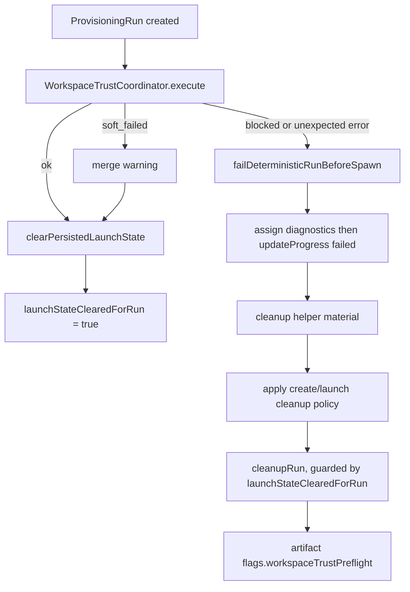
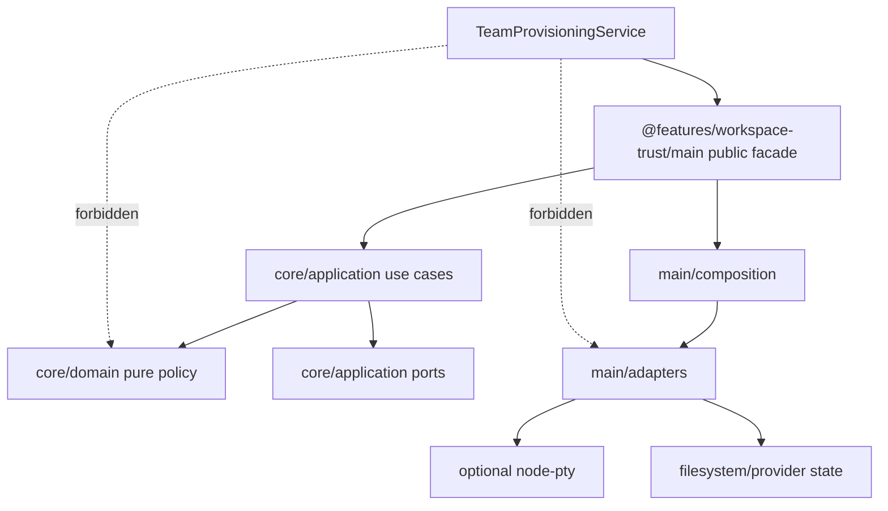
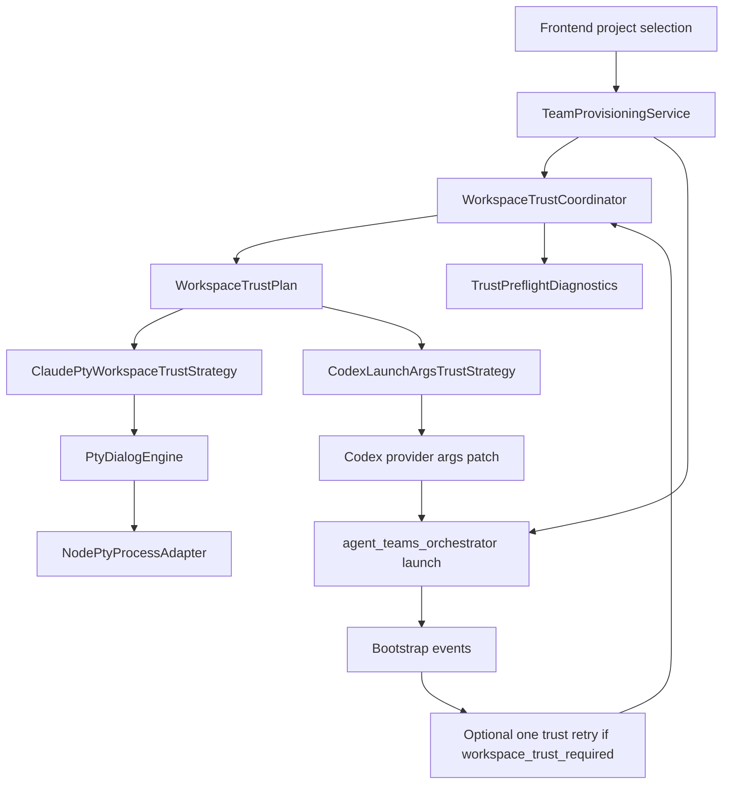
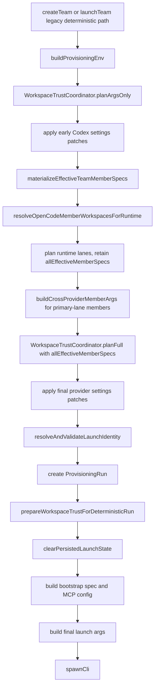
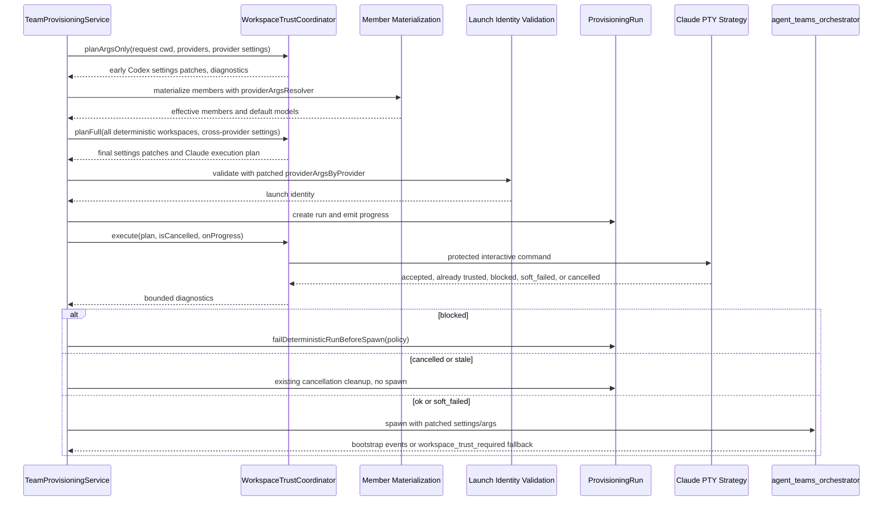
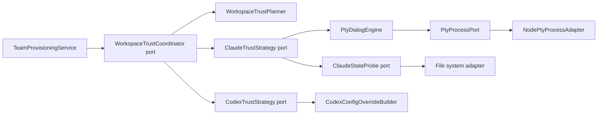
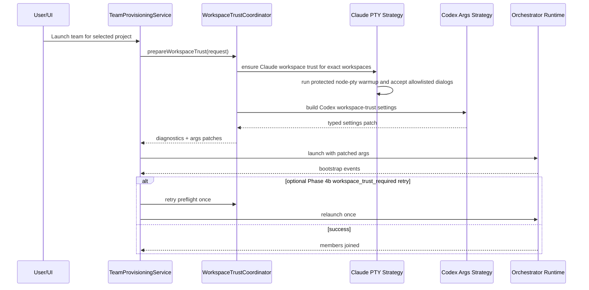
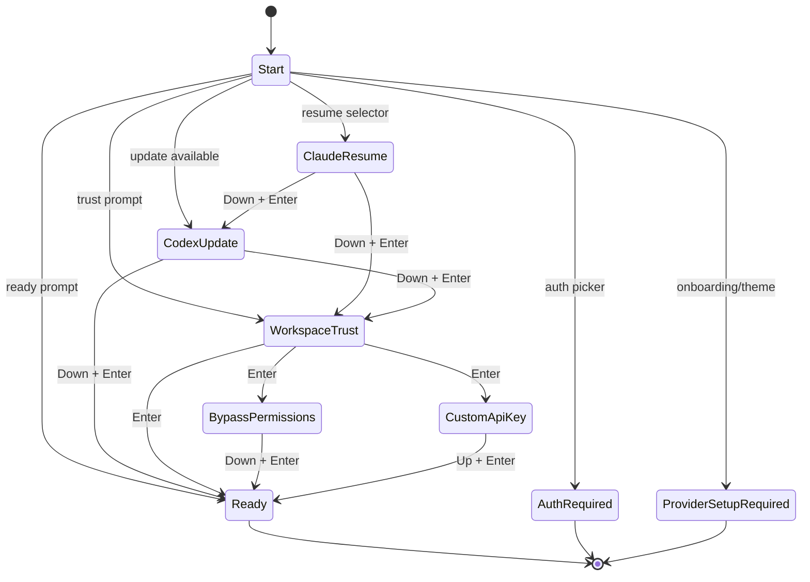
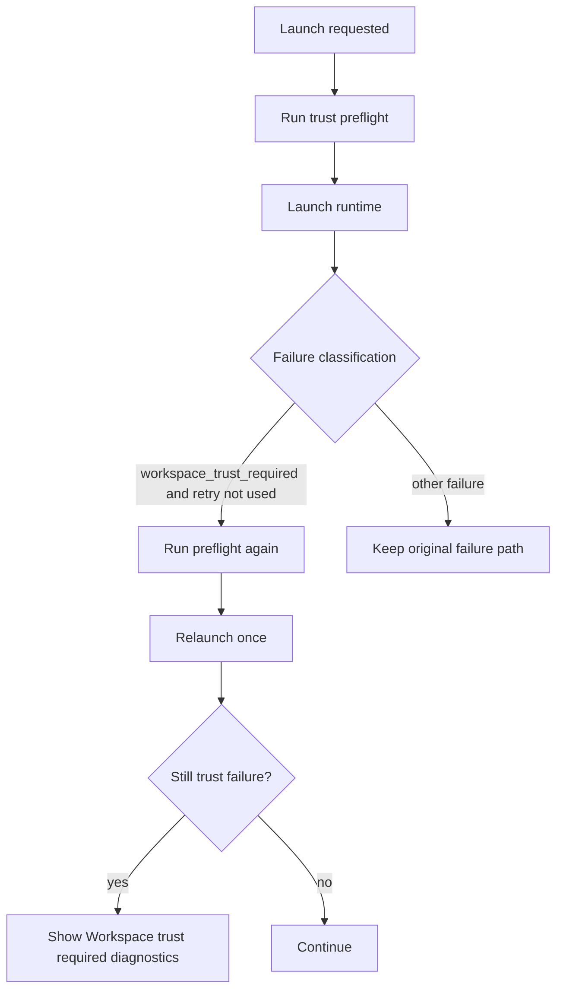

# Workspace Trust Host-Preflight Plan

## Goal

Make team launch work in newly selected workspaces without forcing the user to open Claude Code or Codex manually, while keeping the runtime safe, testable, and easy to extend.

Chosen approach: **Host-preflight + runtime contract**.

Rating:

- Option: Host-preflight + runtime contract
- Confidence: 8/10
- Reliability: 9/10
- Complexity: 8/10
- Estimated change size: 950-1450 lines in the desktop app, plus 50-180 lines if the orchestrator contract is hardened in the sibling runtime repo.

This plan intentionally avoids changing process launch semantics, permission mode, cleanup, tmux lifecycle, or provider auth. It only prepares exact user-selected workspaces for provider trust gates and improves recovery when a trust gate still blocks launch.

Important 2026-05-13 update: the safest Claude preflight is no longer plain `claude`. Use a protected interactive Claude command that still shows the workspace trust prompt but suppresses project MCP, project/local settings, hooks, and built-in tools as much as Claude Code allows.

## Problem Summary

Recent failures show this class of launch error:

```text
Teammate "alice-reviewer" cannot start in headless process runtime because workspace trust is not accepted for "[path]".
Open that workspace once interactively and accept trust, then launch the team again.
```

The current UI explains the failure, but the product goal is stronger:

- The user selects a project in the frontend.
- The app should prepare that exact project for team launch.
- The user should not need to manually open the workspace in Claude Code or Codex.
- The fix must not weaken provider security globally or trust arbitrary paths.

Important finding: this is not just a Codex issue. The `agent_teams_orchestrator` process runtime checks Claude Code workspace trust before spawning headless teammates, including Codex teammates. So a Codex teammate can fail because the Claude/orchestrator workspace trust state is missing.

## Prototype Findings

Local versions used during compatibility checks:

- Claude Code: `2.1.119`
- Codex CLI: `0.125.0`
- node-pty: `1.1.0`
- Platform: macOS arm64

### Claude Findings

Fresh workspace with seeded Claude profile:

```text
Quick safety check: Is this a project you created or one you trust?
Yes, I trust this folder
Enter to confirm
```

After pressing Enter, Claude writes:

```json
{
  "projects": {
    "/private/.../workspace": {
      "hasTrustDialogAccepted": true,
      "projectOnboardingSeenCount": 1
    }
  }
}
```

Second launch in the same folder skips the trust prompt.

Additional observed Claude startup chains:

```text
trust -> main
trust -> bypass permissions -> main
trust -> custom API key confirmation -> main
empty profile onboarding -> no trust yet
```

Important detail: `hasCompletedProjectOnboarding` can remain `false`, but `hasTrustDialogAccepted: true` is enough for the existing `isPathTrusted()` gate.

### Claude Protected Preflight Findings

Local `claude --help` for `2.1.119` exposes these important flags:

- `--bare` - minimal mode that skips hooks, LSP, plugin sync, attribution, auto-memory, background prefetches, keychain reads, and CLAUDE.md auto-discovery.
- `--strict-mcp-config` plus `--mcp-config` - only load MCP servers from the provided config.
- `--setting-sources user` - load user settings without project/local settings.
- `--settings '{"disableAllHooks":true}'` - explicitly disables hooks for this session.
- `--tools ""` - disables built-in tools for this session.
- `-p`/`--print` is not suitable because help says workspace trust is skipped in print mode.
- `doctor` is not suitable because help says workspace trust is skipped and `.mcp.json` stdio servers can be spawned for health checks.

PTY smoke without pressing Enter confirmed these variants still show the workspace trust prompt in a new folder:

```text
claude
claude --bare
claude --bare --strict-mcp-config --mcp-config <empty-mcp-json>
claude --strict-mcp-config --mcp-config <empty-mcp-json> --setting-sources user --settings '{"disableAllHooks":true}'
claude --bare --strict-mcp-config --mcp-config <empty-mcp-json> --setting-sources user --settings '{"disableAllHooks":true}' --tools ""
```

The empty MCP config must be:

```json
{"mcpServers":{}}
```

Plain `{}` is rejected by Claude Code as invalid MCP config.

Recommended candidate command for v1:

```text
claude --bare --strict-mcp-config --mcp-config <temp-empty-mcp.json> --setting-sources user --settings '{"disableAllHooks":true}' --tools ""
```

This still needs one final smoke before default-on: press Enter on the trust prompt in a temp workspace and verify `hasTrustDialogAccepted: true` is persisted in the same state file the orchestrator reads.

### External Research Update

Relevant external facts checked on 2026-05-13:

- Official Claude Code CLI reference documents `--bare`, `--strict-mcp-config`, `--mcp-config`, `--setting-sources`, `--settings`, `--tools`, and warns that `-p` skips workspace trust: [Claude Code CLI reference](https://code.claude.com/docs/en/cli-reference).
- Official Claude Code settings and hooks docs document `disableAllHooks`, managed/user/project/local setting sources, and hook disable behavior: [Claude Code settings](https://code.claude.com/docs/en/settings), [Claude Code hooks](https://code.claude.com/docs/en/hooks).
- Official Claude Code security docs say first-time codebase runs and new MCP servers require trust verification, and that MCP configuration can live in source-controlled project settings: [Claude Code security](https://docs.anthropic.com/en/docs/claude-code/security).
- Recent security research around "TrustFall" argues that accepting folder trust can enable project-defined MCP execution in agentic CLIs. We should not rely on full normal Claude startup for preflight if a protected interactive command works: [Adversa AI TrustFall report](https://adversa.ai/blog/trustfall-coding-agent-security-flaw-rce-claude-cursor-gemini-cli-copilot/).
- A recent Codex issue reports that `-c projects."<path>".trust_level="trusted"` behavior may not be purely ephemeral in affected versions. Treat Codex native config overrides as app-scoped intent, not a hard guarantee that no user config changes can happen: [openai/codex issue #18475](https://github.com/openai/codex/issues/18475).
- Sibling runtime check: Claude CLI uses `-c` for `--continue`, while Codex native exec uses `configOverrides: string[]` and turns those into `-c` only when spawning the Codex binary. Therefore desktop must not append Codex `-c` pairs to Claude/orchestrator launch argv.

### Codex Findings

Codex TUI with real profile in a new workspace:

```text
Update available
Skip
Do you trust the contents of this directory?
Yes, continue
```

The order matters. After skipping the update prompt, the workspace trust prompt appears. This matches GasCity's tested sequence:

```text
Down, Enter, Enter
```

Codex direct CLI with per-launch override:

```bash
codex \
  -c 'projects."/path".trust_level="trusted"' \
  -c 'projects."/realpath".trust_level="trusted"'
```

The trust prompt is skipped for that direct Codex launch. Path keys with spaces, brackets, and quotes work when serialized as quoted TOML keys.

Important refinement: the reusable value is the dotted config override string, not necessarily the CLI `-c` flag. In Agent Teams deterministic launch, pass those values to the sibling runtime through a typed settings/runtime contract, and let Codex native exec convert them to `-c` only at the direct Codex binary boundary.

Codex with an isolated `CODEX_HOME` and no auth shows an auth picker first, not a trust prompt. This must be handled as provider auth required, not workspace trust.

### GasCity Prior Art

GasCity has a battle-tested startup dialog sequence in `internal/runtime/dialog.go`:

1. Claude resume selector - `Down`, `Enter`
2. Codex update dialog - `Down`, `Enter`
3. Workspace trust dialog - `Enter`
4. Bypass permissions warning - `Down`, `Enter`
5. Claude custom API key confirmation - `Up`, `Enter`
6. Rate limit dialog

Relevant behavior from GasCity tests:

- Detects Claude trust: `Quick safety check`, `trust this folder`
- Detects Codex trust: `Do you trust the contents of this directory?`
- Detects Gemini trust: `Do you trust the files in this folder?`
- Peeks deep enough to catch a late trust dialog below prompt text
- Handles stale update snapshots before moving to trust
- Waits a short grace period after an apparent prompt because a dialog can arrive in the next terminal snapshot

We should copy the state-machine idea, not the tmux dependency.

### Other Project Lessons

GasTown older implementation:

- polls tmux pane content after startup
- accepts workspace trust before bypass permission warning
- checks trust text before prompt detection because Codex trust screens can contain a leading `>` line
- has a blind dismiss helper, but only for remediation of already-stalled sessions

What to copy:

- trust-before-prompt matching order
- polling with timeout
- idempotent no-dialog behavior

What not to copy into v1:

- blind key sequences on a healthy launch
- tmux dependency
- generic prompt suffix readiness

Overstory newer implementation:

- provider runtime owns `detectReady(content)` and returns `dialog`, `ready`, or `loading`
- `waitForTuiReady()` calls a provider callback instead of hardcoding Claude only
- tracks handled dialog actions so trust `Enter` is not sent repeatedly
- retries typed dialogs like bypass confirmation after a delay if the dialog persists
- declares Claude ready only after prompt marker plus status bar marker

What to copy:

- provider-owned detection callback shape
- handled-action memory
- two-signal readiness
- dead-session/exit awareness

What to adapt:

- our PTY engine should use `PtyProcessPort`, not tmux
- our v1 preflight can stop after trust persistence, not full TUI readiness

## Second-Pass Codebase Findings

This section records the high-risk integration findings from the current app codebase.

### Deterministic Path Shape

The legacy deterministic paths are in `TeamProvisioningService._createTeamInner` and
`TeamProvisioningService._launchTeamInner`.

Important order today:

1. Acquire per-team lock.
2. Normalize `config.json` and update project path.
3. Resolve Claude binary.
4. Build provider-aware env.
5. Materialize effective member specs.
6. Resolve OpenCode member workspaces.
7. Build cross-provider args.
8. Build `providerArgsByProvider`.
9. Resolve and validate launch identity.
10. Create `ProvisioningRun`.
11. Build bootstrap spec, prompt file, MCP config.
12. Build final launch args.
13. Spawn CLI process.

The trust work cannot be inserted as a single block without risk. It needs three phases:

- **Early settings-only plan phase** immediately after `buildProvisioningEnv`, because Codex provider settings can affect default model resolution inside `materializeEffectiveTeamMemberSpecs()`.
- **Full plan phase** before launch identity validation, because Codex runtime-trust settings must affect `readRuntimeProviderLaunchFacts()` and final runtime settings.
- **Execute phase** after `ProvisioningRun` exists, because Claude PTY warmup can take seconds and should report progress/diagnostics.

### Provider Args Risk

Codex provider settings/args are used in several places:

- Primary provider args from `buildProvisioningEnv`.
- Cross-provider args from `buildCrossProviderMemberArgs`.
- `providerArgsByProvider` passed into `resolveAndValidateLaunchIdentity`.
- Final `launchArgs`.
- Flattened cross-provider member args pushed after primary runtime args.

Risk: if Codex is a **secondary teammate** under an Anthropic lead, adding trust only to primary provider args will not reach the spawned Codex teammate. The opposite mistake is worse: appending Codex native `-c` to Claude launch argv makes Claude interpret `-c` as `--continue`.

Rule: apply Codex trust intent only through surfaces that are known to carry Codex settings or Codex native config overrides:

- `providerArgsByProvider.get('codex')`
- primary `runtimeArgsPlan.providerArgs` when lead provider is Codex
- flattened cross-provider settings when Codex is a cross-provider teammate
- sibling runtime Codex native `configOverrides` after validating the override values
- any future one-shot runtime probe that takes Codex provider settings

### Progress And Artifact Risk

Before `ProvisioningRun` exists, failures can throw without launch progress/artifact context. After `ProvisioningRun` exists, the service can:

- update progress
- append provisioning trace lines
- include diagnostics in launch failure artifacts
- clean up generated bootstrap files if a later step fails

Rule: the plan phase must not throw for normal trust problems. It should return diagnostics and arg patches. The execute phase should also prefer diagnostics over throw, except for deterministic local errors such as invalid cwd.

### PTY Pattern Already Exists

The app already has `ClaudeDoctorProbe` and `PtyTerminalService` patterns:

- `node-pty` is an optional native dependency.
- imports must be graceful.
- PTY startup can throw and must become a diagnostic, not app crash.
- output should be bounded.
- `pty.kill()` is best effort.

The workspace trust PTY adapter should reuse those patterns rather than adding direct `require('node-pty')` calls in the launch service.

### OpenCode Boundary

`_createTeamInner` and `_launchTeamInner` do not handle pure OpenCode teams routed through the runtime adapter. Mixed OpenCode secondary lanes are handled later. V1 should target the legacy deterministic create/launch paths and exact workspaces in `allEffectiveMemberSpecs`.

Do not pull OpenCode runtime adapter launch into this change unless a separate OpenCode trust gate appears. That keeps the blast radius small.

## Third-Pass Integration Findings

This section records additional constraints found after reading the current app and sibling runtime code more closely.

### Service Injection Constraint

`TeamProvisioningService` has a large positional constructor used by many tests. Adding another constructor parameter is technically possible, but it increases test churn and makes dependency order more brittle.

Safer integration:

- add a private `workspaceTrustCoordinator` field or lazy getter
- add `setWorkspaceTrustCoordinator(coordinator: WorkspaceTrustCoordinator | null): void`
- follow the existing setter pattern used by `setRuntimeAdapterRegistry`, `setControlApiBaseUrlResolver`, and runtime turn-settled providers
- keep constructor signature unchanged

Rating: 🎯 9   🛡️ 9   🧠 3, ~20-35 LOC.

Avoid in v1:

- converting the whole service constructor to an options object
- threading the coordinator through every existing test constructor call
- importing `node-pty` from `TeamProvisioningService`

### Progress Schema Constraint

`TeamLaunchDiagnosticItem.code` is a fixed TypeScript union. Adding `workspace_trust_preflight` there is a schema change and should come with renderer tests.

V1 should avoid that surface:

- use `progress.message` for temporary live status
- use `progress.warnings` for short non-blocking warning strings
- store structured trust preflight data on `run.workspaceTrustDiagnostics`
- copy structured trust preflight data into artifact `flags.workspaceTrustPreflight`

Only add UI diagnostic rows later if needed, with:

- `TeamLaunchDiagnosticItem.code` union extension
- renderer copy-diagnostics test
- member card/detail diagnostic rendering test

Rating: 🎯 9   🛡️ 10   🧠 3, ~25-45 LOC for v1 artifact-only diagnostics.

### Artifact Pack Constraint

`writeLaunchFailureArtifactPackBestEffort()` already has a flexible `flags` object in the manifest. That is the safest place to put structured workspace trust preflight data in v1.

Add:

```ts
flags: {
  ...existingFlags,
  workspaceTrustPreflight: run.workspaceTrustDiagnostics ?? null,
}
```

Do not add raw terminal transcripts here. Store bounded, redacted facts only:

- provider
- workspace path or hash according to existing path exposure policy
- status
- matched dialog ids
- actions
- elapsedMs
- error code

### Runtime Security Constraint

The sibling `agent_teams_orchestrator` uses Claude workspace trust as a security gate for more than teammate spawn:

- headless teammate process startup checks `isPathTrusted(workingDir)`
- hooks are skipped until workspace trust is accepted
- auth helpers are guarded by `checkHasTrustDialogAccepted()`
- MCP headers helpers are guarded by trust

So the host must not disable the runtime gate. The host should prepare trust through the provider-owned flow, then let the runtime keep enforcing trust.

This confirms the v1 rule: no global bypass flag and no direct config write as the normal path.

### Provider Args Constraint

`buildTeamRuntimeLaunchArgsPlan()` reads `providerArgs` from `envResolution.providerArgs`.

Safer than changing the method signature:

```ts
const envResolutionForLaunch = {
  ...provisioningEnv,
  providerArgs: providerArgsForLaunch,
}
```

Then pass `envResolutionForLaunch` into `buildTeamRuntimeLaunchArgsPlan()`.

`mergeJsonSettingsArgs()` only merges `--settings` JSON args. For deterministic Agent Teams launch, Codex trust should normally be represented as JSON settings that the sibling runtime consumes, not as direct `-c` pairs on the Claude CLI command.

Arg ordering rule:

- final launch currently pushes extra args before provider args
- app-managed Codex trust settings should live in app-managed provider settings so `mergeJsonSettingsArgs()` can combine them with existing Codex settings
- direct Codex CLI `-c` is allowed only at the Codex binary boundary, not at the Claude launch boundary
- if Codex native config override precedence changes, switch the sibling runtime adapter to explicit validated merge of user `projects` entries plus app-owned workspace keys

Probe ordering rule:

- `readRuntimeProviderLaunchFacts()` receives only provider args, not user extra args
- therefore Codex trust settings must be patched into `providerArgsByProvider` before launch identity validation
- do not rely on final `launchArgs` for provider facts

### Runtime Path Matching Constraint

The runtime `isPathTrusted(dir)` walks parent directories from `resolve(dir)`. The host `ClaudeStateProbe` should mirror this:

- check exact resolved cwd
- check exact realpath cwd
- check parent directories up to root
- treat a trusted parent as trusted for a child
- do not write trust to a parent unless the provider itself chooses that key

This lets us skip PTY when the user already trusted a repository root and then launches a subdirectory.

## Fourth-Pass Failure Scope Findings

The most dangerous integration bug is not prompt matching. It is inserting preflight after `ProvisioningRun` is created but outside the existing cleanup scopes.

Current launch shape:

- `run` is inserted into `runs` and `provisioningRunByTeam`
- progress trace is initialized
- persisted launch state is cleared
- bootstrap files are written inside a local `try/catch`
- spawn is inside another local `try/catch`
- `cleanupRun()` writes artifacts and removes run tracking, but does not restore the prelaunch config backup

If workspace trust `execute()` throws in the wrong place, the service can leave:

- `provisioningRunByTeam` pointing at a dead run
- normalized config not restored
- Anthropic helper material not cleaned
- progress retained without a failure artifact
- stale launch state cleared without a corresponding launch attempt

### Pre-Spawn Failure Helper

Add a small helper for failures after `run` exists and before `spawnCli()` succeeds:

```ts
private async failDeterministicRunBeforeSpawn(
  run: ProvisioningRun,
  input: {
    mode: 'create' | 'launch'
    message: string
    error: string
    provisioningEnv: ProvisioningEnvResolution
    cleanupPolicy: DeterministicPreSpawnCleanupPolicy
  }
): Promise<never>
```

Responsibilities:

1. assign bounded `run.workspaceTrustDiagnostics` if the failure came from preflight
2. `updateProgress(run, 'failed', input.message, { error: input.error, warnings: run.progress.warnings })`
3. `run.onProgress(run.progress)`
4. cleanup Anthropic helper material if present
5. apply the typed create/launch cleanup policy
6. call `cleanupRun(run)` so artifacts and retained progress are handled consistently
7. throw an `Error` with the same message

The diagnostics assignment must happen before `cleanupRun(run)`, because the failure artifact writer is idempotent per run and may run during cleanup.

Use this helper for workspace trust `blocked` results and unexpected preflight exceptions after run creation.

Do not manually duplicate `this.runs.delete(...)` and `this.provisioningRunByTeam.delete(...)` in the new preflight path. The existing code already has several manual cleanup branches, and adding one more is how subtle lifecycle drift happens.



### Exact Execute Placement

Recommended v1 placement:

1. create `run`
2. insert `run` into maps
3. initialize provisioning trace and emit initial progress
4. run `WorkspaceTrustCoordinator.execute()` inside a guarded pre-spawn block
5. if blocked, call `failDeterministicRunBeforeSpawn(...)`
6. if soft-failed, merge warning and continue
7. then clear persisted launch state and continue current bootstrap flow

Reason for running before `clearPersistedLaunchState`: if preflight blocks before any runtime launch starts, the app should not erase the previous launch snapshot as if a new launch had begun.

Required guard: initialize `run.launchStateClearedForRun = false` and set it to `true` only after `clearPersistedLaunchState()` succeeds. `cleanupRun()` must use this flag before persisting failed launch snapshots or finalizing unconfirmed bootstrap members for a launch run. Otherwise a preflight-blocked relaunch can still overwrite the previous launch snapshot even though no runtime process was spawned.

Create mode detail: run the helper before team meta/tasks directories are created. That keeps create cleanup minimal and avoids deleting any pre-existing unrelated team data if a future branch changes existence checks.

Launch mode detail: run the helper after `normalizeTeamConfigForLaunch()` and `updateConfigProjectPath()` because the launch flow already mutates config before run creation. A blocked launch preflight must restore the prelaunch config through the typed cleanup policy.

If later product behavior wants clearing earlier, it should be a deliberate change with a test that covers stale launch state UI.

### Preflight Env Constraint

Claude PTY preflight should not use the final runtime env blindly.

Use a derived env:

```ts
const trustPreflightEnv = buildWorkspaceTrustPreflightEnv(shellEnv)
```

Keep:

- `HOME`
- `USERPROFILE`
- `PATH`
- `SHELL` / `COMSPEC`
- `TERM`
- `CLAUDE_CONFIG_DIR`
- normal user auth env already present in the shell

Remove:

- `CLAUDE_ENABLE_DETERMINISTIC_TEAM_BOOTSTRAP`
- `CLAUDE_TEAM_CONTROL_URL`
- app-managed Anthropic helper env vars
- runtime turn-settled hook env vars
- transient team launch nonce/env vars

Reason: preflight is not a team runtime. It should only let Claude Code show and persist workspace trust. It should not execute app-managed helper paths or runtime hooks before trust is established.

Rating: 🎯 8   🛡️ 9   🧠 5, ~40-80 LOC with tests.

## Fifth-Pass Reliability Findings

This pass focuses on the parts that can still fail after the high-level design is correct.

### Concurrency Scope

`TeamProvisioningService.withTeamLock()` serializes launches per team name, not per workspace. Two different teams can launch against the same selected workspace at the same time.

Add `WorkspaceTrustLockRegistry` in the workspace-trust feature:

- lock key: `${provider}:${normalizedRealpath}`
- in-process promise chaining for normal app usage
- optional file lock using the existing `withFileLock` helper for cross-window or duplicate app instances
- acquire timeout: 5 seconds for plan-free locks, 20 seconds for active PTY preflight
- stale timeout: 30 seconds
- waiting for a lock should be cancellable

Behavior:

- if another launch is already preparing the same workspace, wait for it
- after lock wait, re-run the state probe before spawning PTY
- if the other launch already accepted trust, return `already_trusted_after_wait`
- if lock acquisition times out, return `soft_failed` and let runtime classification handle any remaining trust issue

Rating: 🎯 9   🛡️ 9   🧠 5, ~70-120 LOC.

### Cancellation Contract

Preflight must be cancellable because it runs after `ProvisioningRun` exists.

Add to `WorkspaceTrustExecutionPlan`:

```ts
isCancelled(): boolean
onProgress(event: WorkspaceTrustProgressEvent): void
```

Rules:

- check cancellation before acquiring lock
- check before spawning PTY
- check after every terminal snapshot
- check before every key action
- if cancelled, kill PTY and return `cancelled`
- `TeamProvisioningService` maps `cancelled` to the existing launch cancellation path, not a trust failure

Do not use a long uninterruptible `Promise.race` around the whole preflight. The engine should poll in small intervals and notice cancellation.

### Claude PTY Command Shape

Default Claude preflight command should be protected, not just boring:

```text
claude --bare --strict-mcp-config --mcp-config <temp-empty-mcp.json> --setting-sources user --settings '{"disableAllHooks":true}' --tools ""
```

Do not pass:

- team bootstrap args
- `--team-bootstrap-spec`
- `--mcp-config`
- `--dangerously-skip-permissions`
- user `extraCliArgs`
- model/effort args

Reason: the goal is only to let Claude Code persist workspace trust for the selected cwd. Passing launch args can trigger extra provider setup, hooks, MCP, permission prompts, or model-specific behavior.

The protected command also reduces the risk that accepting trust immediately loads project MCP, project/local settings, hooks, or tools before the preflight can kill the PTY. The dialog engine may still know about bypass/custom API prompts because users can have global settings that surface them, but the strategy should not intentionally create those prompts.

Command fallback order:

1. Protected modern command - 🎯 9   🛡️ 9   🧠 6, ~80-140 LOC including flag detection and temp MCP cleanup. Chosen for v1 if the final persistence smoke passes.
2. Strict MCP/settings command without `--bare` - 🎯 8   🛡️ 8   🧠 5, ~60-110 LOC. Fallback for Claude builds that do not support `--bare`.
3. Plain `claude` PTY auto-accept - 🎯 8   🛡️ 5   🧠 4, ~40-80 LOC. Do not default now because it can load more project/user startup behavior after trust.

Flag compatibility rule:

- Discover support with cached `claude --help` text or optimistic spawn diagnostics.
- If protected flags are unsupported, return `preflight_unavailable_or_unprotected` as a soft failure unless an explicit experimental env flag allows the lower-safety fallback.
- Do not silently downgrade to plain `claude` in production defaults.

### Post-Trust Exit Rule

After a trust action, success probing outranks dialog clearing.

Flow:

1. detect workspace trust prompt
2. send allowlisted `Enter`
3. wait a short settle delay
4. probe Claude state
5. if trust is persisted, kill PTY immediately and return success

Do not wait for full TUI readiness after trust is persisted.

Reason: after trust is accepted, Claude may begin loading project config, MCP, hooks, or auth helpers. The selected workspace is now trusted, but preflight should still minimize side effects by exiting as soon as the trust bit is durable.

### Path Canonicalization Contract

Use two path forms everywhere:

- `displayCwd`: what the user selected and what diagnostics can show
- `configKeyCwd`: path normalized like the runtime config key

Rules:

- `realCwd` uses `fs.promises.realpath` when available
- `configKeyCwd` uses path normalize plus backslash-to-forward-slash, matching sibling runtime `normalizePathForConfigKey`
- comparison key uses `normalizePathForComparison` so Windows drive letter and separator case do not duplicate locks
- diagnostics include both display and real path when existing launch diagnostics already expose paths
- do not lowercase POSIX paths
- do not trust parent by writing parent key; only treat a persisted trusted parent as covering the child

Tests:

- macOS `/var` and `/private/var`
- symlinked workspace
- Windows `C:\Repo` and `c:/repo`
- UNC path
- path with trailing slash
- deleted workspace during plan

### Feature Flag Semantics

Use a single parsed config object:

```ts
type WorkspaceTrustFeatureFlags = {
  enabled: boolean
  claudePty: boolean
  codexArgs: boolean
  retry: boolean
  fileLock: boolean
}
```

Parsing rules:

- only `'0'`, `'false'`, and `'off'` disable
- only `'1'`, `'true'`, and `'on'` enable explicit experimental flags
- malformed values fall back to default and emit a diagnostic once
- include effective flags in artifact `flags.workspaceTrustPreflight.featureFlags`

Default v1:

- `enabled: true`
- `claudePty: true`
- `codexArgs: true`
- `retry: false`
- `fileLock: true` if lock path can be created, otherwise degrade to in-process lock

### Diagnostics Redaction

PTY raw output can contain account names, emails, org names, or snippets of provider setup text.

V1 diagnostics should store structured facts by default:

- status
- provider
- workspace id/source
- matched rule ids
- action names
- elapsedMs
- bounded error code/message

Only store `rawTail` when:

- preflight fails
- feature flag `AGENT_TEAMS_WORKSPACE_TRUST_DEBUG=1` is set
- the tail has passed the same secret redaction used by launch failure artifacts

Even then, cap raw tail to 8 KiB.

## Sixth-Pass Lifecycle Findings

This pass focuses on integration bugs that can happen even when prompt handling is correct.

### Launch Cancellation State

`ProvisioningRun` is created with progress state `validating`, but `cancelProvisioning()` only allows cancellation in `spawning`, `configuring`, `assembling`, `finalizing`, or `verifying`.

If Claude PTY preflight runs for several seconds while progress remains `validating`, the UI can show an active run that cannot be cancelled through the existing cancel API.

Rule:

- before `WorkspaceTrustCoordinator.execute()`, update progress to cancellable state `spawning` with message `Preparing workspace trust`
- after execute returns `ok` or `soft_failed`, continue current flow
- if execute returns `cancelled`, do not call `failDeterministicRunBeforeSpawn(...)` as a failure; follow existing cancellation semantics
- after execute returns, check `run.cancelRequested`, `run.processKilled`, `stopAllTeamsGeneration`, and whether the run is still current before continuing to `clearPersistedLaunchState`

Rating: 🎯 9   🛡️ 9   🧠 4, ~25-45 LOC plus tests.

### Stop/Shutdown Race

`stopTeam()` can call `cleanupRun(run)` while `_createTeamInner()` or `_launchTeamInner()` is still inside the preflight await. That means the code after `execute()` must tolerate a run that was already cleaned up by user stop or app shutdown.

Add a stale-run guard:

```ts
private isLaunchRunStillCurrent(run: ProvisioningRun): boolean {
  return this.runs.get(run.runId) === run &&
    this.provisioningRunByTeam.get(run.teamName) === run.runId &&
    !run.cancelRequested &&
    !run.processKilled
}
```

Use it after trust preflight and before every subsequent pre-spawn block.

If the run is stale:

- kill any preflight PTY through coordinator cancellation
- do not restore config twice
- do not write a second failure artifact
- throw a cancellation-shaped error only after the existing stop cleanup has already updated progress

### Main Composition Boundary

`TeamProvisioningService` is constructed in `src/main/index.ts` and then configured through setter methods.

V1 wiring:

```ts
teamProvisioningService = new TeamProvisioningService()
teamProvisioningService.setWorkspaceTrustCoordinator(createWorkspaceTrustCoordinator(...))
```

Rules:

- expose main-only composition from `src/features/workspace-trust/main`
- keep `node-pty`, filesystem config probes, temp MCP files, and file locks inside main adapters
- keep root `src/features/workspace-trust/index.ts` free of Electron/native imports
- tests can inject fake coordinator without loading `node-pty`

### Coordinator Shutdown Ownership

The coordinator owns transient PTY sessions. The service owns team launch cancellation.

Contract:

- `WorkspaceTrustCoordinator.execute()` receives `isCancelled`
- `stopTeam()` and `stopAllTeams()` set existing run cancellation flags
- coordinator checks cancellation in small polling intervals and kills active PTY
- optional `dispose()` kills any sessions not tied to a current run
- `TeamProvisioningService.stopAllTeams()` does not need a new broad process killer for preflight; it should only trigger cancellation and let the coordinator clean its own sessions

This avoids adding preflight Claude PIDs to generic team runtime cleanup, where it would be easy to kill unrelated user Claude sessions.

### Provider State Probe Races

Claude may write `.claude.json` while `ClaudeStateProbe` reads it.

Rules:

- read with a small max byte limit
- on JSON parse failure, retry 2-3 times with a short delay
- never log the raw file
- if still unreadable, return `unknown` and let the strategy decide soft failure
- mirror runtime path matching, including parent directory trust

This is especially important on Windows and OneDrive-style filesystems where atomic rename and file visibility can lag.

### Claude Binary Resolution Gap

Local prototype showed `claude` was not in this shell PATH, while `/Users/belief/.local/bin/claude` exists and works. The strategy must use `ClaudeBinaryResolver.resolve()` output, not a hardcoded `claude` command name.

The PTY env can add `path.dirname(claudePath)` to PATH for child tools only if needed, but the spawned executable should be the resolved absolute path.

### PTY Ownership Is Not ChildProcess Ownership

Existing `transientProbeProcesses` tracks `child_process.spawn()` probes. `node-pty` returns `IPty`, not a `ChildProcess`, so it must not be stuffed into that set.

Rules:

- `NodePtyProcessAdapter` owns `IPty` lifecycle.
- `WorkspaceTrustCoordinator` owns the active preflight session registry.
- `TeamProvisioningService` cancels by setting run flags and passing `isCancelled`.
- app shutdown can call optional coordinator `dispose()` through the service setter-owned dependency.
- do not add preflight PTYs to global CLI process tracking, because those helpers are designed for normal child processes and can over-kill.

### Shell Env And Keychain Boundary

`buildEnrichedEnv()` only sets `CLAUDE_CONFIG_DIR` when the user configured a custom Claude base path. Setting it to the default path can break macOS Keychain namespace lookup.

Preflight env rule:

- start from the same enriched env family as runtime, using the resolved `claudePath`
- preserve `HOME`, `USERPROFILE`, `USER`, `LOGNAME`, `PATH`, and custom `CLAUDE_CONFIG_DIR` if present
- do not force `CLAUDE_CONFIG_DIR` to the default `~/.claude`
- strip team runtime env and app-managed helper env after enrichment

## Seventh-Pass Flow Integration Findings

This pass found the biggest missing piece in the earlier plan: the app has two legacy deterministic flows, not one.

### Create And Launch Must Both Be Covered

`createTeam()` and `launchTeam()` have parallel legacy deterministic paths:

- both build provider env
- both materialize member specs
- both resolve OpenCode member workspaces
- both build cross-provider args
- both validate launch identity
- both create `ProvisioningRun`
- both write bootstrap/MCP files
- both spawn Claude CLI

If preflight is added only to `_launchTeamInner`, the very first team creation for a new project can still hit the same trust gate.

V1 scope should be:

- legacy deterministic `createTeam`
- legacy deterministic `launchTeam`
- not pure OpenCode runtime adapter path
- mixed OpenCode side lanes only insofar as their workspaces flow through legacy deterministic launch

Top 3 integration options:

1. Shared helper used by create and launch - 🎯 9   🛡️ 9   🧠 7, ~180-280 integration LOC. Chosen because it prevents drift between the two flows.
2. Implement launch first, create later - 🎯 6   🛡️ 6   🧠 5, ~90-160 LOC. Lower initial work, but leaves first-run new-project failures.
3. Inline duplicate preflight blocks in both flows - 🎯 5   🛡️ 5   🧠 4, ~120-220 LOC. Fast but likely to diverge during future launch fixes.

Recommended helper shape:

```ts
private async prepareWorkspaceTrustForDeterministicRun(input: {
  mode: 'create' | 'launch'
  run: ProvisioningRun
  request: TeamCreateRequest | TeamLaunchRequest
  claudePath: string
  shellEnv: NodeJS.ProcessEnv
  stopAllGenerationAtStart: number
  workspaceTrustPlan: WorkspaceTrustFullPlanResult
  cleanupPolicy: DeterministicPreSpawnCleanupPolicy
}): Promise<WorkspaceTrustExecutionResult>
```

The helper owns:

- progress transition to cancellable `spawning`
- `WorkspaceTrustCoordinator.execute()`
- stale-run guard after await
- result mapping: `ok`, `soft_failed`, `blocked`, `cancelled`
- calling the correct pre-spawn failure cleanup helper

It must not own:

- provider arg patch computation
- bootstrap spec generation
- MCP runtime config generation
- process spawn

### Different Cleanup Policies For Create And Launch

Create and launch clean up different things.

Launch cleanup:

- restore prelaunch `config.json`
- cleanup Anthropic helper material
- remove generated bootstrap files if already present
- preserve existing team data
- do not clear previous launch state if preflight blocks before runtime launch

Create cleanup:

- there may be no previous team files yet
- if preflight runs before team meta/tasks dirs are created, cleanup should only remove run tracking and Anthropic helper material
- if a later shared helper is reused after meta dirs are written, it must delete the create-owned team dir/tasks dir exactly like current create spawn-failure cleanup
- never call `restorePrelaunchConfig()` for create mode

Do not use one boolean like `restorePrelaunchConfig`. Use a typed cleanup policy:

```ts
type DeterministicPreSpawnCleanupPolicy =
  | { mode: 'launch'; restorePrelaunchConfig: true; cleanupCreatedTeamArtifacts?: false }
  | { mode: 'create'; restorePrelaunchConfig?: false; cleanupCreatedTeamArtifacts: boolean }
```

### Early Provider Args Patch Before Default Model Resolution

`materializeEffectiveTeamMemberSpecs()` can call `resolveProviderDefaultModel()` for non-Anthropic members that do not specify a model. That command receives `envResolution.providerArgs` before the full `WorkspaceTrustCoordinator.planFull()` placement.

This matters for Codex because provider args already carry runtime auth intent, and the new trust settings should be consistently present for all provider fact/model probes.

Use two planning phases:

1. **Early settings-only phase**
   - after `buildProvisioningEnv`
   - before `materializeEffectiveTeamMemberSpecs`
   - workspaces: `request.cwd` and `realpath(request.cwd)`
   - providers: request lead provider plus explicit member provider ids
   - output: Codex provider settings patches only
   - no PTY, no locks, no config writes

2. **Full workspace phase**
   - after `resolveOpenCodeMemberWorkspacesForRuntime`
   - workspaces: request cwd plus resolved member/worktree cwd values
   - output: final Codex settings patches plus Claude execution plan
   - dedupe early patches so the final settings contain one app-owned Codex trust override set

Integration rule:

- pass the early provider settings patches into `materializeEffectiveTeamMemberSpecs()` through an optional parameter, or refactor default model resolution to call a provider-arg resolver callback
- do not let `materializeEffectiveTeamMemberSpecs()` import workspace-trust feature internals
- keep the dependency direction as `TeamProvisioningService -> WorkspaceTrustCoordinator port`

Rating: 🎯 8   🛡️ 9   🧠 7, ~80-140 LOC plus tests.

### Progress State Options

The preflight needs to be cancellable. Options:

1. Set progress to existing `spawning` before PTY preflight - 🎯 9   🛡️ 8   🧠 3, ~15-30 LOC. Chosen for v1 because it uses existing cancel states and avoids schema changes.
2. Add `validating` to cancellable states - 🎯 7   🛡️ 7   🧠 3, ~10-25 LOC. Could change semantics for other validation waits and existing tests.
3. Add a new state like `preparing_workspace_trust` - 🎯 6   🛡️ 6   🧠 6, ~60-120 LOC. Cleaner UI but requires shared/renderer state updates.

V1 uses option 1 with message `Preparing workspace trust`.

### Artifact Flags Need Their Own Size Cap

`writeTeamLaunchFailureArtifactPack()` redacts JSON recursively, but `flags` is otherwise flexible. Workspace trust diagnostics must self-limit before being assigned to `run.workspaceTrustDiagnostics`.

Rules:

- max strategy results: 20
- max workspaces per strategy result: 20
- max evidence strings per result: 5
- max evidence string length: 600 chars
- max raw tail: 8 KiB and only under debug/failure
- no env values
- no full provider config file content

## Eighth-Pass Integration Hardening Findings

This pass re-checked the exact current create/launch code paths instead of only the target architecture.

### Default Model Resolution Must Use A Provider Args Resolver

`materializeEffectiveTeamMemberSpecs()` calls `resolveProviderDefaultModel()` for non-Anthropic members without explicit models. It obtains secondary provider env through its local `getProvisioningEnv()` closure, which means a simple patch to the primary `provisioningEnv.providerArgs` is not enough.

Recommended signature change:

```ts
private async materializeEffectiveTeamMemberSpecs(params: {
  ...
  providerArgsResolver?: (input: {
    providerId: TeamProviderId
    providerArgs: string[]
    phase: 'default-model-resolution'
  }) => string[]
}): Promise<TeamCreateRequest['members']>
```

Rules:

- default implementation returns the input args unchanged
- workspace-trust integration passes a resolver created from `planArgsOnly()`
- the resolver is pure and does not import workspace-trust internals into materialization
- only provider args are patched; env objects and auth helper material are not mutated

Why this matters: without this resolver, a Codex secondary member can fail during model probing before the full workspace plan has a chance to patch cross-provider launch args.

Rating: 🎯 8   🛡️ 9   🧠 6, ~45-90 LOC plus tests.

### Cross-Provider Arg Patching Must Happen After Env Resolution

`buildCrossProviderMemberArgs()` builds secondary provider env internally and returns:

- flattened inherited args
- `providerArgsByProvider`
- `envPatch`
- `usesAnthropicApiKeyHelper`

Do not push workspace-trust logic into this method. Instead:

1. Let it return current provider args unchanged.
2. Run `planFull()` using the resolved member workspaces and returned cross-provider provider args.
3. Apply final patches to both `crossProviderMemberArgs.args` and `crossProviderMemberArgs.providerArgsByProvider`.
4. Rebuild `providerArgsByProviderForLaunch` from patched primary and patched cross-provider args.

This keeps `buildCrossProviderMemberArgs()` responsible for provider auth/env only, while workspace trust owns launch arg policy.

Rating: 🎯 9   🛡️ 9   🧠 5, ~55-100 LOC plus tests.

### Pre-Run Disk Artifacts Must Not Increase

Current `buildProvisioningEnv()` can materialize Anthropic API-key helper files before `ProvisioningRun` exists. That is an existing lifecycle risk. The workspace-trust feature should not add any new pre-run disk artifacts.

V1 rules:

- `planArgsOnly()` writes nothing
- `planFull()` writes nothing
- temp empty MCP config is created only inside Claude strategy `execute()`, after `run` exists
- if touching pre-run env failure paths, add best-effort helper cleanup in a separate, focused hardening commit with tests

Do not mix a broad helper-material lifecycle refactor into the first workspace-trust PR unless tests prove the current leak can be fixed narrowly.

Rating: 🎯 8   🛡️ 8   🧠 6, ~0 LOC for v1 scope control, ~40-80 LOC only if separately hardening.

### Launch Config Mutation Window Is Intentional

Launch mode normalizes `config.json` and updates `projectPath` before `ProvisioningRun` is created. Workspace trust execution will therefore happen after those launch mutations.

Required behavior:

- blocked launch preflight restores prelaunch config
- cancelled launch preflight should follow existing stop cleanup without double restore
- create mode must never call launch config restore
- tests should assert restore calls by mode, not just final progress state

This is why the cleanup policy must be typed by mode instead of a loose boolean.

Rating: 🎯 8   🛡️ 9   🧠 5, ~35-70 LOC plus tests.

### Naming Should Avoid Launch-Only Semantics

Names like `failLaunchBeforeSpawn` are easy to misuse from create mode. Use deterministic-run terminology for shared helpers:

- `prepareWorkspaceTrustForDeterministicRun`
- `failDeterministicRunBeforeSpawn`
- `DeterministicPreSpawnCleanupPolicy`
- `WorkspaceTrustLaunchArgContext` can remain launch-arg-specific because it describes CLI args, not the workflow mode

Rating: 🎯 9   🛡️ 8   🧠 2, ~10-25 LOC.

## Ninth-Pass Runtime Contract Findings

This pass checked the sibling orchestrator implementation, not just the desktop app.

### Runtime Trust Key Is Not Always The Exact Cwd

The sibling runtime uses `normalizePathForConfigKey(path)` as:

- Node `path.normalize(...)`
- then backslash-to-forward-slash conversion

It also computes the primary project config key as:

- canonical git root when the cwd is inside a git repo
- otherwise the resolved original cwd

`isPathTrusted(dir)` then walks from `resolve(dir)` to parents and returns true if any ancestor key has `hasTrustDialogAccepted`.

Host probe rule:

- check exact `request.cwd`
- check `realpath(request.cwd)`
- check canonical git root when cheap and available
- check parent directories up to filesystem root
- normalize keys exactly like runtime: path normalize, then backslash-to-forward-slash
- never lowercase POSIX paths
- on Windows, compare case-insensitively for dedupe/locks but preserve the serialized key casing

Do not guess a parent key to write. Let Claude decide where to persist trust. The host only probes all keys the runtime might later accept.

Tests to add:

- selected subdirectory inside a trusted git root skips PTY
- trust accepted from a git subdirectory is observed through the git-root key
- symlinked repo path is checked through original path, realpath, and parent walk
- Windows drive letter case dedupes lock keys but preserves config key text

Rating: 🎯 8   🛡️ 9   🧠 6, ~50-100 LOC plus tests.

### Home Directory Trust Is Not Persisted Reliably

The sibling runtime comments state that when running from the home directory, trust can be session-only. Headless teammate startup uses `isPathTrusted(dir)`, which checks persisted config and does not consult the interactive session latch.

V1 behavior:

- detect `realpath(cwd) === realpath(home)` before Claude PTY
- do not auto-trust home, root, or broad parent directories
- return a blocked diagnostic like `workspace_trust_not_persistable_home`
- keep the provider's exact runtime error if launch still proceeds through a soft-failure path

Top 3 options:

1. Block home-dir preflight with clear diagnostic - 🎯 9   🛡️ 10   🧠 3, ~20-40 LOC. Chosen for v1 because it avoids broad trust.
2. Continue launch and rely on runtime classification - 🎯 6   🛡️ 8   🧠 2, ~5-15 LOC. Less invasive, but user sees the same failure after waiting.
3. Write persisted trust for home directly - 🎯 3   🛡️ 2   🧠 5, ~60-120 LOC. Too broad and security-sensitive.

### Provider Config Writes Need Provider Locks

Claude's own `saveCurrentProjectConfig()` uses a file lock and auth-loss guard before writing `~/.claude.json`. This reinforces the v1 decision not to direct-write Claude trust files.

If a future emergency fallback writes provider config directly, it must:

- take the provider-compatible lock
- re-read before merge
- preserve auth and onboarding state
- create backups according to provider conventions
- use the same config-key normalization
- be behind a separate feature flag

Do not implement that fallback in the first PR.

Rating: 🎯 7   🛡️ 6   🧠 8, 140-260 LOC if ever implemented.

### Competitor Lesson: Dialog Beats Ready

Gastown polls tmux panes and intentionally checks trust dialog text before prompt detection because Codex trust screens can include a leading prompt-looking marker. Overstory tests the same class of precedence: trust/bypass dialogs must win over ready indicators.

Adopt:

- dialog phase has priority over prompt/ready phase
- polling handles render races
- tests replay multiple snapshots where prompt-looking text and dialog text coexist

Do not adopt:

- blind startup dismiss by default
- tmux as the transport
- "prompt suffix means ready" as a trust-preflight success condition

Rating: 🎯 9   🛡️ 9   🧠 4, ~40-80 LOC in dialog-engine tests.

### ProvisioningRun Needs Explicit Trust Fields

`ProvisioningRun` currently has no workspace trust fields, and `TeamProvisioningProgress` should not grow a structured trust payload in v1.

Add only main-process run fields:

```ts
launchStateClearedForRun: boolean
workspaceTrustPlan?: WorkspaceTrustFullPlanResult | null
workspaceTrustExecution?: WorkspaceTrustExecutionResult | null
workspaceTrustDiagnostics?: WorkspaceTrustDiagnosticsManifest | null
workspaceTrustRetryAttempted?: boolean
```

Rules:

- these fields are not sent over IPC as progress
- `launchStateClearedForRun` is a lifecycle guard, not user-facing diagnostics
- `workspaceTrustDiagnostics` is already budgeted/redacted before assignment
- `writeLaunchFailureArtifactPackBestEffort()` copies only `workspaceTrustDiagnostics` into `flags.workspaceTrustPreflight`
- retained progress does not need these fields

This keeps the renderer schema stable and makes the artifact pack the structured diagnostics surface.

Rating: 🎯 9   🛡️ 9   🧠 4, ~25-50 LOC plus artifact tests.

## Tenth-Pass Runtime Lane And Provider Args Findings

This pass re-checked OpenCode routing and provider CLI arg construction. It found two places where a correct preflight feature could still miss real launches.

### Pure OpenCode Runtime Adapter Is Out Of V1

Pure OpenCode teams can be routed through the runtime adapter before the legacy deterministic create/launch flow. That path is a different runtime ownership model and should not call the workspace-trust coordinator in v1.

V1 boundary:

- legacy deterministic `createTeam` and `launchTeam`: use workspace trust preflight
- mixed OpenCode secondary lanes inside a deterministic launch: include their resolved workspace paths
- pure OpenCode runtime adapter launch: do not call workspace trust preflight
- future OpenCode-native trust gate: add a separate strategy and adapter-owned contract

Tests to add:

- pure OpenCode runtime-adapter launch with a fake coordinator asserts coordinator was not called
- mixed OpenCode side lane under a deterministic lead includes the generated side-lane cwd in `planFull()` workspace input
- deterministic create and deterministic launch both pass `allEffectiveMemberSpecs`, not only filtered primary members, into workspace collection

Top 3 options:

1. Keep v1 scoped to deterministic paths and include mixed side-lane workspaces - 🎯 9   🛡️ 9   🧠 5, ~50-90 LOC plus tests. Chosen because it matches current ownership boundaries.
2. Add preflight to pure OpenCode adapter now - 🎯 5   🛡️ 6   🧠 7, ~120-220 LOC. Too easy to mix runtime-adapter and desktop UX policy before a real OpenCode trust failure exists.
3. Ignore OpenCode workspaces completely - 🎯 4   🛡️ 5   🧠 2, ~0-10 LOC. Simple but can miss mixed side-lane generated worktrees.

### Workspace Collection Must Use All Effective Members

The deterministic flow creates `allEffectiveMemberSpecs`, plans runtime lanes, then filters `effectiveMemberSpecs` to primary-lane members. Workspaces must be collected before that filter loses side-lane information.

Rule:

- use `allEffectiveMemberSpecs` for workspace collection and artifact diagnostics
- use `effectiveMemberSpecs` for primary runtime bootstrap semantics exactly as today
- include side-lane OpenCode workspaces only when they flow through this deterministic path
- dedupe by comparison key, but retain `source` and `memberId` evidence for diagnostics

This is a Clean Architecture boundary: workspace trust collection is launch preparation policy, not lane execution policy. It consumes the lane plan output but does not decide lane ownership.

Rating: 🎯 9   🛡️ 9   🧠 5, ~35-70 LOC plus mixed-lane tests.

### Provider CLI Args Accept Early Patches

The current helper shape is:

```ts
function buildProviderCliCommandArgs(providerArgs: string[], args: string[]): string[] {
  return mergeJsonSettingsArgs([...providerArgs, ...args])
}
```

That means app-managed provider settings can be applied before provider fact commands such as `model list` and `runtime status`. This is good: Codex trust intent belongs in provider settings, not in final launch-only raw argv.

Rules:

- patch provider settings before default-model resolution
- patch `providerArgsByProvider` before `resolveAndValidateLaunchIdentity`
- keep command args like `model list` and `runtime status` after provider args
- characterize that `mergeJsonSettingsArgs()` merges app-owned Codex workspace-trust settings with existing forced-login settings
- do not move trust overrides into user `extraCliArgs`

Rating: 🎯 9   🛡️ 9   🧠 4, ~30-60 LOC plus characterization tests.

### Provider Presence Decides Codex Patches, Not Workspace Presence

`planFull()` should always receive the deterministic workspace set because Claude/orchestrator trust applies to every teammate workspace. Codex trust settings, however, should be produced only when Codex is actually present in one of the provider surfaces.

Provider detection inputs:

- resolved lead provider id
- requested member provider ids before materialization
- materialized member provider ids after defaults
- cross-provider args map from `buildCrossProviderMemberArgs()`
- provider facts/default-model probe surface for Codex

Rules:

- Anthropic-only team: no Codex trust settings
- Codex lead: patch primary provider settings and provider facts settings
- Anthropic lead with Codex teammate: patch cross-provider Codex settings and default-model probe settings
- OpenCode-only pure adapter: no v1 patch because this path is outside deterministic launch
- unknown/future provider ids: ignore for Codex strategy and keep diagnostics non-throwing

Rating: 🎯 9   🛡️ 9   🧠 5, ~35-75 LOC plus provider-matrix tests.

### Codex Native Overrides Should Be Repeatable Dotted Values

The earlier plan used one `-c projects={...}` blob. That is riskier than necessary because it replaces the whole `projects` value at the config override layer and creates awkward merging with user-provided project config.

Use one override value per trusted path:

```text
projects."<escaped-config-key>".trust_level="trusted"
projects."<escaped-realpath-key>".trust_level="trusted"
```

Builder contract:

- output `CodexConfigOverride[]`, not one TOML table string
- each item is a value that the sibling Codex native adapter can pass as a single `-c` flag only when spawning Codex
- quoted key segment uses TOML basic-string escaping
- preserve slash/backslash text after runtime-compatible normalization
- dedupe exact config keys after canonicalization
- append app-owned overrides after existing Codex native config overrides inside the sibling adapter where the CLI uses later-wins semantics
- do not parse and rewrite arbitrary user Codex config overrides unless a future test proves CLI precedence changed

Example output:

```ts
[
  'projects."/tmp/project".trust_level="trusted"',
  'projects."/private/tmp/project".trust_level="trusted"',
]
```

Why this is safer:

- it preserves unrelated `projects` entries
- it aligns with Codex CLI `-c <key=value>` syntax at the Codex binary boundary
- it matches the sibling runtime's native `configOverrides: string[]` contract
- it makes order and rollback easier to test

Tests to add:

- quoted path segment with spaces, brackets, quotes, and backslashes
- two repeated override values are preserved by the sibling Codex native adapter
- forced-login `--settings` JSON remains separate from native Codex trust override values
- app overrides are appended after existing sibling Codex native config overrides
- no single `projects={...}` blob is produced by v1 code
- no Codex native override is emitted as `-c` in Claude launch argv

Top 3 Codex override encodings:

1. Repeatable dotted override values passed through typed runtime contract to sibling `configOverrides` - 🎯 9   🛡️ 9   🧠 6, ~90-180 LOC across desktop and sibling runtime. Chosen because it avoids Claude `-c` ambiguity and uses the existing Codex native boundary.
2. Direct Codex CLI `-c projects."<path>".trust_level="trusted"` from desktop - 🎯 6   🛡️ 6   🧠 4, ~45-90 LOC. Valid only for direct Codex binary surfaces, not deterministic Claude/orchestrator launch.
3. Single `-c projects={...}` table blob - 🎯 6   🛡️ 5   🧠 5, ~50-100 LOC. Works in prototypes, but has more merge/clobber risk.

## Eleventh-Pass Cleanup And Restart Findings

This pass checked what happens if preflight blocks after `ProvisioningRun` exists but before the current launch flow calls `clearPersistedLaunchState()`.

### `cleanupRun()` Needs A Launch-State Guard

Current `cleanupRun()` treats any failed `run.isLaunch && !run.provisioningComplete && !run.cancelRequested` run as a launch that already entered runtime bootstrap cleanup. It finalizes unconfirmed members and persists a failed launch snapshot.

That is correct after runtime launch has begun. It is wrong for a workspace-trust preflight that blocks before `clearPersistedLaunchState()`: the previous launch snapshot should remain untouched because no new runtime launch actually started.

Add a narrow run flag:

```ts
interface ProvisioningRun {
  launchStateClearedForRun: boolean
}
```

Rules:

- initialize as `false`
- set to `true` immediately after `clearPersistedLaunchState()` succeeds
- gate launch cleanup finalization on `run.launchStateClearedForRun === true`
- failure artifacts should still be written for failed preflight runs
- retained progress should still be stored
- previous launch snapshot must not be overwritten when preflight blocks before clear

Target cleanup condition:

```ts
const shouldFinalizeFailedLaunchSnapshot =
  !hasNewerTrackedRun &&
  run.isLaunch &&
  run.launchStateClearedForRun &&
  !run.provisioningComplete &&
  !run.cancelRequested
```

This is a small lifecycle hardening that makes the planned preflight placement safe. Without it, the plan's "run before clearing persisted launch state" guarantee is false.

Top 3 options:

1. Add `launchStateClearedForRun` and gate only launch-state finalization - 🎯 9   🛡️ 10   🧠 3, ~20-40 LOC plus tests. Chosen because it is precise and preserves current post-clear behavior.
2. Avoid `cleanupRun()` for preflight-blocked launches - 🎯 6   🛡️ 6   🧠 5, ~40-80 LOC. Risky because it duplicates run-map/progress/artifact cleanup.
3. Move preflight after `clearPersistedLaunchState()` - 🎯 7   🛡️ 5   🧠 2, ~5-15 LOC. Simpler but loses the main safety property and can erase the previous launch snapshot on trust setup failures.

### Preflight Failure Artifact Ordering

`writeLaunchFailureArtifactPackBestEffort()` is idempotent per run. If workspace-trust diagnostics are assigned after the first artifact write, Copy diagnostics will miss the most useful facts.

Ordering rule for `failDeterministicRunBeforeSpawn()`:

1. assign `run.workspaceTrustDiagnostics`
2. update progress to `failed`
3. call `run.onProgress(...)`
4. cleanup helper material and mode-specific disk artifacts
5. call `cleanupRun(run)`

Do not call `writeLaunchFailureArtifactPackBestEffort()` directly from the preflight helper unless the helper also owns the idempotence key and can prove `cleanupRun()` will not write first. The cleaner v1 path is to let `cleanupRun()` write exactly once after diagnostics are already on the run.

Tests to add:

- blocked launch preflight before `clearPersistedLaunchState()` writes artifact with `workspaceTrustPreflight`
- blocked launch preflight before clear does not call `persistLaunchStateSnapshot`
- blocked launch preflight after a simulated clear uses existing failed-launch cleanup behavior
- failed artifact is written once even if the preflight helper and cleanup path both observe failure

Rating: 🎯 9   🛡️ 9   🧠 4, ~35-70 LOC plus tests.

### Direct Teammate Restart Is A Separate Workflow

The code also has direct teammate restart paths:

- `launchDirectTmuxMemberRestart(...)`
- `launchDirectProcessMemberRestart(...)`

Those paths can spawn provider runtimes with their own cwd after a team is already alive. They are not part of issue #100 first-launch/relaunch, and pulling them into the first PR would widen the blast radius.

V1 rule:

- do not wire workspace trust preflight into direct restart paths
- keep direct restart failures classified through existing runtime diagnostics
- make `WorkspaceTrustCoordinator` reusable so a later `prepareWorkspaceTrustForDirectRestart(...)` can call the same port
- document direct restart as a phase 2 extension, not a hidden TODO inside launch integration

Future direct restart helper should be tiny:

```ts
prepareWorkspaceTrustForDirectRestart({
  teamName,
  memberName,
  providerId,
  cwd,
  shellEnv,
  claudePath,
})
```

Top 3 direct-restart options:

1. Exclude from v1 but keep coordinator reusable - 🎯 9   🛡️ 9   🧠 3, ~0-15 LOC now. Chosen because launch reliability is the current bug.
2. Add direct process restart preflight only - 🎯 6   🛡️ 7   🧠 6, ~80-140 LOC. Covers one restart path but creates tmux/process asymmetry.
3. Add all restart preflight now - 🎯 5   🛡️ 6   🧠 8, ~150-260 LOC. Too much workflow risk for the first PR.

### Post-Trust Provider Screens Must Not Become New Automation

The sibling Claude startup flow shows trust before several other screens and side-effectful setup steps: MCP server approvals, external CLAUDE.md include warnings, telemetry/env initialization, Grove policy, and custom API key prompts.

V1 rule:

- after pressing workspace-trust `Enter`, probe persisted trust immediately
- if trust is persisted, kill PTY and return success
- do not automate MCP approvals, external include dialogs, Grove policy, or provider onboarding
- bypass/custom API key rules exist only for observed screens that can appear before trust persistence is readable or in compatibility smoke, not as a reason to keep the PTY alive longer

This mirrors the security intent in the sibling runtime: accept trust for the exact selected folder, then minimize additional provider startup side effects.

Rating: 🎯 9   🛡️ 10   🧠 4, ~20-45 LOC in strategy/engine tests.

### Pending-Key And No-Run Phase Invariant

Both create and launch set a pending provisioning key before the run object exists. Early `planArgsOnly()` happens in that no-run window.

Invariant:

- no-run phase may compute pure arg patches and diagnostics
- no-run phase must not spawn PTY
- no-run phase must not write temp files
- no-run phase must not create provider config sentinels
- any no-run exception must be caught by the existing pending-key cleanup path

This keeps the TOCTOU guard intact without introducing a second run lifecycle before `ProvisioningRun` exists.

Rating: 🎯 9   🛡️ 9   🧠 3, ~10-25 LOC plus tests.

## Twelfth-Pass Feature Boundary, Arg Dialect, And PTY Adapter Findings

This pass focused on the remaining places where a clean plan could still become risky during implementation: feature imports, `node-pty` ownership, Codex/Claude argument dialects, duplicate fallback patches, and diagnostic redaction.

### Feature Boundary Must Be Public And Narrow

The workspace trust feature should be a feature module, not a hidden subfolder of `TeamProvisioningService`.

Allowed imports from team launch code:

```ts
import {
  createWorkspaceTrustCoordinator,
  type WorkspaceTrustCoordinator,
  type WorkspaceTrustFullPlanResult,
} from '@features/workspace-trust/main'
```

Forbidden imports from team launch code:

```ts
// forbidden
import { NodePtyProcessAdapter } from '@features/workspace-trust/main/adapters/output/NodePtyProcessAdapter'
import { StartupDialogRules } from '@features/workspace-trust/main/infrastructure/StartupDialogRules'
import { CodexConfigOverrideBuilder } from '@features/workspace-trust/core/domain/CodexConfigOverride'
```

Reason:

- `TeamProvisioningService` should orchestrate launch lifecycle only.
- prompt matching should change because provider startup changes, not because team launch flow changes.
- Codex settings/runtime-contract syntax should change because Codex runtime syntax changes, not because launch cleanup changes.
- `node-pty` optional native loading should stay behind a port and never leak into tests that only launch fake teams.

Feature import boundary:



Top 3 boundary options:

1. Public feature facade only - 🎯 9   🛡️ 10   🧠 5, ~45-90 LOC of feature shell and exports. Chosen because it keeps launch lifecycle separate from provider automation.
2. Local `team/workspaceTrust` folder with internal exports - 🎯 7   🛡️ 7   🧠 4, ~25-60 LOC. Faster, but makes future provider growth easier to couple into launch service.
3. Direct imports from adapters/domain inside `TeamProvisioningService` - 🎯 4   🛡️ 4   🧠 2, ~10-25 LOC. Too easy to violate SRP and hard to test without native dependencies.

### Do Not Reuse `PtyTerminalService`

`PtyTerminalService` already handles app terminals and optional `node-pty`, but it is the wrong abstraction for trust preflight.

Why not reuse it:

- it is renderer-terminal-facing and tied to `BrowserWindow`/IPC behavior.
- it owns interactive terminal sessions, not short provider startup probes.
- it may keep session state that is useful for UI terminals but undesirable for headless preflight.
- workspace trust preflight needs bounded raw-tail capture, allowlisted key actions, and immediate cleanup.

Use a new adapter:

```ts
export class NodePtyProcessAdapter implements PtyProcessPort {
  async spawn(input: PtySpawnInput): Promise<PtySessionPort> {
    const pty = loadOptionalNodePty()
    if (!pty.ok) {
      return skippedPtySession('node_pty_unavailable', pty.error)
    }
    return spawnBoundedProviderProbe(pty.module, input)
  }
}
```

Rules:

- adapter may use the same optional `require('node-pty')` pattern as terminal service.
- adapter must not import `BrowserWindow`.
- adapter must not register app terminal sessions.
- missing native addon returns `pty_unavailable` diagnostic, not a thrown launch crash.
- test core with fake `PtyProcessPort`; test adapter with one small optional-load unit.

Top 3 PTY ownership options:

1. Dedicated `NodePtyProcessAdapter` behind `PtyProcessPort` - 🎯 9   🛡️ 9   🧠 5, ~80-150 LOC. Chosen because it isolates native/process lifecycle.
2. Wrap `PtyTerminalService` from workspace trust feature - 🎯 6   🛡️ 6   🧠 4, ~40-80 LOC. Reuses code but leaks renderer terminal semantics into launch preflight.
3. Spawn normal `child_process` and hope prompts print enough - 🎯 4   🛡️ 4   🧠 3, ~30-60 LOC. Not reliable for TUIs and misses the core issue.

### Launch Arg Patches Need Dialect, Owner, And Dedupe

The earlier type was too raw:

```ts
type WorkspaceTrustLaunchArgPatch = {
  provider: WorkspaceTrustProvider
  args: string[]
  appliesTo: 'primary' | 'cross_provider' | 'provider_facts' | 'default_model_probe'
  reason: string
}
```

That is not enough to prevent mistakes. A patch must say which CLI dialect consumes it and where it is safe to apply.

Safer contract:

```ts
export type WorkspaceTrustLaunchArgPatch = {
  id: string
  owner: 'workspace-trust'
  targetProvider: WorkspaceTrustProvider
  targetSurface:
    | 'primary_provider_args'
    | 'cross_provider_member_args'
    | 'provider_facts_probe'
    | 'default_model_probe'
  dialect:
    | 'codex-native-config-override'
    | 'claude-codex-runtime-settings'
    | 'codex-direct-cli-config'
  args: string[]
  dedupeKey: string
  sourceWorkspaceIds: string[]
  reason: string
}
```

Application rules:

- `claude-codex-runtime-settings` is the v1 desktop-to-sibling contract for deterministic Agent Teams launch.
- `codex-native-config-override` may only be applied inside the sibling Codex native adapter before spawning the Codex binary.
- `codex-direct-cli-config` is allowed only for future direct Codex CLI probes, not for Claude/orchestrator launch.
- no Codex dialect may append `-c` to pure Anthropic Claude CLI args.
- unknown target surface returns a skipped diagnostic, not a best-effort append.
- patch applier is pure: input args in, derived args out, no mutation.
- exact app-owned override sequence is not appended twice.
- never remove arbitrary user-provided Codex config overrides.

This is the narrowest way to support fallback/future phases without mixing provider syntax into launch orchestration.

Top 3 arg patch models:

1. Typed patch with dialect, owner, target surface, and dedupe key - 🎯 9   🛡️ 10   🧠 5, ~90-160 LOC plus tests. Chosen because it prevents wrong-provider args and duplicate fallback patches.
2. Raw `args: string[]` append helper - 🎯 6   🛡️ 5   🧠 2, ~25-50 LOC. Simple but fragile during retries and cross-provider launch.
3. Full parser/merger for all provider args - 🎯 6   🛡️ 7   🧠 9, ~250-450 LOC. Too broad for v1 and likely to create parser bugs.

### Codex Arg Dialect Boundary

There are at least two Codex-related launch surfaces in this repo family:

- direct Codex binary style, where `-c key=value` is native to Codex.
- Claude/orchestrator multimodel style, where Codex preferences are passed through Claude `--settings` JSON and later consumed by runtime code.
- sibling Codex native executor style, where `configOverrides: string[]` is converted to direct Codex `-c` only at the Codex binary boundary.

Do not assume every place that mentions Codex can consume the same argument shape.

V1 rule:

- desktop deterministic launch emits Codex trust as `--settings` JSON, not direct `-c`.
- sibling runtime validates the settings payload and appends matching values to Codex native `configOverrides`.
- do not append Codex native `-c` to primary Anthropic provider args or any Claude CLI argv.
- characterize `buildInheritedCliFlags` in the sibling runtime to prove app-owned settings survive Anthropic lead -> Codex teammate.
- characterize desktop `buildProviderCliCommandArgs(...)` so provider facts/default model probes keep existing order and merge app trust settings.
- if a Codex surface cannot be proven, emit `codex_trust_settings_surface_unknown` diagnostic and leave current behavior intact.

Required tests:

- Anthropic-only team receives no Codex trust settings.
- Codex lead receives app-owned Codex workspace-trust settings.
- Anthropic lead with Codex teammate receives app-owned settings that `buildInheritedCliFlags` preserves for the Codex teammate.
- default model probe for Codex member receives merged app-owned settings.
- provider facts probe for Codex receives merged app-owned settings.
- pure Claude primary provider args do not receive Codex native `-c`.
- repeated application of the same patch does not duplicate override values.
- existing sibling Codex native `configOverrides` remain in place.

### Borrow From GasCity, But Do Not Copy Its Coupling

What to borrow:

- PTY automation is valid for real TUI startup screens.
- update dialogs and trust dialogs can appear in sequence.
- stale terminal text must not cause repeated key presses.
- tests should be snapshot-driven and replayable.

What to improve:

- use provider state probe as the success condition, not only screen text.
- kill provider PTY as soon as trust state persists.
- use a protected Claude command so project MCP/hooks/tools are not loaded.
- keep PTY automation in desktop host, not in the headless runtime executor.
- keep fallback as typed diagnostics, not blind extra key presses.

Rating: 🎯 9   🛡️ 9   🧠 5, mostly tests and architecture boundaries.

### Diagnostic Redaction Should Reuse Existing Launch Artifact Policy

Workspace trust should not invent a second redaction system.

Rules:

- structured diagnostics by default.
- raw PTY tail only when debug flag is on and status is failed/blocked.
- raw tail must pass through the same redaction helper used for launch artifacts or a shared redactor extracted from it.
- diagnostic budget is applied before assigning to `run.workspaceTrustDiagnostics`.
- artifact manifest stores effective feature flags, omitted counts, statuses, and evidence tokens, not full config files or env.

Top 3 redaction options:

1. Extract/reuse launch artifact redaction helper - 🎯 9   🛡️ 9   🧠 4, ~40-90 LOC. Chosen because diagnostics stay consistent.
2. New workspace-trust-only redactor - 🎯 7   🛡️ 6   🧠 4, ~40-80 LOC. Easier locally, but policy drift is likely.
3. Do not include any PTY tail ever - 🎯 7   🛡️ 10   🧠 1, ~5-10 LOC. Safest but weak for field debugging.

## Thirteenth-Pass Sibling Runtime Contract And Launch Lifecycle Findings

This pass rechecked the sibling runtime and the current `TeamProvisioningService` integration points. It changes the Codex part of the plan: direct Codex `-c` is valid, but not on Claude/orchestrator argv.

### Claude `-c` Collision Is A Hard Boundary

Sibling runtime facts:

- `src/main.tsx` defines Claude `-c` as `--continue`.
- sibling Codex native `execRunner` accepts `configOverrides: string[]` and converts each value into direct Codex `-c`.
- `buildInheritedCliFlags()` propagates `--settings` inline JSON, but it does not propagate arbitrary Codex `-c` pairs.
- cross-provider inherited flags strip model/effort only; settings survive provider boundary.

Therefore:

- desktop must not append `-c projects...` to Claude launch args.
- desktop should send app-owned Codex workspace trust as inline settings JSON.
- sibling runtime should validate that settings payload and append values to Codex native `configOverrides`.
- direct Codex `-c` remains valid only for direct Codex PTY/probe/future direct binary surfaces.

Suggested settings shape:

```json
{
  "codex": {
    "agent_teams_workspace_trust": {
      "config_overrides": [
        "projects.\"/path\".trust_level=\"trusted\"",
        "projects.\"/private/path\".trust_level=\"trusted\""
      ]
    }
  }
}
```

Sibling validation rules:

- accept only an object at `codex.agent_teams_workspace_trust`.
- accept only a bounded string array at `config_overrides`.
- accept only override values matching `projects."<path>".trust_level="trusted"`.
- reject values containing NUL, newline, unrelated keys, or non-string entries.
- bound count and total bytes.
- append after existing `buildCodexNativeMcpConfigOverrides()` values.
- log structured diagnostic if settings are malformed, then skip trust overrides.

Top 3 Codex contract options:

1. Inline settings contract -> sibling `configOverrides` - 🎯 9   🛡️ 9   🧠 6, ~120-220 LOC across both repos. Chosen because it survives teammate inheritance and avoids Claude `-c`.
2. New env var with JSON override values - 🎯 7   🛡️ 7   🧠 5, ~90-160 LOC. Simpler to parse, but tmux/env forwarding and security naming need more care.
3. Desktop direct `-c` append - 🎯 4   🛡️ 3   🧠 3, ~40-80 LOC. Invalid for Claude launch because `-c` means continue.

### Launch Lifecycle Has Four Trust-Safe Windows

Current create path:

1. pending key
2. cwd + Claude binary
3. provisioning env
4. materialization/default model probes
5. worktree resolution
6. runtime lane and cross-provider args
7. launch identity validation
8. create `ProvisioningRun`
9. clear persisted launch state
10. write team meta, members, bootstrap spec, prompt, MCP config
11. validate MCP runtime
12. spawn

Current launch path:

1. pending key
2. read config
3. compatibility repair
4. normalize config and backup/restore boundary
5. update project path
6. cwd + Claude binary
7. provisioning env
8. materialization/default model probes
9. worktree resolution
10. runtime lane and cross-provider args
11. launch identity validation
12. create `ProvisioningRun`
13. clear persisted launch state
14. publish mixed secondary lane status
15. write bootstrap/MCP files
16. write meta/members
17. spawn

Trust-safe windows:

- `planEarly`: after provisioning env, before materialization. Pure settings patches only.
- `planFull`: after `allEffectiveMemberSpecs` and cross-provider args, before launch identity validation. Pure settings patches only.
- `executePreflight`: after `ProvisioningRun`, before `clearPersistedLaunchState`. Claude PTY only, cancellable.
- `spawn`: after clear/write/validate. No new trust side effects.

Do not move Claude PTY before run creation: progress/cancel/artifacts would be weak. Do not move it after `clearPersistedLaunchState`: a blocked trust setup could wipe the previous launch snapshot.

Top 3 placement options:

1. Pure plans before validation, PTY execute after run and before clear - 🎯 9   🛡️ 10   🧠 7, ~160-260 LOC integration. Chosen because it respects both provider probes and launch snapshot safety.
2. PTY before `ProvisioningRun` - 🎯 6   🛡️ 5   🧠 4, ~80-150 LOC. Less lifecycle state, but poor progress/cancel/artifacts.
3. PTY after `clearPersistedLaunchState` - 🎯 7   🛡️ 5   🧠 3, ~60-120 LOC. Simpler, but can erase previous launch state before trust is ready.

### Create And Launch Need Different Failure Policies

Create failures before metadata writes should not delete unrelated existing files. Launch failures after config normalization must restore prelaunch config.

Typed cleanup policy:

```ts
type WorkspaceTrustPreSpawnFailurePolicy =
  | {
      mode: 'create'
      teamName: string
      createdTeamDirectories: false
      cleanupAnthropicHelper: boolean
    }
  | {
      mode: 'launch'
      teamName: string
      restorePrelaunchConfig: true
      launchStateClearedForRun: boolean
    }
```

Rules:

- `create` preflight block before meta writes removes run tracking and helper material only.
- `create` preflight block must not `rm -rf` team/task directories unless this run created them.
- `launch` preflight block restores prelaunch config because normalization/projectPath update already happened.
- `launch` preflight block before clear must not persist a new failed launch snapshot.
- both modes assign workspace trust diagnostics before `cleanupRun()`.

Rating: 🎯 9   🛡️ 10   🧠 6, ~70-130 LOC plus tests.

### Sibling Runtime Changes Are Now Explicit V1 Scope

Old assumption: desktop can solve Codex with launch args only.

Updated assumption: desktop solves Claude/orchestrator trust alone, but Codex-native trust needs a small sibling runtime contract if we want zero user friction for Codex-native turns.

V1 sibling scope:

- add `getCodexWorkspaceTrustConfigOverrides(settingsInline?)`.
- validate and bound settings payload.
- append validated values to `runExec({ configOverrides })` in `turnExecutor`.
- add tests in sibling runtime for valid, malformed, over-limit, and inherited settings.
- keep runtime `isPathTrusted()` gate unchanged.

Out of v1 sibling scope:

- modifying Claude trust persistence.
- accepting trust in headless runtime.
- changing `isPathTrusted()`.
- global Codex config writes.

Rating: 🎯 9   🛡️ 9   🧠 6, ~50-120 sibling LOC plus tests.

## Non-Goals

Do not do these in v1:

- Do not add tmux as a requirement.
- Do not auto-edit Claude trust files as the primary path.
- Do not globally trust parent directories, home directories, or recent projects.
- Do not scan project files to decide trust.
- Do not mutate provider auth state.
- Do not accept unknown prompts.
- Do not change teammate permission mode.
- Do not change process cleanup or lifecycle.
- Do not treat Codex auth picker as a trust prompt.
- Do not hide the exact provider error if preflight fails.

## Architecture

The desktop app owns UX policy. The runtime owns process execution.



### Detailed Runtime Placement



The ordering is intentional:

- early Codex settings patches must exist before default model resolution inside `materializeEffectiveTeamMemberSpecs`.
- final Codex settings patches must exist before `resolveAndValidateLaunchIdentity`.
- Claude PTY warmup should happen after `ProvisioningRun` exists so progress and diagnostics are retained.
- Claude PTY warmup should happen before `clearPersistedLaunchState` so a blocked preflight does not erase the previous launch snapshot.
- Bootstrap files and MCP config should be written after trust warmup, so preflight failures do not leave unnecessary temporary launch files.
- create and launch must use the same helper so first-run project creation and later relaunches do not drift.

### Critical Sequence



### Dependency Direction



Allowed dependencies:

- `TeamProvisioningService` depends only on coordinator types.
- coordinator depends on strategy ports and pure domain helpers.
- strategies depend on provider-specific ports.
- adapters depend on filesystem, `node-pty`, and provider config syntax.

Forbidden dependencies:

- `TeamProvisioningService` -> `node-pty`
- `TeamProvisioningService` -> prompt regexes
- `PtyDialogEngine` -> team launch state
- Codex strategy -> Claude state file
- Claude strategy -> Codex config builder

### Three-Stage Coordinator

```ts
export interface WorkspaceTrustCoordinator {
  planArgsOnly(request: WorkspaceTrustArgsOnlyPlanRequest): Promise<WorkspaceTrustArgsOnlyPlanResult>
  planFull(request: WorkspaceTrustFullPlanRequest): Promise<WorkspaceTrustFullPlanResult>
  execute(plan: WorkspaceTrustExecutionPlan): Promise<WorkspaceTrustExecutionResult>
}
```

`planArgsOnly()`:

- pure or near-pure
- runs after `buildProvisioningEnv`
- sees `request.cwd`, requested providers, provider args, shell env, and `claudePath`
- computes Codex settings patches needed by default model and provider fact probes
- does not inspect member worktrees because they are not resolved yet
- does not spawn PTY
- does not write config or temp files
- should not throw for provider trust setup problems

`planFull()`:

- pure or near-pure
- computes unique workspaces
- computes provider list
- computes final Codex settings patches for primary and cross-provider launch args
- computes Claude execution work
- does not spawn PTY
- does not write trust files
- dedupes early Codex patches so the final launch receives one app-owned override set
- should not throw for provider trust setup problems

`execute()`:

- runs side-effectful strategies
- currently Claude PTY warmup
- updates diagnostics
- uses bounded timeouts
- observes cancellation
- returns `ok`, `soft_failed`, `blocked`, or `cancelled`

This split keeps launch identity validation correct without forcing a long PTY warmup before the UI has a visible run.

### Strategy Ratings After Code Review

| Area | Rating | Reason |
| --- | --- | --- |
| Claude PTY warmup | 🎯 9 / 🛡️ 8 / 🧠 6 | Prototype confirmed it writes `hasTrustDialogAccepted`; risk is prompt matching and cleanup. |
| Codex per-launch args | 🎯 8 / 🛡️ 8 / 🧠 5 | Best scoped intent, but recent Codex issue means we must verify/diagnose possible provider-side config mutation. |
| Three-stage coordinator | 🎯 8 / 🛡️ 9 / 🧠 8 | Best fit for current create/launch order; risk is integration complexity. |
| Direct `.claude.json` write fallback | 🎯 5 / 🛡️ 5 / 🧠 5 | Useful emergency lever but private format and file race risk. Keep out of v1. |
| Codex PTY fallback | 🎯 7 / 🛡️ 7 / 🧠 6 | GasCity-proven for TUI, but not needed for issue #100 path if settings -> native override contract works. Keep engine-ready, do not default. |

### Responsibility Boundaries

`TeamProvisioningService`:

- Knows when a team launch is about to start.
- Knows requested members, providers, cwd, worktrees, and launch args.
- Does not know prompt text or PTY details.

`WorkspaceTrustCoordinator`:

- Builds the trust plan for all launch workspaces.
- Executes provider strategies.
- Produces diagnostics and launch argument patches.
- Owns idempotence and retry policy.

`WorkspaceTrustStrategy`:

- Provider-specific behavior behind one interface.
- Claude strategy handles PTY warmup.
- Codex strategy handles per-launch config override.
- Future Gemini/OpenCode strategies can be added without modifying the coordinator.

`PtyDialogEngine`:

- Generic terminal snapshot state machine.
- Owns prompt detection and key actions.
- Does not know team launch, providers, or config files.

`NodePtyProcessAdapter`:

- Thin adapter around `node-pty`.
- Handles process spawn, snapshot collection, key writes, timeout, and cleanup.

`Runtime contract`:

- Runtime receives prepared workspace and provider args.
- Runtime still enforces trust gates.
- Runtime reports typed trust failure if trust is still missing.

## Clean Architecture Shape

Suggested desktop app layout:

```text
src/features/workspace-trust/
  index.ts
  contracts/
    index.ts
  core/
    domain/
      WorkspaceTrustTypes.ts
      WorkspaceTrustPolicy.ts
      WorkspaceTrustPath.ts
      CodexConfigOverride.ts
      WorkspaceTrustDiagnosticsBudget.ts
    application/
      WorkspaceTrustCoordinator.ts
      WorkspaceTrustPlanner.ts
      WorkspaceTrustArgPatchApplier.ts
      WorkspaceTrustDiagnostics.ts
      WorkspaceTrustLocks.ts
      ClaudePreflightCommand.ts
      ports.ts
  main/
    index.ts
    composition/
      createWorkspaceTrustCoordinator.ts
    adapters/
      output/
        ClaudeStateProbe.ts
        NodePtyProcessAdapter.ts
        FileWorkspaceTrustLockStore.ts
        TempEmptyMcpConfigStore.ts
    infrastructure/
      PtyDialogEngine.ts
      StartupDialogRules.ts
      WorkspaceTrustFeatureFlags.ts
```

Small pure helpers that are only needed by `TeamProvisioningService` can live near the service, but the feature logic should use the canonical `src/features/<feature-name>` shape from `docs/FEATURE_ARCHITECTURE_STANDARD.md`.

Top 3 placement options:

1. `src/features/workspace-trust` with core/application/main layers - 🎯 9   🛡️ 9   🧠 8, ~700-1050 LOC. Best long-term architecture and easiest provider growth.
2. `src/main/services/team/workspaceTrust` local module - 🎯 8   🛡️ 8   🧠 6, ~550-850 LOC. Less churn, but weaker boundary and easier to couple back into team service.
3. Inline helpers inside `TeamProvisioningService` - 🎯 4   🛡️ 4   🧠 3, ~180-300 LOC. Fast, but violates SRP and makes prompt/PTY bugs likely.

Chosen: option 1.

SOLID mapping:

- Single Responsibility - prompt rules, PTY IO, provider strategy, and launch orchestration are separate.
- Open/Closed - new provider support adds a new strategy and rules, not changes in `TeamProvisioningService`.
- Liskov - every strategy returns the same result contract and can be skipped safely.
- Interface Segregation - Codex settings strategy does not depend on PTY; Claude PTY strategy does not depend on Codex config override syntax.
- Dependency Inversion - coordinator depends on ports, not `node-pty` directly.

## Core Types

```ts
export type WorkspaceTrustProvider = 'claude' | 'codex' | 'gemini' | 'opencode'

export type WorkspaceTrustWorkspace = {
  id: string
  displayCwd: string
  cwd: string
  realCwd: string
  configKeyCwd: string
  gitRootConfigKey?: string
  comparisonKey: string
  source: 'team-root' | 'member-worktree' | 'member-cwd' | 'git-root'
  memberId?: string
  persistable: boolean
  nonPersistableReason?: 'home_directory' | 'filesystem_root' | 'unavailable'
}

export type WorkspaceTrustRequest = {
  teamName: string
  launchId: string
  mode: 'create' | 'launch'
  providers: WorkspaceTrustProvider[]
  workspaces: WorkspaceTrustWorkspace[]
  shellEnv: NodeJS.ProcessEnv
  trustPreflightEnv: NodeJS.ProcessEnv
  claudePath?: string
  codexPath?: string
  policy: WorkspaceTrustPolicy
  featureFlags: WorkspaceTrustFeatureFlags
  isCancelled: () => boolean
  onProgress?: (event: WorkspaceTrustProgressEvent) => void
}

export type WorkspaceTrustResult = {
  ok: boolean
  stage: 'args_only_plan' | 'full_plan' | 'execute'
  provider: WorkspaceTrustProvider
  workspaceIds: string[]
  actions: WorkspaceTrustAction[]
  launchArgPatches?: WorkspaceTrustLaunchArgPatch[]
  diagnostics: WorkspaceTrustDiagnostic[]
  error?: string
}

export type WorkspaceTrustExecutionStatus =
  | 'ok'
  | 'soft_failed'
  | 'blocked'
  | 'cancelled'

export type WorkspaceTrustLaunchArgPatch = {
  id: string
  owner: 'workspace-trust'
  targetProvider: WorkspaceTrustProvider
  targetSurface:
    | 'primary_provider_args'
    | 'cross_provider_member_args'
    | 'provider_facts_probe'
    | 'default_model_probe'
  dialect:
    | 'codex-native-config-override'
    | 'claude-codex-runtime-settings'
    | 'codex-direct-cli-config'
  args: string[]
  dedupeKey: string
  sourceWorkspaceIds: string[]
  reason: string
}

export type WorkspaceTrustDiagnosticsManifest = {
  attempt: number
  featureFlags: WorkspaceTrustFeatureFlags
  strategyResults: WorkspaceTrustDiagnosticStrategyResult[]
  omittedCounts?: Record<string, number>
}
```

The important design choice: strategies can either prepare state with side effects, or return typed launch argument patches. That keeps Codex native config overrides out of Claude argv, makes duplicate fallback patches testable, and keeps Claude PTY warmup isolated.

## Ports And Adapters Contract

Keep the core coordinator free from native dependencies and provider file formats.

Core ports:

```ts
export interface WorkspaceTrustStrategy {
  provider: WorkspaceTrustProvider
  planArgsOnly?(request: WorkspaceTrustRequest): Promise<WorkspaceTrustResult>
  planFull(request: WorkspaceTrustRequest): Promise<WorkspaceTrustResult>
  execute?(request: WorkspaceTrustRequest): Promise<WorkspaceTrustResult>
}

export interface PtyProcessPort {
  spawn(input: PtySpawnInput): Promise<PtySessionPort>
}

export interface PtySessionPort {
  readSnapshot(timeoutMs: number): Promise<TerminalSnapshot | null>
  writeAction(action: PtyKeyAction): Promise<void>
  kill(): Promise<void>
}

export interface ProviderStateProbe {
  readTrustState(workspace: WorkspaceTrustWorkspace): Promise<ProviderTrustState>
}

export interface WorkspaceTrustLockPort {
  withWorkspaceLock<T>(
    key: string,
    options: { timeoutMs: number; isCancelled: () => boolean },
    fn: () => Promise<T>,
  ): Promise<T>
}
```

Adapter mapping:

- `NodePtyProcessAdapter` implements `PtyProcessPort`.
- `ClaudeStateProbe` implements `ProviderStateProbe`.
- `WorkspaceTrustLockRegistry` implements `WorkspaceTrustLockPort`.
- `CodexConfigOverrideBuilder` is a pure adapter for Codex native config override values. Only the sibling Codex native adapter turns those values into `-c` flags.
- `TeamProvisioningService` only consumes `WorkspaceTrustCoordinator`.

Testing rule: every provider strategy must be testable without a real provider binary. Real Claude/Codex checks belong in manual smoke scripts, not unit tests.

### Dialog Detection Contract

Use the Overstory shape, not a pile of regexes inside the launch service:

```ts
export type StartupReadinessState =
  | { phase: 'dialog'; ruleId: string; actions: PtyKeyAction[]; retryPolicy: 'once' | 'typed_retry' }
  | { phase: 'ready'; evidence: string[] }
  | { phase: 'setup_required'; code: string; evidence: string[] }
  | { phase: 'loading'; evidence?: string[] }
```

Provider strategy owns `detect(snapshot)`. The engine owns polling, action memory, retry delays, timeout, and cleanup.

Action memory:

- `Enter` trust actions are sent once per dialog rule unless a fresh, clearly new trust screen appears
- typed actions like bypass confirmation may retry after a short delay if the same dialog persists
- unknown screens never receive actions

This is more robust than GasTown's simple sequential polling and avoids blind key sequences.

## Fallback Ladder

The product goal is "launch from frontend with no manual trust prompt". The engineering goal is "do that without silently trusting the wrong thing".

### Claude Ladder

1. Probe state.
   - If exact `cwd`, `realCwd`, git root, or a parent key is already trusted, skip PTY.
2. Non-persistable guard.
   - If the workspace is home/root, return a clear blocked diagnostic instead of broad trust.
3. PTY warmup.
   - Use protected interactive Claude args, not normal startup.
   - Accept only allowlisted workspace trust prompt.
   - Handle known post-trust prompts like bypass permissions and custom API key.
4. Verify state.
   - Check `hasTrustDialogAccepted` through exact, realpath, git-root, and parent candidate keys after PTY action.
5. Soft failure.
   - If PTY unavailable, timeout, or unknown screen appears, continue launch with diagnostics unless the screen is known setup-required.
6. Runtime fallback.
   - If runtime still fails, keep `workspace_trust_required` classification and exact provider error.
7. Optional later retry.
   - Run only once and only after normal cleanup.

Do not use direct `.claude.json` writes in v1. It is tempting because it is simple, but it bypasses the provider's own persistence path and risks config races.

### Codex Ladder

1. Build scoped native config override values.
   - Add repeatable dotted `projects."<path>".trust_level="trusted"` values for exact workspace paths.
2. Carry those values through app-owned Codex settings.
   - Primary Codex launch settings.
   - Secondary Codex teammate settings under another lead provider.
   - Provider facts validation settings.
   - Default model resolution probe settings.
3. Apply direct `-c` only inside sibling Codex native exec.
   - Validate settings payload.
   - Append trusted project override values to `configOverrides`.
   - Let `execRunner` turn values into Codex binary `-c` flags.
4. Keep Codex PTY rules tested but inactive by default.
   - Useful for future direct Codex TUI flows.
5. Auth/setup fallback.
   - If Codex shows auth picker, return `provider_auth_required`.
   - Do not press Enter.

Do not write `~/.codex/config.toml` in v1. Per-launch override is safer because it is scoped to the app launch and easy to roll back.

### Fallback Ratings

| Fallback | Use in v1 | Rating | Notes |
| --- | --- | --- | --- |
| Claude state probe | yes | 🎯 9 / 🛡️ 10 / 🧠 3 | read-only and cheap |
| Non-persistable home/root guard | yes | 🎯 9 / 🛡️ 10 / 🧠 3 | avoids broad unsafe trust |
| Claude PTY warmup | yes | 🎯 9 / 🛡️ 8 / 🧠 6 | provider-owned persistence, bounded risk |
| Runtime typed/text failure | yes | 🎯 9 / 🛡️ 10 / 🧠 2 | already protected by current diagnostics |
| Optional relaunch retry | later | 🎯 7 / 🛡️ 7 / 🧠 8 | useful but lifecycle-sensitive |
| Direct Claude config write | no | 🎯 5 / 🛡️ 5 / 🧠 5 | future emergency flag only |
| Codex settings -> native `configOverrides` | yes, with sentinel | 🎯 9 / 🛡️ 9 / 🧠 6 | safest deterministic-launch path because Claude argv never receives Codex `-c` |
| Direct Codex per-launch dotted `-c` | future direct Codex only | 🎯 7 / 🛡️ 7 / 🧠 4 | valid at direct Codex binary boundary, unsafe on Claude argv |
| Codex PTY fallback | later | 🎯 7 / 🛡️ 7 / 🧠 6 | useful if direct TUI path appears |
| Codex global config write | no | 🎯 4 / 🛡️ 5 / 🧠 4 | unnecessary with `-c` |

## Runtime Flow



## Dialog State Machine

The PTY engine should model startup as phases. It should not classify against a single ever-growing transcript.



Important behavior:

- After an action, the engine should wait for a fresh snapshot or action-settle delay.
- Previously matched stale text must not trigger the same rule again forever.
- A prompt-looking screen should get a short grace window before declaring ready.
- Unknown text should never receive `Enter`.

## Claude Implementation Plan

### What We Need To Solve

Claude/orchestrator trust is the workspace trust gate that blocks headless process teammates.

Current runtime behavior in the sibling orchestrator:

- `isPathTrusted(workingDir)` checks Claude global project trust.
- If false, teammate spawn fails before the provider-specific process starts.
- This affects Codex teammates too.

Therefore, Claude workspace trust preflight must run for every workspace used by a team launch, even if no teammate uses Anthropic as its model provider.

### Claude Strategy

`ClaudePtyWorkspaceTrustStrategy` should:

1. Resolve Claude binary with the same resolver used for launch.
2. For each exact workspace:
   - use `cwd`
   - compute `realCwd`
   - run a short PTY warmup in that cwd with the protected interactive Claude command
   - detect allowlisted startup dialogs
   - press only the required keys
   - stop immediately once trust state is persisted or the workspace is already trusted
3. Record diagnostics without secrets.

The strategy should not send any user prompt to Claude. It starts interactive Claude only long enough to clear startup dialogs.

The strategy should not pass runtime launch args. In particular, do not pass team bootstrap args, MCP config, user extra CLI args, model args, or `--dangerously-skip-permissions`.

Protected command builder:

```ts
buildClaudeWorkspaceTrustPreflightArgs({
  emptyMcpConfigPath,
  supportsBare,
  supportsStrictMcpConfig,
  supportsSettingSources,
  supportsTools,
})
```

Expected modern args:

```text
--bare
--strict-mcp-config
--mcp-config <temp-empty-mcp.json>
--setting-sources user
--settings {"disableAllHooks":true}
--tools ""
```

The temp empty MCP file is app-owned, contains `{"mcpServers":{}}`, and is removed in `finally`.

### Claude Success Criteria

Success if any is true:

- Claude reaches a trusted normal prompt without showing trust.
- Claude trust dialog was accepted and state now contains `hasTrustDialogAccepted: true` for `realCwd` or an ancestor.
- The workspace was already trusted before preflight.
- Another concurrent preflight accepted trust while this launch was waiting for the workspace lock.

Do not require:

- `hasCompletedProjectOnboarding: true`
- a model call
- a session to remain open
- a successful plugin marketplace install

### Claude Dialog Rules

Required rules:

```text
Claude theme onboarding:
  detect: Choose the text style that looks best with your terminal
  action: none in v1
  result: provider_setup_required

Claude workspace trust:
  detect: Quick safety check
  detect: trust this folder
  detect: Yes, I trust this folder
  action: Enter
  success check: state file has hasTrustDialogAccepted true

Claude bypass permissions:
  detect: Bypass Permissions mode
  action: Down, Enter

Claude custom API key:
  detect: Detected a custom API key in your environment
  detect: Do you want to use this API key?
  action: Up, Enter

Claude ready:
  detect: prompt marker plus status/readiness marker
  action: none
```

Do not treat `ClaudeCode v2.x` alone as ready. Prototype showed that string appears on splash/onboarding before the app is actually ready.

Do not treat a single prompt marker as ready. GasTown's prompt-suffix exit is useful for detached tmux sessions, but Overstory's two-signal readiness is safer for a provider TUI. For our v1 Claude preflight, readiness is secondary anyway: trust persistence is the success condition.

### Claude State Probe

`ClaudeStateProbe` should read only the minimal state needed:

- `$HOME/.claude.json`
- `$CLAUDE_CONFIG_DIR/.claude.json` if present
- only `projects` keys and trust booleans

Do not log:

- OAuth account data
- API keys
- MCP configs
- full config JSON

Path matching:

- check exact `cwd`
- check exact `realCwd`
- check parent directories like orchestrator `isPathTrusted`
- normalize macOS `/var` to `/private/var` by checking both original and realpath
- preserve Windows drive paths if running on Windows
- skip PTY if a trusted parent already covers the workspace

### Claude Edge Cases

| Case | Expected behavior |
| --- | --- |
| Claude binary missing | skip PTY, return `provider_binary_missing`, launch should fail with existing diagnostics |
| `node-pty` unavailable | skip PTY, return `preflight_unavailable`, no crash |
| Protected Claude flags unsupported | soft-fail by default; do not silently downgrade to plain `claude` |
| Empty MCP config file invalid | treat as implementation error in tests; runtime returns soft-failed diagnostic |
| Empty Claude profile shows onboarding | return `provider_setup_required`, do not auto-select theme in v1 |
| Trust prompt appears | press Enter only if allowlisted prompt matches |
| Bypass permissions appears after trust | probe trust state first; if persisted, kill PTY and return success |
| Custom API key prompt appears after trust | probe trust state first; if persisted, kill PTY and return success |
| Claude hangs on irrelevant output | timeout and return diagnostic |
| Trust accepted but UI not ready | success if trust state is persisted |
| Trust accepted then another dialog appears | success if trust state is persisted |
| Workspace missing | do not run PTY, keep existing cwd-unavailable error |
| Multiple team worktrees | run per unique realpath |
| Concurrent launch same workspace | serialize by provider + realpath lock |

### Claude Integration Detail

Claude PTY preflight should run for all deterministic team launch workspaces, not only Anthropic launches.

Reason: the sibling orchestrator checks Claude workspace trust before spawning headless process teammates. A Codex teammate can therefore fail before Codex starts.

Workspace collection:

- always include `request.cwd`
- include `member.cwd` from `allEffectiveMemberSpecs` when present
- include generated OpenCode worktree paths only when they flow through the legacy deterministic launch path
- include `request.worktree` only if it resolves to an actual cwd path, not the worktree name string
- dedupe by `realpath`
- keep both display path and realpath in diagnostics so Windows/macOS path normalization bugs are visible
- treat trusted parent directories as covering child workspaces, matching runtime `isPathTrusted`

Placement:

- collect workspaces after `resolveOpenCodeMemberWorkspacesForRuntime`
- run Claude PTY after `ProvisioningRun` is created and before `clearPersistedLaunchState`
- keep this preflight outside `buildProvisioningEnv`, because env resolution should not spawn UI processes
- run under `failDeterministicRunBeforeSpawn(...)` cleanup if it blocks

Progress:

- start: `Preparing workspace trust`
- action: `Accepted Claude workspace trust`
- soft failure: warning diagnostic, continue launch
- blocking setup: `Claude setup required` only if the runtime would otherwise be guaranteed to fail

The safer v1 default is to continue launch on soft preflight failures and let the existing runtime failure path classify `workspace_trust_required`. This avoids converting recoverable launch paths into new pre-spawn hard failures.

## Codex Implementation Plan

### What We Need To Solve

Codex has two separate trust-related surfaces:

1. The orchestrator's Claude workspace trust gate before spawning headless teammates.
2. Codex CLI's own workspace trust prompt in TUI/direct Codex flows.

For issue #100 class failures, the first surface is the blocker. That is solved by Claude workspace preflight.

For direct Codex launch and future Codex-native flows, use native config override values as the app-owned intent instead of directly writing global config. Recent Codex issue data means we must not promise that Codex itself will never persist a project trust entry.

### Codex Strategy

`CodexWorkspaceTrustSettingsStrategy` should:

1. Compute trusted path keys for every workspace:
   - original `cwd`
   - `realpath(cwd)`
   - normalized config key candidates that match Codex path syntax
2. Build repeatable dotted native override values:

```text
projects."/path".trust_level="trusted"
projects."/realpath".trust_level="trusted"
```

3. Return them as typed settings patches for Codex provider invocations.
4. In the sibling runtime, validate the settings payload and append values to Codex native `configOverrides`.

Do not write `~/.codex/config.toml` in v1.

Do not claim "no config writes" in diagnostics. The correct claim is:

- the desktop app does not directly write Codex global config
- Codex native receives scoped config override values for the selected launch workspaces
- current Codex behavior must be smoke-tested for whether it persists trust despite native config overrides
- Claude/orchestrator launch argv never receives Codex native `-c`

### Codex Config Override Builder

The override builder must not concatenate unsafe raw path strings or emit a single `projects={...}` blob.

Rules:

- quote each path as a TOML basic-string dotted-key segment
- support spaces
- support quotes
- support brackets
- support backslashes
- include original and realpath
- deduplicate exact strings
- return one override per path
- do not parse or rewrite unrelated user Codex config overrides in v1

Example:

```ts
buildCodexTrustedProjectOverrides([
  '/tmp/project',
  '/private/tmp/project',
])
```

Output:

```ts
[
  'projects."/tmp/project".trust_level="trusted"',
  'projects."/private/tmp/project".trust_level="trusted"',
]
```

### Codex PTY Fallback

Codex PTY fallback is optional in v1, but the shared `PtyDialogEngine` should support it because:

- GasCity has proven the update-to-trust order in real user environments.
- Direct Codex TUI can show update before trust.
- It is useful for future direct runtime flows.

Codex rules:

```text
Codex update:
  detect: Update available
  detect: Skip until next version
  detect: Press enter to continue
  action: Down, Enter

Codex workspace trust:
  detect: Do you trust the contents of this directory?
  detect: Working with untrusted contents
  detect: Trusting the directory allows project-local config
  action: Enter

Codex auth picker:
  detect: Sign in with ChatGPT
  detect: Provide your own API key
  action: none
  result: provider_auth_required

Codex ready:
  detect: Ask Codex
  detect: model/status line
  action: none
```

### Codex Edge Cases

| Case | Expected behavior |
| --- | --- |
| Codex auth picker appears | return `provider_auth_required`, do not press Enter |
| Update prompt appears | press Down, Enter |
| Trust appears after update | press Enter |
| Stale update snapshot remains in buffer | state machine must move to next phase and reclassify fresh snapshots |
| Per-launch native override values present | trust prompt should not appear |
| Path has spaces/quotes | config override builder escapes TOML dotted-key segments correctly |
| Codex `exec` does not show trust | no problem, override is harmless and scoped to launch |
| Codex mutates `~/.codex/config.toml` after native override | record provider-side mutation diagnostic; keep rollback flag |
| Global config write fails | app does not direct-write in v1; provider-side failures surface through Codex/runtime diagnostics |

### Codex Config Mutation Sentinel

Because a recent Codex issue reports unexpected persistence from project trust native overrides, add a small sentinel for manual smoke and optional debug diagnostics.

Sentinel behavior:

- before launch, read only `stat` plus a content hash of `~/.codex/config.toml` if the file exists
- do not log file content
- after a Codex launch failure or debug-enabled smoke, re-check stat/hash
- if changed, record `codex_config_changed_during_trust_override`
- never restore user config automatically

This is not a blocker for issue #100 because Claude/orchestrator trust is the main gate there. It is a guardrail so we do not silently rely on a false "ephemeral override" assumption.

Top 3 Codex trust options after the external finding and sibling code review:

1. Desktop `--settings` contract -> sibling Codex native `configOverrides` plus mutation sentinel - 🎯 9   🛡️ 9   🧠 6, ~120-220 LOC across both repos. Best v1 because Claude argv never receives Codex `-c`.
2. App-owned atomic write to `~/.codex/config.toml` with backup - 🎯 7   🛡️ 6   🧠 7, ~140-220 LOC. More deterministic but we own user config risk.
3. Codex PTY accept trust - 🎯 7   🛡️ 7   🧠 6, ~120-200 LOC. Provider-owned persistence, but more prompt automation and update/auth handling.

Chosen: option 1 for v1, with a feature flag to disable Codex trust settings if mutation behavior is worse than expected.

### Codex Integration Detail

Codex settings patch must be typed and applied immutably.

Do not mutate `provisioningEnv.providerArgs` or `crossProviderMemberArgs` in place. Instead derive:

- `providerArgsForLaunch`
- `providerArgsByProviderForLaunch`
- `crossProviderMemberArgsForLaunch`

Consumers that must receive patched Codex settings:

- `providerArgsByProvider.get('codex')` before `resolveAndValidateLaunchIdentity`
- `runtimeArgsPlan.providerArgs` when the lead provider is Codex
- `crossProviderMemberArgs.args` as merged `--settings` JSON when Codex is a secondary provider
- launch snapshot and spawn context through the final merged args

Surfaces that must not receive Codex native `-c`:

- pure Anthropic primary provider args
- Claude PTY trust preflight command args
- runtime bootstrap args that are not provider CLI args
- OpenCode pure runtime adapter args in v1

Special cases:

- Anthropic API-key helper strips path-based `--settings`; app-owned Codex trust settings must be inline JSON settings so they survive.
- `mergeJsonSettingsArgs` should still run after adding patches, and must deep-merge app-owned Codex workspace-trust settings with forced-login settings.
- Existing user Codex settings should not be blindly overwritten. App-owned workspace-trust keys should live under a dedicated namespace such as `codex.agent_teams_workspace_trust`.
- Sibling runtime Codex native path already models `configOverrides` as repeatable `-c` values. Keep our desktop settings payload compatible with that contract instead of putting raw `-c` in Claude argv.
- Every patch must carry `targetSurface`, `dialect`, `owner`, and `dedupeKey`.
- Applying the same patch twice must be a no-op for exact app-owned dotted overrides.
- If a target surface cannot prove that app-owned settings reach the Codex teammate, do not append the patch. Emit `codex_trust_settings_surface_unknown`.

Required v1 hardening:

- Pass Codex trust settings into default model resolution for non-primary Codex members. This is required because default model resolution can call provider runtime commands before final launch args exist.
- Add a typed `CodexConfigOverride` model and typed `WorkspaceTrustLaunchArgPatch` from the start instead of raw string arrays.
- Characterize current `buildInheritedCliFlags` behavior so Anthropic lead -> Codex teammate keeps inline app-owned settings intact.
- Characterize current `buildProviderCliCommandArgs(...)` order for provider facts/default model probes.
- Keep all Codex trust settings behind `AGENT_TEAMS_WORKSPACE_TRUST_CODEX_SETTINGS` so a runtime contract regression can be rolled back without disabling Claude PTY trust preflight.

## PTY Dialog Engine

The dialog engine is the most important reliability piece.

It must be a phase-aware state machine, not a single regex over all accumulated output.

Why:

- Codex update output can remain visible after pressing Skip.
- Claude/Codex TUI rendering can remove or collapse whitespace.
- Dialogs can appear one frame after a prompt-looking screen.
- Some startup screens include provider names before the actual prompt is ready.

### Engine Inputs

```ts
export type TerminalSnapshot = {
  raw: string
  normalized: string
  lines: string[]
  elapsedMs: number
}

export type StartupDialogRule = {
  id: string
  phase: StartupDialogPhase
  priority: number
  match(snapshot: TerminalSnapshot): boolean
  actions: PtyKeyAction[]
  afterAction?: 'continue' | 'success' | 'fail'
  successProbe?: StartupSuccessProbe
}
```

### Normalization

Use a shared normalizer:

- strip ANSI escape sequences
- convert `\r` to `\n`
- keep both line-based text and compact text
- compact text lowercases and removes whitespace for TUI-collapsed matching

Example:

```text
Quick safety check
QuickSafetyCheck
Quicksafetycheck:
```

All must match the same trust rule.

### Required Phase Order

```text
claude_resume
codex_update
workspace_trust
bypass_permissions
custom_api_key
rate_limit
ready
```

The phase order should be configurable by strategy, but shared rules can live in one registry.

### Action Safety

Only these actions are allowed:

- `Enter`
- `Down`
- `Up`
- `Escape` only for explicit abort paths

Do not send text input.
Do not send shell commands.
Do not press Enter on unknown screens.

Allowed exception:

- typed confirmation can be modeled as `type:2` only for an exact Claude bypass confirmation screen that contains the full warning and both numbered choices
- this must be behind its own rule id and tests, not a general text-entry action

### Timeouts

Suggested defaults:

- per phase: 8 seconds
- action settle delay: 200-500 ms
- post-prompt grace: 100-250 ms
- total PTY warmup cap per workspace: 15 seconds

These should be constants with tests, not magic numbers in strategies.

### Cleanup

Always kill the PTY child at the end of preflight.

On POSIX:

- kill process group if possible
- fall back to direct child kill

On Windows:

- use existing process tree kill helper if available

Do not kill unrelated Claude, Codex, tmux, or OpenCode processes.

### Snapshot Memory Model

Use two bounded transcript buffers:

- `rawTail`: last N bytes for diagnostics
- `phaseWindow`: text observed since the previous accepted action

Rule matching should use `phaseWindow`, not the full lifetime buffer. This is the GasCity lesson that matters most for Codex: after pressing Skip on an update prompt, stale update text can remain visible while the trust prompt appears below it.

After every accepted action:

- record the action and matched rule
- clear `phaseWindow`
- keep `rawTail`
- wait for an action-settle delay
- require a fresh snapshot timestamp before matching the same phase again

This prevents loops like:

```text
see update -> Down Enter -> stale update still visible -> Down Enter forever
```

It also lets tests replay exact terminal snapshots without a real PTY.

## Runtime Contract

The runtime should remain the authority for process execution and bootstrap events.

The host should prepare trust before launch and pass explicit settings/contracts. The runtime should still fail safely if trust is missing.

### Host To Runtime

The desktop app may pass:

- prepared workspace cwd
- existing provider launch args
- app-owned Codex workspace-trust settings containing validated native config override values
- a diagnostic marker like `AGENT_TEAMS_WORKSPACE_TRUST_PREFLIGHT=1`

Avoid:

- passing raw provider config JSON outside the typed settings contract
- passing secrets
- passing global trust flags
- disabling runtime checks

### Runtime To Host

Runtime failure should be typed when possible:

```json
{
  "code": "workspace_trust_required",
  "provider": "claude",
  "workspace": "/path",
  "message": "workspace trust is not accepted"
}
```

Current text classification already catches this class. Keep it as fallback even if typed events are added.

## Precise Integration Plan In `TeamProvisioningService`

This is the safest wiring plan after reviewing `_createTeamInner` and `_launchTeamInner`.

1. Add an optional `workspaceTrustCoordinator` dependency to `TeamProvisioningService`.
   - Keep the constructor unchanged.
   - Default production value is created lazily by a private getter.
   - Tests can inject a fake coordinator through `setWorkspaceTrustCoordinator(...)`.
   - This follows existing service setter patterns and avoids churn across many `new TeamProvisioningService(...)` tests.
   - The service should depend on the coordinator interface, not on `node-pty`, dialog rules, or Codex config override builders.

2. Add optional fields to `ProvisioningRun`.
   - `workspaceTrustPlan`
   - `workspaceTrustExecution`
   - `workspaceTrustRetryAttempted`
   - `workspaceTrustDiagnostics`

3. Insert early settings-only planning after `buildProvisioningEnv`.
   - Inputs: `request.cwd`, resolved/requested provider ids, `providerArgs`, `shellEnv`, `claudePath`.
   - Output: Codex settings patches for provider probes/default model resolution.
   - No PTY, no locks, no config writes, no prompt actions.
   - Pass the resulting provider arg patch resolver into `materializeEffectiveTeamMemberSpecs()` without importing workspace-trust internals there.

4. Insert full `planFull()` after `buildCrossProviderMemberArgs`.
   - Inputs: `request.cwd`, `allEffectiveMemberSpecs`, `effectiveMemberSpecs`, `resolvedProviderId`, `providerArgs`, `crossProviderMemberArgs`, `shellEnv`, `claudePath`.
   - Output: unique workspaces, strategy plan, Codex settings patches, non-blocking diagnostics.
   - No PTY, no config writes, no prompt actions.
   - Workspace collection must use `allEffectiveMemberSpecs`; provider runtime/bootstrap behavior can still use filtered `effectiveMemberSpecs`.

5. Derive patched settings/args immutably.
   - `providerArgsForLaunch = applyProviderSettingPatches(providerArgs, plan.patches, resolvedProviderId)`
   - `crossProviderMemberArgsForLaunch = applyCrossProviderSettingPatches(crossProviderMemberArgs, plan.patches)`
   - `providerArgsByProviderForLaunch = buildProviderArgsByProvider(...)`
   - Do not mutate `provisioningEnv`.
   - Do not mutate the original `crossProviderMemberArgs`.

6. Pass `providerArgsByProviderForLaunch` into `resolveAndValidateLaunchIdentity`.
   - This is required because `readRuntimeProviderLaunchFacts()` receives provider args.
   - Missing this step can leave Codex validation/probes using untrusted default args.

7. Create `ProvisioningRun`, then run the shared execution helper.
   - Before `execute()`, update progress to cancellable state `spawning` with message `Preparing workspace trust`.
   - Emit progress before and after.
   - Store diagnostics on `run`.
   - Use `progress.warnings` for short live warnings.
   - Do not add workspace trust entries to `progress.launchDiagnostics` in v1 because its `code` field is a fixed union.
   - If execution returns `blocked`, fail with a clear setup message and restore prelaunch config through the existing cleanup path.
   - If execution returns `soft_failed`, keep launching and let runtime classification handle any remaining trust failure.
   - If execution returns `cancelled`, follow existing cancellation semantics and do not create a trust failure.
   - After `execute()`, check the run is still current before continuing. User stop or shutdown may have cleaned it up while the PTY was running.
   - Run this before `clearPersistedLaunchState`.
   - Use a typed cleanup policy so create mode deletes only create-owned artifacts and launch mode restores prelaunch config.

8. Use patched args in final launch args.
   - Build `envResolutionForLaunch = { ...provisioningEnv, providerArgs: providerArgsForLaunch }`.
   - `buildTeamRuntimeLaunchArgsPlan` should receive `envResolutionForLaunch`.
   - `launchArgs.push(...runtimeArgsPlan.providerArgs)` should use patched primary args.
   - `launchArgs.push(...crossProviderMemberArgsForLaunch.args)` should use patched secondary args.

9. Copy diagnostics into failure artifacts.
   - Add `workspaceTrustPreflight` under artifact manifest `flags`.
   - Keep it bounded and redacted.
   - Do not store full PTY transcripts.

10. Keep preflight env separate from runtime env.
   - Build `trustPreflightEnv` from `shellEnv`.
   - Strip team runtime env and app-managed Anthropic helper env.
   - Preserve `CLAUDE_CONFIG_DIR` and normal shell auth env.

11. Keep temp preflight files out of run cleanup.
   - Temp empty MCP config belongs to `ClaudePtyWorkspaceTrustStrategy`.
   - The strategy removes it in `finally`.
   - Do not store it in `run.mcpConfigPath`, because that field is for team runtime MCP config and existing cleanup removes it as launch-owned state.

12. Use the same shared helper in create and launch.
   - `_createTeamInner` and `_launchTeamInner` should call the same workspace-trust integration helper.
   - The only difference should be the cleanup policy and user-facing progress wording.

Preferred helper shape:

```ts
type WorkspaceTrustLaunchArgContext = {
  primaryProviderId: TeamProviderId
  primaryProviderArgs: string[]
  crossProviderArgs: CrossProviderMemberArgsResult
  providerArgsByProvider: Map<TeamProviderId, string[]>
}

type WorkspaceTrustLaunchArgContextWithPatches = WorkspaceTrustLaunchArgContext & {
  diagnostics: WorkspaceTrustDiagnostic[]
}
```

The helper should be pure and covered by tests. Most regressions here would be invisible until mixed-provider launch, so this logic should not live inline inside `_createTeamInner` or `_launchTeamInner`.

## Retry Policy

Recommendation after code review: ship preflight first, ship automatic relaunch retry only as a separate sub-phase behind a feature flag.

Reason: `handleDeterministicBootstrapEvent()` already owns failure cleanup, progress state, retained logs, artifact writing, member spawn statuses, and config restoration. Relaunching from inside that path is higher risk than preparing trust before the first launch.



Rules:

- Retry only once.
- Retry disabled by default until Phase 4b smoke tests pass.
- Retry only for `workspace_trust_required`.
- Do not retry for auth, missing binary, permission denied, model errors, or cwd unavailable.
- Preserve original error text in diagnostics.
- Record both preflight attempts.
- Do not relaunch directly inside `handleDeterministicBootstrapEvent`.
- If retry is enabled later, cleanup the failed run first, then call the normal launch entrypoint with a retry marker.

## Diagnostics

Add a compact diagnostics object to launch failure artifacts and progress trace.

Example:

```json
{
  "workspaceTrustPreflight": {
    "attempt": 1,
    "strategyResults": [
      {
        "provider": "claude",
        "workspace": "/private/tmp/project",
        "status": "accepted",
        "matchedDialogs": ["workspace_trust"],
        "actions": ["Enter"],
        "elapsedMs": 532,
        "lockWaitMs": 0,
        "rawTailIncluded": false
      },
      {
        "provider": "codex",
        "status": "args_patch_added",
        "pathsCount": 2
      }
    ]
  }
}
```

Redaction rules:

- Do not log env values.
- Do not log full `.claude.json`.
- Do not log OAuth/account details.
- Do not log API keys.
- Log path and provider only if existing diagnostics already expose the workspace path.
- Do not log PTY raw tail unless failure plus debug flag.
- Redact raw tail before writing artifact.

### Progress Diagnostics Without UI Schema Change

No renderer schema change is needed in v1.

Use existing surfaces:

- `progress.message` for high-level state:
  - `Preparing workspace trust`
  - `Workspace trust prepared`
  - `Claude setup required`
- `progress.warnings` for non-blocking trust preflight warnings.
- artifact manifest `flags.workspaceTrustPreflight` for structured details.
- launch failure classification remains `workspace_trust_required` when runtime still fails.

User-facing rule:

- If preflight succeeds, do not show extra UI noise.
- If preflight soft-fails but launch succeeds, keep the warning in diagnostics only.
- If launch fails with trust, show the existing `Workspace trust required` message and include preflight evidence in Copy diagnostics.

Do not use `progress.launchDiagnostics` for trust preflight in v1 unless `TeamLaunchDiagnosticItem.code` is explicitly extended and renderer tests are added.

## Integration Points

### Desktop App

Likely touch points:

- `TeamProvisioningService`
  - before `spawnCli(...)`
  - after cwd, worktrees, provider mix, shell env, and provider args are resolved
  - before final launch args are frozen
- `TeamLaunchFailureArtifactPack`
  - include trust preflight diagnostics
  - keep `workspace_trust_required` classification first
- Tests under:
  - `test/main/services/team/`
  - new `workspaceTrust` unit tests

### Sibling Orchestrator Repo

The sibling runtime already has:

- `isPathTrusted(dir)`
- `checkHasTrustDialogAccepted()`
- headless process failure when trust is missing
- Codex native `configOverrides`
- hooks/auth helpers/MCP helper guards that depend on workspace trust

Preferred contract changes:

- Keep `isPathTrusted` gate.
- Add typed failure metadata if not already available through events.
- Accept Codex `configOverrides` from host without special casing.
- Do not add PTY prompt handling inside the orchestrator in v1.

This keeps the orchestrator as runtime, not UX policy owner.

Security rule: do not weaken these runtime checks. The desktop host prepares the selected workspace, but the runtime still decides whether a given headless process is allowed to start.

## Implementation Phases

### Revised Low-Risk Implementation Order

Do not start with the full preflight pipeline. Build in this order:

1. Domain and pure helpers.
2. Path canonicalization, feature flags, and lock registry.
3. Dialog engine with fake terminal snapshots.
4. Codex settings patching with pure integration helpers.
5. Early settings-only plan integration for provider/default-model probes.
6. Claude PTY strategy behind a fake `PtyProcessPort`.
7. Shared create/launch `TeamProvisioningService` full plan integration.
8. Shared create/launch execute integration behind feature flags.
9. Protected Claude command smoke with real profile in temp workspaces.
10. Codex mutation sentinel smoke with real profile or isolated `CODEX_HOME`.
11. Enable default preflight.
12. Add automatic relaunch retry only after preflight is stable.

Top 3 implementation approaches:

1. Three-stage coordinator: early settings, full plan, execute - 🎯 8   🛡️ 9   🧠 8, ~950-1450 LOC desktop plus 50-180 sibling runtime LOC. Best v1 after create/launch and default-model gaps.
2. Two-stage coordinator: full plan and execute only - 🎯 7   🛡️ 8   🧠 7, ~650-950 LOC. Simpler, but misses early default-model/provider probe arg consistency.
3. Full preflight plus automatic retry in one PR - 🎯 6   🛡️ 6   🧠 9, ~1000-1400 LOC. More complete, but too much launch lifecycle risk for first rollout.

### Phase 0 - Keep Current Diagnostics

Already done or in progress:

- classify `workspace_trust_required`
- show `Workspace trust required` for deterministic bootstrap failure
- preserve exact provider error as `error`

Value:

- users see the true cause even before auto-preflight exists
- tests protect the current behavior

### Phase 1 - Domain And Dialog Engine

Add:

- workspace trust domain types
- path canonicalization helper
- feature flag parser
- workspace trust lock registry
- Codex config override builder
- terminal normalizer
- startup dialog rules
- PTY dialog engine with fake adapter tests

No live process changes yet.

Tests:

- Claude trust compact text matches
- Codex update matches
- Codex stale update then trust sends `Down, Enter, Enter`
- stale `rawTail` does not rematch update after phase transition
- `phaseWindow` resets after accepted action
- Bypass sends `Down`, then `Enter` with delay
- Custom API key sends `Up`, then `Enter`
- Unknown screen sends no keys
- Claude `ClaudeCode v2.1.119` splash alone is not ready
- Claude single prompt marker alone is not ready
- Claude trust dialog takes precedence over prompt-looking `>` text
- Claude trust dialog takes precedence over ready indicators and bypass text
- Codex trust dialog takes precedence over prompt-looking update/banner text
- Codex auth picker sends no keys
- PTY unavailable returns skipped diagnostic
- cancellation stops PTY and returns non-throwing diagnostic
- Prompt-looking screen waits grace for delayed dialog
- Timeout returns a non-throwing diagnostic
- Windows drive and UNC paths dedupe correctly
- trusted parent path covers child workspace
- lock wait re-probes state before spawning PTY
- malformed feature flag value emits one diagnostic and uses default

### Phase 2 - Claude PTY Strategy

Add:

- `ClaudePtyWorkspaceTrustStrategy`
- `ClaudeStateProbe`
- `ClaudePreflightCommandBuilder`
- temporary empty MCP config writer
- process cleanup
- per-workspace lock
- stripped `trustPreflightEnv`
- diagnostics

Run it behind a feature flag first:

```text
AGENT_TEAMS_WORKSPACE_TRUST_PREFLIGHT=1
```

Success criteria:

- fresh workspace gets `hasTrustDialogAccepted`
- repeated preflight is no-op
- empty profile returns setup required
- protected Claude command is used with no runtime launch args
- `-p` and `doctor` are not used for workspace trust preflight
- temp MCP config is `{"mcpServers":{}}`, not plain `{}`
- project/local settings are not loaded in the protected command
- built-in tools are disabled with `--tools ""`
- trust action is followed by state probe and immediate PTY kill on success
- follow-up bypass/custom API dialogs are ignored if trust has already persisted
- preflight env strips app-managed team helper env
- trusted parent path skips PTY for child workspace
- selected home directory returns non-persistable-home blocked diagnostic
- selected git subdirectory observes trust persisted at git-root key
- symlinked git workspace observes trust through original path, realpath, and git-root candidates

### Phase 3 - Codex Settings Strategy

Add:

- `CodexWorkspaceTrustSettingsStrategy`
- `CodexConfigOverrideBuilder`
- provider settings patch application
- early settings-only plan for `request.cwd`
- sibling runtime settings reader for `codex.agent_teams_workspace_trust.config_overrides`

Success criteria:

- settings contain repeatable dotted `projects."<path>".trust_level="trusted"` override values
- overrides are represented as typed patches with `dialect: 'claude-codex-runtime-settings'` on desktop and `codex-native-config-override` in sibling runtime
- original and realpath included
- quoted paths are valid
- app does not directly write global Codex config
- existing Codex forced-login settings stay stable
- Codex primary lead gets the trust settings
- Anthropic lead with Codex teammate gets inherited trust settings via `--settings` JSON
- Anthropic primary provider args do not get Codex native `-c`
- `providerArgsByProvider.get('codex')` includes trust settings before launch identity validation
- Anthropic args are unchanged when no Codex provider is present
- applying early and full-plan patches does not duplicate exact app-owned overrides
- duplicate path keys are removed
- `mergeJsonSettingsArgs` deep-merges the trust settings with forced-login settings
- `buildTeamRuntimeLaunchArgsPlan` receives a cloned env resolution with patched `providerArgs`
- original `provisioningEnv.providerArgs` remains unchanged
- user extra args before provider args cannot remove app-managed Codex trust settings
- provider facts probes receive patched Codex settings even before final launch args exist
- default model resolution receives patched Codex settings for non-Anthropic members without explicit model
- sibling Codex native `turnExecutor` appends validated settings values to `configOverrides`
- no v1 deterministic launch path emits Codex native `-c` into Claude argv
- optional mutation sentinel records config hash changes without logging config content
- no v1 code path emits a single `projects={...}` table blob

### Phase 4a - Create/Launch Integration Without Retry

Integrate coordinator into `TeamProvisioningService`.

Flow:

1. In create and launch, run early settings-only plan after `buildProvisioningEnv`.
2. Materialize members/default models with early patched provider settings.
3. Resolve OpenCode workspaces, retain `allEffectiveMemberSpecs`, and plan runtime lanes.
4. Build cross-provider args for primary-lane members, then run full `WorkspaceTrustCoordinator.planFull()` with the all-effective workspace set.
5. Apply final provider settings patches immutably.
6. Resolve and validate launch identity with patched provider settings.
7. Create `ProvisioningRun`.
8. Set progress to cancellable `spawning` and run shared `prepareWorkspaceTrustForDeterministicRun()`.
9. Clear persisted launch state only if execute did not block/cancel.
10. Set `run.launchStateClearedForRun = true` only after clear succeeds.
11. Launch runtime.
12. On failure, artifact manifest includes `flags.workspaceTrustPreflight`.

Guardrails:

- feature flag default can be off for first internal smoke
- if preflight fails, launch can still proceed unless the failure is deterministic setup-required
- all failures are diagnostic, not crashes
- no launch retry in this phase
- no new `TeamLaunchDiagnosticItem.code` in this phase
- blocked preflight uses typed create/launch cleanup policy
- blocked launch preflight restores prelaunch config and writes failure artifact
- blocked create preflight removes run tracking and create-owned helper material without deleting unrelated team data
- blocked preflight does not clear the previous launch snapshot
- blocked launch preflight does not persist a synthetic failed launch snapshot
- soft-failed preflight clears persisted launch state only after deciding to continue into bootstrap
- cancelled preflight maps to existing launch cancellation semantics
- stopped/shutdown run after preflight does not continue into `clearPersistedLaunchState`
- trust lock timeout is soft failure, not a launch crash

### Phase 4b - Optional Trust Retry

Add controlled retry only after Phase 4a passes manual smoke.

Flow:

1. Existing launch fails with `workspace_trust_required`.
2. Current run completes its normal cleanup path.
3. Service schedules one relaunch with `workspaceTrustRetryAttempted: true`.
4. Coordinator runs preflight again.
5. Relaunch once.

Guardrails:

- behind `AGENT_TEAMS_WORKSPACE_TRUST_RETRY=1`
- no retry for non-trust failures
- no retry if launch was cancelled
- no retry if preflight returned `provider_setup_required`
- preserve original failure in artifacts

### Phase 5 - Default On And Cleanup

After smoke tests:

- enable by default
- remove temporary feature flag if desired
- update debugging runbook
- add launch artifact examples

## Test Plan

### Unit Tests

Dialog engine:

- `matchesClaudeTrustDialogWithCollapsedWhitespace`
- `matchesCodexTrustDialog`
- `skipsCodexUpdateThenAcceptsTrust`
- `doesNotPressEnterOnCodexAuthPicker`
- `acceptsClaudeBypassAfterTrust`
- `acceptsClaudeCustomApiKeyAfterTrust`
- `stopsAfterTrustStatePersistsBeforeFollowUpDialog`
- `usesProtectedClaudeCommandForTrustPreflight`
- `doesNotUsePrintOrDoctorForTrustPreflight`
- `writesValidEmptyMcpConfigShape`
- `removesTempEmptyMcpConfigOnSuccessAndFailure`
- `waitsGraceAfterPromptLookingSnapshot`
- `timesOutOnIrrelevantSnapshots`
- `cancelsBeforeWritingKeyAction`

Codex config overrides:

- simple absolute path
- `/var` and `/private/var`
- path with spaces
- path with quotes
- Windows drive path
- Windows drive path case dedupe
- UNC path
- trailing slash dedupe
- duplicate path dedupe
- one dotted override per trusted path
- no single `projects={...}` table blob
- app-owned settings deep-merge with forced-login settings
- direct Codex `-c` never appears in Claude launch argv
- `WorkspaceTrustLaunchArgPatch` requires owner, dialect, target surface, and dedupe key
- applying the same app-owned dotted override twice does not duplicate settings values
- pure Anthropic primary provider args never receive Codex native `-c`
- unknown Codex target surface emits `codex_trust_settings_surface_unknown`
- `buildProviderCliCommandArgs(...)` preserves provider facts/default model probe order with merged settings
- sibling `buildInheritedCliFlags` preserves app-owned settings for Anthropic lead -> Codex teammate
- sibling Codex native settings reader validates and bounds `config_overrides`

Claude state probe:

- reads `$HOME/.claude.json`
- reads `$CLAUDE_CONFIG_DIR/.claude.json`
- trusts exact path
- trusts parent path
- trusts git root path for selected subdirectory
- mirrors runtime config key normalization
- detects non-persistable home directory
- ignores missing state file
- retries transient JSON parse failure during provider write
- does not expose sensitive keys in diagnostics

Coordinator:

- dedupes workspaces
- runs Claude strategy for Codex-only team because orchestrator gate needs it
- returns Codex settings patch only when Codex provider is present
- serializes concurrent preflights for same workspace
- re-probes trust after waiting for same-workspace lock
- lock timeout returns soft failure
- cancellation while waiting for lock returns cancelled
- retry only on `workspace_trust_required`
- can be injected with `setWorkspaceTrustCoordinator`
- dispose kills active PTYs without touching unrelated provider processes
- plan diagnostics do not throw for PTY/provider setup problems
- feature flag parser accepts on/off variants
- malformed feature flag falls back to default with diagnostic
- `planArgsOnly()` and `planFull()` never throw after provider helper material may have been created
- `workspaceTrustDiagnostics` is budgeted before assignment to `ProvisioningRun`
- pure OpenCode runtime-adapter launch does not call the coordinator in v1
- mixed OpenCode side-lane workspaces are included when the launch still uses the deterministic path
- feature public facade is the only import used by `TeamProvisioningService`
- fake `PtyProcessPort` drives strategy tests without loading `node-pty`
- `NodePtyProcessAdapter` missing module returns skipped diagnostic instead of throwing
- workspace trust feature does not import renderer terminal services or `BrowserWindow`

Create/launch integration:

- constructor signature stays unchanged
- fake coordinator receives expected workspaces from `request.cwd` and `member.cwd` in both create and launch
- fake coordinator receives workspaces from `allEffectiveMemberSpecs`, including side-lane/generated worktrees, before filtering primary-lane `effectiveMemberSpecs`
- both `_createTeamInner` and `_launchTeamInner` use the same `prepareWorkspaceTrustForDeterministicRun()` helper
- early settings-only plan runs after `buildProvisioningEnv` and before `materializeEffectiveTeamMemberSpecs`
- default model resolution receives patched Codex settings through a provider args resolver
- Codex settings patch is visible to `resolveAndValidateLaunchIdentity`
- cross-provider Codex settings patch reaches inherited teammate settings
- `progress.launchDiagnostics` is unchanged by preflight in v1
- preflight progress uses a cancellable state before awaiting PTY
- failure artifact flags include bounded `workspaceTrustPreflight`
- artifact `workspaceTrustPreflight` drops excess workspaces/evidence before manifest write
- artifact flags include no raw env values or unredacted PTY output
- blocked preflight assigns diagnostics before `cleanupRun()` writes artifacts
- cancellation before PTY execute skips preflight and launch cleanly
- cancellation during PTY execute does not continue into `clearPersistedLaunchState`
- `stopTeam()` during PTY execute does not restore config twice or write a second artifact
- blocked launch preflight calls restore-prelaunch-config path
- blocked create preflight does not call restore-prelaunch-config
- blocked create preflight before meta writes does not delete unrelated existing team data
- blocked preflight removes run tracking and retains failed progress
- blocked preflight artifact includes preflight diagnostics
- soft-failed preflight continues to bootstrap writes
- preflight execute does not run with `CLAUDE_ENABLE_DETERMINISTIC_TEAM_BOOTSTRAP`
- preflight execute does not run with app-managed Anthropic helper env
- preflight execute preserves custom `CLAUDE_CONFIG_DIR` but does not force default `~/.claude`
- preflight PTY sessions are not added to `transientProbeProcesses`
- preflight blocked before `clearPersistedLaunchState` preserves previous launch snapshot
- preflight blocked before `clearPersistedLaunchState` does not call `persistLaunchStateSnapshot`
- cleanupRun finalizes failed launch snapshots only when `launchStateClearedForRun` is true
- direct teammate restart paths do not call workspace trust preflight in v1

### Focused Existing Tests

Keep existing focused tests:

```bash
pnpm vitest run test/main/services/team/TeamLaunchFailureArtifactPack.test.ts
pnpm vitest run test/main/services/team/TeamProvisioningService.test.ts -t "workspace trust"
```

Add new focused tests:

```bash
pnpm vitest run test/main/services/team/workspaceTrust
pnpm vitest run test/main/services/team/TeamProvisioningService.test.ts -t "trust preflight"
```

### Manual Compatibility Scripts

Keep scripts under temp-only probes or document commands. Do not commit user profile mutations.

Manual scenarios:

- Claude fresh temp workspace with real profile
- Claude isolated seeded config
- Claude isolated empty config
- Claude real profile with runtime launch using `--dangerously-skip-permissions` after preflight
- Claude with dummy `ANTHROPIC_API_KEY` in shell env
- two teams launching the same fresh workspace concurrently
- Codex TUI real profile new workspace
- Codex TUI per-launch trusted override
- Codex isolated `CODEX_HOME` auth picker
- Codex path escaping with spaces and quotes

## Risk Register

| Risk | Severity | Mitigation |
| --- | --- | --- |
| Pressing Enter on unknown prompt | High | allowlisted rules only, no generic Enter |
| Stale terminal snapshots cause wrong phase | High | phase state machine, replayable snapshots, action settle delay |
| Trust accepted for wrong path | High | exact cwd + realpath only, no parent auto-trust |
| Provider auth picker misclassified | Medium | explicit auth rules return `provider_auth_required` with no action |
| Empty Claude onboarding blocks preflight | Medium | setup-required diagnostic, no auto-theme selection in v1 |
| PTY process leak | High | strict timeout and process tree cleanup |
| Windows path serialization bug | Medium | config override builder tests for drive, backslash, quotes |
| OneDrive/EPERM write issue | Medium | do not direct-write trust files in v1; rely on provider write path |
| Multiple launches race trust state | Medium | per provider + realpath lock |
| Retry loops | Medium | one retry only |
| Hidden regression in launch args | High | settings patch tests and narrow integration point |
| Constructor/test churn | Medium | keep constructor unchanged; inject coordinator through setter |
| Progress diagnostic schema drift | Medium | keep trust details out of `TeamLaunchDiagnosticItem` in v1 |
| Runtime security bypass | High | never disable `isPathTrusted`; use provider-owned trust persistence |
| Pre-spawn failure leak | High | centralized `failDeterministicRunBeforeSpawn(...)` helper |
| Preflight runs with runtime env | High | build stripped `trustPreflightEnv` and test removed env keys |
| Same-workspace concurrent launches | Medium | lock by provider + normalized realpath, re-probe after wait |
| Post-trust project side effects | Medium | kill PTY immediately after trust state persists |
| Feature flag drift | Medium | central parser and artifact effective-flags record |
| Raw PTY output leaks account info | Medium | structured diagnostics by default, raw tail only debug + failure + redaction |
| Normal Claude startup executes project MCP after trust | High | protected interactive command with strict empty MCP, user settings only, hooks disabled, tools disabled |
| User cancel unavailable during preflight | Medium | set cancellable progress state before awaiting PTY |
| Stop/shutdown cleans run while preflight awaits | High | cancellation checks and stale-run guard before continuing launch |
| Codex native override persists trust unexpectedly | Medium | mutation sentinel, feature flag rollback, no app-owned restore |
| Create path missed | High | shared deterministic helper and create-specific tests |
| Default model probe uses unpatched Codex settings | High | early settings-only plan and provider args resolver in materialization |
| Cross-provider env helper mixes trust policy | Medium | patch returned args after `buildCrossProviderMemberArgs`, keep env helper unchanged |
| PTY lifecycle treated like `ChildProcess` | High | coordinator-owned `IPty` registry, no `transientProbeProcesses` use |
| Workspace trust flags grow unbounded | Medium | diagnostics budget before assigning to `run.workspaceTrustDiagnostics` |
| Default `CLAUDE_CONFIG_DIR` breaks Keychain auth | High | preserve custom config dir only, never force auto-detected default |
| Pre-run helper material lifecycle widened | Medium | no trust temp files before `ProvisioningRun`; separate helper cleanup hardening if needed |
| Git-root trust key missed | High | probe exact cwd, realpath, git root, and parents with runtime key normalization |
| Home directory trust not persisted | Medium | block home/root broad trust with explicit diagnostic |
| Competitor blind dismiss copied accidentally | High | allowlisted phase engine only; blind dismiss remains out of v1 |
| Preflight-blocked launch overwrites previous snapshot | High | `launchStateClearedForRun` guard before failed launch snapshot finalization |
| Artifact written before trust diagnostics assigned | Medium | assign budgeted diagnostics before failed progress and `cleanupRun()` |
| Direct restart scope creep | Medium | exclude direct restart from v1, keep coordinator reusable through a port |
| Post-trust screens automated accidentally | High | kill PTY after trust persistence; do not automate MCP/include/Grove setup |
| Pending-key no-run phase gets side effects | Medium | `planArgsOnly()` remains pure, no PTY/temp files/sentinels before run exists |
| Codex `-c` passed to Claude CLI | High | typed patch dialect and target surface checks; no Codex native flags on Claude argv |
| Duplicate trust args on fallback/retry | Medium | app-owned `dedupeKey` and exact-sequence dedupe in pure patch applier |
| Deep feature imports from team service | Medium | public facade only, import-boundary test or dependency lint |
| Reusing terminal UI PTY service | Medium | dedicated `NodePtyProcessAdapter`; no `BrowserWindow` or terminal session registry imports |
| Arg dialect drift in sibling runtime | High | characterization tests for `buildInheritedCliFlags` and `buildProviderCliCommandArgs` before default-on |
| Redaction policy drift | Medium | reuse/extract launch artifact redactor and budget before manifest assignment |

## Highest-Risk Areas After Code Review

| Area | Why risky | Mitigation | Score |
| --- | --- | --- | --- |
| Cross-provider Codex settings | Codex teammate under Anthropic lead inherits inline settings, not primary provider args | pure patch helper plus sibling inherited-settings tests | 🎯 9 / 🛡️ 9 / 🧠 6 |
| Create vs launch drift | first team creation and later relaunch have similar but separate code paths | shared helper plus typed cleanup policy tests | 🎯 9 / 🛡️ 9 / 🧠 7 |
| Default model probe order | `materializeEffectiveTeamMemberSpecs()` can call provider commands before final plan exists | `planArgsOnly()` provider args resolver | 🎯 8 / 🛡️ 9 / 🧠 6 |
| Launch identity validation order | `readRuntimeProviderLaunchFacts()` runs before final launch args are built | run `planFull()` and apply provider settings patches before validation | 🎯 8 / 🛡️ 9 / 🧠 6 |
| Preflight before `ProvisioningRun` exists | failures before run creation lose progress/artifact context | make planning non-throwing; run PTY only after run creation | 🎯 9 / 🛡️ 9 / 🧠 5 |
| Relaunch retry | failure handler already owns cleanup and retained state | keep retry out of v1 default; implement later via normal launch entrypoint | 🎯 7 / 🛡️ 7 / 🧠 8 |
| Claude empty onboarding | auto-selecting theme is not workspace trust and can surprise users | return `provider_setup_required`; do not press keys | 🎯 8 / 🛡️ 9 / 🧠 4 |
| Optional `node-pty` | native dependency may fail to load on some systems | adapter import guard and skipped diagnostic | 🎯 9 / 🛡️ 8 / 🧠 4 |
| Direct config writes | private state formats can change and writes can race provider process | no direct `.claude.json` or Codex config writes in v1 | 🎯 8 / 🛡️ 9 / 🧠 3 |
| Progress schema | fixed diagnostic code union can break TS/UI if extended casually | artifact `flags` first, UI rows later | 🎯 9 / 🛡️ 10 / 🧠 3 |
| Service constructor | many tests use positional constructor args | setter/lazy default instead of constructor param | 🎯 9 / 🛡️ 9 / 🧠 3 |
| Pre-spawn cleanup | new failure point after run creation can leak config/run state | `failDeterministicRunBeforeSpawn(...)` plus tests | 🎯 8 / 🛡️ 9 / 🧠 6 |
| Runtime env contamination | PTY preflight could see team runtime helper env | stripped preflight env | 🎯 8 / 🛡️ 9 / 🧠 5 |
| Same-workspace lock | team lock is per team, not per cwd | workspace trust lock registry | 🎯 9 / 🛡️ 9 / 🧠 5 |
| Post-trust exit | provider may continue into project setup after trust | success probe then immediate kill | 🎯 8 / 🛡️ 9 / 🧠 5 |
| Project MCP execution after trust | normal Claude startup can load project MCP/settings after trust | protected command: `--bare`, strict empty MCP, user settings only, hooks off, tools off | 🎯 8 / 🛡️ 9 / 🧠 6 |
| Cancel blocked during preflight | run starts in `validating`, which current cancel API rejects | switch to cancellable `spawning` before PTY await | 🎯 9 / 🛡️ 9 / 🧠 4 |
| Stop/shutdown race after cleanup | `stopTeam()` can cleanup run while create/launch awaits preflight | stale-run guard after execute and before clearing launch state | 🎯 8 / 🛡️ 9 / 🧠 5 |
| Codex native override mutates config | recent Codex issue reports non-ephemeral project trust override behavior | mutation sentinel, feature flag, no app direct write | 🎯 7 / 🛡️ 8 / 🧠 5 |
| PTY ownership | `node-pty` returns `IPty`, not a normal spawned child | adapter-owned lifecycle and coordinator session registry | 🎯 9 / 🛡️ 9 / 🧠 5 |
| Artifact flag size | flexible manifest flags can accidentally carry too much data | pre-budget diagnostics before artifact write | 🎯 9 / 🛡️ 9 / 🧠 3 |
| Claude config env boundary | forcing default `CLAUDE_CONFIG_DIR` can break OAuth Keychain lookup | preserve custom only, test preflight env builder | 🎯 8 / 🛡️ 9 / 🧠 4 |
| Runtime key mismatch | Claude may persist trust at git root while selected cwd is a child | mirror runtime key normalization and parent walk | 🎯 8 / 🛡️ 9 / 🧠 6 |
| Home/root workspace | provider may not persist home trust and broad trust would be unsafe | explicit non-persistable diagnostic, no parent auto-trust | 🎯 9 / 🛡️ 10 / 🧠 3 |
| Dialog vs ready precedence | competitor tests show trust text can coexist with ready-looking text | dialog-first phase machine and snapshot replay tests | 🎯 9 / 🛡️ 9 / 🧠 4 |
| Codex contract dialect | Codex `-c` is valid only at the Codex binary boundary, while deterministic launch uses Claude settings | typed patch dialect plus sibling settings contract tests | 🎯 9 / 🛡️ 9 / 🧠 6 |
| Patch idempotency | early plan, full plan, and future retry can append the same override more than once | owner/dedupeKey and exact-sequence dedupe | 🎯 9 / 🛡️ 9 / 🧠 4 |
| Feature boundary | easy to deep-import adapters from a large service during implementation pressure | public facade and import-boundary test | 🎯 9 / 🛡️ 9 / 🧠 4 |
| PTY adapter boundary | existing terminal service looks reusable but owns renderer session semantics | dedicated adapter and fake port tests | 🎯 9 / 🛡️ 9 / 🧠 5 |
| Pure OpenCode adapter boundary | adding desktop preflight there can mix runtime-adapter ownership with legacy deterministic launch | v1 coordinator only in deterministic create/launch, adapter test asserts not called | 🎯 9 / 🛡️ 9 / 🧠 5 |
| Side-lane workspace omission | filtering to `effectiveMemberSpecs` can drop mixed OpenCode generated worktrees | collect from `allEffectiveMemberSpecs` before lane filtering | 🎯 9 / 🛡️ 9 / 🧠 5 |
| Codex projects table clobber | one `projects={...}` override can replace unrelated project config at the override layer | repeatable dotted overrides only | 🎯 9 / 🛡️ 9 / 🧠 4 |
| Launch snapshot guard | current `cleanupRun()` can persist a failed launch snapshot for a preflight-only failure | add and test `launchStateClearedForRun` | 🎯 9 / 🛡️ 10 / 🧠 3 |
| Direct restart exclusion | process/tmux restart paths are separate from create/launch but can look similar | document as v2 and assert v1 coordinator not called there | 🎯 9 / 🛡️ 9 / 🧠 3 |

## Risk Burn-Down Plan

This is the concrete plan for reducing the remaining risk before default-on. Do not treat the feature as done just because unit tests pass. Each gate below must pass in order.

### Gate 0 - Freeze Current Failure Diagnostics

Goal: preserve today's behavior when auto-preflight is disabled.

Actions:

- keep `workspace_trust_required` classification first in artifact pack classification.
- keep deterministic bootstrap title `Workspace trust required`.
- keep exact runtime error in `progress.error`.
- add no renderer schema changes in this gate.

Required tests:

- issue #100 text classifies as `workspace_trust_required`.
- issue #104 text still classifies as `workspace_trust_required`.
- disabling all workspace-trust flags produces the same launch args and progress shape as before.

Stop rule:

- if disabled flags change launch behavior, stop and fix before adding PTY or settings contract.

Rating: 🎯 10   🛡️ 10   🧠 2, ~20-60 LOC.

### Gate 1 - Pure Core Only

Goal: prove path, settings, diagnostics, and patch logic before any process is spawned.

Actions:

- implement path canonicalization and trust workspace collection as pure functions.
- implement `CodexConfigOverrideBuilder` as pure value builder, not CLI argv builder.
- implement `WorkspaceTrustLaunchArgPatch` with owner, dialect, target surface, and dedupe key.
- implement settings patch applier as a pure function.
- implement diagnostics budget as a pure function.

Required tests:

- path with spaces, quotes, brackets, backslashes, Windows drive, UNC, symlink, git child directory.
- duplicate cwd/realpath/git-root candidates dedupe predictably.
- app-owned settings deep-merge with existing Codex forced-login settings.
- exact same patch applied twice produces one settings payload.
- Anthropic-only provider matrix produces no Codex settings.
- malformed patch surface returns diagnostic, not throw.

Stop rule:

- if a pure helper needs `TeamProvisioningService`, filesystem side effects, or provider processes, move it behind a port before continuing.

Rating: 🎯 9   🛡️ 10   🧠 4, ~180-320 LOC plus tests.

### Gate 2 - Sibling Codex Settings Contract

Goal: make the Codex path safe before desktop uses it.

Actions:

- add sibling runtime reader for `codex.agent_teams_workspace_trust.config_overrides`.
- validate only bounded strings matching `projects."<path>".trust_level="trusted"`.
- append validated values to Codex native `configOverrides` inside `turnExecutor`.
- never pass direct Codex `-c` through Claude/orchestrator argv.
- keep malformed settings as skipped diagnostics.

Required tests in sibling runtime:

- valid settings become `configOverrides`.
- malformed values are ignored: newline, NUL, unrelated key, non-string, over-limit.
- existing MCP config overrides remain.
- existing forced-login settings remain.
- `buildInheritedCliFlags()` preserves inline settings from Anthropic lead to Codex teammate.
- Claude argv snapshot contains no Codex native `-c`.

Stop rule:

- if settings do not survive Anthropic lead -> Codex teammate inheritance, keep `AGENT_TEAMS_WORKSPACE_TRUST_CODEX_SETTINGS=0`.

Rating: 🎯 9   🛡️ 9   🧠 6, ~50-120 sibling LOC plus tests.

### Gate 3 - Claude PTY Strategy In Isolation

Goal: prove prompt automation without touching team launch.

Actions:

- implement `PtyDialogEngine` with fake snapshots.
- implement `NodePtyProcessAdapter` behind `PtyProcessPort`.
- implement protected command builder:
  `claude --bare --strict-mcp-config --mcp-config <temp-empty-mcp.json> --setting-sources user --settings '{"disableAllHooks":true}' --tools ""`
- implement state probe that mirrors sibling runtime parent walk.
- kill PTY immediately after trust persists.

Required tests:

- unknown screen sends no keys.
- trust screen sends one Enter only.
- stale update/trust output cannot repeat actions forever.
- auth picker and onboarding return setup/auth required with no key action.
- `node-pty` missing returns skipped diagnostic.
- cancellation kills PTY and returns cancelled.
- temp MCP config is removed on success, failure, timeout, and cancellation.
- raw tail is absent unless debug + failed/blocked + redacted.

Manual smoke:

- fresh temp git repo with real Claude profile accepts trust and writes `hasTrustDialogAccepted`.
- repeated run is no-op.
- selected git subdirectory is recognized through git-root key.
- home directory returns non-persistable diagnostic.

Stop rule:

- if any unknown prompt receives Enter, disable Claude PTY and fix the rule set before launch integration.

Rating: 🎯 8   🛡️ 9   🧠 6, ~250-420 LOC plus tests.

### Gate 4 - Create/Launch Integration Behind Flags

Goal: wire into `TeamProvisioningService` without changing normal lifecycle semantics.

Actions:

- inject coordinator through setter/lazy getter, not constructor.
- keep `planArgsOnly()` side-effect free before run creation.
- run PTY execute only after `ProvisioningRun` exists.
- set progress to cancellable `spawning` before awaiting PTY.
- execute before `clearPersistedLaunchState`.
- set `launchStateClearedForRun = true` immediately after clear succeeds.
- assign budgeted diagnostics before failed progress and before `cleanupRun()`.
- use typed cleanup policy for create vs launch.
- keep pure OpenCode adapter and direct restart paths out of v1.

Required tests:

- create path calls shared helper once.
- launch path calls shared helper once.
- pure OpenCode adapter path does not call coordinator.
- direct tmux/process restart paths do not call coordinator.
- blocked create before meta writes does not remove unrelated team/task dirs.
- blocked launch restores prelaunch config.
- blocked launch before clear does not persist failed launch snapshot.
- cancellation during PTY does not continue into clear/spawn.
- stop/shutdown during PTY does not restore twice or write two artifacts.
- artifact includes `workspaceTrustPreflight` when blocked.

Stop rule:

- if any blocked preflight can erase previous launch state, do not ship.

Rating: 🎯 8   🛡️ 9   🧠 7, ~220-380 LOC plus tests.

### Gate 5 - Real Smoke Matrix

Goal: verify real provider behavior that unit tests cannot prove.

Run with feature flags on and retry off:

```text
AGENT_TEAMS_WORKSPACE_TRUST_PREFLIGHT=1
AGENT_TEAMS_WORKSPACE_TRUST_CLAUDE_PTY=1
AGENT_TEAMS_WORKSPACE_TRUST_CODEX_SETTINGS=1
AGENT_TEAMS_WORKSPACE_TRUST_RETRY=0
```

Smoke cases:

- Claude fresh temp git repo, Anthropic-only team.
- Claude fresh temp git repo, Codex-only team, because orchestrator trust still gates headless teammates.
- Anthropic lead with Codex teammate.
- Codex lead with Anthropic teammate.
- selected subdirectory inside git repo.
- symlinked workspace.
- two concurrent launches for same fresh workspace.
- cancel during preflight.
- stop team during preflight.
- missing optional `node-pty` simulation.
- isolated `CODEX_HOME` with auth picker.
- Codex config mutation sentinel before/after hash.

Pass criteria:

- no issue #100 trust error on fresh trusted profile cases.
- no direct Codex `-c` in Claude argv snapshots.
- no unknown prompts receive keys.
- no previous launch snapshot is overwritten by blocked preflight.
- no unredacted env/config/raw account data appears in artifact.

Stop rule:

- if smoke fails only in Codex settings contract, ship Claude PTY with `AGENT_TEAMS_WORKSPACE_TRUST_CODEX_SETTINGS=0`.
- if smoke fails in Claude PTY prompt automation, ship diagnostics-only with PTY disabled.

Rating: 🎯 8   🛡️ 10   🧠 5, mostly test/smoke time.

### Gate 6 - Default-On Criteria

Do not enable by default until all are true:

- Gate 0-5 pass on macOS.
- Windows path unit tests pass even if live Windows smoke is not available.
- sibling runtime contract tests pass.
- artifact copy has enough data to diagnose field failures without raw secrets.
- feature flags can disable Claude PTY and Codex settings independently.
- existing focused team provisioning tests pass.

Minimum verification before default-on:

```bash
pnpm vitest run test/main/services/runtime/cliSettingsArgs.test.ts
pnpm vitest run test/main/services/team/TeamLaunchFailureArtifactPack.test.ts
pnpm vitest run test/main/services/team/TeamProvisioningService.test.ts -t "workspace trust"
pnpm vitest run test/main/services/team/workspaceTrust
```

Sibling runtime minimum:

```bash
bun test src/utils/swarm/spawnUtils.test.ts
bun test src/services/codexNative/mcpConfigBridge.test.ts
bun test src/services/codexNative/execRunner.test.ts
```

Stop rule:

- no default-on without a documented smoke artifact from at least one fresh workspace run.

Rating: 🎯 9   🛡️ 10   🧠 4, mostly verification.

## Residual Risk Playbook

Use this table when something fails during implementation or field testing.

| Symptom | Likely cause | Immediate action | Long-term fix |
| --- | --- | --- | --- |
| Claude trust prompt still appears in runtime | PTY did not persist trust or path key mismatch | keep runtime failure classification, inspect `workspaceTrustPreflight` | add path candidate or state probe test |
| Claude opens onboarding/theme screen | profile setup missing, not workspace trust | return `provider_setup_required`, no key action | optional future UI setup guidance |
| Unknown PTY screen | provider version changed | no action, timeout/soft fail | add snapshot test only after human review |
| Previous launch state disappears after blocked preflight | lifecycle guard missed | block release | fix `launchStateClearedForRun` and cleanup tests |
| Create deletes existing team files | create cleanup policy too broad | block release | track create-owned directories only |
| Codex teammate still prompts trust | settings did not reach sibling native exec | disable Codex settings flag | fix inherited settings contract and sibling validator |
| Claude argv contains Codex `-c` | wrong dialect applied | block release | fix patch target surface and add snapshot test |
| Duplicate settings payload | early/full patch dedupe failed | keep feature off | fix `dedupeKey` applier |
| Raw account/config data in artifact | redaction path drifted | block release | reuse/extract launch artifact redactor |
| PTY process remains alive | adapter cleanup bug | disable Claude PTY | add finally kill/process-tree tests |
| User cannot cancel preflight | progress state not cancellable | block release | set `spawning` before await and test IPC cancel |

## Final Confidence Gates

Top 3 hard gates before implementation can be considered low-risk:

1. Lifecycle gate: blocked preflight cannot clear or overwrite previous launch state - 🎯 9   🛡️ 10   🧠 6, ~40-90 LOC plus tests.
2. Dialect gate: Codex native `-c` appears only inside sibling Codex native exec - 🎯 9   🛡️ 10   🧠 5, ~60-120 LOC plus tests.
3. Prompt gate: unknown PTY screens never receive key actions - 🎯 8   🛡️ 10   🧠 6, ~120-220 LOC plus snapshot tests.

If any of these three gates fails, keep the feature behind flags and ship only improved diagnostics.

## Implementation Slicing And Freeze Rules

This feature should not be implemented as one large diff. Split the work so every slice can be reviewed and rolled back independently.

### Slice A - Diagnostics Baseline

Scope:

- keep existing `workspace_trust_required` classification stable.
- keep deterministic bootstrap title stable.
- add no new launch behavior.

Allowed files:

- launch failure artifact pack
- deterministic bootstrap event handling tests
- docs/runbook if needed

Forbidden:

- no `node-pty`
- no launch arg/settings mutation
- no `TeamProvisioningService` lifecycle edits except tests for current behavior

Exit criteria:

- focused tests pass.
- disabled-feature behavior is identical to current behavior.

Rating: 🎯 10   🛡️ 10   🧠 2, ~20-60 LOC.

### Slice B - Sibling Codex Contract

Scope:

- add sibling runtime settings reader.
- validate `codex.agent_teams_workspace_trust.config_overrides`.
- append validated values to Codex native `configOverrides`.
- prove `buildInheritedCliFlags()` preserves inline settings.

Allowed files:

- sibling runtime Codex native settings/turn executor utilities
- sibling runtime tests

Forbidden:

- no desktop launch integration yet
- no direct Codex global config writes
- no Claude CLI argv `-c`

Exit criteria:

- sibling tests pass.
- malformed settings skip safely.
- valid settings reach Codex native `execRunner`.

Rating: 🎯 9   🛡️ 9   🧠 6, ~50-120 sibling LOC.

### Slice C - Desktop Pure Workspace-Trust Core

Scope:

- feature shell and contracts.
- pure path/canonicalization helpers.
- pure Codex settings patch builder.
- diagnostics budget/redaction adapter.
- fake-only coordinator planning tests.

Allowed files:

- `src/features/workspace-trust/**`
- focused unit tests
- no integration into launch service except type-only public facade exports

Forbidden:

- no `node-pty`
- no `TeamProvisioningService` behavior change
- no real filesystem writes except temp test fixtures

Exit criteria:

- all pure tests pass.
- no import from feature internals by team service.
- path edge cases pass.

Rating: 🎯 9   🛡️ 10   🧠 5, ~250-450 LOC.

### Slice D - Claude PTY Strategy Isolated

Scope:

- `PtyDialogEngine`
- `NodePtyProcessAdapter`
- protected Claude command builder
- temp empty MCP config store
- Claude state probe
- fake PTY tests and optional manual smoke

Allowed files:

- workspace-trust feature adapters
- isolated workspace-trust tests

Forbidden:

- no create/launch integration yet
- no blind prompt dismissal
- no direct provider state file writes

Exit criteria:

- unknown screens never receive key actions.
- temp files are removed in all paths.
- manual smoke can accept a fresh trusted temp workspace.

Rating: 🎯 8   🛡️ 9   🧠 6, ~300-520 LOC.

### Slice E - TeamProvisioningService Integration Behind Flags

Scope:

- setter/lazy coordinator.
- early settings-only plan.
- full plan.
- execute preflight after `ProvisioningRun`, before clear.
- `launchStateClearedForRun`.
- typed create/launch failure policy.
- artifact flags.

Allowed files:

- `TeamProvisioningService`
- focused team provisioning tests
- feature facade composition

Forbidden:

- no automatic retry.
- no UI schema changes.
- no direct restart integration.
- no pure OpenCode runtime adapter integration.

Exit criteria:

- all Gate 4 tests pass.
- feature disabled restores current behavior.
- blocked preflight cannot erase previous launch state.

Rating: 🎯 8   🛡️ 9   🧠 8, ~250-450 LOC.

### Slice F - Smoke, Rollout, And Default-On

Scope:

- real smoke matrix.
- artifact sample review.
- feature flag defaults.
- docs/runbook update.

Forbidden:

- no retry default-on.
- no fallback direct config write.
- no default-on until fresh workspace smoke is documented.

Exit criteria:

- Gate 5 and Gate 6 pass.
- rollback flags verified.

Rating: 🎯 8   🛡️ 10   🧠 4, mostly verification.

### Merge Freeze Rules

Do not merge a slice if any of these are true:

- it changes launch behavior when all workspace trust flags are disabled.
- it adds Codex native `-c` to Claude argv.
- it makes `TeamProvisioningService` import feature internals instead of public facade.
- it presses a key on an unknown PTY screen.
- it writes `.claude.json` or `~/.codex/config.toml` directly.
- it expands `TeamLaunchDiagnosticItem.code` without renderer tests.
- it changes pure OpenCode adapter launch behavior.
- it makes direct teammate restart call the coordinator in v1.
- it leaves a PTY process running after cancellation/timeout tests.
- it can clear persisted launch state before preflight success.

### Review Order

Review in this order to catch expensive mistakes early:

1. sibling Codex contract and no-Claude-`-c` proof.
2. pure workspace/path/settings tests.
3. PTY prompt state machine snapshots.
4. `TeamProvisioningService` lifecycle placement.
5. artifact redaction and diagnostics.
6. real smoke artifacts.

Top 3 implementation strategies:

1. Strict slices A-F with freeze rules - 🎯 9   🛡️ 10   🧠 7, ~1000-1600 desktop LOC plus sibling LOC. Chosen because every risky behavior has a gate.
2. One feature branch with all code behind flags - 🎯 7   🛡️ 7   🧠 6, same LOC. Faster locally, but review risk is much higher.
3. Diagnostics-only plus manual user instruction - 🎯 6   🛡️ 9   🧠 2, ~40-80 LOC. Very safe but does not solve the product goal.

## Feature Flags And Rollback

Use independent switches so a bad provider path can be disabled without reverting the whole feature.

```text
AGENT_TEAMS_WORKSPACE_TRUST_PREFLIGHT=0
AGENT_TEAMS_WORKSPACE_TRUST_CODEX_SETTINGS=0
AGENT_TEAMS_WORKSPACE_TRUST_CLAUDE_PTY=0
AGENT_TEAMS_WORKSPACE_TRUST_ALLOW_UNPROTECTED_CLAUDE=0
AGENT_TEAMS_WORKSPACE_TRUST_RETRY=0
AGENT_TEAMS_WORKSPACE_TRUST_FILE_LOCK=0
AGENT_TEAMS_WORKSPACE_TRUST_DEBUG=0
```

Default rollout:

- internal smoke: preflight on, retry off
- first release: Claude PTY on, Codex settings contract on after sibling tests, retry off
- later release: retry on only if artifact data shows remaining trust failures are recoverable

Rollback behavior:

- disabling Claude PTY keeps current launch path and diagnostics
- disabling Codex settings removes only app-owned Codex workspace-trust settings and sibling native config overrides
- disabling unprotected Claude fallback is the default; keep it disabled unless debugging a specific old Claude build
- disabling retry keeps first-launch preflight and existing failure classification
- disabling file lock keeps in-process lock behavior
- disabling debug suppresses raw PTY tails even on failure

## Recommended V1 Defaults

1. Always run Claude workspace trust preflight for team launch workspaces.
2. Use the protected Claude interactive command, not plain `claude`, for PTY preflight.
3. Add Codex workspace-trust settings when Codex provider is present, and let sibling runtime convert validated values to Codex native `configOverrides`.
4. Keep Codex PTY fallback implemented in rules/tests but not necessarily used in the main path unless direct Codex TUI launch needs it.
5. Do not direct-write `.claude.json` or `~/.codex/config.toml`.
6. Keep automatic retry off in v1 default; add it later only for `workspace_trust_required`.
7. Keep current user-visible diagnostics if all preflight paths fail.
8. Use workspace trust locks by provider + realpath.
9. Kill Claude PTY as soon as trust state persists.
10. Treat home/root workspaces as non-persistable for v1, not as broad trust targets.
11. Apply Codex trust settings only through typed dialect-aware patches.
12. Keep `node-pty` behind a dedicated adapter, not behind terminal UI services.

## V1 Cut Line

Ship in first implementation PR:

- `src/features/workspace-trust` feature shell
- domain types
- path canonicalization, git-root candidate detection, and parent trust matching
- workspace trust lock registry
- feature flag parser
- Codex config override builder
- Codex config mutation sentinel
- pure provider settings patch helpers
- typed `WorkspaceTrustLaunchArgPatch` with owner, dialect, target surface, and dedupe key
- settings dialect/surface resolver for Codex-consuming invocation surfaces
- early settings-only provider args resolver for default model probes
- full plan patching for provider facts, primary settings, and cross-provider settings
- PTY dialog engine with fake terminal tests
- dedicated `NodePtyProcessAdapter` behind `PtyProcessPort`
- Claude state probe
- Claude protected command builder
- temp empty MCP config writer and cleanup
- Claude PTY strategy behind feature flag
- `TeamProvisioningService` create/launch plan/execute integration without retry
- `prepareWorkspaceTrustForDeterministicRun(...)` shared helper
- `failDeterministicRunBeforeSpawn(...)` cleanup helper
- typed create/launch cleanup policy
- stale-run guard after preflight execute
- `launchStateClearedForRun` cleanup guard
- stripped `trustPreflightEnv`
- artifact `flags.workspaceTrustPreflight`
- workspace trust diagnostics budget before assigning artifact flags
- non-persistable home/root workspace diagnostic
- raw PTY tail disabled by default
- shared or extracted launch artifact redaction helper for workspace trust diagnostics
- public feature facade import boundary
- sibling runtime settings reader that validates Codex workspace-trust config override values
- sibling runtime tests for inherited settings and native `configOverrides`
- focused tests for primary Codex and cross-provider Codex settings
- focused tests for Codex settings dialect, duplicate patch dedupe, and Anthropic-only no-op behavior
- focused tests for `node-pty` unavailable behavior
- focused tests for pure OpenCode adapter boundary and mixed side-lane workspace inclusion

Do not ship in first implementation PR:

- automatic relaunch retry
- direct `.claude.json` writes
- direct `~/.codex/config.toml` writes
- UI diagnostic row code changes
- OpenCode runtime adapter changes
- direct teammate restart preflight
- tmux dependency
- blind dialog dismiss on healthy launches

Definition of done:

- issue #100 text no longer appears for a fresh workspace when Claude profile is otherwise set up, for both first create and relaunch
- issue #104-like failures still classify as `workspace_trust_required` if preflight cannot clear trust
- Codex teammates under Anthropic lead receive scoped app-owned Codex workspace-trust settings
- sibling Codex native executor receives validated `projects."<path>".trust_level="trusted"` values through `configOverrides`
- Codex teammates without explicit model receive patched settings during default model resolution
- pure Anthropic provider args never receive Codex native `-c` overrides
- repeated early/full/future retry patch application does not duplicate app-owned Codex trust settings
- disabling all workspace trust feature flags returns to current launch behavior
- no new prompt receives keys unless its rule is allowlisted and tested
- two concurrent launches for the same fresh workspace result in one PTY accept and one `already_trusted_after_wait`
- Claude preflight command is protected and does not use `-p`, `doctor`, runtime bootstrap args, project/local settings, or project MCP
- stopping launch during preflight does not clear previous launch state or continue into spawn
- blocked launch preflight does not persist a new failed launch snapshot when `clearPersistedLaunchState()` was not reached
- blocked create preflight before meta writes leaves no partial team metadata/tasks directories
- selected git subdirectory works when Claude persists trust at the git-root key
- selected home directory never causes the app to trust home/root automatically
- missing optional `node-pty` produces a diagnostic and keeps existing runtime fallback behavior

## Open Questions

1. Should empty Claude onboarding be auto-accepted later?
   - Recommendation: no for v1. It is provider setup, not workspace trust.

2. Should we add direct `.claude.json` fallback?
   - Recommendation: no for v1. Keep it as a documented emergency fallback behind a future feature flag only.

3. Should Codex PTY fallback run automatically?
   - Recommendation: not for the current team launch path if settings -> sibling native config override contract is available. Keep the engine capable of it for future direct Codex TUI flows.

4. Should we trust all member worktrees?
   - Recommendation: yes, but only exact selected/generated worktree paths used by the launch.

5. Should plain `claude` fallback be allowed when protected flags are missing?
   - Recommendation: no by default. Add an explicit experimental flag because normal startup can load project behavior after trust.

## Final Decision

Implement **Host-preflight + runtime contract**.

The desktop app prepares exact deterministic launch workspaces. The orchestrator remains the runtime executor and keeps its trust gate. Claude workspace trust is prepared through a bounded protected `node-pty` warmup using a dedicated adapter, `--bare`, strict empty MCP config, user settings only, hooks disabled, and tools disabled, then exits as soon as trust persists. Codex receives scoped app-owned workspace-trust settings through typed dialect-aware patches with dedupe; the sibling runtime validates those settings and converts them to Codex native `configOverrides` only at the Codex binary boundary. Pure OpenCode runtime-adapter launch and direct teammate restart stay out of v1. Launch retries stay off in v1 and remain narrowly limited to trust failures later. `launchStateClearedForRun` prevents a preflight-only failure from overwriting the previous launch snapshot.
